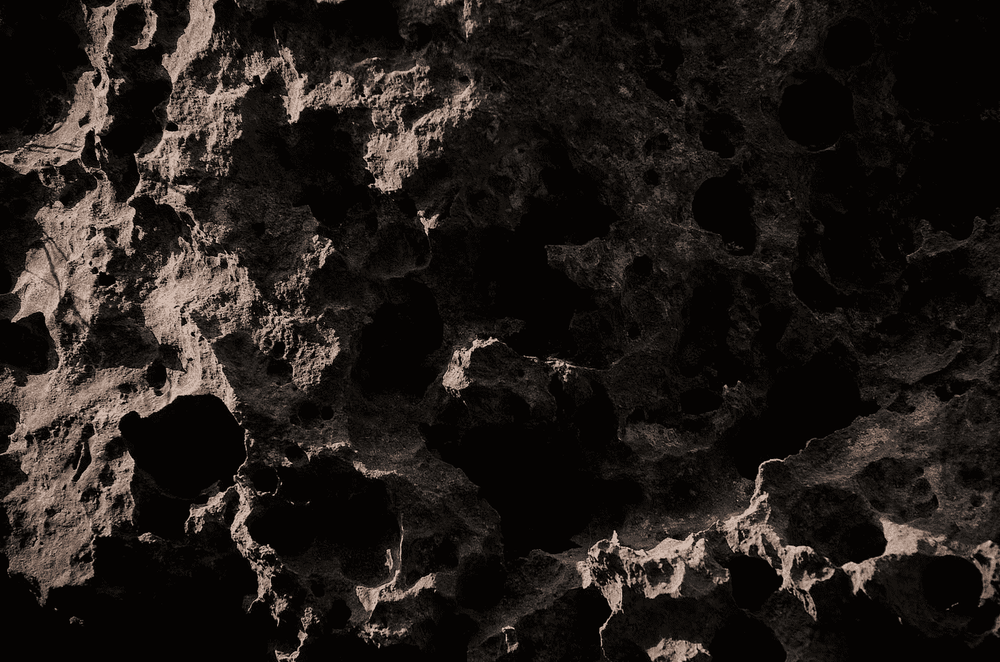
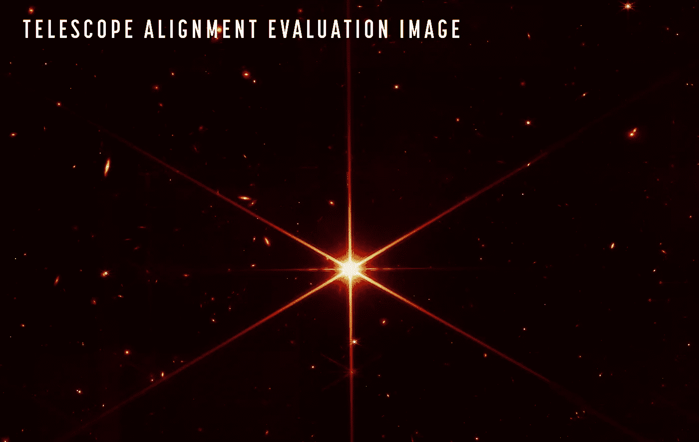
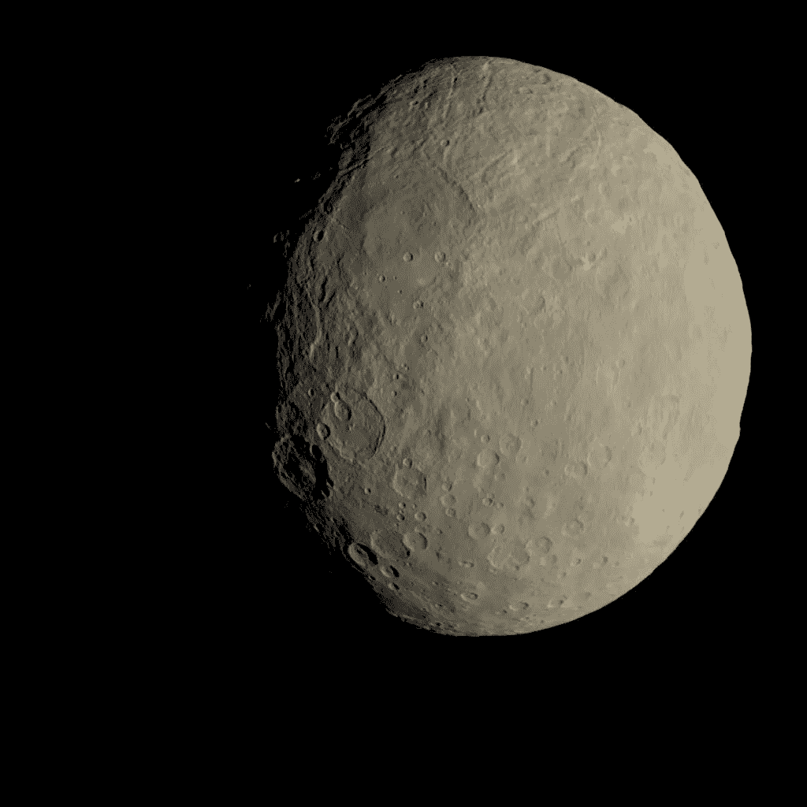
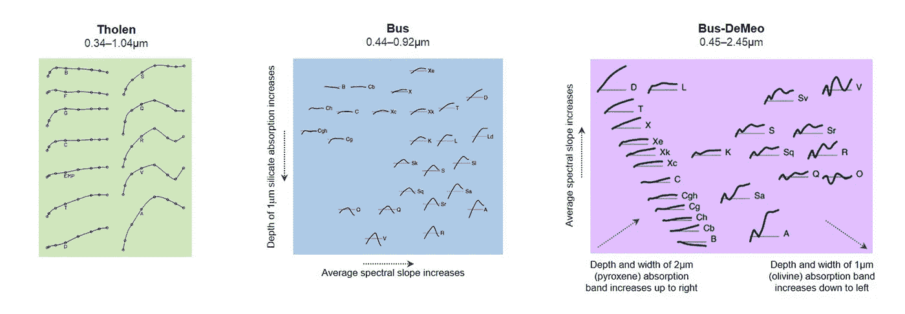
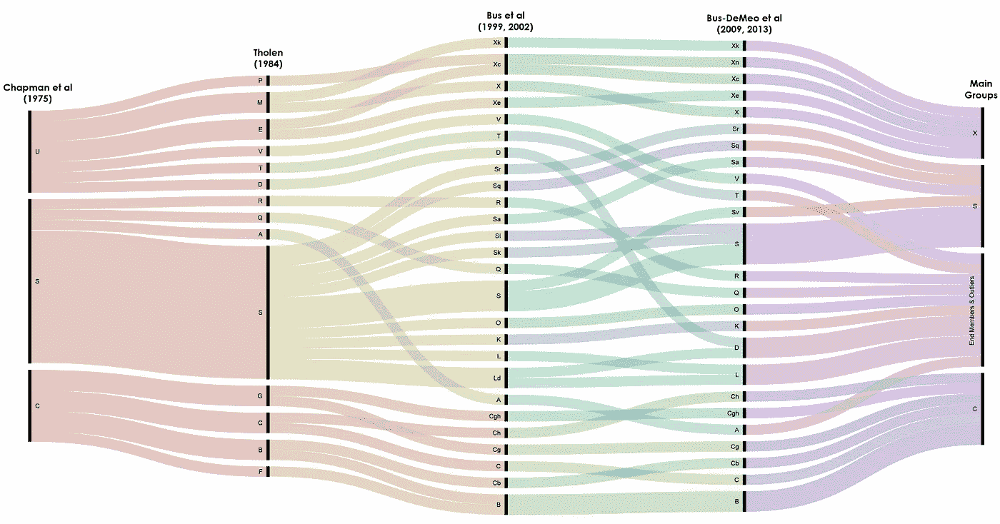
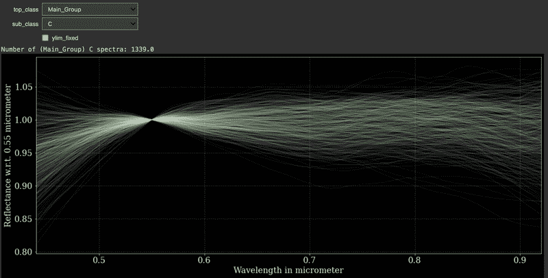
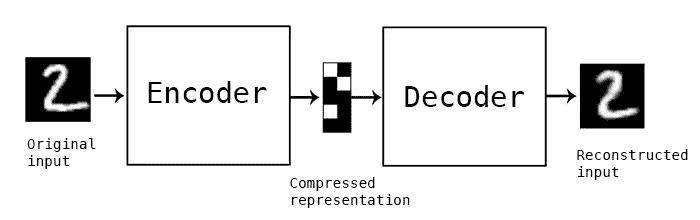
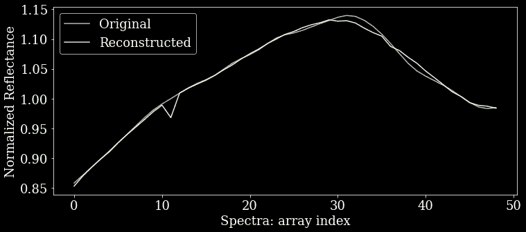
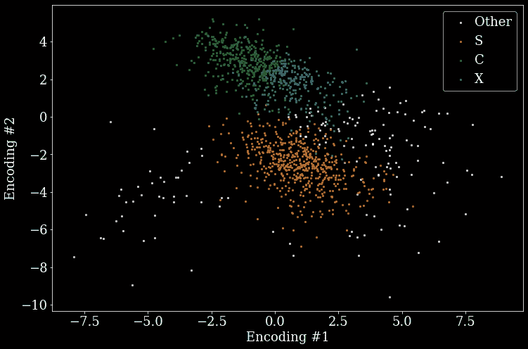

# Python、空间和机器学习

> 原文：<https://levelup.gitconnected.com/python-space-and-machine-learning-ef1e304ce2b0>

## 使用 Python 和机器学习理解空间科学主题:小行星类

维克多·塔拉舒克在 [Unsplash](https://unsplash.com?utm_source=medium&utm_medium=referral) 上拍摄的照片

***TL；如果你对一个将空间科学和机器学习联系起来的 Python 项目感兴趣，这个项目可能就是它。在 14 节强大的在线教程中，我们将介绍所谓的小行星反射光谱，以创建各种基于 ML 的监督和非监督模型。这些模型帮助我们区分不同的小行星光谱及其相关类别。代码和视频可以在*[*GitHub*](https://github.com/ThomasAlbin/Astroniz-YT-Tutorials/tree/main/%5BML1%5D-Asteroid-Spectra)*和*[*YouTube*](https://www.youtube.com/watch?v=sFrmYG-Mb5w&list=PLNvIBWkEdZ2gagAcgm44cplgSvQ_Cmvbv)*上找到。***

# 介绍

在过去的几年里，公众对空间科学、天文学、载人航天和无人驾驶宇宙飞船的兴趣大增。像 SpaceX、蓝色起源或维珍银河这样的新商业公司受到了很多关注，未来的计划，如 SpaceX 的 Starship，美国宇航局 Artemis 计划中即将到来的登月，以及最近的科学活动，如火星探测器 Perseverance 及其令人惊叹的成功直升机独创性，或詹姆斯·韦伯太空望远镜(JWST)的发射，都受到了热情的欢迎。

星 2MASS J17554042+6551277 显示了 JWST 的最终对准/调整。已经选择了红色过滤器。请注意聚集在这颗特殊恒星周围的小“斑点”。星系；遥远的世界，比如我们的银河系。*鸣谢:NASA/STScI*

但是，公共科学利益并不“止于”空间科学领域。由大学和科技公司(如谷歌、Meta 和其他大公司)领导的快速开发的模型、新颖的方法和几乎每天的部署为我们介绍了一个新的人工智能(AI)软件世界，特别是深度学习。像 GPT-3 或 StyleGAN3 这样的模型分别展示了当前文本和文本到图像生成的前沿人工智能路线图。像 [paperswithcode](https://paperswithcode.com/) 这样的总结网站试图收集越来越多的论文、新颖的方法和相应的数据集。除了 CPU 和 GPU，谷歌还开发了名为 TPUs 的 Tensorflow 专用硬件，以进一步提高人工智能训练性能。我们将在未来几年内看到这条路将带领我们走向何方:是否会出现越来越多的通用人工智能解决方案的尝试(例如 [DeepMind 的加托](https://www.deepmind.com/publications/a-generalist-agent))，我们是否会有第 5 级自动驾驶汽车，或者“人工智能冬天”是否会导致进一步的财政支持、兴趣和研究活动的停止。

 [## 达尔第二季

### 感谢那些对此版本提供帮助和反馈的人:Sandhini Agarwal，Sam Altman，Chester Cho，Peter…

openai.com](https://openai.com/dall-e-2/) 

毫无疑问，技术进步在几个领域加速了。由于 3d 打印机、易于使用的硬件、开源解决方案以及大量的文档、讲座和在线教程，知识日益大众化。

编程民主化的一个完美例子是 Python。你们中的大多数人，都精通这种特殊的编码语言，或者至少知道最重要的基础知识和相应的库。无论是开发一个有后台和前台的网站，数据科学研究，编程一个 Raspberry Pi 及其硬件，机器学习或科学:Python 已经实现了许多领域，并让感兴趣的公众可以轻松地进行编码。

照片由[大卫·克洛德](https://unsplash.com/@davidclode?utm_source=medium&utm_medium=referral)在 [Unsplash](https://unsplash.com?utm_source=medium&utm_medium=referral) 上拍摄

所以作为第一个简短的总结，3 个话题目前聚集了很多共同的吸引力:

1.  空间
2.  机器学习
3.  计算机编程语言

*现在是链接部分！*

# 使用 Python 的空间科学

在我的在线教程系列*空间科学与 Python* 中，我将前两个主题联系起来:空间…和…嗯… Python。YouTube 上的个人学习课程以及相应的免费 Jupyter 笔记本将使每个对这一跨学科主题感兴趣的人都能茁壮成长。

 [## 阿斯特罗尼兹

### 嘿观众们！在这里我想给你看一些 Python 和机器学习教程，里面有空间科学的链接！还有:我……

www.youtube.com](https://www.youtube.com/c/Astroniz) 

但这不仅仅是个别会议和基本空间科学概念的教学。有时，几个培训课程相互联系，包含开展一个科学项目的所有必要步骤。这些步骤包括:

*   界定科学任务/范围/目标
*   研究到目前为止已经完成的文献和工作
*   规划项目(从开始到结束…记住*意想不到的*转折点和可能出现的新问题)
*   分析部分:获取数据、清理、导出统计数据/洞察、对数据应用基础理论等。
*   解释
*   摘要
*   观点

而我要给大家详细介绍的第一个项目，不仅有*空间*和 *Python* ，还有*机器学习*。

# 小行星光谱…

你可能已经看过科幻电影，讲述了一名宇宙飞船驾驶员拼命避免与小行星带内的一颗小行星相撞。数以千计的物体潜伏在腰带中，平均距离只允许一个熟练的飞行员飞过！

我必须粉碎你的想象。事实上，小行星带相当*空*。当然，成千上万的物体在火星和木星之间围绕太阳旋转。但是这些大尺度导致物体密度非常低。否则我们就不能让我们的飞船穿过它。

顾名思义:该带居住着被称为*小行星*的多石世界。据推测，该带包含了本应形成一个行星世界的残余物体。多亏了重力扰动，这种情况没有发生。尽管如此，该带还有更大的小行星，如*帕拉斯*、*灶神星*或*谷神星*。你可能知道这些小行星的名字，这要归功于最近的科幻系列，比如《无垠》。

黎明号飞船拍摄的谷神星图像。谷神星是该带最大的小行星，直径约 950 公里。鸣谢:美国宇航局/JPL 加州理工学院/加州大学洛杉矶分校/MPS/德国航天中心/国际开发协会

尽管它们看起来像是“死亡世界”，小行星是一个令人着迷的研究课题。事实上，这些残留物包含了太阳系形成时的矿物化学。当然，就像研究人员发现、观察和描述的所有东西一样，小行星也被分类在各种目录中。根据称为*反射光谱*的观察测量进行分类。这些光谱很容易解释:

*   阳光被小行星吸收和部分反射
*   反射光被望远镜和相应的分光计捕获
*   这台分光计按颜色“分离”光线
*   “颜色的强度”取决于小行星的反射特性
*   不同的小行星表面成分导致不同的光谱

…这些不同的光谱使研究人员能够得出关于小行星组成的结论。

下图显示了这些光谱的例子。标题对此有更详细的描述。

不同的反射光谱，在 3 个不同的类别系统中进行区分( *Tholen，Bus，Bus-DeMeo* )。在每个系统中，可以看到具有不同类型注释(例如，S、ch 等)的这些光谱的定性示例。).光谱的左侧和右侧分别对应于“更蓝”和“更红”的光。较大的“y”值对应于小行星表面这种特定颜色(波长)的较高反射率。致谢:[玛格丽特·麦克墨菲的博客文章](https://vissiniti.com/wp-content/uploads/2019/07/Asteroid-Reflectance-Spectra.jpg)。

然而，不同的研究者提出了几种分类模式。下面的 Sankey 图显示了这些分类数据的子集是如何相互链接的。对我们来说，最右边的群体很重要:

*   c 型:“含碳”小行星的表面具有富碳特征
*   s 型:多石的小行星，显示出丰富的矿物质
*   x 型:“铁”小行星；可能是原行星内核的残余(因为行星有一个富含铁的内核)
*   终端成员和异常值(其他):嗯…其他的一切，例如，与行星地幔有关的 A 型小行星

显示不同分类模式及其相互关系的 Sankey 图。对于这个数据科学项目，我们将考虑最右边的“通用”主组系统。致谢:[玛格丽特·麦克墨菲的博客文章](https://vissiniti.com/wp-content/uploads/2019/07/Asteroid-Classification-Chapman-Tholen-to-Bus-to-BusDeMeo-v4-1.jpg)。

# …去 ML

好了，太空科学到此为止！事实上，它要深入得多，一个人可以写[吨](https://uapress.arizona.edu/book/asteroids-iii)吨[吨](https://uapress.arizona.edu/book/asteroids-iv)关于小行星的书。但在这篇文章中，我想给你展示一个项目，它将这些光谱数据用于一个机器学习项目。

这个项目是我在 GitHub 和 YouTube 上的*空间科学与 Python* 教程系列的一部分。但是让我给你描述一下我们小行星计划的范围:

*我们项目的范围是获取、清理、理解和可视化小行星反射光谱。此外，我们将使用不同的 ML 相关工具对光谱进行分类，如支持向量机(SVMs)和深度学习*

在我开始描述这个 14 笔记本的项目之前，让我分享一下相应的 GitHub 库…

 [## Astroniz-YT-Tutorials/[ML1]-主托马斯阿尔宾的小行星光谱/Astroniz-YT-Tutorials

### 我的 Python YT 教程系列-Astroniz-YT-Tutorials/[ML1]-小行星-光谱

github.com](https://github.com/ThomasAlbin/Astroniz-YT-Tutorials/tree/main/%5BML1%5D-Asteroid-Spectra) 

…和播放列表:

## 第 1-3 部分:数据提取、解析和清理

首先我们需要数据*[***笔记本# 1***](https://github.com/ThomasAlbin/Astroniz-YT-Tutorials/blob/main/%5BML1%5D-Asteroid-Spectra/1_data_fetch.ipynb)*！谢天谢地， *SMASS:小型主带小行星光谱调查*提供了可以使用的光谱数据。此外，它们还提供了更多与小行星相关的数据集:**

 **[## SMASS -小主带小行星光谱调查

### Richard P. Binzel(麻省理工学院)，首席研究员 Cristina a . Thomas(NAU)Andrew s . Rivkin(APL)Thomas h . bur bine…

smass.mit.edu](http://smass.mit.edu/smass.html)** 

**第一批笔记本与获取这些数据有关，并添加了*主组*类，正如我们在上面的 Sankey 图中所看到的。由于这个话题更多的是一个“小众”话题，所以我尽量多解释一些细节*[***笔记本# 2***](https://github.com/ThomasAlbin/Astroniz-YT-Tutorials/blob/main/%5BML1%5D-Asteroid-Spectra/2_data_parse.ipynb)***&***[***笔记本# 3***](https://github.com/ThomasAlbin/Astroniz-YT-Tutorials/blob/main/%5BML1%5D-Asteroid-Spectra/3_data_enrichment.ipynb)*。****

## ***第 4 部分:理解光谱***

***到目前为止，您在 ML 旅程中使用了哪些数据？虹膜数据？西法尔还是 MNIST？还是纽约的住房数据？***

***我猜你们中的大多数人至少使用过一次数据集。事实上，它们仍然是使 ML 模型具有可比性的一个很好的基准集。事实上，从这些数据中可以获得很多知识**。*****

***然而，反射光谱数据还没有被 ML 爱好者和编码者大量研究。因此，在我们开始深入 ML 之前，让我们创建一个交互式的 *ipwidgets* 光谱查看器，以便更好地理解和感受这些数据看起来如何 [***【笔记本# 4】***](https://github.com/ThomasAlbin/Astroniz-YT-Tutorials/blob/main/%5BML1%5D-Asteroid-Spectra/4_spectra_viewer.ipynb)！***

****

**几个小行星的反射光谱一次显示，[在 Python](https://github.com/ThomasAlbin/Astroniz-YT-Tutorials/blob/main/%5BML1%5D-Asteroid-Spectra/4_spectra_viewer.ipynb) 的交互式 ipywidget 中。这个工具是作者拍摄的小电影，运行在 Google Colab 内部。演职员表:T. Albin**

## **第 5 — 7 部分:支持向量机**

**第一个机器学习项目旨在为一个简单的二元问题训练一个支持向量机(SVM):区分 X 类和“非”X 类小行星*[***笔记本# 5***](https://github.com/ThomasAlbin/Astroniz-YT-Tutorials/blob/main/[ML1]-Asteroid-Spectra/5_ml_svm_binary.ipynb)*。首先，在深入 ML 相关主题之前，我希望事情尽可能简单(因为这个项目将针对不同的技能水平)。使用 scikit-learn 超参数搜索方法***[***[***笔记本# 6***](https://github.com/ThomasAlbin/Astroniz-YT-Tutorials/blob/main/%5BML1%5D-Asteroid-Spectra/6_ml_svm_search.ipynb)*，我们随后能够优化 SVM 相关参数，以从模型中挤出一些更高的准确性。*****

*** [## 1.4.支持向量机

### 在高维空间有效。在维数大于…的情况下仍然有效

scikit-learn.org](https://scikit-learn.org/stable/modules/svm.html) 

最后，多类 SVM 方法使我们能够进行 ML 实验，区分 C、S、X 和“其他”类*[***笔记本#7***](https://github.com/ThomasAlbin/Astroniz-YT-Tutorials/blob/main/%5BML1%5D-Asteroid-Spectra/7_ml_svm_multiclass.ipynb) ***。****

## *第 8-10 部分:深度学习(监督分类)*

*PyTorch 还是 TensorFlow？深度学习从业者最根本的“起点问题”之一。这篇文章并不打算引发另一场关于哪个库是最好的的争论。个人比较喜欢 TensorFlow 和它的高级 API keras。*

* [## keras:Python 深度学习 API

### Keras 是为人类设计的 API，不是为机器设计的。Keras 遵循减少认知负荷的最佳实践:it…

keras.io](https://keras.io/) 

在最初的 scikit-learn 实验之后，是时候进行一些深度学习实验了(使用 keras)。多类分类从一开始就是目标*[***笔记本# 8***](https://github.com/ThomasAlbin/Astroniz-YT-Tutorials/blob/main/%5BML1%5D-Asteroid-Spectra/8_dl_dense_multiclass.ipynb)*。与 scikit-learn 类似，keras 使人们能够为更好的超参数搜索创建模型，称为 keras-tuner。**

** [## Keras 文档:KerasTuner

### KerasTuner 是一个易于使用、可扩展的超参数优化框架，它解决了…

keras.io](https://keras.io/keras_tuner/) 

在 [***笔记本# 9***](https://github.com/ThomasAlbin/Astroniz-YT-Tutorials/blob/main/%5BML1%5D-Asteroid-Spectra/9_dl_convnet_multiclass.ipynb)*中我们用这个调音器来熟悉这种“自优化”的方式。使用蛮力、贝叶斯方法或超带可以找到粗略定义的神经网络的最佳参数和超参数。*

*最后，我们用卷积网络，得到一个百分点以上的准确度*[***笔记本# 10***](https://github.com/ThomasAlbin/Astroniz-YT-Tutorials/blob/main/%5BML1%5D-Asteroid-Spectra/10_dl_hyperparameter_search.ipynb)*。***

## ***第 11-14 部分:深度学习(无监督自动编码器+ GMM)***

***分类模式是“人造的”，试图通过某些波长(颜色)范围内的某些反射/吸收特征来区分光谱。空间科学中的这种分类工作不仅适用于小行星，还适用于流星、彗星、恒星、星系等等。无数物体的巨大目录被分类成列和行，以便在这混乱的宇宙中得到某种秩序。***

***但是……我们能从数据科学的角度证明这些课程的合理性吗？***

***为了回答这个问题，我们通过应用无监督算法，加强了我们的深度学习游戏；特别关注自动编码器。***

***自动编码器是一种特定的深度学习架构，其输出与其输入相对应(因此基本上是输入数据对自身的回归)。自动编码器将信息“压缩”到某个预定义数量的神经元。或者，至少它在训练过程中尝试这样做。***

******

***自动编码器架构示意图。“压缩表示”，也称为**潜在空间**包含我们将在此使用的输入数据的压缩信息！信用: [keras.io](https://blog.keras.io/building-autoencoders-in-keras.html)***

***在 [***笔记本# 11***](https://github.com/ThomasAlbin/Astroniz-YT-Tutorials/blob/main/%5BML1%5D-Asteroid-Spectra/11_dl_autoencoder_reconstruction.ipynb)*中我们创建了我们的第一个自动编码器并检查了它的重建能力。我们用来压缩信息的神经元数量:2。导致信息丢失的极低的数字。但是在这种情况下，我们想在事后画出潜在空间，以获得这个潜在空间可能看起来是什么样子的感觉。下图显示了重建性能的一个很好的例子:****

******

***单光谱，原始的自动编码器的重建。贷方:T. Albin***

***[***笔记本# 12***](https://github.com/ThomasAlbin/Astroniz-YT-Tutorials/blob/main/%5BML1%5D-Asteroid-Spectra/12_dl_autoencoder_latent_space.ipynb)*然后被用来绘制二维潜空间。当然，这是一个不可忽视的方法，但是我们也添加了光谱类作为潜在空间的颜色代码。这样，我们就能够看到不同的类是否被分开(请注意:自动编码器不知道任何类！)****

******

***小行星反射光谱的二维潜在空间。颜色代码表示相应的光谱。每个点代表一颗小行星。***

***正如我们所见，S 级小行星在中心形成了一个占主导地位的星团，周围散布着“其他”星团。第二个集群包含 C 和 X 类，两者之间有特定的边界。聚类算法可能无法区分这些类别。***

***或者会吗？***

***最后，在 [***笔记本#13***](https://github.com/ThomasAlbin/Astroniz-YT-Tutorials/blob/main/%5BML1%5D-Asteroid-Spectra/13_dl_autoencoder_clustering.ipynb) 和 [***笔记本# 14***](https://github.com/ThomasAlbin/Astroniz-YT-Tutorials/blob/main/%5BML1%5D-Asteroid-Spectra/14_dl_autoencoder_gmm_check.ipynb)*中，我们使用了 5-D 自动编码器，应用了高斯混合模型(GMM)并计算了几个 GMM 的贝叶斯信息准则(BIC)。最后，我们发现了 4-5 个集群(取决于起始权重)。****

***然而，多亏了这个令人惊奇的，但稍微不为人知的包 *pingouin* 我们发现这些数据并不是由多正态高斯描述的。否定的结果/发现。但是，嘿，这就是科学:否定的结果也是结果，我不想给人一种印象，科学项目中的一切都是 100 %完全预先决定的！***

** [## GitHub - raphaelvallat/pingouin:基于熊猫的 Python 统计包

### Pingouin 是一个用 Python 3 编写的开源统计包，主要基于 Pandas 和 NumPy。它的一些…

github.com](https://github.com/raphaelvallat/pingouin) 

## 总结和展望

这个辅导和研究项目是一个*野生骑*。对于我和所有以前没有空间科学相关数据经验的人来说。我希望通过这次会议你能学到很多东西。对于一个相当小的话题来说，这似乎太多了。但科学就是这样运作的；最后显示的是浓缩的结果，而不是旅程本身。在这里，我想提供尽可能多的信息和研究思路。

人们现在可以写一篇关于这些 ML 模型的论文，为小行星研究人员创建一个 API，帮助他们自动分类他们的数据等。

对我来说，这段旅程到此结束。现在是时候寻找新的、未知的空间主题和编码路径了。

托马斯

[在推特上联系我](https://twitter.com/MrAstroThomas)********