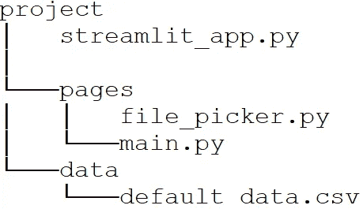
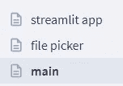
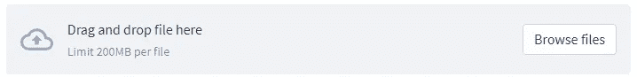
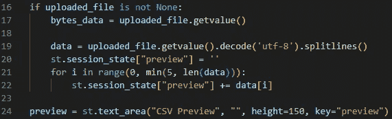
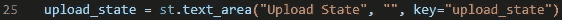
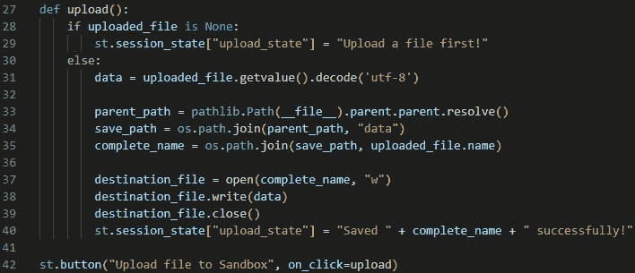
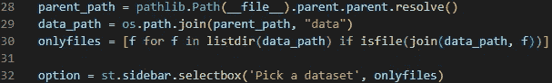
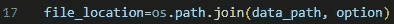

# Python Streamlit:上传和使用文件

> 原文：<https://levelup.gitconnected.com/python-streamlit-uploading-and-using-files-cf797dc30be3>


我一直在使用 Streamlit 进行小型前端项目。之前，我提供了一个应用程序将使用的数据文件，但是我还希望用户上传他们自己的文件，并根据 python 脚本运行它们。

**我的目标:** *允许用户上传文件并选择运行应用程序的文件，为演示提供默认文件*

# 设置多个页面

在这种方法中，我认为最好将文件的上传和使用文件运行脚本分离到不同的页面中。



文件结构

作为一个主页，有一些关于项目的信息，以及如何使用它。

`pages`应用程序页面所在的子目录。

`file_picker.py`是让用户上传文件的逻辑所在。

`main.py`是主应用脚本。

`data`子目录是保存输入数据的地方，目前只包含我为演示提供的默认数据。

此文件夹结构支持从应用程序的侧菜单在这些页面之间导航:



侧面菜单导航

# 文件选择器

Streamlit 提供了一个`file_uploader`，可通过`st.file_uploader`访问，如下所示:



简化文件选择器


文件选取器的代码，以标题作为参数

给用户更多的信息是个好主意，所以我添加了一些文本区域来通知用户当前的状态。

我添加了一个小的文本区域，最多包含 5 行(最多 5 行，以防用户上传少于 5 行的文件)，只是为了向用户显示他们刚刚上传的文件的片段。*(请注意，文本区域是在‘if’语句之后定义的)。*



CSV 预览

类似地，我添加了一个文本区域来通知用户结果。



用于显示上传状态的文本区域

最后，我添加了一个按钮和一个上传功能:



点击按钮后，上传功能运行，文件被保存。在这里我使用了相对路径，所以这个项目可以稍后归档。

这导致了下面的`file_picker.py`:

```
import streamlit as st
import os.path
import pathlibst.write("""
# File Picker
""")uploaded_file = st.file_uploader("Choose a CSV file")if uploaded_file is not None:
    bytes_data = uploaded_file.getvalue()
    data = uploaded_file.getvalue().decode('utf-8').splitlines()         
    st.session_state["preview"] = '' for i in range(0, min(5, len(data))):
        st.session_state["preview"] += data[i]preview = st.text_area("CSV Preview", "", height=150, key="preview")
upload_state = st.text_area("Upload State", "", key="upload_state")def upload():
    if uploaded_file is None:
        st.session_state["upload_state"] = "Upload a file first!"
    else:
        data = uploaded_file.getvalue().decode('utf-8')
        parent_path = pathlib.Path(__file__).parent.parent.resolve()           
        save_path = os.path.join(parent_path, "data")
        complete_name = os.path.join(save_path, uploaded_file.name)
        destination_file = open(complete_name, "w")
        destination_file.write(data)
        destination_file.close()
        st.session_state["upload_state"] = "Saved " + complete_name + " successfully!"st.button("Upload file to Sandbox", on_click=upload)
```

# 主文件

一旦用户上传了文件，他们可以从侧边菜单导航到应用程序的`main`部分。我用`st.selectbox`放置了一个下拉菜单。

使用类似的方法，我从`data`子目录中检索了所有文件名，并将它们用作下拉菜单中的选项:



用于从‘数据’子目录中选择输入文件的逻辑

可以使用`data_path`变量检索选定的文件位置，如下所示:



选定的文件位置

`file_location`可以作为参数传递给主脚本。就是这样！

这导致了下面的`main.py`:

```
import streamlit as st
import os
import pathlib
from os import listdir
from os.path import isfile, joinst.write("""
# Demo
""")parent_path = pathlib.Path(__file__).parent.parent.resolve()
data_path = os.path.join(parent_path, "data")
onlyfiles = [f for f in listdir(data_path) if isfile(join(data_path, f))]option = st.sidebar.selectbox('Pick a dataset', onlyfiles)file_location=os.path.join(data_path, option)# use `file_location` as a parameter to the main script
```

# 结论

这些是我采取的允许用户上传文件并使用它运行脚本的步骤。

在这一阶段，没有文件验证，但通常最好确保用户上传的文件是有效的，即:

*   它有正确的文件扩展名
*   该文件的格式正确
*   它包含的数据不会破坏您的脚本

我选择在这里不包括这一点，因为验证确实是特定于您正在处理的数据类型的，这是我在这个应用程序中的下一步。

我希望这有所帮助，有人觉得这很有用！

# 分级编码

感谢您成为我们社区的一员！在你离开之前:

*   👏为故事鼓掌，跟着作者走👉
*   📰查看[升级编码出版物](https://levelup.gitconnected.com/?utm_source=pub&utm_medium=post)中的更多内容
*   🔔关注我们:[Twitter](https://twitter.com/gitconnected)|[LinkedIn](https://www.linkedin.com/company/gitconnected)|[时事通讯](https://newsletter.levelup.dev)

🚀👉 [**加入升级人才集体，找到一份神奇的工作**](https://jobs.levelup.dev/talent/welcome?referral=true)