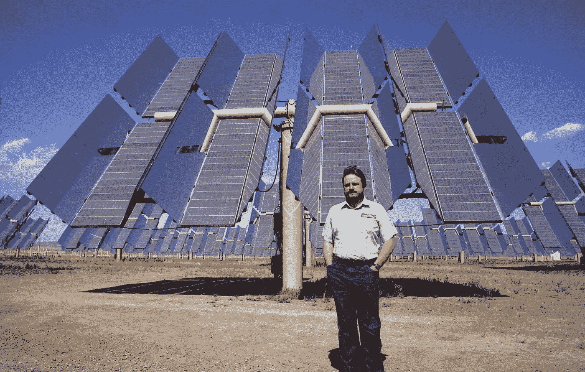
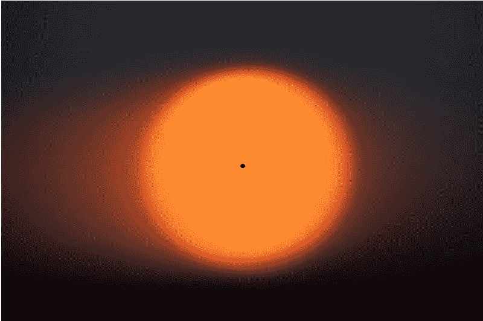
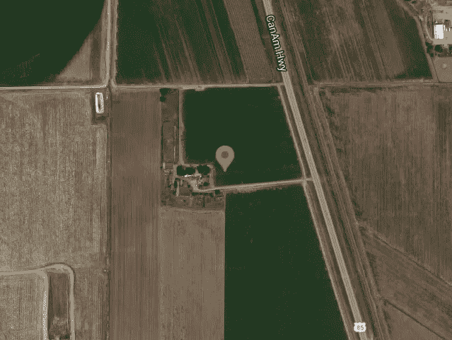
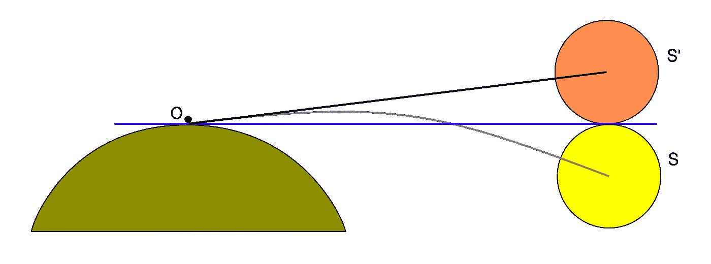
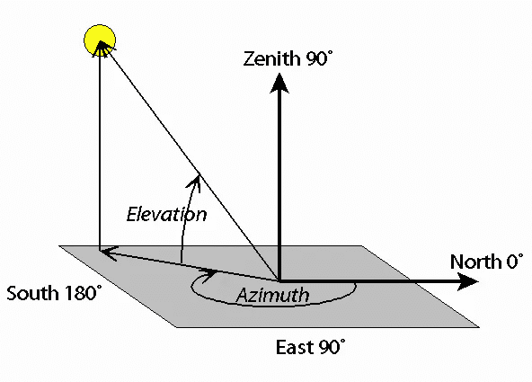
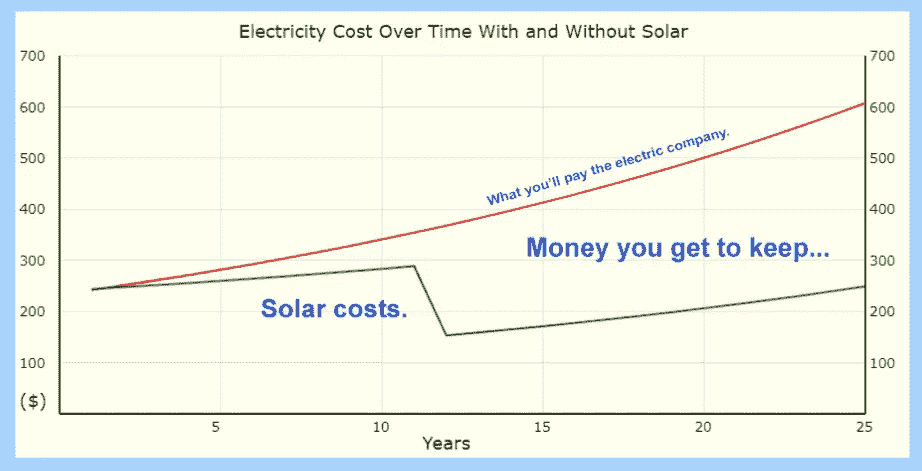
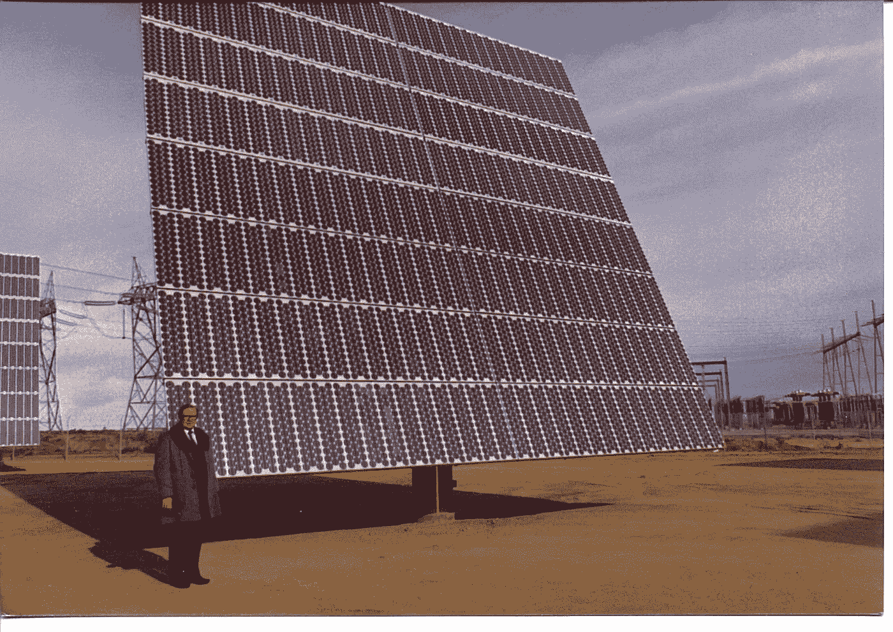

# 太阳能和研究的 Python 太阳位置

> 原文：<https://levelup.gitconnected.com/python-sun-position-for-solar-energy-and-research-7a4ead801777>

这里有一个简洁的 Python 程序，你可以用它来计算太阳的位置，精度达到 0.01 度。



作者在假虎刺属平原发电设施

这是我最喜欢的太阳笑话……”我彻夜未眠，试图弄清楚太阳去了哪里。我终于明白了。”

不过说真的，随着世界转向太阳能和风能替代能源，知道太阳在天空中的位置非常重要。我已经为许多太阳能站点创建了软件，例如上面显示的假虎刺属平原项目，分享一个核心 Python 算法来计算太阳的位置感觉是正确的事情。我希望它能帮助你，无论是在一个爱好项目上，还是在一些世界上最大的太阳能项目上。给你更多的力量！

这里介绍的程序简短、快速，对于 1901 年到 2099 年之间的任何一天，以及地球上的任何一个位置，精度都可以达到 0.01 度。为了更好地理解这种准确性，这张太阳圆盘照片中心附近的黑点大约是太阳直径的 1/50，或大约 0.01 度。



对于瞄准太阳跟踪器或定日镜以获取能量来说，这种精度已经足够了。对于极其精确的科学目的，如跟踪太阳黑子或其他细节，VSOP87 算法更好，但它要复杂得多。

*注:我的激情是 Python，但如果你需要不同通用编程语言中的这种算法，请查阅我的书，* [*《太阳位置:9 种通用编程语言中的天文算法》*](https://amzn.to/3mE8Aoh)

这是我的 Python 程序，它可以让你找到地球上任何特定时刻的太阳在天空中的位置:

```
# sunpos.pyimport mathdef sunpos(when, location, refraction):# Extract the passed data
    year, month, day, hour, minute, second, timezone = when
    latitude, longitude = location# Math typing shortcuts
    rad, deg = math.radians, math.degrees
    sin, cos, tan = math.sin, math.cos, math.tan
    asin, atan2 = math.asin, math.atan2# Convert latitude and longitude to radians
    rlat = rad(latitude)
    rlon = rad(longitude)# Decimal hour of the day at Greenwich
    greenwichtime = hour - timezone + minute / 60 + second / 3600# Days from J2000, accurate from 1901 to 2099
    daynum = (
        367 * year
        - 7 * (year + (month + 9) // 12) // 4
        + 275 * month // 9
        + day
        - 730531.5
        + greenwichtime / 24
    )# Mean longitude of the sun
    mean_long = daynum * 0.01720279239 + 4.894967873# Mean anomaly of the Sun
    mean_anom = daynum * 0.01720197034 + 6.240040768# Ecliptic longitude of the sun
    eclip_long = (
        mean_long
        + 0.03342305518 * sin(mean_anom)
        + 0.0003490658504 * sin(2 * mean_anom)
    )# Obliquity of the ecliptic
    obliquity = 0.4090877234 - 0.000000006981317008 * daynum# Right ascension of the sun
    rasc = atan2(cos(obliquity) * sin(eclip_long), cos(eclip_long))# Declination of the sun
    decl = asin(sin(obliquity) * sin(eclip_long))# Local sidereal time
    sidereal = 4.894961213 + 6.300388099 * daynum + rlon# Hour angle of the sun
    hour_ang = sidereal - rasc# Local elevation of the sun
    elevation = asin(sin(decl) * sin(rlat) + cos(decl) * cos(rlat) * cos(hour_ang))# Local azimuth of the sun
    azimuth = atan2(
        -cos(decl) * cos(rlat) * sin(hour_ang),
        sin(decl) - sin(rlat) * sin(elevation),
    )# Convert azimuth and elevation to degrees
    azimuth = into_range(deg(azimuth), 0, 360)
    elevation = into_range(deg(elevation), -180, 180)# Refraction correction (optional)
    if refraction:
        targ = rad((elevation + (10.3 / (elevation + 5.11))))
        elevation += (1.02 / tan(targ)) / 60# Return azimuth and elevation in degrees
    return (round(azimuth, 2), round(elevation, 2))def into_range(x, range_min, range_max):
    shiftedx = x - range_min
    delta = range_max - range_min
    return (((shiftedx % delta) + delta) % delta) + range_minif __name__ == "__main__":# Close Encounters latitude, longitude
    location = (40.602778, -104.741667)# Fourth of July, 2022 at 11:20 am MDT (-6 hours)
    when = (2022, 7, 4, 11, 20, 0, -6)# Get the Sun's apparent location in the sky
    azimuth, elevation = sunpos(when, location, True)# Output the results
    print("\nWhen: ", when)
    print("Where: ", location)
    print("Azimuth: ", azimuth)
    print("Elevation: ", elevation)# When:  (2022, 7, 4, 11, 20, 0, -6)
# Where:  (40.602778, -104.741667)
# Azimuth:  121.38
# Elevation:  61.91
```

我已经设置了这个程序，这样你就可以很容易地将它导入到任何需要寻找太阳位置的程序中。将代码保存在一个名为 sunpos.py 的文件中，将其导入到您的项目中，并根据需要调用函数 sunpos()。现在，请注意，很容易在清单末尾附近更改位置和时间参数，以生成任意位置的太阳位置。


怀俄明州的恶魔之塔——杰夫·芬利[在](https://unsplash.com/@jeff_finley?utm_source=medium&utm_medium=referral) [Unsplash](https://unsplash.com?utm_source=medium&utm_medium=referral) 上拍摄的照片

如清单末尾的示例代码所示，我选择了一个我最喜欢的位置，电影《第三类亲密接触》中的错误的纬度和经度位置。据推测，外星人向怀俄明州的恶魔之塔发出了与当局会面的信号，但电影中的经纬度实际上指向科罗拉多州奥尔特北部一座农舍附近的一块田地。这不是一个戏剧性的网站，但它将是伟大的安装一些太阳能追踪器！



谷歌地图提供

我选择了 2022 年 7 月 4 日上午 11 点 20 分。如果需要，可以随意更改这些参数，但是我建议使用它们来验证代码。您的输出应该与这里显示的代码清单相匹配。

位置和时间参数被设置为列表或元组。时间包括时区，或与格林威治时间的时差，因地点和一年中的时间而异。网上有很多地方可以仔细检查这个值。

# 大气折光改正

通常情况下，对于太阳能计算，太阳在天空中的表观位置就是您想要的位置。但是有些时候，比如在计算日出和日落时，你不想校正折射。请注意传递的参数是真还是假，以包括或忽略折射校正。我来解释一下屈光矫正是什么意思。

大气使光线发生了一点弯曲，使星星、月亮和太阳在天空中的位置发生了一点偏移。这种变化很小，但意义重大，尤其是当太阳在天空中低低的时候，更接近地平线。当太阳看起来位于地平线上时，它实际上正悬挂在地平线下。在更高的天空中，这种移动比太阳圆盘的直径要小一些。



弗朗西斯科·哈维尔和布兰科·冈萨雷斯

# 弧度或角度

大多数编程语言中的三角函数需要用弧度而不是度数表示的参数。这里介绍的大多数方程都可以在用度数表示的天文资料中找到。为了加速代码，我把这些方程项转换成弧度，用弧度做所有复杂的计算，最后再转换回度数。这有助于加快速度。

# 方位角和仰角

太阳的位置用方位角和仰角来表示。为了清楚起见，让我确切地定义这是什么意思。方位角是地平线上从北向东旋转的度数。因此，如果太阳正好位于东方地平线之上，它的方位角将是 90 度。在太阳正午，当太阳穿过观察者正南方的天空时(北半球的情况)，它的方位角是 180 度。方位角表示为范围从 0 到 360 度的正数。

仰角是从地平线到太阳圆盘中心位置的度数。当穿过地平线时，太阳处于 0 度仰角，当太阳垂直向上时，头顶上的所谓天顶，其仰角为 90 度。



礼貌 Celestis.com

# 黄道倾角和其他奇怪的术语

你会在代码中注意到一些你可能不知道的天文细节的计算。这些细节处理了与太阳穿过我们天空的复杂路径有关的因素，这些复杂路径是由于地球的倾斜、月球的引力推动、地球略呈椭圆形的轨道等等。你不需要了解这些因素来使用这个程序，但是如果感兴趣，我建议你在网上搜索一下，或者买我上面提到的书，因为它有更多的解释。

# 太阳位置的创造性应用

太阳的位置对于瞄准所有类型的太阳跟踪器都是有用的，例如双轴定日镜或各种类型的单轴跟踪光伏板。它对于非跟踪应用程序也非常有用。例如，我的下一篇文章将展示如何计算放置在屋顶上的面板的整体年效率，这些面板面向任何方位，具有任何标准斜度，并且位于地球上的某个纬度。

我已经开发了几十个有用的太阳能程序，都是基于这个核心的太阳位置算法，其中许多被我的妻子用于她的分析，因为她向全国各地的房主出售最佳效率和最佳省钱的太阳能电池板系统。



作者的许多太阳能应用程序的例子

# 这是家庭事务

我娶了老板的女儿。我的老板是一名顶尖的工程师，他参与了海盗号火星着陆器以及其他许多著名的项目。当时，他的小型太阳能工程小组创造、建造并规划了(由我负责)几个世界上最大的太阳能发电设施。这是我做过的最好的工作，它包括一个很棒的附带福利；会见老板的女儿，EJ！



作者的老板，弗洛伊德·布莱克，在我们的一个太阳能测试设施

今天，EJ 是一名“总统俱乐部”的销售人员，拥有数百名快乐的客户，因为她帮助他们节省了大量资金，同时通过定制安装你看到的出现在邻居屋顶上的太阳能电池板来保护地球。我很荣幸能够帮助她完成各种软件任务，其中许多任务都是基于这里介绍的 sun 位置代码。

**全面披露:如果你想了解更多关于 EJ 如何通过定制安装太阳能电池板来取代你的电费账单，从而为你节省大量资金，** [**只需点击此处**](https://powur.com/solar.proud/education/why-solar) **。(EJ 将是她公司中被通知的人)**

# 下一步是什么？

这里介绍的核心太阳位置程序已经被我多年来开发的许多太阳能应用程序所采用。我的计划是写更多的 Medium.com 文章，展示一些有用的 Python 实用程序，任何人，从房主到太阳能专家，都可以使用它们，因为我们都在努力让世界变得更美好。敬请期待！

John 的热情和使命是分享 Python 代码，帮助揭开生活挑战的神秘面纱，并从中获得乐趣。约翰著有 [*Python 为 Numworks*](https://amzn.to/3k4O39j) *，* [*Python 为 OpenSCAD*](https://amzn.to/3mHK0Br) *，以及* [*等诸多头衔*](https://amzn.to/320uLMg) *。*