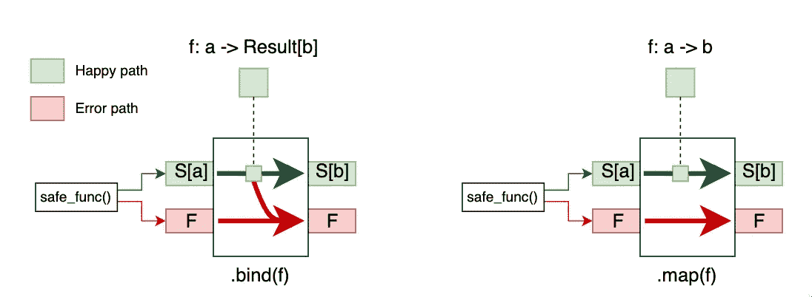
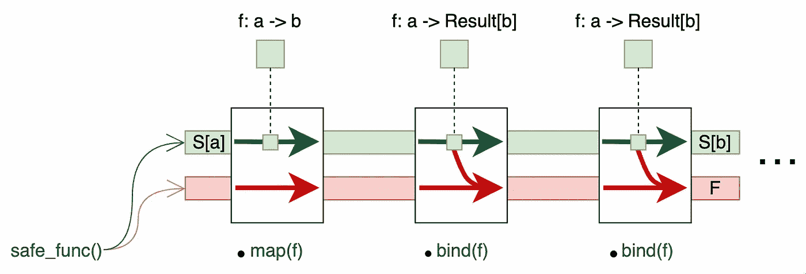

# Python:不可接受的例外

> 原文：<https://levelup.gitconnected.com/python-the-unacceptable-except-fd633c85c3ae>


## 还有一个关于铁路和星球大战的故事

这是我的“[Why None not Nothing](/python-why-none-is-not-nothing-bb3de55dd471)”故事的后续文章，在这篇文章中，我触及了一元编程的表面。虽然“一元”这个词已经引起了一些人的反感，但它在生成更干净、更简洁的代码方面非常有用，同时不会因为样板错误处理逻辑而污染代码。

实际上，每个计算机程序都遵循相同的原则:它接收一些输入，对输入进行一系列转换，并产生一些输出。沿着这些转换链，错误可能到处发生，其中之一是“异常”，而正确的“异常处理”被证明是最复杂的规程之一，尤其是因为异常打破了自然的控制流。

## 目标受众

Pythonistas 对从不同的角度看待异常处理感兴趣，并对函数式编程原则有所了解。

## 放弃

本文提出的解决方案并不意味着要取代异常处理。这只是在保持自然控制流的同时，以功能风格处理异常情况的不同方式。

## 入门指南

让我们深入星球大战领域做一些调查。为了便于说明，我们将使用[星球大战 API](https://swapi.dev/) 。考虑以下下载函数(您可以简单地将其粘贴到您的 REPL 中):

```
import requestsdef download(path: str) -> list[dict]:
    response = requests.get(f"https://swapi.dev/api/{path}")
    return response.json()["results"]
```

这个 2-liner 进入 Star Wars API，根据我们提供的路径获取一些信息，并在 HTTP 响应的 JSON 主体中返回“results”元素(我们希望是一个字典列表)。我们现在可以检索行星数据(只要您连接到互联网):

```
>>> from pprint import pprint
>>> p = download("planets")
>>> pprint(p)
[{'climate': 'arid',
  'created': '2014-12-09T13:50:49.641000Z',
  'diameter': '10465',
  'edited': '2014-12-20T20:58:18.411000Z',
  'films': ['[https://swapi.dev/api/films/1/'](https://swapi.dev/api/films/1/'), ...],
  'gravity': '1 standard',
  'name': 'Tatooine',
  'orbital_period': '304',
  'population': '200000',
  'residents': ['[https://swapi.dev/api/people/1/'](https://swapi.dev/api/people/1/'), ...],
  'rotation_period': '23',
  'surface_water': '1',
  'terrain': 'desert',
  'url': '[https://swapi.dev/api/planets/1/'](https://swapi.dev/api/planets/1/')},
...
]
```

现在想想我们的 2 条线可能会出什么问题:

```
p = download("planets/1")
...
KeyError: 'results'
```

我们得到一个 KeyError 异常，告诉我们响应 JSON 主体显然不包含“results”元素。

下一次尝试:

```
p = download("insects")
...
requests.exceptions.JSONDecodeError: Expecting value: line 2 column 1 (char 1)
```

JSONDecodeError 意味着响应体不是有效的 JSON，可能是因为我们请求了一个不存在的实体(昆虫)。

最后，断开网络连接(不要忘记之后重新连接),并执行以下操作:

```
p = download("planets")
...
requests.exceptions.ConnectionError:
```

ConnectionError 显然表明网络层存在问题。

通过提供不正确的输入(不存在的路径)或依赖不正确的假设(“结果”元素总是存在)，或者通过模拟外部系统(如网络或远程系统)上的故障，我们很容易使我们的函数失败并引发不同种类的异常。

你看，错误的来源数不胜数，甚至有更多的例外可以打击我们，只要看看这个令人印象深刻的列表:[https://requests.readthedocs.io/en/latest/api/#exceptions](https://requests.readthedocs.io/en/latest/api/#exceptions)

看起来我们的 2 行函数有一些潜在的不良行为，对吗？现在我们可以开始提问了:

*   我们如何优雅地处理这种失败？
*   我们应该在本地捕获异常还是让它们在堆栈中向上传播？其他人可能会觉得有责任。
*   但是，外部作用域中的异常处理程序如何知道它可以预期哪些类型的异常，以及它如何知道要应用哪些补救措施？
*   如果我们在离异常最近的地方捕获它，我们返回什么？没有吗？一个错误代码(必须有人再次解释)？或者，我们只是记录到 stderr 并再次“引发”它？
*   我们应该根据异常类型做出改变吗？
*   我们应该根据异常的超类型对异常进行分组吗？
*   我们程序中的其他函数是如何处理类似情况的？是否有一致的异常处理概念？
*   我们如何记录我们的异常处理层次结构？
*   更重要的是:我们如何测试所有潜在的异常？
*   …

请记住，异常会破坏控制流。如果一个异常在一个函数中被引发，那么这个函数就不再返回值，而是异常终止。一个例外是我们所说的“副作用”，可能是所有副作用中最无情的一种:-)副作用

在函数式编程环境中，我们希望尽可能避免副作用。他们使函数“不纯”,这意味着他们使函数行为不确定。问题是操作系统经常没有其他传播致命错误的方法(想想运行时错误，比如被零除，或者使用大于数组大小的索引)。

## 最好请求原谅？

底线是，在 Python 中，我们必须以某种方式处理异常。我们都知道惯用的方法:“请求原谅比请求允许更好”:

```
import requestsdef download(path: str) -> list[dict] | None:
    try:
        response = requests.get(f"https://swapi.dev/api/{path}")
        return response.json()["results"]
    except Exception as ex:
        print(f"exception occurred: {ex}")
        return None
```

“改进的”版本现在只捕捉每一种异常类型，打印一条日志消息，并且不返回任何异常。但是，我们深感满意吗？恐怕，我们不是？我们的修改使我们的程序变得更好了吗？实际上没有。

因为现在我们必须问这个问题:“如果我们的函数不返回任何值，这意味着什么？”。外部函数如何知道如何处理这个问题？不幸的是，他们不知道 None 是什么意思，因为它根本没有语义。我们不应该更好地返回一个包含错误代码和消息的元组吗？

## 进入铁路

如果我告诉你有另一个更安全的选择呢？

```
import requests
**from returns.result import safe****@safe**
def download(path: str) -> list[dict]:
    response = requests.get(f"https://swapi.dev/api/{path}")
    return response.json()["results"]
```

有一个很棒的 Python 包叫做 [**returns**](https://returns.readthedocs.io/en/latest/index.html) ，它可以让你编写无异常代码(如果你想的话)。请安装返回(pip install returns)并再次运行下载命令，首先是成功案例:

```
>>> p = download("planets")
>>> p
<Success: [{'name': 'Tatooine', 'rotation_period': '23'...}]>
>>> type(p)
<class 'returns.result.Success'>
>>> p.__class__.__bases__
(<class 'returns.result.Result'>,)
```

漂亮的小 *@safe* decorator 已经将我们的函数“转换”为返回 **returns.result.Result** 对象的函数，在成功的情况下，它看起来是子类型 **returns.result.Success** 而在失败的情况下，它看起来是子类型 **returns.result.Failure** :

```
>>> p = download("planets/1")
>>> p
<Failure: 'results'>
>>> type(p)
<class 'returns.result.Failure'>
>>> p.__class__.__bases__
(<class 'returns.result.Result'>,)>>> download("insects")
<Failure: Expecting value: line 2 column 1 (char 1)>>>> download("planets")
<Failure: HTTPSConnectionPool(host='swapi.dev', port=443): Max retries exceeded with url: /api/planets (Caused by NewConnectionError('<urllib3.connection.HTTPSConnection object at 0x101b72e90>: Failed to establish a new connection: [Errno 8] nodename nor servname provided, or not known'))>
```

有趣的是，我们现在有了一个返回单一数据类型的函数。原始返回值将被保留在 Success 对象中。装饰器还会捕捉每个异常，并将异常“提升”到一个失败对象中。现在，我们可以用这个结果对象做什么呢？

通常，我们想要在我们的行星列表上执行一些转换。假设我们想过滤所有温带气候的行星，最后我们想按字母顺序得到这些行星的名称。为此，我们将定义一个基于值过滤属性的通用函数。然后，我们使用 partial()创建一个接受单个参数的函数:

```
from returns.curry import partial@safe
def entity_names(
    attribute: str, value: str, entities: list[dict]
) -> list[dict]:
    return [e["name"] for e in entities if value in e[attribute]]# we need a function taking a single parameter for bind()/map()
temperate_planets = partial(entity_names, "climate", "temperate")
```

我们必须知道**结果**是一个**单子**，因为它有一个 bind()方法，所以我们可以这样编写我们的转换管道:

```
>>> p = download("planets").bind(temperate_planets).map(sorted)
>>> p
<Success: ['Alderaan', 'Bespin', 'Coruscant', 'Endor', 'Kamino', 'Naboo', 'Yavin IV']>
```

不错！我们的管道完成了任务！我们得到一个排序后的行星名称列表，打包到一个成功对象中。但是之前的失败案例呢？

```
>>> download("planets/1").map(temperate_planets).map(sorted)
<Failure: 'results'>>>> download("insects").map(temperate_planets).map(sorted)
<Failure: Expecting value: line 2 column 1 (char 1)>>>> download("planets").map(temperate_planets).map(sorted)
<Failure: HTTPSConnectionPool(host='swapi.dev', port=443): Max retries exceeded with url: /api/planets (Caused by NewConnectionError('<urllib3.connection.HTTPSConnection object at 0x101b71ff0>: Failed to establish a new connection: [Errno 8] nodename nor servname provided, or not known'))>
```

太酷了，再也不会出现异常了！它来自一元类型的力量。秘方在 bind()和 map()的实现中，对于**成功**和**失败**是不同的。让我们想象一下这个概念:



转型步骤

在开头有一个函数 safe_func()，它返回一元结果类型(具体地说，要么成功要么失败)，包装在“a”类型的某个值周围(“a”可以是任何类型)。为了能够对这个值进行转换，我们必须使用 bind()或 map()。

如果转换函数返回另一个结果(f: a -> Result[b])，则必须使用 bind()，而如果转换函数只返回非一元类型(f: a -> b)，则使用 map()。同样，“b”可以是任何类型，甚至与“a”相同！

值得注意的是，转换函数只应用在快乐路径上。如果传递给 bind()的函数返回一个失败，就会发生从快乐路径到错误路径的切换。而那应该是一条不归路！对失败对象调用 bind()或 map()，只会再次返回失败对象，而不会应用任何转换，无论您如何努力。

> 重要提示:请注意，只有 bind()能够执行从成功到失败的切换，map()不能！

还记得玩铁路模型的日子吗？那时你把几段铁轨连接在一起，组成一条新的轨道。我们可以对我们的转换步骤做同样的事情，因为一个步骤的输出与下一个步骤的输入兼容。总是类型结果！



转换链

> 这种风格有时被称为“面向铁路的编程”，这个术语是由 Scott Wlaschin 创造的。查看他众多类似这样的演讲中的一个([https://www.youtube.com/watch?v=fYo3LN9Vf_M](https://www.youtube.com/watch?v=fYo3LN9Vf_M))来更深入地了解这个概念！

## 打开还是不打开

剩下的问题是:我们将如何处理加工链的结果？怎么才能释放原来的价值？我们有必要这么做吗？

也许我们的管道位于 web API 之后，我们希望在成功时生成 200 响应，如果出现异常，则生成 500 响应。比方说，作为后端，我们对失败的根本原因并不感兴趣，我们只想将信息传播回客户端。

这意味着，当我们的链完成时，我们必须从结果对象中提取真正的值，这样我们就可以创建一个普通的 JSON 响应体。为此，我们使用 unwrap()方法:

```
>>> result = download("planets").bind(temperate_planets).map(sorted)
>>> **result.unwrap()**
['Alderaan', 'Bespin', 'Coruscant', 'Endor', 'Kamino', 'Naboo', 'Yavin IV']
```

但是等等，如果结果是失败呢？嗯，展开一个失败会导致最初的异常被抛出，这是我们实际上想要避免的结果。

```
>>> result = download("planets/1").bind(temperate_planets).map(sorted)
>>> result.unwrap()
Traceback ...
KeyError: 'results'
```

眼熟吗？异常没有丢失，它只是在等待再次释放:-)所以我们需要找到一种破坏性更小的方法来解开成功和失败

在函数式编程中，“模式匹配”的概念是必由之路，从 Python 10 开始，我们拥有了这种非常强大的语言特性(不，它不仅仅是 switch-case 语句):

```
match result:
    case Success(planets):
       print(planets) # or do whatever has to be done
    case Failure(detail):
       print(detail)  # or fail however you want to fail
```

> 我不会详细介绍结构模式匹配是如何工作的，我强烈推荐阅读 [PEP-636](https://peps.python.org/pep-0636/) (在这方面，也要注意 __match_args__ 这就是为什么代码片段可以工作！)

使用模式匹配，如果结果是一个成功对象(不是构造函数调用语法！)，否则我们将异常消息映射到“detail”变量。

在早期的 Python 版本中，我们必须使用更“传统”的命令式方法:

```
from returns.pipeline import is_successfulif is_successful(result):
    print(result.unwrap())
else:
    print(result.failure())
```

> 请注意，如果对 Success 对象调用 p.failure()将引发异常！此外，注意模式匹配的声明性(“你是成功(行星)还是失败(细节)的对象？”)与命令式实现(“如果您是一个成功对象，那么打开包装的值，否则打开失败消息”)

## 一个完整的例子

让我们以一个工作示例来结束。我组装了一个小而简单的 [FastAPI](https://fastapi.tiangolo.com/tutorial/) web 服务器应用程序来展示面向铁路的风格:

swapi.py 与 FastAPI 一起运行

所有的魔法都从第 79 行开始。我们正在调用不会抛出异常的管道，所以我们可以直接将它用作 match 语句的参数。“sorted()”是标准的非一元内置函数，所以我们可以只使用 map()。

如果管道返回看起来成功的东西(实体)，那么我们只返回一个普通的字典。否则，我们会引发一个包含异常消息的 HTTPException(如 FastAPI 所要求的)。

除了结果类型和它提供的方法，我们从来不需要处理其他任何东西。只有在最后，我们使用模式匹配来访问封装的值，我们需要在 HTTP 响应中返回它们。

您可以随意地将代码存储在一个名为 swapi.py 的文件中，安装 FastAPI 并进行测试…

```
pip install fastapi "uvicorn[standard]" httpie
uvicorn swapi:app --reload
```

质疑一些蓝眼睛的英雄:

```
http "localhost:8000/names/people?attr=eye_color&value=blue"
```

或者质疑其他一些物种:

```
http "localhost:8000/names/species?attr=classification&value=mammal"
```

或者产生错误:

```
http "localhost:8000/names/insects?attr=size&value=huge"
```

诚然，我们的异常的字符串表示不是很有意义，但出于演示的目的，它应该是可以接受的。

# 结果

*   不再需要异常处理，因为异常会立即变成失败对象。保持自然的控制流。
*   以面向铁路的方式实现的转换管道总是端到端的。这意味着在错误跟踪上可能会有一些额外的 NOOP 函数调用，引入很少的计算开销。
*   端到端方面也与必须快速失败的情况相矛盾。在这种情况下，铁路方向可能不适用。
*   一元风格需要一定的经验，并熟悉一元和函子的概念，但实际上它归结为如何使用 bind()和 map()将操作组合在一起。

# 结论

本文介绍了一种异常处理方法，作为传统异常处理的替代方法。这并不意味着完全取代异常，事实上有一些[合理的论据](https://fsharpforfunandprofit.com/posts/against-railway-oriented-programming/)在某些情况下一般不使用它。我试图保持简单，然而[返回](https://returns.readthedocs.io/en/latest/)提供了许多额外的奇特功能(甚至是一种从错误轨道切换回快乐路径的方式)。如果你愿意，请不要犹豫，继续深入挖掘。

顺便说一句: [dry-python Github 站点](https://github.com/orgs/dry-python/repositories)有一些更有趣的回复，2 个值得注意的是

*   [https://github.com/dry-python/classes](https://github.com/dry-python/classes)
*   https://github.com/dry-python/lambdas

也许你想看看他们！

像往常一样，使用概念不仅仅是为了使用概念，而是为了使软件更简单、更可靠、更合理、更可读、可测试、可维护。请不要停止使用异常，通常它们会使意图更加清晰:-)

如果你觉得这篇文章很有用，请给它一个掌声，随时分享并留下你的评论、问题和改进建议。

谢谢，保重！