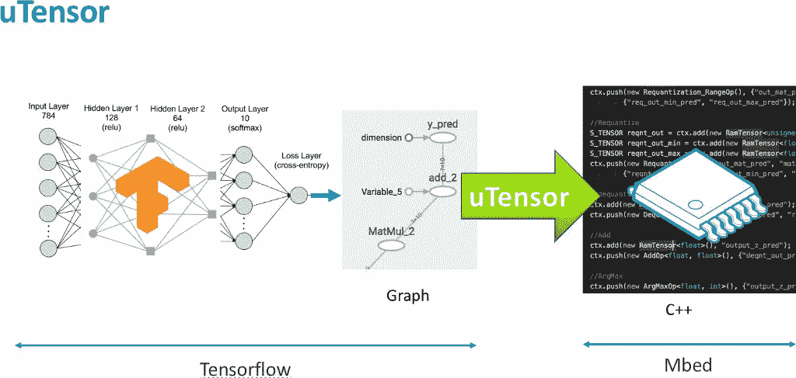
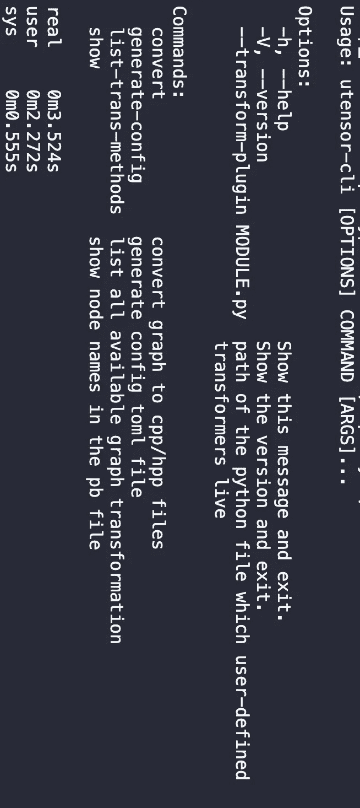
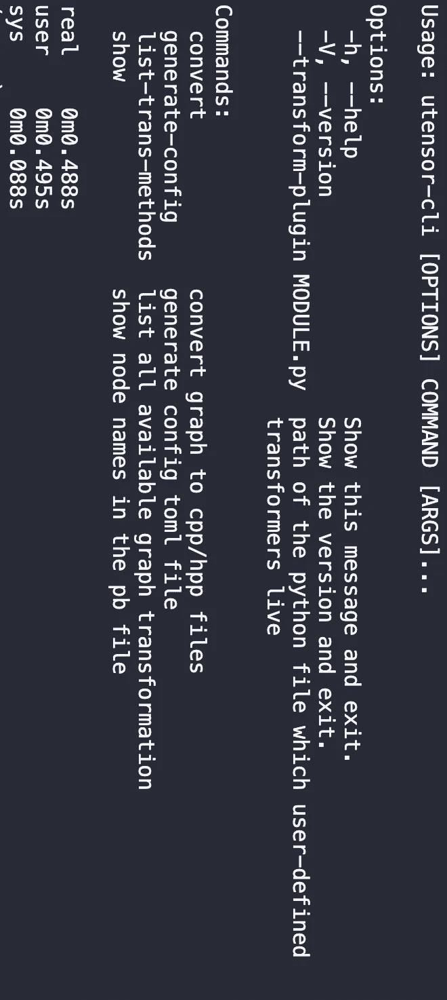

# Python 技巧:延迟模块加载

> 原文：<https://levelup.gitconnected.com/python-trick-lazy-module-loading-df9b9dc111af>



# 介绍

我大量参与了用于微控制器的神经网络推理库`[uTensor](https://github.com/uTensor/uTensor)`的 CLI 工具`[utensor_cgen](https://github.com/uTensor/utensor_cgen)`的开发。

在我们在这篇文章中深入探讨这个技巧之前，读者最好先了解一下这个问题的背景。

简而言之，`[utensor_cgen](https://github.com/uTensor/utensor_cgen)`可以获取一个预先训练好的模型文件，比如使用`Tensorflow`训练的 protobuff 模型文件，并在`uTensor`运行时将其转换为等价的实现，即一堆 C++源文件和头文件。因此，当 CLI 启动并运行时，我需要导入库，如`Tensorflow`。

然而，加载`Tensorflow`需要很长时间。具体来说，将它加载到我的机器上大约需要 3 秒钟:



优化前的加载时间

我使用`time`来获取 cli 的加载时间。

正如您在`real`部分看到的，我花了 3.5 秒加载 cli 并打印帮助消息。

当我检查程序时，我意识到我的程序花了很多时间加载`Tensorflow`。所以才慢。非常感谢`Tensorflow`，你真的毁了我的表演。

初看起来，3 秒钟似乎没有什么害处，但当你不得不每天一遍又一遍地使用这个命令行界面时，情况会变得更糟。没有人愿意等待 3 秒钟的求助信息。幸运的是，我没花多长时间就想出了如何修复它。

想法很简单:咱们不要进口`Tensorflow`！

这不公平。我的意思是不要马上导入`Tensorflow`，而是只在需要的时候导入。

但是怎么做呢？你可能会问。

由于 python 是一种解释型语言，您可以这样做:

```
def my_func():
    import tensorflow as tf
    # do stuff with tf
```

或者

```
class MyClass:
    def magic(self):
        import tensorflow as tf
        # do stuff with tf
```

在这两种情况下，只有在调用函数/方法时，才会执行导入语句。

然而，这不是一个好主意，因为`Tensorflow`是 CLI 如此重要的一部分。它在多个地方被引用，所以我们必须到处复制和粘贴 import 语句，这样不好维护。

到目前为止，要求是明确的:

1.  对`Tensorflow`的单一引用，就像在我的每一个 python 脚本的顶部的`import tensorflow as tf`，所以脚本中的所有成员可以共享对`Tensorflow`的相同引用。
2.  只有当`tf`的属性被访问时，才执行导入语句。

# 惰性模块加载

是的，让我们的模块变懒吧！

计划是写一个类，它以一个库/包名为字符串，并带有自定义的属性访问，即实现`__getattrib__`方法。在`__getattrib__`的主体中，它将检查目标库/包是否被加载。如果没有加载，我们用`importlib.import_module`加载库/包，然后得到我们需要的属性。

一个简化的实现可能如下所示:

```
import importlibclass LazyLoader:
    def __init__(self, lib_name):
        self.lib_name = lib_name
        self._mod = None def __getattrib__(self, name):
        if self._mod is None:
            self._mod = importlib.import_module(self.lib_name)
        return getattr(self._mod, name)
```

它的工作原理如下:

1.  最初，模块`self._mod`被设置为`None`，目标模块名以字符串的形式给出为`lib_name`
2.  当对该对象进行任何属性查找时，即`__getattrib__`被调用时，我们检查`self._mod`是否仍然是`None`，如果模块丢失，则使用`importlib.import_module`加载库。
3.  用`getattr`将属性查找委托给`self._mod`。

因此，这个惰性加载器对象将像一个普通的模块一样工作，除了它不会加载模块，直到需要它的属性。

有了这个`LazyLoader`，我们只需将所有的`import tensorflow as tf`替换为`tf = LazyLoader('tensorflow')`即可，以下是最终的加载时间:



延迟模块加载的加载时间

Boooom，加载时间下降到不到 0.5 秒！巨大的提升。

当然，这一招并不是`Tensorflow`的专属。您可以将它应用于 python 脚本中任何您认为比较慢的 import 语句。你可以在这里找到我实现的[](https://github.com/uTensor/utensor_cgen/blob/develop/utensor_cgen/utils.py#L23-L44)**。**

**也就是说，我的实现可能不会涵盖所有用例。例如，我没有在我的懒惰加载器中正确处理`from ... import ...`语句。**

**对于需要这个的人，我建议你看一下`importlib` [文档](https://docs.python.org/3/library/importlib.html#importlib.import_module)看看怎么做。**

**希望你会喜欢这一招，喜欢 python 编程！**

**下一次，我们将讨论如何为`[utensor_cgen](https://github.com/uTensor/utensor_cgen)`编写插件，这样我们就可以为 CLI 注入一个新的后端。**