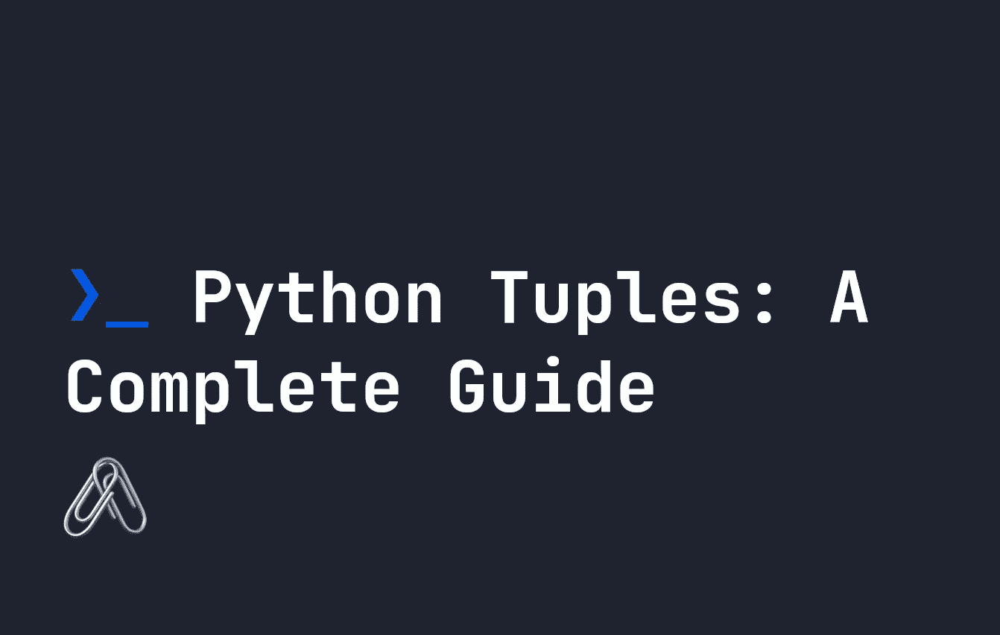

# Python 元组:完整指南

> 原文：<https://levelup.gitconnected.com/python-tuples-a-complete-guide-eef4e59c62ef>



元组是 Python 中一种重要的数据结构，与 [Python 列表](https://fjolt.com/article/python-lists)非常相似。元组和列表的主要区别在于元组**不能被**修改。一旦它被创建，它就是固定的，不可改变的。元组比列表更快，所以如果你知道你的数据不会改变，这是正确的做法。元组通常用于遍历我们知道不会改变的固定项目列表。

在本指南中，我们将介绍如何使用元组，以及一些方法和你想用它们做的事情。首先，让我们定义一个新的元组:

```
myTuple = ("my", "new", "tuple")
print(myTuple) # ('my', 'new', 'tuple')
```

你也可以看到元组的定义没有括号。逗号分隔值的列表也会自动变成一个元组:

```
myTuple = "my", "new", "tuple"
print(myTuple) # ('my', 'new', 'tuple')
```

尝试更改元组将导致错误:

```
myTuple = ("my", "new", "tuple")
myTuple[0] = "your" # TypeError: 'tuple' object does not support item assignment
```

正如您所料，这意味着我们可以使用语法`myTuple[0]`来访问元组数据，以引用索引 0 处的条目。

元组可能包含重复项，所以它们不会像 [Python sets](https://fjolt.com/article/python-sets) 那样受到唯一性的限制:

```
myTuple = ("my", "new", "tuple", "tuple")
print(myTuple) #  ('my', 'new', 'tuple', 'tuple' )
```

最后，元组也可以嵌套，就像列表一样:

```
myTuple = ( ("nested", "tuple"), "my", "new", "tuple", "tuple")
```

# 使用元组检查成员资格

与 [Python 集合](https://fjolt.com/article/python-sets)一样，我们可以使用使用`in`和`not in`关键字的元组来测试成员资格。例如，下面，我们检查`apple`是否在我们的`fruits`元组中:

```
fruits = ("apple", "pear", "strawberry")print("apple" in fruits) # True
print("apple" not in fruits) # False
```

# 组合元组

因为我们不能修改元组，所以如果我们想创建一个元组的更新版本，我们需要组合它。这可以通过将它们相加来实现:

```
tupleOne = ("one", "two")
tupleTwo = ("three", "four")
tupleThree = tupleOne + tupleTwo
print(tupleThree) # ("one", "two", "three", "four")
```

# 排序元组

由于元组像 [Python 列表](https://fjolt.com/article/python-lists)一样排序，我们也可以对元组排序。但是，一个 tuple 没有方法`sort()`，所以我们必须使用`sorted()`函数。为什么不能用一个`sort()`的方法？因为元组是不可变的！所以我们必须使用`sorted()`定义一个新的元组:

```
myTuple =  ("a", "c", "e", "b", "f", "d", "g", "z", "w", "x")
myNumberTuple = (1, 3, 5, 2, 7, 4, 6)newTuple = sorted(myTuple)
newNumberTuple = sorted(myNumberTuple)print(newTuple) # ('a', 'b', 'c', 'd', 'e', 'f', 'g', 'w', 'x', 'z')
print(newNumberTuple) # (1, 2, 3, 4, 5, 6, 7)
```

和`list.sort()`一样，如果你试图用多种类型排序——比如整数和字符串，你最终会得到一个错误。这里我们必须使用`sorted()`的附加参数来排序我们的列表:

*   `key`给出一个数字，用于比较列表内容
*   `reverse`如果设置为真将颠倒顺序。

例如，要将所有值`b`放在一个元组的开头，我们可以这样尝试:

```
def isB(letter):
    if(letter == "b"):
        return 1
    else:
        return 0myTuple = ("b", "c", "b", 5, "f", "b", 2, "z", "a", "x")newTuple = sorted(myTuple, key=isB, reverse=True)print(newTuple) # ['b', 'b', 'b', 'c', 5, 'f', 2, 'z', 'a', 'x']
```

这里我们定义了一个函数`isB`，它在`sorted()`中用来将元组中的每一项传递给函数。如果元组中的项目是`b`，那么该项目的顺序被设置为`1`，否则为`0`。这让我们根据条件而不是字母数字顺序来排序我们的列表。

# 结论

感谢阅读。您可以在下面了解有关 Python 数据集合的更多信息:

*   [Python 数据集合](https://fjolt.com/python-data-collections)
*   [Python 数据集合:列表](https://fjolt.com/article/python-lists)
*   **Python 数据集合:元组**
*   [Python 数据集合:集合](https://fjolt.com/article/python-sets)
*   [Python 数据集合:字典](https://fjolt.com/article/python-dictionaries)

# 分级编码

感谢您成为我们社区的一员！在你离开之前:

*   👏为故事鼓掌，跟着作者走👉
*   📰查看[升级编码出版物](https://levelup.gitconnected.com/?utm_source=pub&utm_medium=post)中的更多内容
*   🔔关注我们:[Twitter](https://twitter.com/gitconnected)|[LinkedIn](https://www.linkedin.com/company/gitconnected)|[时事通讯](https://newsletter.levelup.dev)

🚀👉 [**将像你这样的开发人员安置在顶级创业公司和科技公司**](https://jobs.levelup.dev/talent/welcome?referral=true)