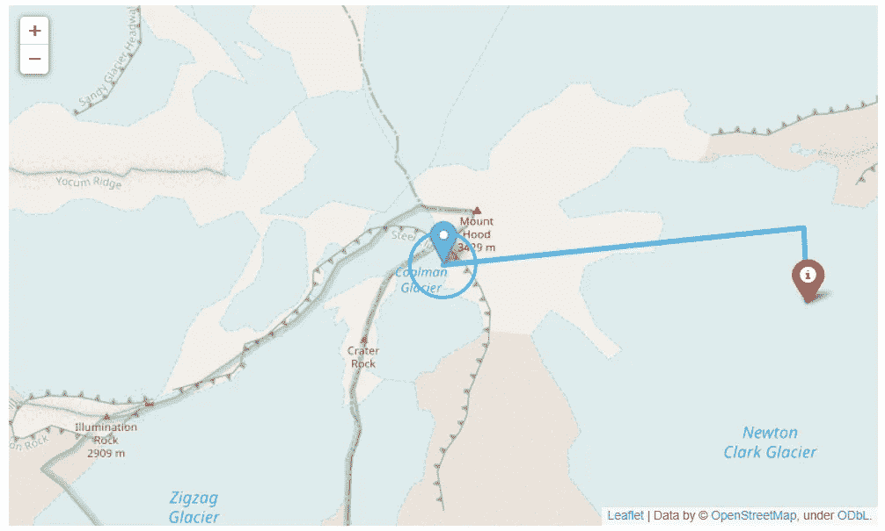

# 关于如何使用 follow 发布交互式地图的 Python 教程

> 原文：<https://levelup.gitconnected.com/python-tutorial-on-how-to-use-folium-to-publish-an-interactive-map-31a4120b19c4>



这个例子提供了一个关于如何用一些简单的形状创建一个[叶子](https://python-visualization.github.io/folium/modules.html)地图的快速概述。

要开始，去[mecsimcalc.com/create](https://mecsimcalc.com/create)，点击地图，选择绘制形状。

# 第一步:输入[和](https://docs.mecsimcalc.com/maps/example-3#step-1-inputs)

对于输入，创建具有以下属性的单个选择:

*   名称:map_tile
*   标签:地图框
*   选项:
*   OpenStreetMap
*   雄蕊地形
*   雄蕊调色剂
*   雄蕊水彩

并创建一个具有以下属性的颜色选择器:

*   名称:颜色
*   标签:形状颜色
*   默认值:#43BFF5

# 第二步:编码[](https://docs.mecsimcalc.com/maps/example-3#step-2-code)

# 创建地图[](https://docs.mecsimcalc.com/maps/example-3#creating-a-map)

首先创建一个叶子地图实例`m`，它具有以下属性:

*   `location`:经纬度地图的初始中心。
*   `zoom_start`:初始缩放级别。
*   `tiles`:地图平铺。
*   地图分块指定要使用的地图类型，例如卫星与道路。
*   `"OpenStreetMap"`是用来看道路的标准瓦片。
*   点击查看可能的地图区块[。](https://python-visualization.github.io/folium/modules.html)

```
m = folium.Map(location=[45.372, -121.6972],
                zoom_start=15, tiles=inputs['map_tile'])
```

# 添加形状[和](https://docs.mecsimcalc.com/maps/example-3#adding-shapes)

要将形状添加到您的地图，首先创建形状，然后使用`.add_to(m)`将其添加到您的地图。

向您的地图添加两个`[Markers](https://python-visualization.github.io/folium/modules.html#folium.map.Marker)`:

*   `location`是经纬度中的标记位置。
*   点击标记时会显示`popup`。您可以在字符串中使用 HTML。
*   `tooltip`将鼠标悬停在标记上时显示。
*   `icon`是标记的可选图标。

```
folium.Marker(
    [45.372, -121.6972], popup="<i>Italic popup text</i>", tooltip="Click on Marker"
).add_to(m)folium.Marker(  *# Marker with icon*
    location=[45.371, -121.683],
    popup="<b>Bold popup text</b>",
    tooltip="Click on Marker",
    icon=folium.Icon(color=inputs['color'], icon="info-sign"),
).add_to(m)
```

向您的地图添加一个`[PolyLine](https://python-visualization.github.io/folium/modules.html#folium.vector_layers.PolyLine)`:

*   `locations`是连接时构成直线的点的列表。
*   `color`是线条的颜色，为十六进制颜色代码。
*   `tooltip`将鼠标悬停在折线上时显示。
*   `weight`是线条粗细。
*   `opacity`是线条的透明度。

```
lat_lng_points = [[45.372, -121.6972],
                    [45.373, -121.6831],
                    [45.371, -121.683]]
folium.PolyLine(locations=lat_lng_points,
                color=inputs['color'],
                tooltip="PolyLine",
                weight=5,  *# line thickness*
                opacity=0.8  *# transparency*
                ).add_to(m)
```

向您的地图添加一个`[Circle](https://python-visualization.github.io/folium/modules.html#folium.vector_layers.Circle)`:

*   `radius`是圆的半径。
*   `location`是经纬度上的圆心。
*   `tooltip`悬停在圆圈上方时显示。
*   点击圆圈时会显示`popup`。您可以在字符串中使用 HTML。
*   `color`是圆的颜色作为十六进制颜色代码。

```
folium.Circle(
    radius=100,
    location=[45.372, -121.6972],
    tooltip="Click on Circle",
    popup="Circle",
    color=inputs['color'],
    fill=False,
).add_to(m)
```

# 导出地图[](https://docs.mecsimcalc.com/maps/example-3#exporting-the-map)

最后，要导出地图，只需使用`._repr_html_()`将叶子地图对象转换成可以在输出步骤中显示的 HTML。

```
map_html = m._repr_html_()
return {"map": map_html}
```

# 完整代码[](https://docs.mecsimcalc.com/maps/example-3#full-code)

```
import folium def main(inputs):
    *# Create a folium map*
    m = folium.Map(location=[45.372, -121.6972],
                   zoom_start=15, tiles=inputs['map_tile']) *# Add markers to map*
    folium.Marker(
        [45.372, -121.6972], popup="<i>Italic popup text</i>", tooltip="Click on Marker"
    ).add_to(m)
    folium.Marker(  *# Marker with icon*
        location=[45.371, -121.683],
        popup="<b>Bold popup text</b>",
        tooltip="Click on Marker",
        icon=folium.Icon(color=inputs['color'], icon="info-sign"),
    ).add_to(m) *# Add line shape*
    lat_lng_points = [[45.372, -121.6972],
                      [45.373, -121.6831],
                      [45.371, -121.683]]
    folium.PolyLine(lat_lng_points,
                    color=inputs['color'],
                    tooltip="PolyLine",
                    weight=5,  *# line thickness*
                    opacity=0.8  *# transparency*
                    ).add_to(m) *# Add circle shape*
    folium.Circle(
        radius=100,
        location=[45.372, -121.6972],
        tooltip="Click on Circle",
        popup="Circle",
        color=inputs['color'],
        fill=False,
    ).add_to(m) *# Export folium map as HTML string*
    map_html = m._repr_html_() return {"map": map_html}
```

# 第三步:输出[](https://docs.mecsimcalc.com/maps/example-3#step-3-output)

```
{{ outputs.map }}
```


*更多教程，请访问* [*这里*](https://docs.mecsimcalc.com/) *。*