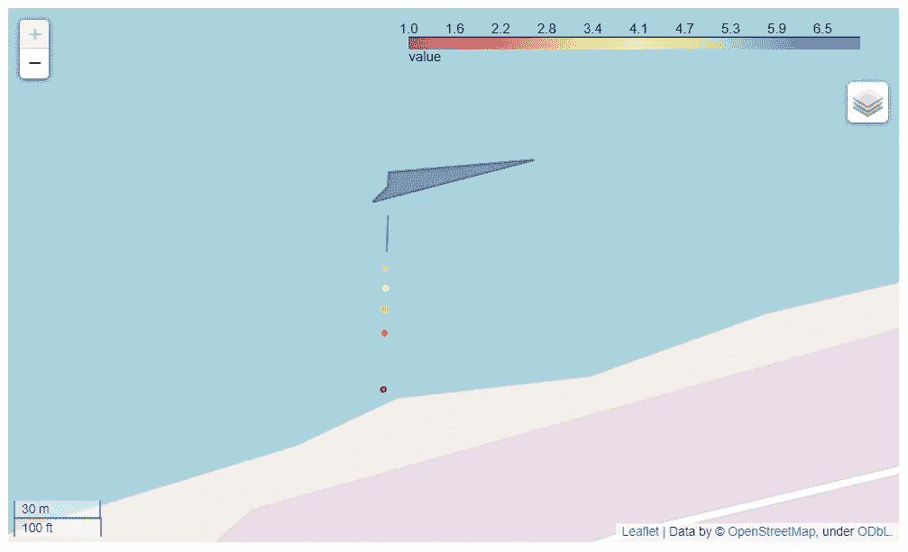
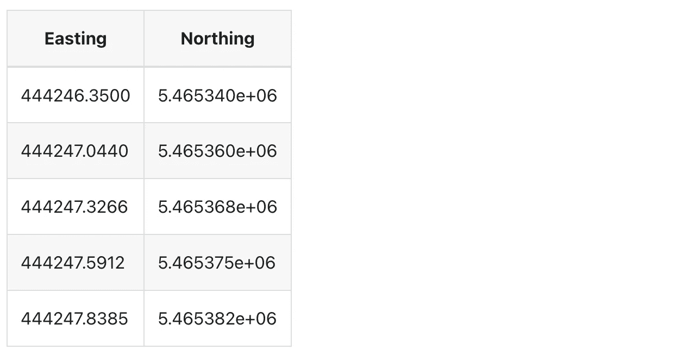
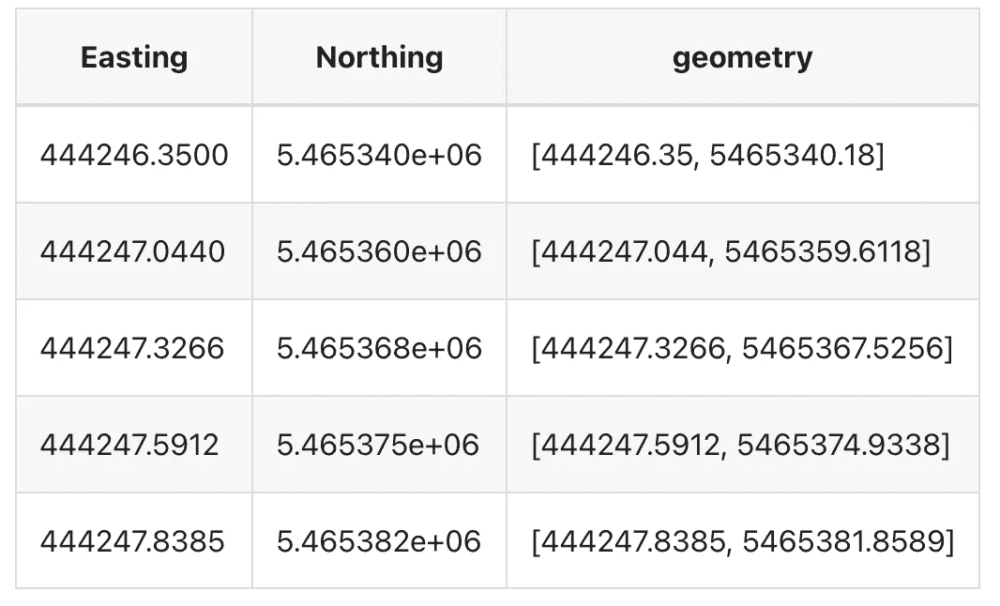
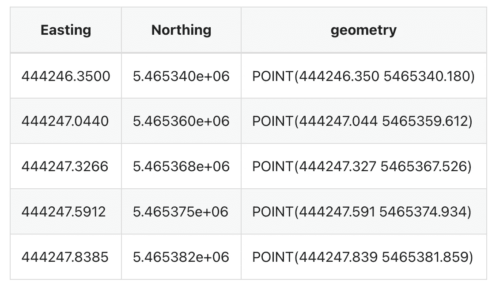
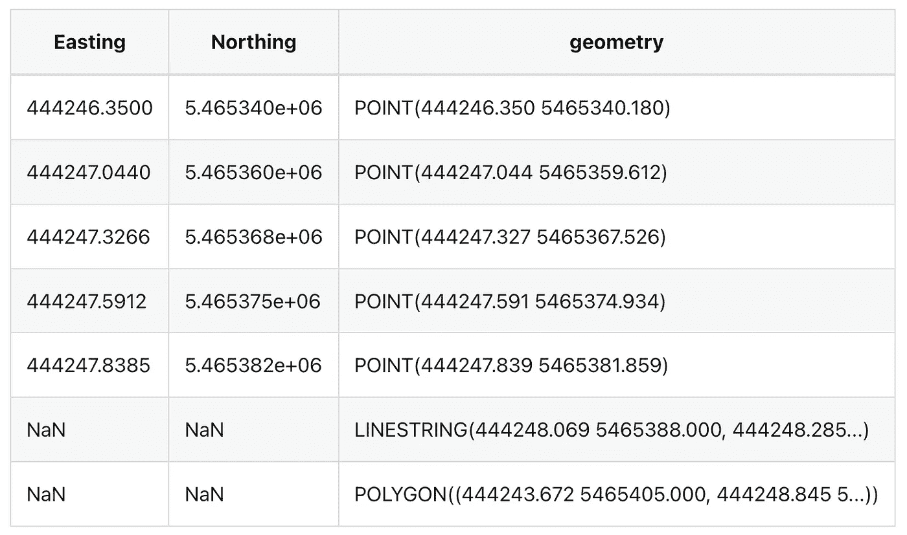
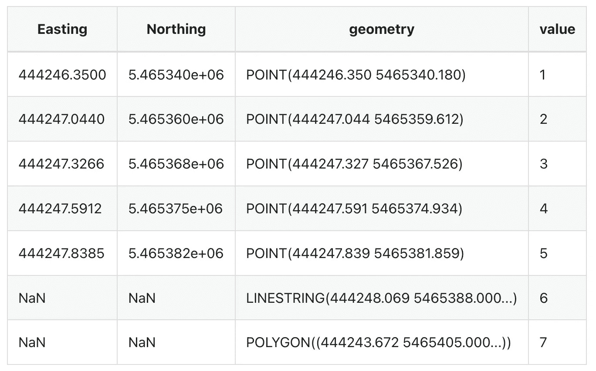
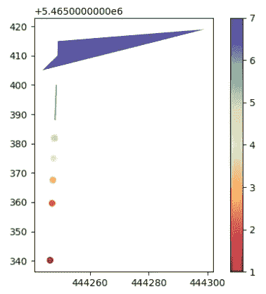

# 关于如何使用 GeoPandas 数据框架生成地图的 Python 教程

> 原文：<https://levelup.gitconnected.com/python-tutorial-on-how-to-use-geopandas-dataframes-to-generate-maps-e4c40eb8223d>



本例详细解释了如何使用 [GeoPandas](https://geopandas.org/en/stable/docs/user_guide.html) 可视化结构化数据。

要开始，去[mecsimcalc.com/create](https://mecsimcalc.com/create)，点击地图，并选择创建一个新的空白应用。

# 第一步:代码[](https://docs.mecsimcalc.com/maps/example-2#step-1-code)

# [获取数据](https://docs.mecsimcalc.com/maps/example-2#get-the-data)

首先，导入或创建要可视化的地理空间数据。在本例中，我们将创建一只熊猫的`DataFrame`，然后将其转换为`GeoDataFrame`。

使用东距和北距坐标创建数据框。

```
df = pd.DataFrame({"Easting": [444246.35, 444247.044, 444247.3266, 444247.5912, 444247.8385],
                   "Northing": [5465340.18, 5465359.6118, 5465367.5256, 5465374.9338, 5465381.8589]})
```

`df`看起来是这样的:



将`Easting`和`Northing`列合并成一列。这将使以后创建形状更加容易。新列必须命名为`geometry`，这将在后面解释。

```
df["geometry"] = df[["Easting", "Northing"]].values.tolist()
```

`df`看起来是这样的:



现在，将`df`数据框转换为地理数据框`gdf`。

```
gdf = geopandas.GeoDataFrame(df, crs="EPSG:26911")
```

## 坐标参考系统[](https://docs.mecsimcalc.com/maps/example-2#coordinate-reference-system-crs)

请注意，坐标位于东距的*和北距*的*中，而 GeoPandas 需要纬度和经度。所以坐标一定要投影成经纬度。幸运的是，`GeoDataFrame`有一个内置的`[crs](https://geopandas.org/en/stable/docs/user_guide/projections.html)`(坐标参考系统)，它将投影应用到`geometry`列。*

在本例中，`crs`是`"EPSG:26911"`，但对于您的代码，它可能会有所不同，这取决于所使用的坐标参考系统。

**提示**

如果您的坐标已经在纬度和经度中，那么您可以跳过设置`crs`属性。

**危险**

为了正确应用`crs`投影，您的形状必须在`geometry`列中！

# [操纵数据](https://docs.mecsimcalc.com/maps/example-2#manipulate-the-data)

通过使用`[.apply()](https://pandas.pydata.org/docs/reference/api/pandas.DataFrame.apply.html)`将来自`[shapely.geometry](https://shapely.readthedocs.io/en/stable/)`的`[Point](https://shapely.readthedocs.io/en/stable/manual.html#Point)`函数应用到所有行，将`geometry`列转换成点数。

```
gdf["geometry"] = gdf["geometry"].apply(Point)
```

`gdf`看起来是这样的:



接下来，我们将在一个单独的`GeoDataFrame`中创建更多的几何图形，然后将其附加到现有的`GeoDataFrame`、`gdf`的末尾。

使用`[LineString](https://shapely.readthedocs.io/en/stable/manual.html#LineString)`和`[Polygon](https://shapely.readthedocs.io/en/stable/manual.html#Polygon)`在名为`more_geometries`的新`GeoDataFrame`中创建新形状。

**提示**

你可以在这里找到更多匀称的几何图形。

使用`[pd.concat](https://pandas.pydata.org/docs/reference/api/pandas.concat.html)`将`more_geometries`连接到`gdf`的末端。注意，`axis=0`表示连接成一个新行，而`axis=1`表示连接成一个新列。

```
more_geometries = geopandas.GeoDataFrame(
    {
        "geometry": [
            LineString([[444248.0694, 5.465388e06], [444248.2847, 5.465394e06], [444248.4852, 5.465400e06]]),
            Polygon([[444243.6719, 5.465405e06], [444248.8454, 5.465410e06], [444249.0068, 5.465415e06], [444299.1569, 5.465419e06]]),
        ]
    }
)
gdf = pd.concat((gdf, more_geometries), axis=0)
```

`gdf`看起来是这样的:



现在我们已经定义了所有的几何图形，我们可以将每个几何图形的计算值添加为一个名为`value`的新列。这里我们使用一些随机数，但是你应该在其他库的帮助下计算更有意义的数字，比如 Numpy、GeoPandas 或 Pandas。

```
gdf["value"] = [1,2,3,4,5,6,7] *# computed values*
```

`gdf`看起来是这样的:



# 导出地图[](https://docs.mecsimcalc.com/maps/example-2#exporting-the-map)

## 互动地图[](https://docs.mecsimcalc.com/maps/example-2#interactive-map)

将`gdf`地理数据框导出为交互式地图:

```
m1 = gdf.explore("value", cmap="Spectral", name="My shapes", tiles=None)
m1.options["preferCanvas"] = True
```

在哪里，

*   `[gdf.explore](https://geopandas.org/en/stable/docs/reference/api/geopandas.GeoDataFrame.explore.html)`返回一个树叶地图对象。
*   `"value"`是`gdf`的列，包含要可视化的数值。
*   `cmap`是刻度的颜色。点击查看更多色彩图[。](https://matplotlib.org/3.5.0/tutorials/colors/colormaps.html)
*   `name`是形状几何图形的*图层控制*名称。
*   `tiles=None`不设置地图平铺。在大多数情况下，您不需要指定`tiles`属性。
*   当你绘制大量的几何图形或者当地图感觉缓慢或滞后时，应该将`m1.options["preferCanvas"] = True`设置为`True`。否则，您可以省略这一行。

接下来，我们将向地图添加一个 LayerControl，它将允许切换地图拼贴以及打开和关闭几何图形。

将每个`[TileLayer](https://python-visualization.github.io/folium/modules.html#folium.raster_layers.TileLayer)`分别添加到地图中。注意，OpenStreetMap 和 Stamen Terrain 是字符串，而 Satellite 必须为`tiles`指定一个 url。这是因为 OpenStreetMap 和 Stamen Terrain 是内置到 leav 中的地图分块，而 Satellite 是自定义的地图分块。

```
folium.TileLayer("OpenStreetMap", name="Road").add_to(m1)
folium.TileLayer("Stamen Terrain", name="Terrain").add_to(m1)
folium.TileLayer(
    tiles="https://server.arcgisonline.com/ArcGIS/rest/services/World_Imagery/MapServer/tile/{z}/{y}/{x}",
    attr="Esri",
    name="Satellite",
).add_to(m1)
folium.LayerControl().add_to(m1)
```

最后，将地图对象转换成可以在网页上显示的 HTML。

```
interactive_map = m1._repr_html_()
```


## 静态地图[](https://docs.mecsimcalc.com/maps/example-2#static-map)

我们还将地图导出为静态 Matplotlib 图。

```
def plt_show(plt, width=500, dpi=100):
    *# Converts matplotlib plt to image data string*
    *#   plt is the matplotlib pyplot or figure*
    *#   width is the width of the graph image in pixels*
    *#   dpi (dots per inch) is the resolution of the image*
    bytes = io.BytesIO()
    plt.savefig(bytes, format="png", dpi=dpi)  *# Save as png image*
    if hasattr(plt, "close"):
        plt.close()
    bytes.seek(0)
    base64_string = "data:image/png;base64," + base64.b64encode(bytes.getvalue()).decode("utf-8")
    return "" m2 = gdf.plot("value", cmap="Spectral", legend=True)
static_map = plt_show(m2.figure)
```

在哪里，

*   `[gdf.plot](https://geopandas.org/en/stable/docs/reference/api/geopandas.GeoDataFrame.plot.html)`返回一个 Matplotlib 图形。
*   `"value"`是`gdf`的列，包含要可视化的数值。
*   `cmap`是刻度的颜色。点击查看更多色彩图[。](https://matplotlib.org/3.5.0/tutorials/colors/colormaps.html)
*   `legend=True`在右侧显示颜色条。
*   将`m2.figure`传入`plt_show`返回一个可以在网页上显示的图片。



# 完整代码[](https://docs.mecsimcalc.com/maps/example-2#full-code)

```
import io
import base64
import folium
import geopandas
import pandas as pd
from shapely.geometry import LineString, Point, Polygon def plt_show(plt, width=500, dpi=100):
    *# Converts matplotlib plt to image data string*
    *#   plt is the matplotlib pyplot or figure*
    *#   width is the width of the graph image in pixels*
    *#   dpi (dots per inch) is the resolution of the image*
    bytes = io.BytesIO()
    plt.savefig(bytes, format="png", dpi=dpi)  *# Save as png image*
    if hasattr(plt, "close"):
        plt.close()
    bytes.seek(0)
    base64_string = "data:image/png;base64," + \
        base64.b64encode(bytes.getvalue()).decode("utf-8")
    return "" def main(inputs):
    *# Create data as Panda's DataFrame*
    df = pd.DataFrame({"Easting": [444246.35, 444247.044, 444247.3266, 444247.5912, 444247.8385],
                       "Northing": [5465340.18, 5465359.6118, 5465367.5256, 5465374.9338, 5465381.8589]})
    *# Merge `Easting` and `Northing` columns into one column called `geometry`*
    df["geometry"] = df[["Easting", "Northing"]].values.tolist() *# Convert DataFrame to GeoDataFrame and project coordinates to "EPSG:26911"*
    gdf = geopandas.GeoDataFrame(df, crs="EPSG:26911")
    *# Convert all geometries into Point shapes*
    gdf["geometry"] = gdf["geometry"].apply(Point) *# Create a new GeoDataFrame with a LineString and a Polygon*
    more_geometries = geopandas.GeoDataFrame(
        {
            "geometry": [
                LineString([[444248.0694, 5.465388e06], [444248.2847,
                                                         5.465394e06], [444248.4852, 5.465400e06]]),
                Polygon([[444243.6719, 5.465405e06], [444248.8454, 5.465410e06], [
                        444249.0068, 5.465415e06], [444299.1569, 5.465419e06]]),
            ]
        }
    )
    *# Add the new geometries as new rows to the existing GeoDataFrame, gdf*
    gdf = pd.concat((gdf, more_geometries), axis=0) *# Add computed values as a new column to gdf*
    gdf["value"] = [1, 2, 3, 4, 5, 6, 7]  *# computed values* *# Export gdf as an interactive Folium map*
    m1 = gdf.explore("value", cmap="Spectral", name="My shapes", tiles=None)
    *# Set `preferCanvas` to optimize performance of map*
    m1.options["preferCanvas"] = True *# Add a LayerControl with different TileLayers*
    folium.TileLayer("OpenStreetMap", name="Road").add_to(m1)
    folium.TileLayer("Stamen Terrain", name="Terrain").add_to(m1)
    folium.TileLayer(
        tiles="https://server.arcgisonline.com/ArcGIS/rest/services/World_Imagery/MapServer/tile/{z}/{y}/{x}",
        attr="Esri",
        name="Satellite",
    ).add_to(m1)
    folium.LayerControl().add_to(m1) *# Get Folium map as HTML string*
    interactive_map = m1._repr_html_() *# Export gdf as Matplotlib plot image*
    m2 = gdf.plot("value", cmap="Spectral", legend=True)
    static_map = plt_show(m2.figure) return {
        "interactive_map": interactive_map,
        "static_map": static_map
    }
```

# 第二步:输出[T5](https://docs.mecsimcalc.com/maps/example-2#step-2-output)

```
{{ outputs.interactive_map }}
{{ outputs.static_map }}
```

*更多教程，请访问* [*这里*](https://docs.mecsimcalc.com/) *。*