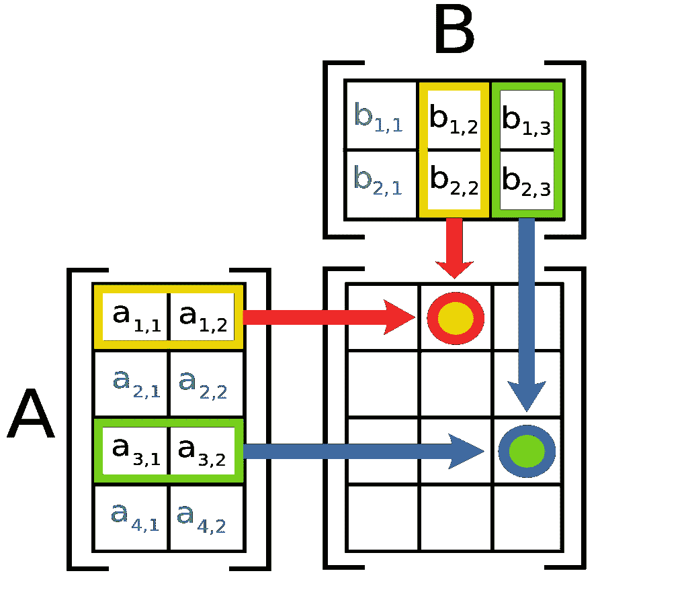
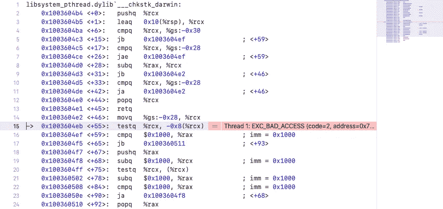

# Python 比 C++快:性能和矩阵乘法

> 原文：<https://levelup.gitconnected.com/python-vs-c-performance-and-matrix-multiplication-59dbf20e212a>

当人们说 Python 慢的时候，给他们看看这篇文章


我想提前说:是的，当你写同样的代码时，C++比大多数现代语言更有性能。Python 应该在列表的末尾。

但是当你实现真正的项目时，没有人关心你的代码或语言，结果很重要，你写代码越快越好。

比方说，你需要创建一个新网站。而且有两个选项:C++和 Python。最终 C++项目会快 10 倍。因此，你的 HTML 页面将在 0.01 秒内生成，而不是 0.1 秒。但是谁在乎呢？在 C++中，你将花几个月的时间编写同一个项目，而在 Python 中，你只需一周。

但这篇文章不是关于这场圣战的。

## 矩阵乘法

让我们用 C++和 Python 把两个矩阵相乘。让我们比较一下运行时间。



维基百科(一个基于 wiki 技术的多语言的百科全书协作计划ˌ也是一部用不同语言写成的网络百科全书ˌ 其目标及宗旨是为全人类提供自由的百科全书)ˌ开放性的百科全书

## C++中的矩阵乘法

当我开始这篇文章时，我认为我将比较两个 1000*1000 矩阵的矩阵乘法。

但是 C++在这点上失败了。



哈哈！拜托，C++，如果真的需要计算，我等两个小时都没问题！但是请照做。

所以，我发现它能够乘以 800*800 的矩阵。

代码如下:

花了多长时间？

```
**1.94591 sec**
```

差不多 2 秒。

## Python 中的矩阵乘法

嗯…我怀疑用 Python 计算同样的东西会有问题，但我不知道有那么糟糕！

用 300 乘 300，它在…

```
**28.535400867462158 sec.**
```

半分钟！！！但是等等…没有人用 Python 写任何逻辑，因为“包括电池”。

当然，这些电池是用 C++写的，但是谁在乎呢？

## 用 Numpy 乘矩阵

没错。让我们试一试。

相信会比上面简单的 C++代码快。

所以。没错。是 1000 乘 1000 乘以 1000 乘 1000。

而且…时间是…

```
...
```

猜猜看…

```
0.016139984130859375 sec.
```

> Python 中的 0. 01 vs c++中的 1.9！！！

为什么停在 1000？

让我们试试更大的数字。

```
2000x2000 : 0.090 sec
3000x3000 : 0.278 sec
4000x4000 : 0.623 sec
and...
5000x5000 : 1.16 sec!
```

你能相信吗？！

## 一些借口

没错。Numpy 是用 C++写的。

但是加油！如果你是用 C++写的话，你永远不会实现和 Numpy 一样复杂的算法。

当然，有了 xtensor 或 GNU 科学库，C++会好得多。

当然，你可以用 C++做很多你用 Python 做不到的事情。

但是谁在乎呢？