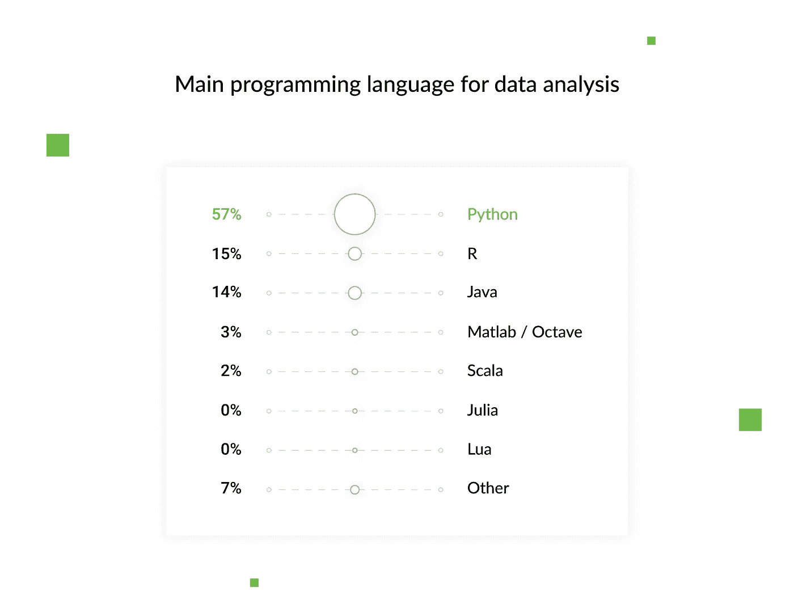

# Python vs Node。Js:选择哪种编程语言？

> 原文：<https://levelup.gitconnected.com/python-vs-nodejs-which-programming-language-to-choose-98721d6526f2>

每个项目都有其规格和要求。当你构建一个应用程序时，选择合适的技术来编码是最重要的。在本文中，我们将通过 [Python](http://hackernoon.com/tagged/python) 与 [Node.js](http://hackernoon.com/tagged/nodejs) 来了解它们的优点、缺点和用例，这样您就可以做出明智的决定，选择最适合您项目的一种。

> 这篇文章是关于[和**比较 Python 和 Node 的。JS**](https://djangostars.com/blog/comparing-python-node-js-best-project/?utm_source=medium&utm_medium=http%3A%2F%2Flevelup.gitconnected.com&utm_campaign=python%20vs%20node%20js&utm_content=originally%20posted) 最初发布在 **Django Stars 博客上。**

# 为什么您的技术堆栈选择很重要

你可以向你的同行咨询选择什么技术，谷歌一下答案，或者问开发者他们更喜欢哪种技术。每个来源都会给你不同的意见，但是没有一个选项会可靠地告诉你哪种技术最适合你的项目。

编程语言和框架是为实现特定的项目目标而设计的，这是你选择的主要标准。不要只看知名度。例如，有些技术更适合大数据应用程序(如 Python 和 R)，而其他技术则更常用于构建大型桌面应用程序(如 Java 和 C/++/#)。

技术的选择应经过深思熟虑，并基于您的需求和能力，例如:

*   项目类型:商业应用、游戏、支付软件
*   产品类型:动态信使，或数据分析平台
*   应用地理:本地、全国或全球
*   预算:从长远来看，为了构建和支持你的项目，你可以在技术和开发人员工资上花多少钱

这个清单还可以继续下去，但是在选择构建产品的技术时，必须考虑到未来产品的每一个特性。通过比较 Python 和 Node.js 的后端开发，我们将向您展示好的技术在它们的优势和应用领域方面是如何变化的。

# Python:优点、缺点和 Python 用例

Python 是一个老古董，但也是一个好东西。这种编程语言起源于 90 年代早期，由于其不断开发的库、优秀的文档和前沿的实现，它仍然是最具创新性、最灵活和最通用的技术之一。例如，Python 是数据科学、机器学习和人工智能项目的首选语言。据 JetBrains 研究公司称，这种情况将会持续五年。

Python 还有一个最大的社区，致力于改进语言来处理现代编程任务，如下图所示。

来源: [Hackerrank 软件开发者调查](https://research.hackerrank.com/developer-skills/2018/#developer-tools)

像任何其他技术一样，Python 有其优点、缺点和特定的应用领域。我曾在许多不同的项目中使用 Python，如监控和支付平台、房地产和安全解决方案、 [FinTech](https://djangostars.com/industries/fintech/?utm_source=medium&utm_medium=http%3A%2F%2Flevelup.gitconnected.com&utm_campaign=python%20vs%20node%20js&utm_content=fintech) (ClearMinds)、 [travel](https://djangostars.com/case-studies/?industry=travel-booking&utm_source=medium&utm_medium=https%3A%2F%2Flevelup.gitconnected.com%2F&utm_campaign=python%20vs%20node%20js&utm_content=travel#filters) (Padi Travel，Diviac)和[health care](https://djangostars.com/case-studies/?industry=health-care-fitness&utm_source=medium&utm_medium=https%3A%2F%2Flevelup.gitconnected.com%2F&utm_campaign=python%20vs%20node%20js&utm_content=healthcare)(Haystack Intelligence)平台。一次又一次，它被证明是一种强大的技术，可以处理我们客户的所有任务。

 [## 案例研究——基于 Django、Python、JS 的项目示例

### 在 Django Stars，我们通过真实且成功完成的 Python 项目实例来证明我们的技能和知识…

djangostars.com](https://djangostars.com/case-studies/?utm_source=medium&utm_medium=https%3A%2F%2Flevelup.gitconnected.com%2F&utm_campaign=python%20vs%20node%20js&utm_content=case_studies) 

# Python 专业版

Python 有许多优势，可以促进从初创公司到大型企业平台的各种项目的开发。以下是一些最突出的例子:

*   **Python 缩短了上市时间** Python 允许你在有限的时间框架内开发一个 MVP 或者一个原型，所以你可以缩短上市时间(TTM)。这要归功于 Python 的快速开发方法——允许您一次维护几次迭代——和 DRY(不要重复自己)原则，这意味着您可以重用部分代码。

来源: [Hackerrank 软件开发者调查](https://research.hackerrank.com/developer-skills/2018/#developer-tools)

这些 Python 特性为您的项目提供了很大的灵活性，因为您可以与消费者来回交流，提供解决方案，收集反馈，进行改进，并[将您的原型扩展为成熟的 web 应用](https://djangostars.com/services/web-development/?utm_source=medium&utm_medium=https%3A%2F%2Flevelup.gitconnected.com%2F&utm_campaign=python%20vs%20node%20js&utm_content=scale%20your%20prototype%20into%20a%20fully%20fledged%20web%20application)。

## [Reddit 用户](https://www.reddit.com/r/Python/comments/9l14y8/why_do_you_use_python/):

> 我在一家为大宗采购(家具、冰箱等)融资的公司的贷款管理部门工作。).我的同事管理我们的账户，我支持他们并通过数据分析和工作流自动化进行管理。既然如此关注生产力，那么短的交付时间通常是最重要的事情，仅次于“这会节省多少全职员工？”所以我使用 Python 是因为它的灵活性和速度，它允许我编写可用的代码。我可以更快地覆盖更多的基地。NET、Java 或任何 Windows 脚本工具，我的工作都不是面向用户的，所以我不需要大量的 GUI 功能。Python 完全符合这一定位。

*   Python 拥有简单的语法
    开发人员如此喜欢 Python 的主要原因之一是它拥有简单的语法，允许他们只用几行代码就能表达概念，并且更容易解决错误和调试代码。Python 是关于代码可读性的。它对客户来说也足够简单易懂，这有助于更方便的协作。
*   **Python 拥有广泛的开发工具和框架**
    Sublime Text，一个流行的代码编辑器，提供了对 [Python 开发](https://djangostars.com/services/python-django-development/?utm_source=medium&utm_medium=https%3A%2F%2Flevelup.gitconnected.com%2F&utm_campaign=python%20vs%20node%20js&utm_content=Python%20development)的支持，以及额外的编辑特性和语法扩展。强大的 web 框架简化了这个过程，并允许开发人员专注于应用程序的逻辑。我们使用 Django，这是一个用于开发各种应用程序(简单或复杂)的全栈框架，并且(由于它的 DRY 哲学)优化了完成一个项目所需的时间。
*   **拥有庞大的社区**
    对比 Python 和 Node.js，Python 是更成熟的开源语言，拥有最大的用户社区之一。它有数量惊人的贡献者，从初级到资深。这至少意味着两件事:很容易找到开发人员，你得到了一个积极的、支持的社区，他们渴望分享解决方案和改进语言。

## [Reddit 用户](https://www.reddit.com/r/Python/comments/9l14y8/why_do_you_use_python/e737lep/):

> 我为 Raspberry Pi 插件创建软件库(通常被称为 HATs，用于附加在上面的硬件),并且——不管是好是坏——Pi 上的标准语言是 Python。对于初学者来说，它通常被认为是一种相当友好的语言，因为整个社区都参与了项目、示例、指南和工具，所以没有理由违背这一原则。但这并不是说我不喜欢 Python。回想起来，这很可能是我最不讨厌的编程语言。
> 
> 我刚刚发布了 Python 库来部署用于驱动 LCD、OLEDs 和 eInk 显示的示例代码的字体——使用名称空间包和入口点一直很有趣，并且允许我以一种可以由社区共享和构建的方式来解决字体问题。

来源: [Hackerrank 软件开发者调查](https://research.hackerrank.com/developer-skills/2018/#developer-tools)

# Python 缺点

Python 非常适合大多数类型的项目，但是它也有一些限制:

*   **Python 是单流的**
    和任何解释型语言一样，Python 的执行速度比编译型语言(如 C 或 Swift)慢。对于涉及大量复杂计算的应用程序，或者任何对性能速度有最重要要求的项目(例如，在高频交易中)，它可能不是最佳选择。
*   **在移动计算方面较弱** Python 对于开发服务器和桌面平台来说很棒，但在移动计算方面被认为较弱。这就是为什么很少有智能手机应用程序是用 Python 写的。

# 何时使用 Python

Python 是各种项目的首选语言，无论大小，简单还是复杂。这包括商业应用、桌面用户界面、教育平台、游戏和科学应用。至于应用领域，Python 主要用于:

*   **数据科学**，包括数据分析(Apache Spark)、机器学习(Tensorflow)、数据可视化(Matplotlib):部分脸书系统使用 Python 的数据分析工具熊猫库；人脸和声音识别系统；神经网络和深度学习系统
*   **Web 开发** : web 开发框架(Django，Flask，CherryPy，Bottle)
*   **桌面 GUI** : 2D 图像处理软件，如 Scribus 和 GIMP 以及 3D 动画软件，如 4D 影院、Maya 和 Blender
*   **科学应用** : 3D 建模软件如 FreeCAD 和有限元软件如 Abaqus
*   **游戏** : 3D 游戏引擎(PySoy)和真实游戏，比如《文明 4》和《织女星打击》
*   **商业应用** : Reddit 是 2005 年用 Python 重写的，网飞的引擎就写在里面
*   **DevOps、系统管理和自动化脚本**:用于自动化简单任务的小应用
*   **解析器、抓取器和爬虫**:一个解析器，用于编译来自不同网站的预测数据并显示结果
*   **软件测试**(包括自动化测试):像 Pytest 这样的单元测试工具，或者像 PAMIE 和 Selenium 这样的 web 测试工具

来源: [Hackerrank 软件开发者调查](https://research.hackerrank.com/developer-skills/2018/#developer-tools)

Python 是一种简单而强大的通用编程语言，具有高级文档和高级开发框架。它是大数据应用的首选语言，也适合商业解决方案、教育平台、科学和医疗保健应用。

# Node.js:优点、缺点和 Node.js 用例

Node.js 是一个允许 JavaScript 用于后端和前端开发以及解决兼容性问题的环境。也可以定义为服务器端脚本语言。它在不久前的 2009 年推出，并逐渐流行起来。

来源: [Hackerrank 软件开发者调查](https://research.hackerrank.com/developer-skills/2018/#developer-tools)

# Node.js Pros

在比较 Python 和 Node.js 的 web 开发时，Node 有几个值得夸耀的优点:

*   **Node.js 实现快速性能**
    当比较 Node.js 和 Python 的速度时，你会发现前者更快。Node.js 基于 Google V8 引擎，这使得它非常适合开发聊天机器人和类似的实时应用程序。

## [Reddit 用户](https://www.reddit.com/r/node/comments/8oac9v/why_do_you_use_nodejs/e02azfl/):

> 我经营一家小企业，做所有的技术工作，包括脚本、服务、内部 web 应用、api 抓取、数据库管理等。我喜欢用 Node 快速开发。如果我们要横向扩展任何东西，我可能会选择更成熟和锁定的技术，但目前平均堆栈对我们来说是完美的。我也喜欢 Javascript 这种语言

*   它支持全栈开发
    你需要一个懂 JavaScript 的开发团队，他们可以开发整个应用，包括前端和后端。这是降低成本的一种方式，考虑到很容易找到 JavaScript 开发人员，而且你不需要那么多。
*   **非常适合开发实时应用**
    它的事件驱动架构允许你开发聊天应用和网页游戏。

# Node.js Cons

*   Node.js 需要一个清晰的架构
    它是一个事件驱动的环境，所以它可以一次运行几个事件——但前提是它们之间的关系写得很好。
*   **它无法维持 CPU 密集型任务**
    繁重的计算请求会阻塞所有其他任务的处理，并降低用 Node 编写的应用程序的速度。因此，它不适合基于数据科学的项目。
*   **不发达的文档**
    与拥有全面和最新文档的 Python 不同，Node.js 文档是滞后的。另外，没有核心库和工具；他们有太多的选择，所以并不总是清楚你应该选择哪一个。

# 何时使用 Node.js

Node.js 是开发广告服务、游戏平台或论坛等应用的首选技术。它擅长处理大量同时连接的项目或具有高速和密集 I/O(输入/输出)的应用程序，以及生产力平台(例如，内容管理系统)、P2P 市场和电子商务平台等应用程序。节点用于不同类型的 web 应用程序，例如:

*   社交和生产力平台:LinkedIn、Trello
*   商业应用:易贝、沃尔玛；
*   支付系统:贝宝；
*   网飞娱乐平台。

查看 Python 与 Node.js 的性能和用例，我们可以看到两者都迎合了不同的需求。Node.js 用于通常不应用 Python 的解决方案——例如，需要更快速度的实时应用程序，或者您希望同一团队同时进行前端和后端开发的情况。

# 结论

如您所见，Python 与 Node.js 各有优缺点，它们用于不同类型的项目。因此，当您在 Node.js 和 Python 之间进行选择时，您需要考虑所有的利弊，以决定哪一个最适合您的项目应用程序。

我使用 Python 已经有很长一段时间了，这些年来，我用它构建了从高质量的中型 web 应用程序到复杂的企业级解决方案的各种东西。每个项目都让我相信(现在仍然相信)Python 有助于简化开发、减少时间和成本，并允许我快速轻松地扩展项目。

