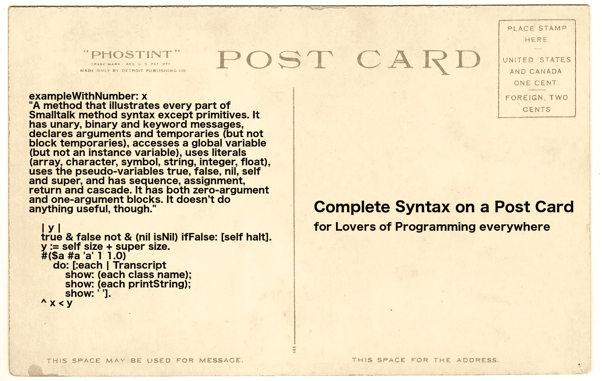

# Python vs Pharo

> 原文：<https://levelup.gitconnected.com/python-vs-pharo-df47599a8ed0>


ython 被广泛认为是初学者的简易语言。但是你知道吗，有一种更简单的语言，它有更强大的能力。它被称为 [Pharo](http://pharo.org) ，Smalltalk 的现代变体。我们来比较一下这两者…

## 简单、简洁和优雅

Pharo 比 Python 简单得多。它包含所有六个保留字。完整的语法可以放在明信片上！



用 Python 肯定做不到这一点！

你可以在 15 分钟内学会整个语言:[用 ProfStef](https://amber-lang.net/learn.html) 学习 Smalltalk。用 Python 肯定做不到这一点！

Pharo 非常简洁优雅。这里有一些精彩的一行程序示例:

```
"Compute difference in days between two dates"
('2014-07-01' asDate - '2013/2/1' asDate) days"Set up an HTTP server that returns the current timestamp"
(ZnServer startDefaultOn: 8080) 
  onRequestRespond: [ :request | 
    ZnResponse ok: (ZnEntity with: DateAndTime now printString) ]"Split a string on dashes, reverse the order of the elements and join them using slashes"
$/ join: ($- split: '1969-07-20') reverse"Sum of the primes up to 64"
(Integer primesUpTo: 64) sum"Extract a Unix format timestamp from the 5th to 8th byte of a byte array given in hex"
DateAndTime fromUnixTime:
  ((ByteArray readHexFrom: 'CAFEBABE4422334400FF') 
      copyFrom: 5 to: 8) asInteger"Return the weekday of a date"
'2013/5/7' asDate dayOfWeekName"Save the HTML source of a web page to a file"
'[http://www.pharo.org](http://www.pharo.org%27/)' asUrl saveContentsToFile: 'page.html'"Count the number of, or show the leap years between two years"
(1914 to: 1945) count: [ :each | Year isLeapYear: each ].
(1895 to: 1915) select: [ :each | Year isLeapYear: each ]."Encode the same string using Latin1, UTF-8 and UTF-16"
#(latin1 utf8 utf16) collect: [ :each | 
  (ZnCharacterEncoder newForEncoding: each)
    encodeString: 'Les élèves Français' ]
```

在 Python 中，几乎不可能在一行中做任何事情。

## 越位规则

Python 使用缩进作为语法是很有争议的。这是很多开发人员讨厌 Python 的主要原因。一个问题是，代码的意外错位可能会导致非常微妙且难以发现的错误。谁能说事故从未发生过？

Pharo 没有患这种病。

## 面向对象编程

Pharo 从上到下完全是面向对象的。它在这方面的清晰性和一致性是任何其他语言都无法比拟的。

另一方面，Python 有一个临时的 OOP 实现，感觉像是附加上去的。例如，Python 中没有真正的封装:实例变量和方法是“隐藏”的，或者通过在它们的名称前加下划线而变成“私有”的。这是非常蹩脚的。

Python 要求将“self”作为第一个参数显式传递给所有实例方法。这是难以置信的做作。

Python 对象并不总是具有您期望的属性。例如，length 属性几乎总是一个名为 len()的外部函数。

## 函数式编程

Pharo 在其“块”中有一个可爱的实现 *lambdas* 。这为 Pharo 提供了很好的函数式编程能力。事实上，Pharo 的类库包含了许多函数构造。

Python 也可以勉强进行函数式编程。然而，它的 lambdas 被限制在单个表达式中，而不允许多行代码。世界上没有其他编程语言有这个限制！我不愿称之为做作和蹩脚货。(好吧，我撒谎了:这是做作和蹩脚的。)

## 集成开发环境

Pharo 有一个可爱的内置实时编码 IDE，和语言本身一样简单易用。实时编码允许你在程序*运行时检查和修改程序中的代码和数据！这种强大的技术实际上消除了传统的编辑-编译-测试-调试循环，这种循环已经困扰了开发人员半个多世纪。根据 Namcook Analytics 进行的一项研究，这就是为什么 Pharo (Smalltalk)是世界上最具生产力的通用编程语言的主要原因。*

Python 最好的 IDE 是 PyCharm。虽然这确实是一个不错的 IDE，但毫无疑问，它比 Pharo 的 IDE 要大得多，复杂得多。掌握这个程序需要很长时间。

而且 PyCharm 不支持现场编码。

## 生产力和开发的便利性

Python 以高效著称。Namcook Analytics 告诉我们 Pharo (Smalltalk)的生产力是 Python 的两倍。这是平均值。在许多情况下，Pharo 的效率会高得多，有时是原来的五倍！

简单明了，Pharo 更易于编程。这种语言及其开发环境实际上不会给开发人员带来任何认知负担。

## 生态系统

Python 拥有令人羡慕的库生态系统。这是 Pharo 的一个弱点。尽管如此，Pharo 是不可思议的多才多艺。它被用于许多不同种类的应用。例如，Pharo 非常适合 web 开发，这要归功于[海边 web 框架](http://seaside.st/)和[茶壶微框架](https://github.com/zeroflag/Teapot)。

Pharo 非常适合前端开发，多亏了 [PharoJS](https://pharojs.github.io/) 。

感谢[博学](https://github.com/PolyMathOrg/PolyMath)和 [Roassal](http://agilevisualization.com/) ，Pharo 对数据科学很有帮助。

Pharo 有利于虚拟现实:

Pharo 擅长物联网和嵌入式编程。参见[了解如何编程](https://medium.com/learn-how-to-program/latest)。

Pharo 用于编写虚幻游戏引擎的脚本:

Pharo 被用来[抗击埃博拉！](http://ummisco.github.io/kendrick/)

Pharo 用于[16 个国家药品的大规模数据可视化](http://mutabit.com/offray/blog/en/entry/sdv-infomed)。

Pharo 用于[自然语言处理。](https://github.com/mark-watson/nlp_smalltalk)

Pharo 用于[机器学习](https://biosmalltalk.github.io/web/)和[神经网络处理](https://medium.com/towards-data-science/single-layer-perceptron-in-pharo-5b13246a041d)。

总的来说，Smalltalk 是通用的。美国联合军方使用 Smalltalk 编写了一个名为 JWARS 的*百万行*战斗模拟器。它实际上胜过了美国空军用 C++编写的一个名为 STORM 的模拟程序。哇哦。太令人兴奋了！

JP 摩根用 Smalltalk 编写了他们的大型金融风险管理系统，名为 Kapital。

[Orient Overseas Container Lines 使用 Smalltalk 开发了他们的 IRIS-2 航运管理系统。](http://www.cincomsmalltalk.com/main/successes/shipping/orient-overseas-container-lines-ltd/)

如果 Pharo 因其生态系统而处于不利地位，它似乎肯定不会减慢它的速度。事实上，我认为公平地说，Pharo 比 Python 更加通用。

## 多线程操作

Pharo 和 Python 都可以做多线程，但是 Python 受到了 GIL(全局解释器锁)的阻碍，这是大多数程序员长期以来的抱怨。

*(首次发布于* [*代号*](https://qr.ae/TWpDWq) *)。)*

[](https://gitconnected.com/learn/python) [## 学习 Python -最佳 Python 教程(2019) | gitconnected

### 50 大 Python 教程-免费学习 Python。课程由开发人员提交并投票，使您能够…

gitconnected.com](https://gitconnected.com/learn/python)