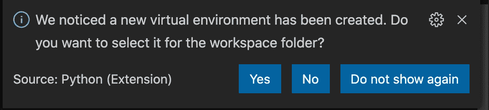

# Python Web 应用程序

> 原文：<https://levelup.gitconnected.com/python-web-applications-75b0d04db677>

Python 是一种高级后端编程语言，旨在易于阅读和使用。根据 Statista 的数据，2020 年全球 44.1%的程序员使用 Python，这使其成为第四大最常用的编程语言。不用说，学习 python 的基础知识对任何软件工程师来说都是一个有用的补充。

在这篇博客中，我将带您使用 Flask 库创建您的第一个 python web 应用程序。该演练基于 Mac OS，如果您使用不同的操作系统，可能会略有不同。我们也将使用 Visual Studio 代码，和一些插件来使事情变得更容易。如果你完全照着做，在本教程结束时，你应该可以在你的机器上运行你自己的 web 服务器了！

# 建立

如前所述，一些插件将使使用 python 变得更容易。我推荐使用 *Chromodynamics* (主要是为了更容易管理配色)和 *MagicPython* (可能已经安装在你的 VS 代码上)和 *Python* 。在我看来，这两个扩展使得在 VS 中阅读和调试 python 代码更加容易。在构建这个应用程序的过程中，可能会提示您根据当前的环境设置安装其他插件，您可以根据需要随意安装。

对于本教程，我们将使用 *Flask* 库来帮助响应和处理 web 请求。python 和 flask 将共同构成这个应用程序的后端。您可以使用 python 的依赖管理器 pip 安装 flask。在 mac 终端中运行以下命令来安装 pip:

Mac pip 安装命令

现在我们已经安装了 pip，我们可以用它来安装 flask，命令如下:

Mac 烧瓶注入命令

现在让我们创建一个新的文件夹，使用 *mkdir folder_name* 命令或您的 GUI，无论哪种您更喜欢。Cd(更改目录)到该文件夹中，我们将运行以下命令来创建一个 python 虚拟环境:

创建一个名为 venv 的 python3 venv

这将在 python 中创建我们称之为虚拟环境的东西。这使得我们创建的每个单独的 python 应用程序都有自己的依赖项，并允许不同的应用程序以不同的方式运行和行为。运行该命令后，您将创建一个名为 *venv 的虚拟环境(venv)。*屏幕底部也会提示此通知，请务必点击*是*！

点击是！

# 我们拥有的

默认情况下，README.md 文件不会出现在您的文件夹中，这是我在创建 GitHub 资源库时添加到我的文件夹中的

在我们的工作区内，我们将创建两个文件夹。vscode”和“venv”。vscode 文件夹包含我们的 settings.json 文件，出于我们今天的目的，我们不需要编辑这个文件。venv 文件夹包括依赖项和许多我们今天也不会看到的其他文件。我们需要关注的是“bin”文件夹。bin 文件夹将包含一个名为“激活”的文件。它应该是第一个文件。Activate 是允许我们激活虚拟环境的文件。所以在终端中，我们可以运行以下命令:

请注意蓝色文本 venv，它表示我们正在运行名为 venv 的虚拟环境

使用这个命令，我们可以访问嵌套在 venv 文件夹的 bin 文件夹中的激活文件，并运行脚本来激活虚拟环境。现在我们准备开始编码了！

# 开始构建我们的应用程序

和大多数语言一样，我们从导入依赖项开始。让我们创建一个文件，我们可以把它命名为 sample.py。py 扩展名，以指示它是 python 文件。然后在文件的顶部，我们将开始从 flask 依赖项导入 Flask 和 jsonify。这些将允许我们使用 Flask 对象并 jsonify 我们的数据。如果您不熟悉 json 化数据，这是将我们的数据转换成 JSON 对象的一种奇特方式，这种方式通常更容易阅读和导航。

接下来我们将实例化名为的类 flask，它是一个内置变量。我们将以这种方式创建 app 对象。到目前为止，我们的文件应该如下所示:

## 关于名字的一个题外话:

Name 是一个内置变量，python 用它来告诉你在哪个模块或包中。在这种情况下，我们位于从终端运行的包中，即主包中。将它传递给 flask 可以让 flask 知道它在什么上下文中运行。这是用于设置烧瓶应用程序的锅炉板。注意:如果这一切不太有意义，不要担心，你不需要完全理解这个项目中 __name__ 的用法。

# 路线

我们已经导入了依赖项并创建了 app 对象。现在让我们使用我们的 app 对象。我们可以将应用程序中的路线附加到将返回数据的函数中。我们可以从一个简单的函数开始，我们称之为主页。这个函数将返回字符串“欢迎来到我的 Python 页面！”然后，我们附加路由并定义它，在这种情况下，我们可以只使用'/'作为我们的路由，以表明它将是默认或起始路由。

该路径可以是您喜欢的任何名称，但必须以反斜杠(/)开头

我们已经创建了我们的第一条路线，但我们需要测试它！我们可以遵循以下步骤，用 *flask run* 命令打开一个服务器。

1.  告诉 flask 使用哪个文件来运行环境变量

$export FLASK_APP=sample.py

2.告诉 flask 以什么模式运行项目

$ export FLASK _ ENV =开发

3.运行烧瓶应用程序

$烧瓶运行

在终端中这样做，一旦我们设置了这些环境变量，它们将跟随虚拟环境并持续存在，即使我们离开文件夹并回来。我们已经告诉 flask 运行 sample.py，这是我们的文件名，我们希望在开发模式下运行，这意味着当我们更改代码时，它会自动重新启动。

## 放在烧瓶和 pip 上

到目前为止，在设置 flask 环境后运行 *flask run* 命令时，遵循这些步骤最初导致了一个错误。如果您遇到诸如 *flask command not found 之类的错误，*我建议用下面的命令更新您的 flask。这立即解决了我的问题，并允许我运行我的烧瓶。

如果我们在终端中点击 http 链接，我们将会看到一个如下所示的页面:

127.0.0.1:5000 是运行我们应用的本地服务器

这不完全是 web 开发的巅峰，但这是创建 python 应用程序的开始。

# 创建对象和字典来传递数据

Python 有一种叫做字典的东西，它非常类似于 ruby 中的 hash，但是它不能写任意的键。所有的键都必须用引号括起来。Python 也有一个列表，它的行为与其他语言中的数组非常相似。

让我们创建一个对象列表，作为数据传递给我们的 python 应用程序。记住 python 不需要用关键字来声明变量，所以我们只需写变量的名字，后跟它的值。

航空公司物品清单

因为列表不是字符串，所以我们不能直接将它返回给浏览器。但是，我们可以将列表字符串化，并作为 json 数据返回！我们使用从 flask 导入的 jsonify 方法，并将我们在第 9 到 19 行定义的 airlines 对象传递给它。

到'/航空公司'的路线

现在，如果我们在浏览器中输入[http://127 . 0 . 0 . 1:5000/airlines](http://127.0.0.1:5000/airlines)，我们将会收到一个代表我们所有航空公司的 JSON 对象。

sample.py 文件中的航空公司列表

在我的 chrome 浏览器中，我使用了一个名为 Awesome JSON Viewer 的扩展，这就是为什么我的 JSON 数据是以这种格式和配色方案构建的。我发现像这样读取 JSON 数据更容易，但是你不需要为你的 python 应用程序做任何扩展就能把数据发送到你的浏览器。如果你决定要这个扩展，它对 chrome 是免费的。

如果我们想访问特定的航空公司呢？我们可以创建一个动态路由，它将接受一个参数，在本例中是一个 id，并返回带有该 id 的航线。为此，我们必须首先改变航空公司列表的结构，为每个航空公司添加一个带有数字值的 id 键。

ID 号没有包装在字符串中，因为它是一个整数

然后我们创建新路线:

让我解释一下这里发生了什么。我们将一条路线附加到我们的应用程序对象上，并将其命名为“/airlines/ <id>”。id 周围的<>告诉我们，<id>将是一个变量，不会是每次到达同一地点的静态路线。然后，我们定义了一个名为 airline (singular)的函数，它将 id 作为参数。该 id 将与路线中的 id 相同，这是将在 Web 浏览器搜索栏中输入的内容。</id></id>

在函数内部，我们有一个简单的 for 循环，它遍历 airlines 对象中的每一家航空公司，如果该航空公司的 id 等于我们在 URL 中输入的 id(解析为整数),那么我们返回该航空公司的 jsonified 版本。

我们可以通过在搜索栏中输入“airlines/1”来测试这一点，以查找 id 为 1 的航空公司，正如所料，它返回 id 为 1 的航空公司列表中的对象！

请注意，初始的“127.0.0.1:5000”对于任何路由都是相同的，随后会发生变化

# 包装它

如果您完全按照这些步骤操作，您将创建一个 python web 应用程序和一个作为 API 的 python 后端。在以后的博客中，我计划讨论除了获取这个 API 之外，如何发出其他请求，比如 POST 和 DELETE。用你现有的知识创造。尝试弄清楚如何向浏览器返回不仅仅是一个字符串，或者为 JSON 数据创建更复杂的数据结构。享受你的编码，永远不要停止学习！