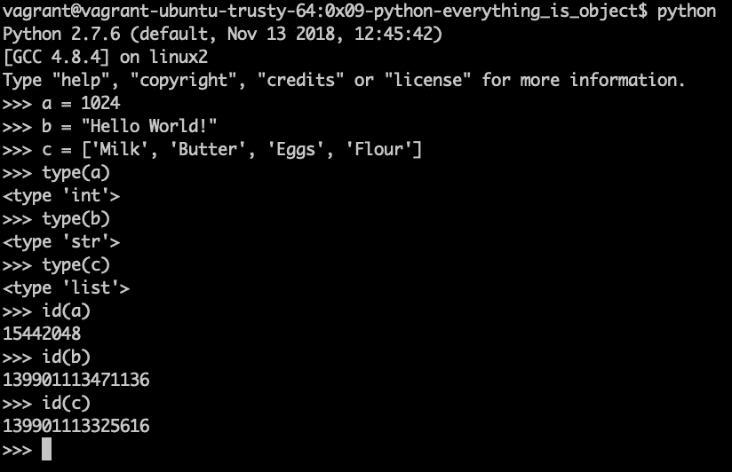
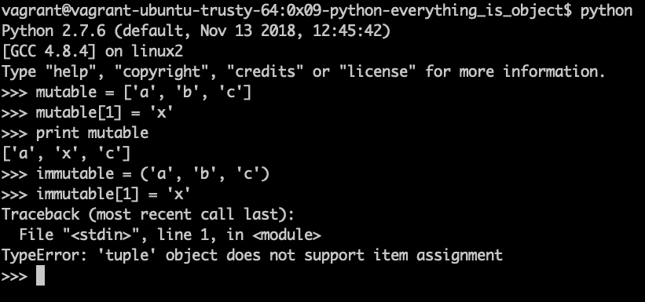
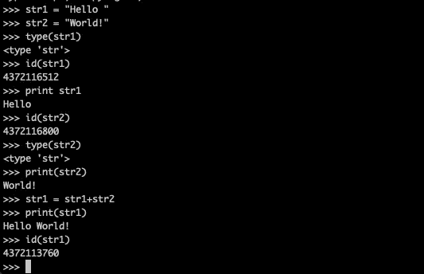
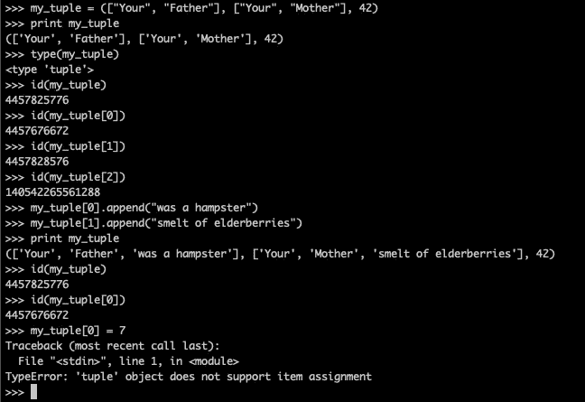
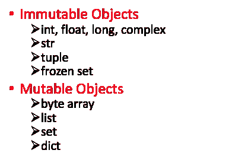

# Python3:可变的，不可变的…一切都是对象！

> 原文：<https://levelup.gitconnected.com/python3-mutable-immutable-everything-is-an-object-1c5d8c7ffb76>

欢迎来到 python 的书呆子伙伴们！

对编码知识的探索仍在继续，我和我的团队最近进入了一个新的领域，面向对象编程。在过去的 3 个月里，我一直专注于学习 C 和函数式编程，但现在是时候学习 Python 和一切都是对象的思想了。因此，如果你一直在学习自己编程，或者刚刚接触技术，你可能以前就听说过这个想法:“一切都是对象”。那到底是什么意思？

当你在处理一个面向对象的程序时，你可以考虑你代码的每一个单独的部分；无论是变量、函数、类还是数据结构，都可以作为一个对象。与您日常生活中的对象类似，编程中的对象也有特征或属性以及能力或功能。虽然您的咖啡杯可能有高度和容量属性，但它可能包含咖啡或茶，代码中的对象可能有数字 id 属性，它可能有到另一个对象的链接，或者它内置了执行特定任务的函数。虽然很容易将一个对象(如咖啡杯)的物理属性概念化为与 Python 中变量的某些属性相关联，但对于更深奥的东西(如链接)来说，最好考虑可以放在对象上的标签。一个过时的概念是，所有 python 对象都是放入数据的盒子，但当您开始深入了解对象如何以物理盒子永远不会有的方式相互链接和关联时，这可能会妨碍理解。因此，当我们开始进入面向对象编程的兔子洞时，非常重要的内置函数会在这个过程中帮助我们:type()和 id()。

# 类型()和 id()

python 解释器和一些对象及其类型和 id 的视图。

当您开始理解对象和面向对象编程时，类型和 id 是帮助您找到方向的重要功能。先说类型。Type 是一个模块(函数),它会告诉你它所接受的参数的类类型，在这个例子中，是你正在处理的对象。如上图所示，我们有三个名为 a、b 和 c 的对象。当我们使用 **type()** 时，我们可以看到 a 是一个整数，b 是一个字符串，c 是一个列表。虽然这种对我们正在处理的对象类型的检查看起来很简单，但在我早期学习 python 时，我发现它对错误处理非常有用。例如，当我编写一个模块，希望使用一个整数来执行一些数学运算时，我将运行的第一个检查是对传递给我的模块的数据进行类型检查。如果我的函数被发送了一些不属于 int 类型的数据，这种类型检查允许我抛出一个 TypeError。

**id()** 像 **type()** 表面上看是一个相当简单的函数。 **id()** 返回给定参数的内存地址。这类似于在 C 中使用& variable_name，如果您发现在编程中需要指针，也可以有类似的功能。回头参考本节顶部的图片，我们可以看到，当我们在每个对象上调用 **id()** 时；a，b 和 c，它们在内存中有不同的地址。当我们深入研究可变和不可变对象以及 python 如何处理被赋予相同值的对象时，记住内存地址的概念对我们来说很重要，这样我们就可以检查什么是唯一对象(有自己的内存地址)，什么只是指向相同数据的副本(共享内存地址)

# 可变对象与不可变对象

变形多边形当然是可变的

python 中可变对象的最简单解释是这样的:可变对象是在创建后其值可以自由修改的对象。这当然也给了我们什么是不可变对象的简单定义；创建后不能随意更改的对象。那么有哪些可变和不可变对象的可靠例子，以及我们如何使用它们呢？在事物可变的一面，我们有像列表、集合和字典这样的数据类型。所有这三种数据类型都可以修改值，而不必创建新的实例。例如，在下图中，您可以看到我们将要创建一个包含“a”、“b”和“c”的列表，然后将“b”更新为“x ”,而无需创建新列表。当我们对一个不可变的对象做同样的事情，比如一个冻结的集合，一个字符串，或者一个元组，就像下面的例子，我们会得到一个错误。

但是像 string1 = string1 + string2 这样的呢？看起来，如果我们连接两个字符串，同时保持第一个字符串的变量名，我们是在修改一个不可变的对象，对吗？是也不是；你改变了 string1 在这里所指的内容，这意味着你将在内存中有一个新的地址。string1 所指向的东西不见了，现在 string1 和 string2 的连接版本就是 string1 的值。在下面的示例中，您可以看到，当我们在串联前后检查 str1 上的 **id()** 时，内存地址是不同的。

字符串是不可变的，但是如果你把两个连接起来，你会在内存中得到一个新的结果地址

好的，所以像字符串这样的不可变类型可以被更新，但是它在内存中不再是同一个对象，这是可以理解的，但是像列表元组这样的分层对象呢？好吧，让我们看看下面的例子。如你所见，我可以用列表等对象创建一个元组，列表本身包含字符串对象。然后，我可以在每个列表中添加额外的字符串，在不改变元组的内存地址的情况下，完成一些来自 Monty Python 和圣杯的侮辱。另一方面，当我试图用一个整数替换第一个列表时，我得到一个错误，让我知道元组不是这样玩的。

那么函数呢，它们是如何处理可变和不可变对象的呢？对于不可变对象，这意味着即使是函数也不会修改原始变量的值。不可变对象通过值传递给函数，这意味着原始变量的值不会被更新。另一方面，可变对象通过引用传递，因此可以通过函数中的操作进行更新。

那么不可变或可变对象有什么好处呢？嗯，不可变对象对于你希望保持其值的变量来说是很好的。由于不能自由修改，它们将保留您最初分配给它们的数据。这有助于维护信息和调试。权衡的结果是，如果您确实需要更新受保护的值，则每次都需要创建一个新的变量，这将降低性能。可变对象总是更适合程序运行时需要更新的数据，因为它可以自由修改。python 用来帮助优化性能的一个很好的技巧是，它将预加载小数字，这种数字通常用于计数器和基本数学。这些被称为 NSMALLPOSINTS 和 NSMALLNEGINTS，它们提供了-5 到 257 的范围。

当然，这仅仅是对面向对象编程的一点皮毛，我期待着随着我的学习，通过更多的博客文章深入了解这一点。如果你有想法，评论，指正，请在评论里告诉我，一如既往的快乐学习！