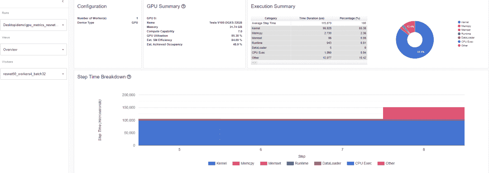

# PyTorch 官方博客:详细的 PyTorch Profiler v1.9

> 原文：<https://levelup.gitconnected.com/pytorch-official-blog-detailed-pytorch-profiler-v1-9-7a5ca991a97b>


PyTorch Profiler v1.9 版现已推出。该版本旨在为用户提供新的工具，以便更容易地诊断和修复机器学习性能问题，无论是在单台机器上还是在多台机器上。

Profiler v1.9 的改进集中在运行时和/或内存中最耗能的执行步骤，同时可视化 GPU 和 CPU 之间的工作负载分布。

**Profiler v1.9 增加了五大功能，包括:**

1.**分布式训练视图**:帮助你掌握分布式训练任务所消耗的时间和内存。假设您有一个训练模型，当您将负载划分到工作节点上并行运行时，各种问题可能会像黑盒一样出现。该模型的总体目标是提高训练速度。这种分布式培训视图有助于您诊断和调试单个节点中的问题。

2.**内存视图**:通过该视图，您可以更好地了解内存的使用情况。这个工具可以显示程序在不同运行阶段的活动内存分配，从而帮助您避免内存不足的错误。

3. **GPU 应用可视化**:这个工具可以保证 GPU 得到充分利用。

4.**云存储支持**:tensor board 插件现在可以从 Azure Blob Storage、亚马逊 S3 和谷歌云平台读取解析后的数据。

5.**跳转到源代码**:该函数支持堆栈跟踪信息的可视化，可以直接跳转到源代码。这有助于您根据分析结果快速优化和迭代您的代码。

**PyTorch Profiler Colab 门户:***[*https://py torch . org/tutorials/intermediate/tensor board _ Profiler _ tutorial . html*](https://pytorch.org/tutorials/intermediate/tensorboard_profiler_tutorial.html)*

***Colab 门户中文版:***

*[*https://open Bayes . com/console/open-tutorials/containers/ta 5h 0 qvm 5 rw*](https://openbayes.com/console/open-tutorials/containers/TA5H0qvm5rw)*

***Colab 内容一览:***

*-准备数据和模型*

*-使用事件探查器记录执行事件*

*-运行探查器*

*-使用 TensorBoard 查看结果并分析模型性能*

*-使用探查器提高性能*

*-使用其他高级功能分析性能*

*【PyTorch 分析工具入门*

*首先:*

*$ pip 安装 torch-tb-profiler*

```
*import torch.profiler as profilerWith profiler.profile(XXXX)*
```

*注:有关 CUDA 和 CPU 的分析，请参见:*

*[***https://github . com/py torch/kineto/blob/master/TB _ plugin/examples/resnet 50 _ profiler _ API . py***](https://github.com/pytorch/kineto/blob/master/tb_plugin/examples/resnet50_profiler_api.py)*

```
*with torch.profiler.profile( activities=[ torch.profiler.ProfilerActivity.CPU, torch.profiler.ProfilerActivity.CUDA],*
```

** profiler . record _ function(" $ NAME "):允许为一个功能块添加一个装饰器(decorator，指的是与名称相关联的标签)。*

*profiler.profile 下的 Profile_memory=True 参数可以分析 CPU 和 GPU 的内存使用情况。*

***可视化 PyTorch 模型性能***

***分布式培训***

*深度学习的最新进展证明了大数据集和大模型的价值，这也意味着模型训练需要更多的计算资源。*

*分布式数据并行(DDP)和 NVIDIA 多卡通信框架(NCCL)是 PyTorch 中广泛采用的加速深度学习训练的范例。*

*在 PyTorch Profiler 的这个版本中，现在支持 NCCL 后端的 DDP。*

**

***计算/通信概述***

*在分布式训练视图的“计算/通信概述”中，用户可以观察到“负载平衡器”节点在所有工作人员中的计算和通信比率，这是根据粒度测量的。*

***负载平衡器相关链接:***

*[***https://en . Wikipedia . org/wiki/Load _ balancing _(计算)***](https://en.wikipedia.org/wiki/Load_balancing_(computing))*

***情景一:***

*如果一个工作者比其他工作者花费更长的时间来计算和重叠，这可能指示工作负载平衡中的问题，或者其中一个节点是落后的。计算是 GPU 内核时间的总和，减去重叠时间。重叠时间是指计算过程中交错通信节省的时间。*

*越长的重叠表明计算和通信之间的并行性越好。理想情况下，计算和通信完全相互重叠。通信是总通信时间减去重叠时间。*

*下面的例子展示了这是如何在 Tensorboard 上发生的。*

**

***散兵游勇的例子***

***情景二:***

*如果批量较小(即所有工作线程上的计算相对较小)，或者要传输的数据较大，则计算与通信的比率也可能较小，您可以在 Profiler 中看到 GPU 利用率较低，等待时间较长。*

*用户可以从这个计算/通信视图中查看代码，通过使用梯度累积来减少通信，或者通过增加批处理大小来减少通信比率。DDP 通信时间取决于型号大小。批量大小与模型大小无关。因此，增加批处理大小会导致更长的计算时间和更大的计算通信实例。*

***同步/通信概述***

*在同步/通信视图中，用户可以观察通信效率。这是通过从步进时间中减去计算和通信时间来计算的。同步时间是等待和与其他工作人员同步的总通信时间的一部分。同步/通信视图包括初始化、数据加载器、CPU 计算等等。*

*从这个视图中，我们可以知道:**总流量中有多少比例实际用于交换数据，还有多少空闲时间等待其他工作人员提供数据。***

**

*例如，如果存在低效的工作负载平衡或掉队问题，可以在同步/通信视图中找到。该视图将显示一些工人比其他人等待的时间更长。*

**

*从上表可以知道各个节点所有通信运营商的详细统计数据。通过这个表可以知道调用了哪些操作符类型，每个操作符被调用了多少次，每个操作符传输的数据大小等等。*

***记忆查看***

*使用该工具，可以了解模型中运营商的硬件资源消耗情况。了解操作符级别的时间和内存消耗有助于解决性能瓶颈并加速模型执行。**鉴于 GPU 内存大小有限，优化内存使用效率会有所帮助:***

**允许运行更大的模型，在终端级任务上表现更好。*

**允许更大的批量，提高训练速度。*

*探查器记录探查间隔期间的所有内存分配。选择“设备”查看 GPU 端或主机端每个操作员的内存使用详情。*

***注:必须启用 profile_memory=True，以生成以下存储器数据。***

*相关链接:*

*[***https://github . com/py torch/kineto/blob/master/TB _ plugin/examples/resnet 50 _ profiler _ API . py # L39***](https://github.com/pytorch/kineto/blob/master/tb_plugin/examples/resnet50_profiler_api.py#L39)*

```
*With torch.profiler.profile(Profiler_memory=True # this will take 1 – 2 minutes to complete. )*
```

***重要定义:***

**“大小增加”显示所有已分配字节的总和减去所有已释放字节。*

**“分配大小”显示所有已分配字节的总和，不包括内存释放。*

**“Self”表示分配的内存不是来自任何子运算符，而是由运算符自己分配的。*

**

***时间轴上的 GPU 指标***

*当一个或多个 GPU 未得到充分利用时，此功能允许您轻松调试性能问题。理想情况下，您的程序应该具有高 GPU 利用率(如果可能，100%的 GPU 利用率)，最小的 CPU 到 GPU 通信成本，并且没有功耗。*

***概述:**概述页面突出显示了三个重要的 GPU 使用指标(即 GPU 利用率，Est。SM 效率和 Est。达到的占有率)。*

*本质上，每个 GPU 都有许多 SM，每个 SM 都有许多可以同时执行许多线程的 warps。Warp 使用许多线程执行，因为它的数量取决于 GPU。从更高的角度来看，时间轴上的 GPU 指标可以帮助开发人员对整个堆栈有一个全局的看法，这非常重要。*

***GPU 利用率低表明模型存在潜在问题。常见原因如下:***

**内核中的并行性不足，即批量太小*

**循环调用小内核，即启动开销不摊销*

** CPU 或 I/O 瓶颈导致工作内容不足，GPU 利用率低*

*在概述页面上，性能建议部分包含一些提高 GPU 利用率的可行建议。在本例中，GPU 利用率较低，因此性能建议是增加批处理大小。正如性能所表明的，将批处理大小从 4 增加到 32 将 GPU 利用率提高了 60.68%。*

***GPU 利用率:**在 Profiler 中，GPU 引擎执行一个工作负载有一个步长间隔时间。利用率越高越好。仅以 GPU 利用率来判断性能瓶颈是不准确的。你不能用这个来知道有多少个流处理器(流多处理器)在运行。*

*请注意，虽然这一指标对于检测空闲时间很有用，但高数值并不一定表示高 GPU 利用率。例如，单线程连续运行的内核将拥有 100%的 GPU 利用率。*

***估计的流处理器效率(Est。SM 效率)是一个更细粒度的指标，即**代表整个跟踪过程中正在使用的 SM 的百分比、SM 上至少有一个活动 wrap 的时间百分比以及空闲 wrap 的时间百分比。*

*NVIDIA 文档:*

*[***https://forums . developer . NVIDIA . com/t/NV prof-question-about-the-sm-efficiency-metric/72640***](https://forums.developer.nvidia.com/t/nvprof-question-about-the-sm-efficiency-metric/72640)*

*估计的 SM 效率也有局限性。每个模块只有一个线程的内核无法充分利用所有的 SMs。仅仅基于 SM 效率不可能知道每个 SM 的利用率，只能知道每个 SM 正在进行的操作，包括等待内存加载结果时的暂停。*

*为了保持 SMs 的高利用率，无论何时出现停顿，都必须保证运行足够数量的就绪包装。*

*对于性能诊断问题。实际占用率比预计占用率更准确。SM 效率和 GPU 利用率。预计达到的占用率表示每个 SM 有多少条经线可以同时处于活动状态。拥有足够数量的活动经纱通常是获得良好吞吐量的关键。与 GPU 利用率和 SM 效率不同，让这个值尽可能高并不是终极目标。*

*根据经验，将这一指标提高到 15%或更高可以获得良好的吞吐量增益。但在某个时候，回报会递减。例如，如果该值已经达到 30%，则下一个增益变得不确定。此指标显示内核执行期间所有 warp 调度程序的平均值*

*NVIDIA 文档:*

*[***https://docs . NVIDIA . com/gameworks/content/developer tools/desktop/analysis/report/cuda experiments/kernellevel/achievedoccupancy . htm***](https://docs.nvidia.com/gameworks/content/developertools/desktop/analysis/report/cudaexperiments/kernellevel/achievedoccupancy.htm)*

*Est 值较高。达到入住更好。*

**

***详细信息:Resnet50_batchsize4***

**

***详细信息:Resnet50_batchsize32***

*内核视图:内核有“每个 SM 的块数”和“Est”。实现入住”。*

*估计的实现的占用率是比较模型健康状况的有用工具。*

**

***每个 SM 的平均块数(每个 SM 的平均块数):***

*每条短信的块数=该内核的块数/该 GPU 的短信数。如果这个数字小于 1，说明 GPU 多处理器没有得到充分利用。“Mean Blocks per SM”是该内核名称的所有运行的加权平均值，使用每次运行的长度作为权重。*

***平均预计。实现入住率(平均预计。实现入住率:***

*估计的已实现入住率的定义与上述定义相同。平均 Est。实现的占用率是该内核名称的所有运行的加权平均值，使用每次运行的持续时间作为权重。*

***轨迹视图:***

*trace 视图显示一个时间线，该时间线显示模型中操作符的持续时间以及执行该操作的系统。这个视图可以帮助您识别高消耗和长执行是由输入还是模型训练引起的。目前，跟踪视图显示 GPU 利用率和预计时间。一段时间内的 SM 效率。*

**

*在上面的示例中，“ProfilerStep5”在线程 28022 期间的 GPU 利用率高于“Optimizer.step”。你可以放大看原因。*

**

*从上图可以看出，前者的内核比后者长。后者内核执行时间太短，导致 GPU 利用率低。*

*美国东部时间。SM 效率:每个内核都有一个计算出来的 EST。SM 效率在 0–100%之间。比如下面这个内核只有 64 块，这个 GPU 的 SM 是 80，那么它的“Est。SM 效率”是 64/80，也就是 0.8。*

**

***云存储支持***

*运行 pip install tensorboard 后，要通过云提供商读取数据，您可以运行:*

```
*torch-tb-profiler[blob] torch-tb-profiler[gs] torch-tb-profiler[s3]*
```

*在 pip 安装 torch-tb-profiler[blob]、pip 安装 torch-tb-profiler[gs]或 pip 安装 torch-tb-profiler[S3]的帮助下，可以通过云服务提供商读取数据。*

*有关更多信息，请参考:*

*【https://github.com/pytorch/kineto/tree/main/tb_plugin】*

****跳转到源代码****

**将 TensorBoard 和 PyTorch Profiler 直接集成到 Visual Studio 代码(VS 代码)中的一个巨大好处是，您可以从分析器的堆栈跟踪直接跳转到源代码(文件和行)。VS 代码 Python 扩展现在支持 TensorBoard 集成。**

**仅当 Tensorboard 在 VS 代码中运行时，跳转到源代码才可用。如果 profiling with_stack=True，那么插件 UI 上会出现一个堆栈跟踪。在 PyTorch Profiler 中点击堆栈跟踪，VS 代码会打开相应的文件，直接跳转到相应的代码进行调试。这使得基于分析结果和建议的快速代码优化和修改成为可能。**

****

****在 UI 中使用 Visual Studio 代码插件跳转到源代码****

**关于如何优化批量性能，请查看详细教程:**

**[***https://opendata science . com/optimizing-py torch-performance-batch-size-with-py torch-profiler/***](https://opendatascience.com/optimizing-pytorch-performance-batch-size-with-pytorch-profiler/)**

**PyTorch Profiler 也可以与 PyTorch Lightning 集成，只需使用 trainer.profiler=pytorch 启动 Lightning 训练任务生成 trace 即可。**

**详细示例:**

**[***https://github . com/PyTorchLightning/pytorch-lightning/blob/master/pl _ examples/basic _ examples/profiler _ example . py***](https://github.com/PyTorchLightning/pytorch-lightning/blob/master/pl_examples/basic_examples/profiler_example.py)**

****原地址:****

**[**【https://pytorch.org/blog/pytorch-profiler-1.9-released/】**](https://pytorch.org/blog/pytorch-profiler-1.9-released/)**

**喜欢这篇文章吗？成为一个媒介成员，通过无限制的阅读继续学习。如果你使用[这个链接](https://machinelearningabc.medium.com/membership)成为会员，你将支持我，不需要额外的费用。提前感谢，再见！**