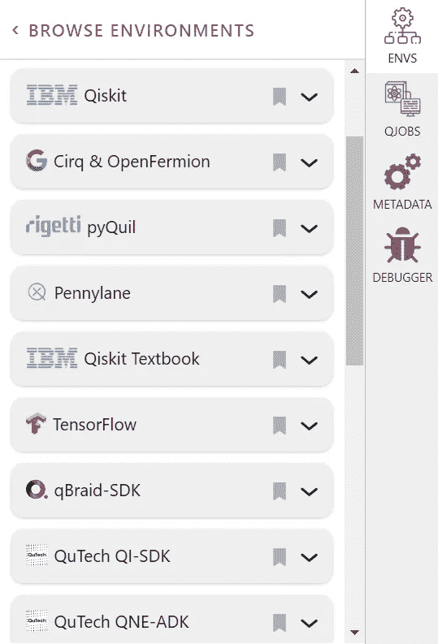
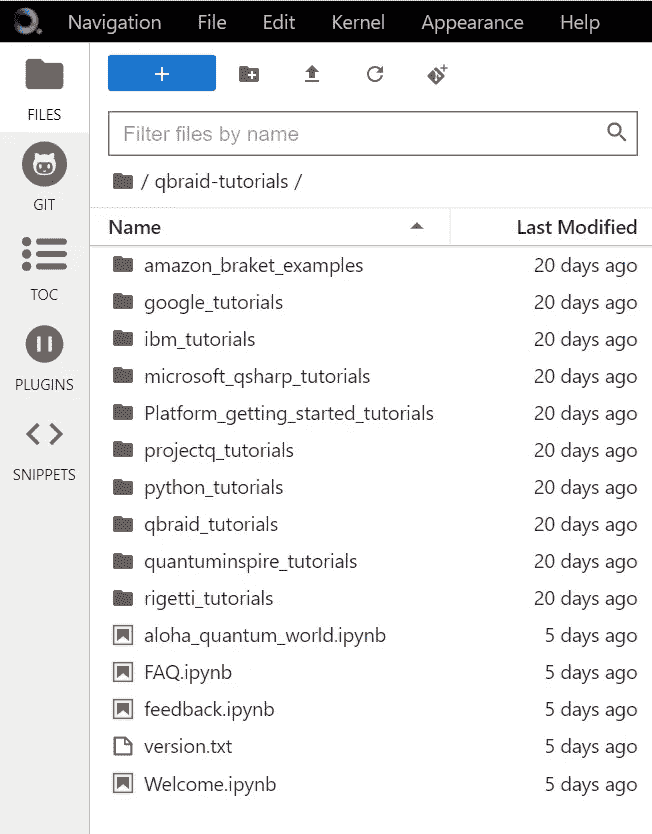
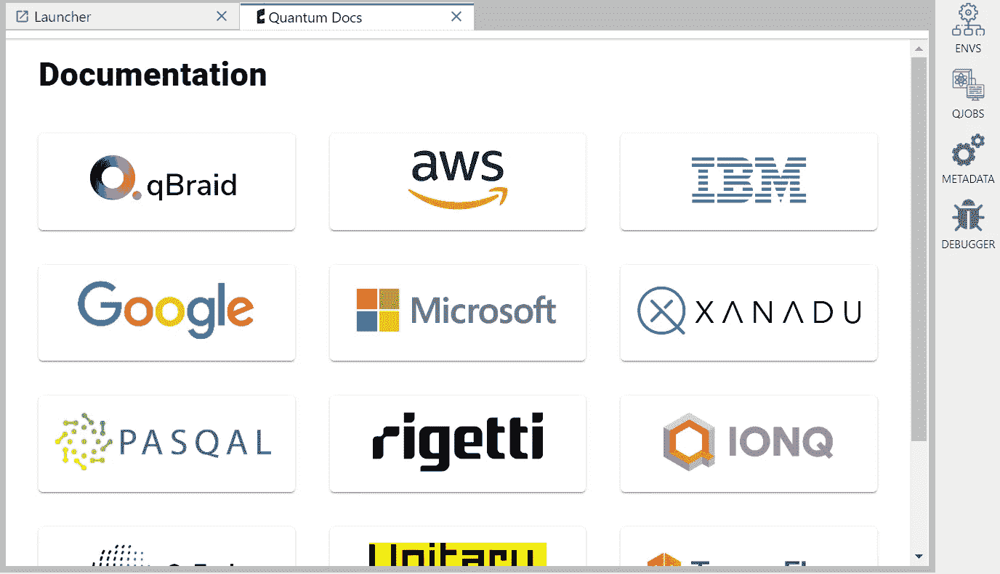

# qBraid 优势

> 原文：<https://levelup.gitconnected.com/qbraid-advantage-53aa40eb40e9>

[https://commons . wikimedia . org/wiki/File:The _ three _ shockers _ Fairbanks . jpg](https://commons.wikimedia.org/wiki/File:The_three_musketeers_fairbanks.jpg)

# 人人为我，我为人人。

我有一个访问 AWS Braket 的新需求，但我不是一个普通用户，所以我真的不想再设置另一个帐户。我已经有了一个 [qBraid](https://qbraid.com/) 账户，所以我决定测试一下我现有的账户。

底线是……它起作用了。我通过我的 [qBraid](https://qbraid.com/) 账户访问了 AWS Braket。我提交了一个作业，排队等待，然后检索结果。所以，一个合乎逻辑的问题是:我还能用 [qBraid](https://qbraid.com/) 做什么？

环境

## 环境

虽然你可以在上面的截图中看到一些主要的名字，但我想把你的注意力吸引到右边的滚动条上。这只是部分列表。像 AWS Braket 这样的环境实际上是多个硬件提供商的网关。

教程

## 教程

[qBraid](https://qbraid.com/) 不仅是所有上述环境的门户，它还是教程的发布者，帮助您开始使用各种提供者。像任何 Jupyter 环境一样，您可以创建和上传自己的笔记本，并在可用的后端运行您的代码。

## 证明文件

qBraid 可能也有你在一个地方寻找的所有文档。同样，注意右边的滚动条。

## 更多教育

教程对你来说还不够吗？这里没有显示，但是 [qBraid](https://qbraid.com/) 也提供课程和黑客马拉松。我没有使用或参与任何，但他们似乎是免费的。

> 你将学习量子计算和信息科学的基础知识，并用一些著名的例子来说明。该课程以视频讲座为基础，辅以编码示例、交互式小部件、练习和问题，指导学生一步一步地学习。

## 运输工具

您想在其他后端上尝试一些现有的代码吗？ [qBraid](https://qbraid.com/) 在 GitHub 上有一个 [transpiler](https://github.com/qBraid/qbraid-lab-demo/blob/main/qbraid_sdk_transpiler.ipynb) ，可以在 Cirq、PyQuil、Qiskit、Braket 和 PennyLane 之间来回转换代码。虽然这不是我所知道的唯一一个这样的跨框架 transpiler，但它是我所知道的唯一一个免费的。

> 我们打算在此基础上构建量子应用层。

## 放弃

为了完全公开起见， [qBraid](https://qbraid.com/) 不是多环境 API 密钥的唯一提供者。然而，这是我测试过的唯一的提供商，这就是为什么我没有提到其他任何人。但是，如果我有机会测试其他人，我一定会发表一个比较。

## 结论

刚开始做量子计算的时候，我想用大家的硬件。特别是，我想选择一种算法，并比较它在无数可用平台上的性能。我可能现在就去做。因此，如果你的研究可以通过在不同类型的量子位上执行算法而受益，qBraid 是一种访问其中几个量子位的无痛方法。只需登录一次，并开始排队您的工作。