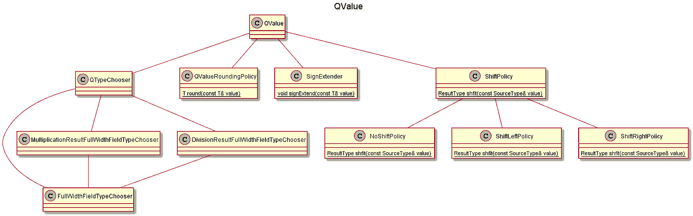

# QFormat

> 原文：<https://levelup.gitconnected.com/qformat-92b4e570235f>

# 介绍

[Q 格式](https://en.wikipedia.org/wiki/Q_(number_format)))是一种二进制定点数格式。 [Tinymind](https://github.com/danmcleran/tinymind) 包含一个模板库，允许我们指定整数位数和小数位数作为模板参数。当定点精度足够时(或者当我们根本没有 FPU 时),可以用 q 格式代替浮点数。).见 [Q 格式](https://en.wikipedia.org/wiki/Q_(number_format))深潜。

# Tinymind QValue

[Tinymind](https://github.com/danmcleran/tinymind) 包含一个 C++模板库，用于定义和使用 Q 格式值。模板类称为 QValue。模板声明在这里:

**NumFixedBits** —定点值的整数部分的位数。

**NumFractionalBits** —定点值的小数部分的位数。

**QValueIsSigned** — true —整数部分保留 1 位给符号位，false —无符号位

**QValueRoundingPolicy**—[模板模板参数](https://riptutorial.com/cplusplus/example/10838/template-template-parameters)，指定处理舍入的策略类。Tinymind 提供了两个选项，但是您也可以定义自己的选项。tinymind 提供的一个选项是截断政策。这通过丢弃低位来舍入 Q 格式值(例如，整数除法就是这样做的)。tinymind 提供的另一个选项是 RoundUpPolicy。RoundUpPolicy 向上舍入到最接近的小数值。

# 示例使用

使用模板，我们可以为几乎任何种类的 Q 格式数量声明类型。单元测试的一些例子:

可以像任何其他类一样声明和初始化此类型的实例:

这里我们声明并初始化一个带符号的 Q24.8 值为负一的表示。我们可以把这个变量当作一个普通的旧整数来使用:

# Tinymind QValue 类图

QValue 使用 qformat.hpp 中的几个类来实现它的目标。这里显示了类之间的关系。



图 1: QValue 类图

# 编译时类型选择

QValue 使用编译时类型选择来选择最小大小的类型:固定部分、小数部分以及整数值表示(固定+小数)。

从上面的代码片段中可以看出，它是通过一个模板类来实现的，这个模板类的目的是选择最佳类型，即 QTypeChooser。

QTypeChooser 将固定位数和小数位数相加，并将该值和有符号标志一起传递给 FullWidthFieldTypeChooser。实际上，每个人都使用 FullWidthFieldTypeChooser 类来选择类型。FullWidthFieldTypeChooser 在编译时分析固定位数+小数位数以及符号位的模板参数，并进行类型选择。

这使得我们可以像处理常规整数一样处理 Q 格式的值。 [qformat.hpp](https://github.com/danmcleran/tinymind/blob/master/cpp/qformat.hpp) 中的大部分代码都提供了必要的操作符重载，将 q 值视为常规整数。

让我们看一个例子。来自单元测试 [qformat_unit_test.cpp](https://github.com/danmcleran/tinymind/blob/master/unit_test/qformat/qformat_unit_test.cpp) :

这定义了一种 Q 格式类型，它使用 8 位来表示 Q 格式值的固定部分以及 8 位来表示 Q 格式值的小数部分。我们通过模板参数“false”选择了 unsigned。舍入策略从默认值 TruncatePolicy 被覆盖为 RoundUpPolicy。通过检查 QTypeChooser 代码，您可以看到我们将为 Q 格式值的固定部分和小数部分选择 uint16_t。因为我们对小数部分使用 8 位，所以在 0 和 1 之间有 256 个唯一值。我们的分辨率计算为 2^-8 或 0.00390625(浮点)。为了用这种格式表示值 1.5，我们将把它写成 0x180。这是左移了小数位数的值 1+小数位数提供的范围的 1/2(即 2⁸ >> 1 或 2⁷，即 0x80)。

# 使用 q 值

从单元测试 [qformat_unit_test.cpp](https://github.com/intel/cppnnml/blob/master/unit_test/qformat/qformat_unit_test.cpp) 中我们可以学习如何使用 QValues。因为我们应该支持所有常见的数学运算符，所以我们可以将它们视为普通的 pod(普通数据)。

# 编译单元测试

要编译单元测试，切换到 unit_test/qformat/目录并使用 make 来构建它们。

```
cd unit_test/qformat
make
```

Makefile 如下所示。

```
# Simple Makefile for the q-format unit test
# Enable C++ iostreams
qformat_unit_test: qformat_unit_test.cpp
#   Make an output dir to hold the executable
    mkdir -p ./output
#   Build the unit tests
    g++ -g -Wall -o ./output/qformat_unit_test qformat_unit_test.cpp -DTINYMIND_ENABLE_OSTREAMS=1 -I../../cpp -I${BOOST_HOME}

# Remove all object files
clean:
    rm -f ./output/*
```

将目录更改为输出目录，以运行单元测试。

```
cd ./output/
./qformat_unit_test
```

您应该会看到下面的输出:

```
Running 10 test cases..

*** No errors detected
```

# 添加

我们可以将相同类型的其他 qvalue 以及具有相同的完整值的底层表示的整数相加。参见 [qformat_unit_test.cpp](https://github.com/danmcleran/tinymind/blob/master/unit_test/qformat/qformat_unit_test.cpp) 中的 test_case_addition。

q 值可以彼此相加，也可以与整数常量相加。

# 减法

减法也是类似的故事。我们可以从同类型的其他 q 值中减去 q 值，也可以从 q 值中减去整数。参见 [qformat_unit_test.cpp](https://github.com/danmcleran/tinymind/blob/master/unit_test/qformat/qformat_unit_test.cpp) 中的 test_case_subtraction。

# 前/后增量和减量

有符号和无符号 Q 格式类型都支持前后递增和递减。参见 [qformat_unit_test.cpp](https://github.com/danmcleran/tinymind/blob/master/unit_test/qformat/qformat_unit_test.cpp) 中的 test_case_increment_decrement。

# 增加

QValues 可以相互相乘，也可以与整数值相乘，就像普通的 pod 一样。参见 [qformat_unit_test.cpp](https://github.com/danmcleran/tinymind/blob/master/unit_test/qformat/qformat_unit_test.cpp) 中的 test_case_multiplication。

支持与同类型的其他 QValues 相乘，也支持与整数常量相乘。

# 分开

就像普通的 pod 一样，q 值可以互相除，也可以被整数除。参见 [qformat_unit_test.cpp](https://github.com/danmcleran/tinymind/blob/master/unit_test/qformat/qformat_unit_test.cpp) 中的 test_case_division。

# 比较器

q 值可以与其他 q 值以及整数进行比较。参见 [qformat_unit_test.cpp](https://github.com/danmcleran/tinymind/blob/master/unit_test/qformat/qformat_unit_test.cpp) 中的 test_case_comparators。

支持与其他 QValues 以及整数常量进行比较。

# 转换

从另一个 QValue 类型转换后，可以为 q value 赋值。参见 [qformat_unit_test.cpp](https://github.com/danmcleran/tinymind/blob/master/unit_test/qformat/qformat_unit_test.cpp) 中的 test_case_conversion。为了支持转换，QValue 定义了一个模板方法。

该方法利用编译时类型选择来选择适当的移位策略，以便在从其他 QValue 类型转换到被赋值的 QValue 类型时应用。

# 结论

Q 值表示 Q 格式的数字，用于没有浮点的系统，或者用于定点分辨率已经足够的情况。QValues 可以被视为正常的 pod。加法、减法、除法和乘法都可以在 q 值上执行，就像它们是普通的旧整数一样。