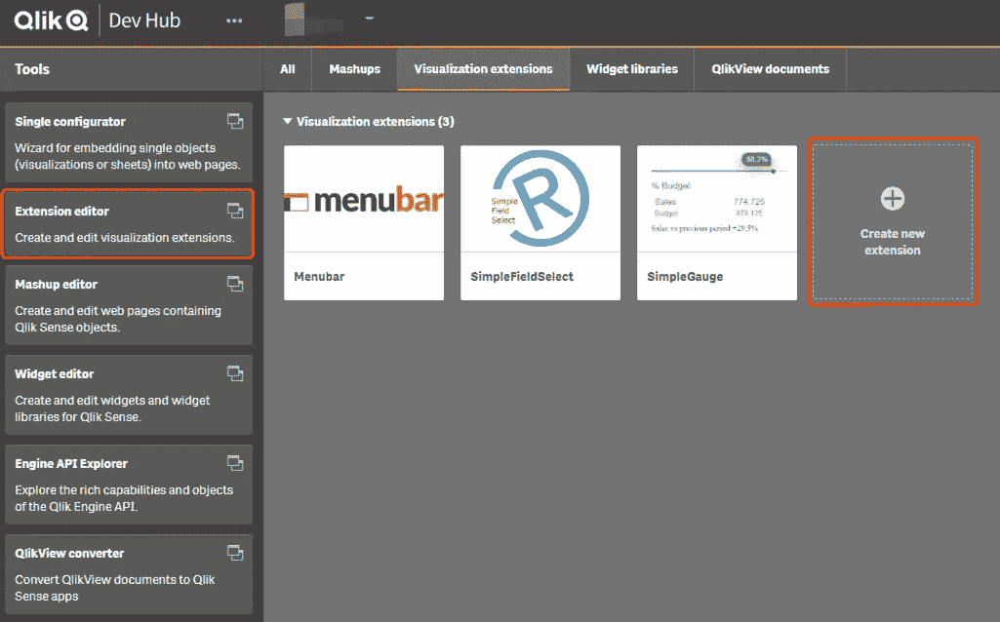
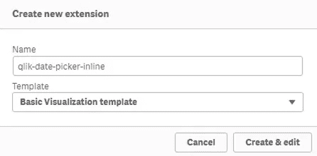
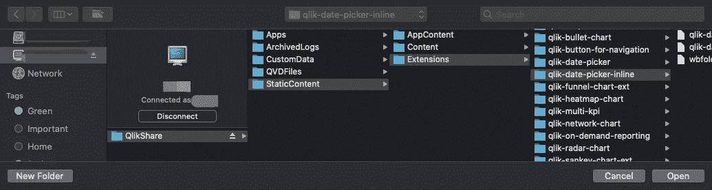
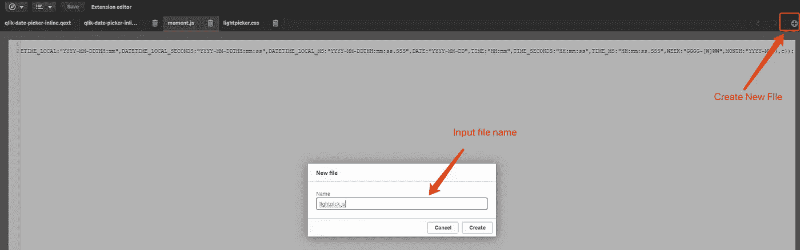
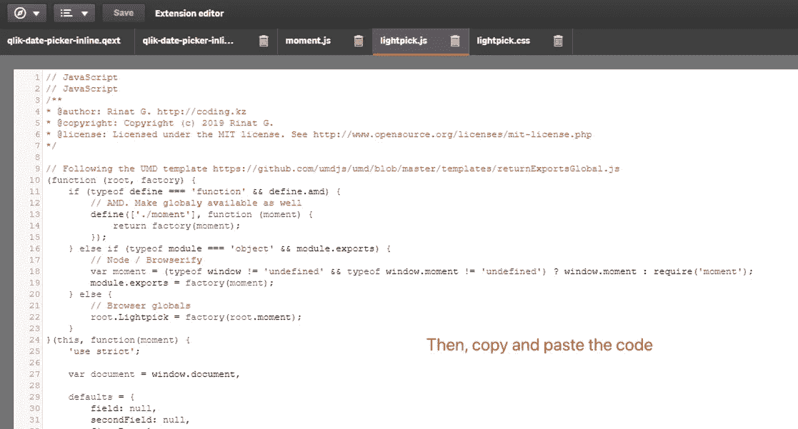
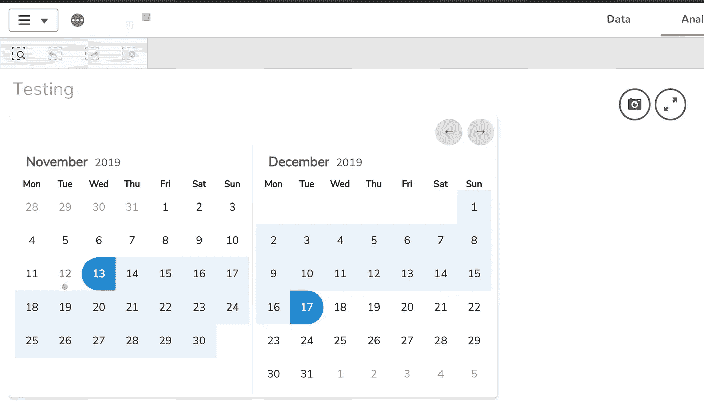
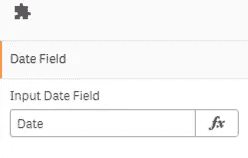
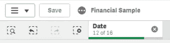

# Qlik Sense 扩展:内联日期范围选择器

> 原文：<https://levelup.gitconnected.com/qlik-sense-extension-an-inline-date-range-picker-7cc688738379>


当您希望在 Qlik Sense 报告中有一个“日期范围选择器”时，几乎总是建议使用已经添加到`qlik-dashboard-bundle`中的扩展`qlik-date-picker`。

然而，在某些情况下，这种扩展并不能很好地满足客户的需求。例如，客户想要一个 Qlik Sense Mashup，其中日期范围选择器是页面上的主要过滤器之一，因此它应该总是可见的。具体来说，不要让用户多次单击弹出日历视图的按钮(假设报告的目的是经常检查不同日期范围的度量)，它应该内联显示，它总是在那里选择不同的日期范围。

不幸的是，对于捆绑包中当前的`qlik-date-picker`，这几乎是不可能的。事实上，它是一个流行的 JavaScript 库`daterangepicker.js`的定制版本。我参观过它的 GitHub repo。许多开发人员要求在问题跟踪器中添加内嵌显示功能，但看起来作者对此并不感兴趣。

因此，我必须“侵入”包含的 JS 库来进行这样的更改。几个回合后，我发现这样做不值得，原因有几个:

*   这个 Qlik Sense 扩展包含的 JS 文件被完全定制以采用 Qlik Sense，并且整个结构被改变并且与其原始 JS 库完全不同。
*   JS 文件被缩小了，这使得它更难被修改，因为可读性很差。
*   该库从未被设计为能够显示内嵌日历。所以，这不是几行代码就能解决的问题。
*   `show`和`hide`事件是高度定制的，即使它被修改为内嵌显示，也可能会导致问题。例如，如果在网页的模型视图或弹出视图中使用选择器，那么嵌套的回调函数对于调试和维护来说确实很难。

基于以上所有需求和现有限制，我决定开发一个独立的 Qlik Sense 扩展来实现这个功能。姑且称之为`qlik-date-picker-inline`。

# 创建 Qlik 感知扩展

转到 Qlik Sense 桌面或服务器的`dev-hub`，单击左侧导航栏上的“扩展编辑器”或主视图上的“创建新扩展”。



输入扩展名，并选择“基本可视化模板”。然后，点击“创建和编辑”



您可以选择使用您喜欢的 IDE 工具，或者只使用 dev-hub 中的 web 编辑器。个人比较喜欢微软 VS 代码。因此，我将从我的 VS 代码中打开扩展文件夹。



然而，重要的是要记住，添加引用的文件(JS、CSS 等。)直接通过 IDE 工具或复制/移动到扩展文件夹将**不能**工作！当我们添加所需的依赖项(如库 JS 文件)时，我们必须在 Qlik Sense Extension Editor 中创建该文件，然后将代码粘贴到创建的文件中。

这里，我们选择的名为“ [Lightpick](https://wakirin.github.io/Lightpick/) 的库包含 3 个文件。一个 JS 文件，一个 CSS 文件及其自身的依赖项“ [moment.js](https://momentjs.com) ”。下面的截图展示了一个添加 lightpicker.js 的例子，对于另外两个文件，步骤完全相同。



对于要复制粘贴的库的源代码，请访问原始 GitHub repo。

# 采用带有 Qlik Sense 的 JS 库

Qlik Sense 使用`define`和`require`模块来包含依赖关系。我们需要添加库的正确路径，如果需要自己的依赖项，有时甚至需要修改库本身。在我们的例子中，它确实需要 moment.js，所以我们需要修改它。

首先，让我们去`qlik-date-picker-inline.js`添加库文件

```
define( [ "qlik", "./lightpick", "./moment", "css!./lightpick.css"],
function (qlik, Lightpick, moment) {
...
```

注意，当使用`define`包含`.js`扩展时，我们需要忽略它们。同样，我们使用`css!`前缀告诉 Qlik Sense 这是一个 CSS 文件而不是 JS 文件。

然后，我们去`lightpick.js`改变它的依赖引用。

最初，工厂函数是这样的

```
(function (root, factory) {
    if (typeof define === 'function' && define.amd) {
        // AMD. Make globaly available as well
        define(['moment'], function (moment) {
            return factory(moment);
        });
    }
...
```

`define(['moment']...`在 Qlik 意义上不起作用。我们把它改成`define(['./moment']`吧，这是一个相对路径。因此，如果您喜欢在您的扩展中创建一个`lib`文件夹，那么您也可以将相对路径更改为`./lib/moment`。但在这里，我只是将它放在根文件夹中。

# 测试内嵌日期范围选择器

这个 lightpick 库的作者准备了关于如何使用这个库的很好的文档。请参考它的 [GitHub repo](https://wakirin.github.io/Lightpick/) 有很多演示。

让我们转到`qlik-date-picker-inline.js`，将下面的代码放到`paint`函数中。

```
paint: function ($element) { console.log('in paint') //add your rendering code here
    $element.html( '<input type="hidden" id="datepicker"/>' );

    var picker = new Lightpick({
        inline: true,
        singleDate: false,
        numberOfMonths: 2,
        field: document.getElementById('datepicker'),
        onSelect: function(start, end){}
    }); //needed for export
    return qlik.Promise.resolve();
}
```

这里，我们需要一个`input`标签来让`lightpick`工作。然而，我们实际上并不希望 Qlik Sense 显示这种输入。所以，我们可以把`type`设为`hidden`。

此外，我们希望将`inline`设置为`true`以便内嵌显示选取器，并将`singleDate`设置为`false`以确保它选取的是一个范围而不是单个日期。有关可配置项目的列表，请参考 GitHub repo 自述文件。

让我们将扩展添加到 Qlik Sense dashboard



有用！

# 向扩展小部件添加日期字段

为了使日期选择器实际上与 Qlik Sense 一起工作，我们需要添加一个输入字段，以便用户可以填写日期维度。

在扩展函数的`return`块中，我们需要先定义`initialProperties`。这里我们只是用`qInitialDateFetch`定义了一个`qListObjectDef`，因为我们只需要一个字段。此外，我们给列表赋予了`1e4`高度，这实际上允许在日期维度中有大约 110 年的连续天数。

```
initialProperties: {
    version: 1.0,  
    qListObjectDef: {
        qInitialDataFetch: [{  
            qWidth: 1,  
            qHeight: 1e4  
        }]  
    }
},
```

然后，我们定义`definition object`中的`items object`只包含一个日期字段的输入字段。Qlik Sense 扩展中的`definition object`可用于定义右侧的`accordion`菜单。

```
definition: {
    type: "items",
    component: "accordion",
    items: {
        dimension: {
            type: "items",
            label: "Date Field",
            ref: "qListObjectDef",
            min: 1,
            max: 1,
            items: {
                dimension: {
                    type: "string",
                    expression: "optional",
                    expressionType: "dimension",
                    ref: "qListObjectDef.qDef.qFieldDefs.0",
                    label: "Input Date Field"
                }
            }
        },
        appearance: {
            uses: "settings"
        }
    }
},
```

在此之后，我们应该能够输入扩展的日期字段。



如果您愿意，现在可以尝试输出`layout`对象来查看获取的日期。

```
paint: function ($element, layout) {
    console.log(layout)
    ....
```

# 实施选择日期功能

现在，我们需要让 Qlik Sense 知道用户已经选择了日期范围，而实际上日期范围是在选取器上选择的。在`Lightpick`定义中，我们需要实现`onSelect`对象。

```
var self = this
var allDates = layout.qListObject.qDataPages[0].qMatrixonSelect: function(start, end){
    if (start && end) { // Convert start & end moment to date string
        var startDateString = start.format('D/M/YYYY')
        var endDateString = end.format('D/M/YYYY')

        // Populate all the dates in between of the range
        toBeSelected = []
        allDates.forEach(qDate => {
            if (checkDateInBetween(moment(qDate[0].qText, 'D/M/YYYY'), startDateString, endDateString)) {
                toBeSelected.push(qDate[0].qElemNumber)
            }
        });
        console.log(toBeSelected) // Select the dates
        if (toBeSelected.length > 0) {
            self.backendApi.selectValues(0, toBeSelected, false)
        }
    }
}
```

这里，我们首先从`layout`对象中获取所有的日期。然后，循环所有日期以测试它是否在所选范围内。如果是，就把它推进`toBeSelected`数组。

现在，如果我们选择一个范围`1/1/2014` — `12/1/2014`，Qlik 后端 API 应该会更新，我们可以从选择栏中看到选择



# 基于现有选择实现“setDateRange”

现在，我们还有一个问题。选择日期范围后，它不会保留在选取器上。此外，如果我们已经在 Qlik 意义上选择了日期范围，它不会反映在选取器上。这是因为每次用户进行更改后，Qlik Sense 都会刷新扩展。因此，我们需要让扩展检测是否有选定的范围，并以编程方式在选择器上设置它。

```
// Get current selection if there are any
var selectedDates = []
allDates.forEach(qDate => {
    if (qDate[0].qState == "S") {
        selectedDates.push(moment(qDate[0].qText, "D/M/YYYY"))
    }
});

if (selectedDates.length > 0) {
    selectedDates = selectedDates.sort((a,b) => a-b)
    minSelectDate = selectedDates[0]
    maxSelectDate = selectedDates[selectedDates.length - 1]
    picker.setDateRange(minSelectDate, maxSelectDate, true)
    picker.gotoDate(maxSelectDate.subtract(1, 'month'))
}
```

这里，将第 3 个参数`setDateRange`设置为`false`很重要。这是为了防止`setDateRange`功能触发`onSelect`事件。如果我们不这样做，`setDateRange`将触发 picker 的`onSelect`事件，picker 中有`backendApi.selectValues()`，这将导致整个扩展被刷新，并且`setDateRange`将被再次调用。

另外，不要忘记在最后调用`gotoDate`函数，以确保选取器将交互地转到选定的日期。如果您有其他可以选择日期的小部件，这是非常重要的。

好吧！现在我们已经完成了 Qlik 意义上的扩展。代码的片段可能很难连接在一起以获得完整的画面。但是不要担心，您可以在我的 GitHub repo 上找到完整的源代码:

[](https://github.com/qiuyujx/qlik-date-picker-inline) [## qiuyujx/qlik-日期选择器-内联

### 此时您不能执行该操作。您已使用另一个标签页或窗口登录。您已在另一个选项卡中注销，或者…

github.com](https://github.com/qiuyujx/qlik-date-picker-inline) [](https://medium.com/@qiuyujx/membership) [## 通过我的推荐链接加入灵媒-陶

### 作为一个媒体会员，你的会员费的一部分会给你阅读的作家，你可以完全接触到每一个故事…

medium.com](https://medium.com/@qiuyujx/membership) 

如果你觉得我的文章有帮助，请考虑加入 Medium 会员来支持我和成千上万的其他作者！(点击上面的链接)

# 资源:

采光:[https://wakirin.github.io/Lightpick/](https://wakirin.github.io/Lightpick/)

moment . js:[https://momentjs.com](https://momentjs.com)

Qlik Sense 开发者文档:[https://help.qlik.com/en-US/sense-developer/April2019](https://help.qlik.com/en-US/sense-developer/April2019)

GitHub 回购:[https://github.com/qiuyujx/qlik-date-picker-inline](https://github.com/qiuyujx/qlik-date-picker-inline)