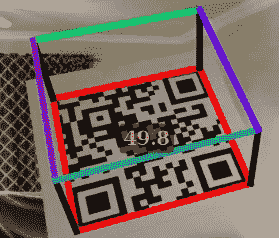
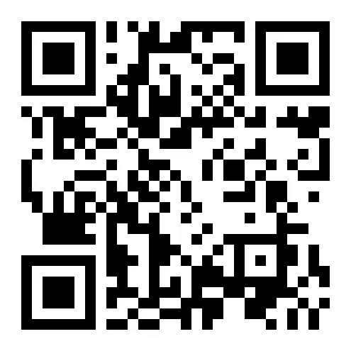

# 科特林的二维码扫描仪

> 原文：<https://levelup.gitconnected.com/qr-code-scanner-in-kotlin-e15dd9bfbb1f>



使用渲染的 3D 立方体检测 QR 码

本文包含几个 Kotlin 示例，这些示例从较高的层面描述了如何在任何计算机上创建和扫描图像和网络摄像头中的 [QR 码](https://en.wikipedia.org/wiki/QR_code),并涉及 Android。此外，它还展示了如何利用 QR 码实时估计物体的 3D 位置，例如增强现实或机器人定位。所有这些都是在科特林使用 [BoofCV](https://boofcv.org/) 计算机视觉库完成的。

*查看该基准测试，了解 BoofCV 与其他二维码检测器的* [*对比。*](https://boofcv.org/index.php?title=Performance:QrCode)

## 创建简单的项目

要将 BoofCV 添加到您的 [Gradle JVM Kotlin](https://kotlinlang.org/docs/reference/using-gradle.html) 项目中，只需添加下面的依赖项:

```
arrayOf("core","swing","kotlin","WebcamCapture").forEach()
**{** implementation("org.boofcv:boofcv-$it:0.41") **}**
```

要查看本文中的工作示例和所有源代码，请查看 Github 上的 [KBoofExamples](https://github.com/lessthanoptimal/KBoofExamples) 。

## 创建二维码



这个例子生成的二维码。使用下面提到的 Android 演示扫描它！

下面的三行代码将创建一个二维码，并在一个窗口中显示上图。

*完整来源*[*QR code create . kt*](https://github.com/lessthanoptimal/KBoofExamples/blob/master/src/main/kotlin/QrCodeCreate.kt)

这应该可以在 Windows、Linux 和 Mac OS X 上运行。如果你愿意，它也可以保存到磁盘或作为 PDF 文档。这是高度可配置的，您可以手动指定 QR 码中的每个[参数](https://www.qrcode.com/en/about/standards.html)。

## 扫描文件夹中的所有图像

在本例中，将打开一个窗口，要求您选择一个文件夹。然后下面的代码将递归地扫描所有的文件夹寻找图像。输出是一个包含图像名称和其中包含的所有消息的映射。

*完整来源*[*QR codediskscanning . kt*](https://github.com/lessthanoptimal/KBoofExamples/blob/master/src/main/kotlin/QrCodeDiskScanning.kt)

## 网络摄像头的实时处理

在这里，我们打开你电脑上的默认摄像头，扫描二维码。如果找到一个，它的轮廓会用红色画出来。

完整来源 [QrCodeWebcam.kt](https://github.com/lessthanoptimal/KBoofExamples/blob/master/src/main/kotlin/QrCodeWebcam.kt)

## 使用网络摄像头进行实时姿态估计

这里有一个有趣的。我们打开一个网络摄像头，猜测一些参数，然后在 QR 码所在的图像中呈现一个 3D 框。这被称为增强现实，你可以在图像中显示更多有趣的物体。

完整来源[qrcodeposeeestimate . kt](https://github.com/lessthanoptimal/KBoofExamples/blob/master/src/main/kotlin/QrCodePoseEstimate.kt)

## 机器人

虽然谷歌提供了自己的二维码检测器，但你可以使用 BoofCV 扫描二维码，获得比谷歌提供的更多的信息。比如你需要估计 3D 姿态的角。这个过程基本上和你已经看到的一样。你只需要把图像从 Android 的格式转换成 BoofCV 能理解的格式。

```
ConvertCameraImage.*imageToBoof*(androidImage, ColorFormat.*RGB*, boofcvImage, null);
```

想在你的手机上看到这一点吗？查看[安卓演示应用](https://play.google.com/store/apps/details?id=org.boofcv.android&hl=en_US)！

暂时就这样吧！如果你想知道更多关于一个特殊的例子，请在下面提问。如果有足够的兴趣，我会张贴一个详细的文章示例，说明姿势估计的例子是如何工作的。