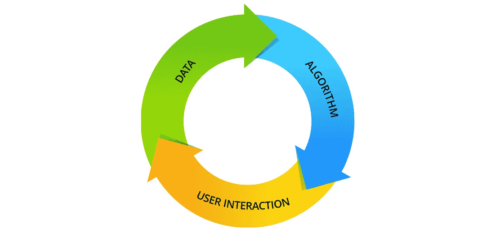
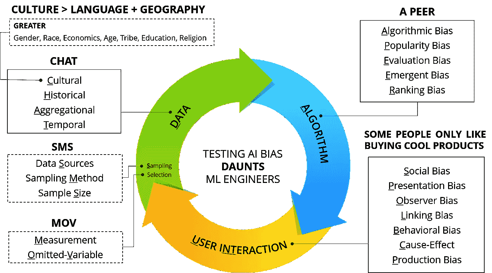
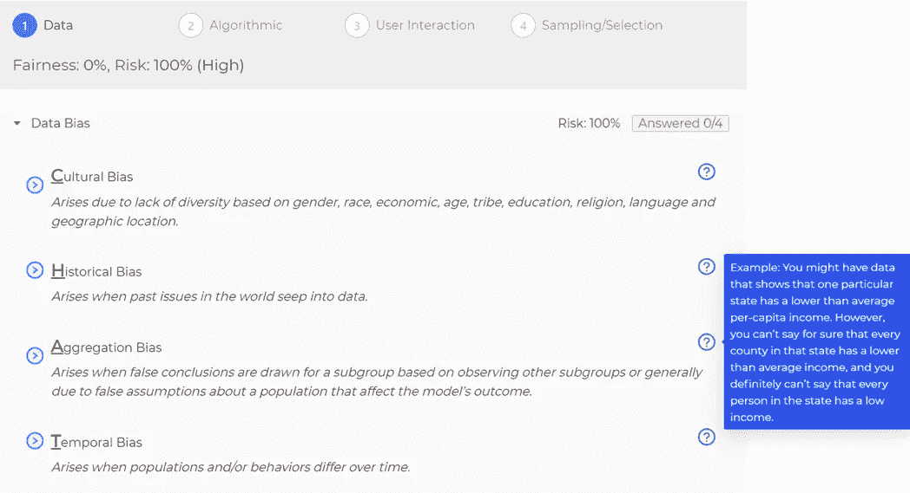
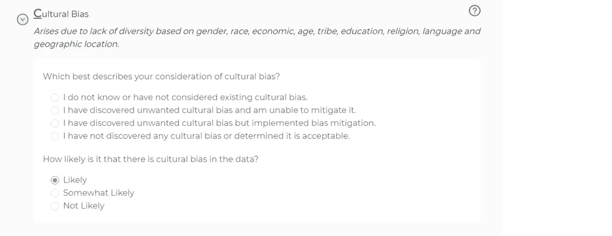
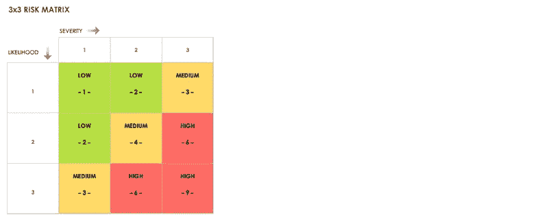
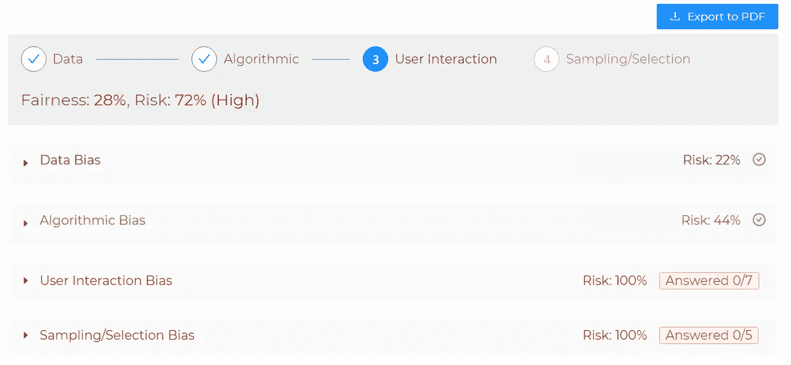

# 量化人工智能偏差的风险

> 原文：<https://levelup.gitconnected.com/quantifying-the-risk-of-ai-bias-998a5542a5e0>

**不想要的人工智能偏差的测试视角**

> 偏见是指与另一事物、人或群体相比，偏向或反对一事物、人或群体，通常以一种被认为不公平的方式。

# 这个世界充满了偏见

一个关于偏见的快速搜索显示了[一个近 200 种认知偏见的列表](https://en.wikipedia.org/wiki/List_of_cognitive_biases)，心理学家根据人类的信仰、决定、行为、社会互动和记忆模式对其进行了分类。当然，最近源于种族不平等和社会不公正的事件提高了人们对当今世界存在的偏见的认识。许多人会争辩说，我们的社会和经济制度不是为公平而设计的，甚至是以一种排斥特定群体而有利于其他人的方式设计的。然而，在我们能够改进这样一个系统之前，我们首先必须能够识别和测量它在哪里以及在什么程度上是不公平的。

因为这个世界充满了偏见，所以我们从其中收集的任何数据都包含偏见。如果我们随后获取这些数据，并将其用于训练人工智能，机器将会反映这些偏差。那么，我们如何开始设计基于人工智能的公平包容的系统呢？从基于人工智能的系统中消除偏见是否可行，或者这是一项过于艰巨的任务？在这篇文章中，我们探索人工智能偏见的世界，并通过负责测试系统的人的眼睛来看看它。更具体地说，我们描述了一套技术和工具，用于防止和检测基于人工智能的系统中不必要的偏差，并量化与之相关的风险。

# 并非所有的偏见都是平等的

虽然这个标题肯定有些讽刺，但在设计基于人工智能的系统时，首先要认识到的一件事是会有偏见，但并不是所有的偏见都必然导致不公平。事实上，如果你仔细检查偏见的定义，短语“通常以一种被认为是不公平的方式”意味着尽管偏见通常带有负面的含义，但它并不总是一件坏事。考虑任何流行的搜索引擎或推荐系统。这种系统通常使用人工智能来预测用户的偏好。这种预测可以被看作是对某些项目的偏爱或反对。然而，如果问题域或目标受众需要这样的区别，它代表了与不希望的偏差相反的期望的系统行为。例如，对于幼儿电影推荐系统来说，只显示 1-3 岁儿童分级的电影是可以接受的。然而，当观众也可能是女性时，该系统仅推荐男性幼儿喜欢的电影是不可接受的。为了避免混淆，我们通常称后者为不必要的或不期望的偏差。

# 人工智能偏差周期

南加州大学信息科学研究所的研究人员最近在[进行的一项关于机器学习中的偏见和公平的调查](https://arxiv.org/pdf/1908.09635.pdf)定义了数据、算法和用户交互中的几种偏见定义。这些偏差类别总结为一个循环，如图 1 所示，可描述如下:

图一。人工智能和机器学习系统中的偏差周期

1.  **数据偏差**:这个周期从收集真实世界的数据开始，由于文化、历史、时间和其他原因，这些数据本身就有偏差。然后，针对给定的应用对源数据进行采样，根据采样方法和大小，这可能会引入进一步的偏差。
2.  **算法偏差**:训练算法本身的设计或者它的使用方式也会导致偏差。这些是系统的和可重复的错误，会导致不公平的结果，例如一组用户比其他用户有特权。例子包括受欢迎程度、排名、评估和突发偏见。
3.  **用户交互偏差**:用户界面和用户都可能是系统偏差的来源。因此，应该注意如何设计、呈现和管理用户输入、输出和反馈循环。用户交互通常会产生新的或更新的数据，其中包含进一步的偏差，并且循环重复。

# 人工智能中偏见的资源

我有兴趣了解更多关于无用人工智能偏置和偏置周期的信息？请查看东北大学研究生数据科学项目主任、前腾讯首席技术官里卡多·巴埃萨-耶茨提供的视频资源。在第一个视频中，巴埃萨-耶茨在不到四分钟的时间里介绍了偏见并解释了偏见周期。在第二个视频中，他深入研究了数据和算法偏差，提供了几个不同类型偏差的真实例子。巴埃萨-耶茨显然是这一领域的专家，我强烈建议您查看他的[谷歌学术简介](https://scholar.google.com/citations?user=v9xULZwAAAAJ&hl=en&oi=ao)以获得关于这一主题的更多资源和出版物。

网络偏见:里卡多·巴埃萨-耶茨简介。

网络上的数据和算法偏见:里卡多·巴埃萨-耶茨的深入探讨。

在去年的[追求品质](https://www.questforquality.eu/)大会上，我有幸见到了 [PEMDAS](https://medium.com/u/f9919b1aa598#:~:text=Lesson%20Summary-,PEMDAS%20is%20an%20acronym%20for%20the%20words%20parenthesis%2C%20exponents%2C%20multiplication,subtraction%20from%20left%20to%20right.) 。

作为开发一套测试人工智能系统的实用技术的起点，我们创造了七种助记法来帮助工程师记住与不必要的人工智能偏差相关的关键因素。这些助记符以图形方式显示在图 2 中的 AI 偏置周期中，描述如下:

图 2: 7 测试人工智能偏差的记忆方法

*助记符#1:* ***道茨*** 测试人工智能偏见的挑战似乎令人生畏，因此*道茨*是我们的第一个助记符*再合适不过了。*是对 AI 偏置循环中顶级类别的提醒——***D****ATA、****A****lgorithm、****U****ser I****NT****eraction、* ***S***

*助记符#2:* ***聊天*** 自 70 年代以来，文字的实时传输一直是互联网的一个特征。*聊天*的意思是*向我们指出来自网络的数据中的偏差——***C****cultural，****H****historical，****A****aggregation，以及**

**助记符#3:* ***文化>语言+地理*** 为了打破所有缩写词的单调，这种助记符是以数学方程式的形式出现的。其实，它更多的是一个隐藏在自然语言方程式中的缩写: ***文化*** *比* ***语言*** *和* ***地理***。**** *这个助记符代表了文化偏见的所有子类型，它除了*语言*和*地理*之外，还包括人类的其他七个方面——***G****ender，****R****ace，* ***E*** *经济，***

****助记符# 4:****SMS*** 我们重新利用了众所周知的手机缩写词 *SMS* ，通过指出需要检查数据源的多样性和适当的采样来帮助改进采样偏差类别—**S****M****etho*****

**助记符# 5*:****MOV*** 让人想起 Quicktime 电影文件类型和将数据从一个位置移动到另一个位置的机器指令， *MOV* 现在给我们一个简单的方法来记住选择偏差的类型——***M****measure，以及* ***O*****

**助记符# 6*:****A PEER*** 受音乐共享应用 Napster 流行的点对点(P2P)架构的启发， *A* *PEER* 包含五个关键偏见——***A****算法* ***，P*** *富裕，****E*****

**助记符# 7*:****S****ome****P****people****O****only****L****ike****B***用户交互偏差类型的最后一个助记符就是——***S****social、****P****resentation、****O****bserver、****L*****

*****应该注意的是，上述偏差的子类别是紧密交织在一起的，并不一定完全符合图 2 所示的独立方框。目标是将它们放在您的问题领域或应用程序空间中最有影响力和相关性的地方。*****

## *****测试人工智能偏差的问卷清单*****

*****好的测试人员会问问题，但是伟大的测试人员似乎知道该问什么问题，以及他们应该在哪里寻找答案。这就是问卷清单成为理解和调查软件质量的有用工具的原因。这样的工件提供了一些问题，这些问题引发了揭示产品或过程的期望属性是否被满足的答案。*****

*****基于我们测试人工智能系统的经验，我们创建了一个调查问卷清单。调查问卷的目标是确保构建基于人工智能的系统的人意识到不必要的偏差、稳定性或质量问题。如果一个工程师不能回答这些问题，很可能产生的系统包含不需要的，甚至可能是可靠的偏差。*****

*****测试 AI 和偏差的问卷清单*****

# *****人工智能偏差风险评估工具*****

*****虽然助记法和调查问卷是一个好的开始，但让我们更进一步，提出另一个贡献——不可否认地拼写为 T-E-S-T-E-R。当然，没有什么比 R-I-S-K 更能拼写 tester 了。毕竟，测试都与风险有关。我们测试软件的主要原因之一是识别发布的风险。此外，如果决定不测试一个系统或者组件，那么我们可能会想要和涉众谈论不测试的风险。*****

*****风险是威胁项目成功的任何东西。作为测试人员，我们不断地尝试测量和交流质量和测试相关的风险。很明显，不必要的偏见给人工智能的成功带来了几个风险，因此我们很乐意提供一个工具来评估人工智能偏见的风险。*****

*****该工具背后的想法是，像清单问卷一样，它可以作为一种方式来捕捉对有关数据特征的问题的回答，包括其采样和选择过程、机器学习算法和用户交互模型。然而，随着回答被输入系统，它量化了不必要的偏见的风险。*****

## *****介绍人工智能小子*****

*****我们的第一个人工智能偏差风险计算工具版本是一个快速简单的[谷歌表单模板](https://docs.google.com/spreadsheets/d/1nvHvQ2DRIZ9cnjO3rH_xW8v08Xea_bfD63pQwToveeM/edit?usp=sharing)。然而， [Dionny Santiago](https://medium.com/u/785cae700b84?source=post_page-----998a5542a5e0--------------------------------) 和 [test.ai](https://test.ai) 的团队已经将其从模板转变为工具，并推出了一款代号为 AI BRAT 的移动友好型网络应用——[AI 偏见风险评估工具](https://bias.test.ai)。*****

**********

*****为了促进本文中描述的启发式的学习和应用，AI BRAT 中的问题根据助记符进行分组和排序。每种偏差类型的定义显示在每个小标题下，将鼠标悬停在右边的问号图标上或点击它，可以查看带有示例的工具提示。*****

*****展开子标题揭示了与检测和/或减轻每种类型的偏倚及其在数据集中发生的可能性的考虑相关的问题。AI BRAT 跟踪每个部分回答的问题，以确保涵盖每种类型的偏见。*****

**********

## *****风险计算*****

*****当问题被回答时，AI 偏倚的严重性和可能性的值被分配给回答。响应对严重性(影响)和可能性(概率)值的贡献如下:*****

********严重性/影响***
我不知道或没有考虑过这种类型的偏差 *(3 分)*
我发现了不想要的偏差，但无法减轻它 *(3 分)*
我发现了不想要的偏差，但实施了偏差减轻 *(2 分)*
我没有发现不想要的偏差或确定它是可接受的 *(1 分)******

*******可能性/概率***
可能 *(3 分)*有点可能 *(2 分)*不太可能 *(1 分)*****

****AI BRAT 然后使用 3x3 风险矩阵计算风险分数，并根据可能性和严重性值相乘的结果将其分为高、中或低。****

********

## ****解释、使用和保存结果****

****AI BRAT 初始化风险分值 100%。换句话说，有 0%的机会，系统是公平的，每个部分都突出显示为红色。当用户回答每个问题时，目标是降低偏差分数的风险，直到该部分变为绿色，或者直到该值尽可能低(在本例中为 11%，即 9 分中的 1 分)。****

********

****也可以使用右上角的*导出为 PDF* 按钮将结果保存到报告中。今天就来 [https://bias.test.ai](https://bias.test.ai) 看看 AI BRAT，让我们知道你的想法。****

# ****测试人工智能偏差的其他资源和工具****

****科技巨头谷歌、微软和 IBM 都开发了测试人工智能偏见和/或公平的工具和指南。****

## ****谷歌的假设工具****

****在这篇[谷歌人工智能博客](https://ai.googleblog.com/2018/09/the-what-if-tool-code-free-probing-of.html)中，詹姆斯·韦克斯勒描述了[假设工具](https://pair-code.github.io/what-if-tool/)，这是开源 [TensorBoard](https://github.com/tensorflow/tensorboard) web 应用的一个功能，它有助于直观地探索经过训练的机器学习模型的行为。观看下面的视频，了解该工具的介绍，包括其主要功能的概述。****

****介绍用于可视化探测经过训练的机器学习模型的假设工具****

## ****微软的 Fairlearn 工具包****

****微软正在通过其新的开源工具包解决机器学习中的偏见。Fairlearn 是一个 Python 包，它使 ML 工程师能够评估他们系统的公平性并减轻观察到的不公平问题。它包含缓解算法以及用于模型评估的 Jupyter 小部件。除了源代码之外，这个存储库还包含了 Jupyter 笔记本，上面有 Fairlearn 用法的例子。在下面的视频中，Azure AI 的高级产品经理 Mehrnoosh Sameki 深入探讨了 Fairlearn 的最新发展。****

## ****IBM 的人工智能公平 360 工具包****

****IBM Research 可信人工智能小组的工作人员发布了[人工智能公平 360](https://aif360.mybluemix.net/?_ga=2.130485455.1744053973.1589509987-72020752.1588123896)——这是一个开源工具包，可以帮助你在整个人工智能应用生命周期中检查、报告和减轻机器学习模型中的歧视和偏见。该工具包包含超过 70 个公平指标和 10 个由研究社区开发的最先进的偏见缓解算法。看看下面的人工智能公平 360 的快速演示。****

# ****下一步是什么？****

****T4:想知道如何参与进来？以下是我们认为人们可以对测试人工智能和偏见产生影响的一些方式:****

1.  ****设计实用的测试方法和流程，以防止和检测数据集中不必要的偏差。****
2.  ****开发新的覆盖模型和静态/动态分析工具来验证 AI 和 ML 系统。****
3.  ****掌握和贡献现有的开源工具包，用于衡量公平性和检测/减轻不必要的人工智能偏见。****

## ****参考****

1.  ****[网上偏](https://dl.acm.org/doi/10.1145/3209581)。巴埃萨-耶茨。美国计算机学会通讯，第 61 卷，第 6 号。****
2.  ****[关于机器学习中偏见和公平的调查](https://arxiv.org/pdf/1908.09635.pdf)。N. Mehrabi、F. Morstatter、N. Saxena、K. Lerman 和 A. Galstyan。****
3.  ****[测试 AI 和偏差](https://www.test.ai/research/testing-ai-and-bias)。j .阿邦。****
4.  ****[软件测试试探法:小心差距！](https://www.ministryoftesting.com/dojo/lessons/software-testing-heuristics-mind-the-gap)。布拉德肖和迪尔里。****
5.  ****[AI 对品质的追求](https://www.techcentral.ie/the-quest-for-quality-in-ai/)。D. Ardalan、T. M. King、N. Chelvachandran、K. Obring、Y. Sulaiman、J. Farrier、L. Zubyte、J. Jerina 和 R. Mugri。****
6.  ****[机器学习中的 7 种数据偏差](https://lionbridge.ai/articles/7-types-of-data-bias-in-machine-learning/)，H. Lim。****