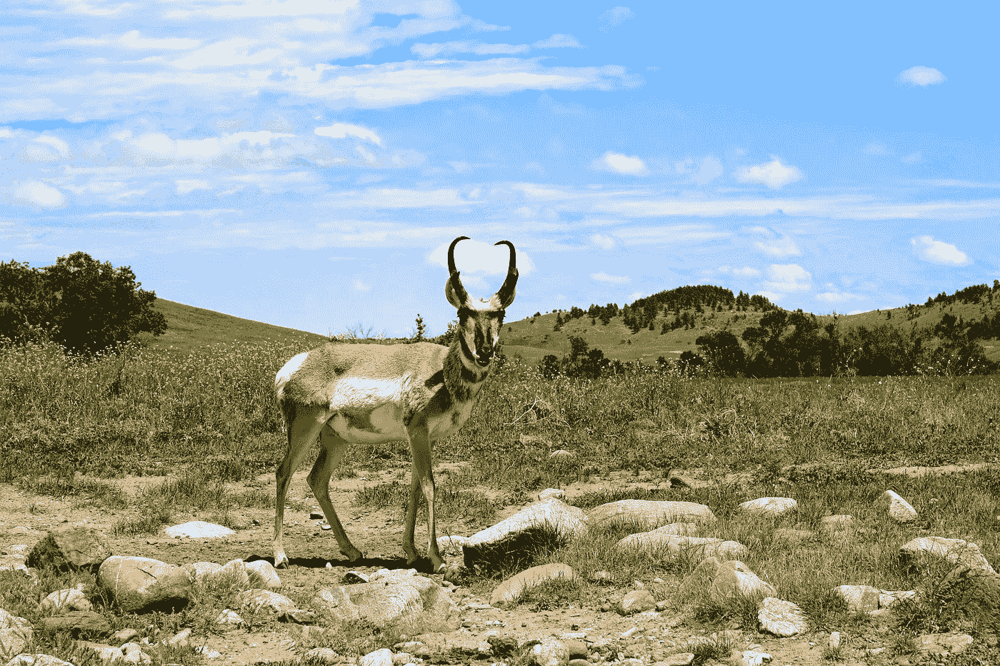
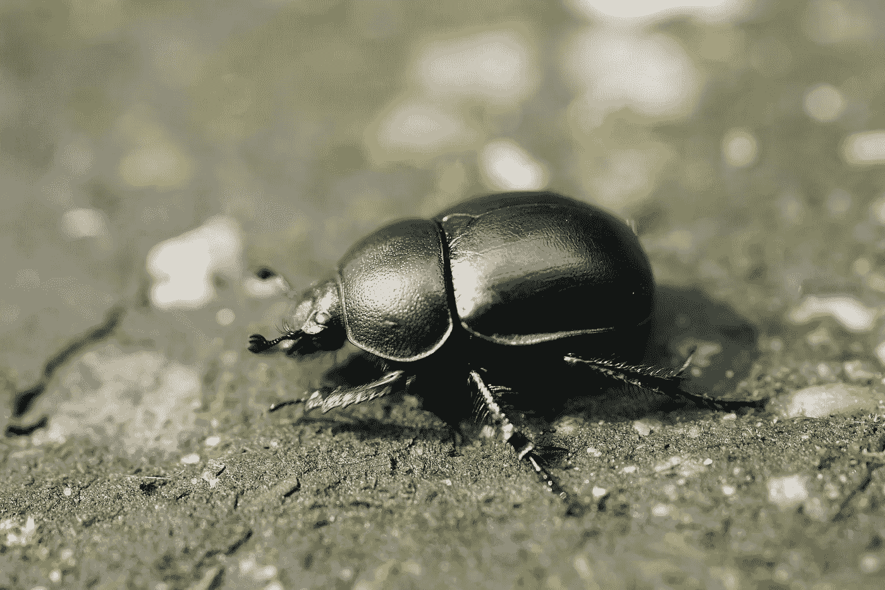

# 量子算法动物园

> 原文：<https://levelup.gitconnected.com/quantum-algorithm-zoo-aedf0d5dec28>

[https://pix abay . com/photos/tiger-animal-roar-roaring-predator-500118/](https://pixabay.com/photos/tiger-animal-roar-roaring-predator-500118/)

# 公开展示的狂野算法

本文介绍了你需要知道的每一个量子计算算法。是的，有更多算法展品的量子算法动物园，但那些是每个人都只是快速拍照然后走开的展品。这个动物园里的展品是你观看演示和向导游提问的。这些展品是量子计算的巨大吸引力。这些展品让参观者排了很长时间的队。这些展品是赚钱的机器。

[https://pix abay . com/photos/大自然-草地-动物-田野-羚羊-3047874/](https://pixabay.com/photos/nature-grass-animal-field-antelope-3047874/)

## 叉角羚

根据[大英百科全书](https://www.britannica.com/list/the-fastest-animals-on-earth)，“叉角羚，也被称为美洲羚羊，是动物王国中跑得最快的长跑运动员。”你可能以为是猎豹，但猎豹“只能在短距离内保持这样的速度。”量子计算算法的叉角羚就是 Shor 的因子分解算法。你可以在 [IBM Quantum Experience](https://quantum-computing.ibm.com/composer/docs/iqx/guide/shors-algorithm) 和 [Qiskit 教科书](https://qiskit.org/textbook/ch-algorithms/shor.html)中详细阅读这个宏伟的怪兽，并且你可以在 [Quantum Computing UK](https://quantumcomputinguk.org/tutorials/shors-algorithm-with-code) 学习如何使用它用一行代码分解数字。

[https://www.flickr.com/photos/gregthebusker/17132779149/](https://www.flickr.com/photos/gregthebusker/17132779149/)

## 六线赛跑运动员

根据动物的[速度，](https://www.speedofanimals.com/)[六线赛跑运动员](https://www.speedofanimals.com/animals/six_lined_race_runner)相对于它的身体大小是最快的动物。量子计算算法的六线赛跑选手是格罗弗算法。看起来它运行在一个值得称赞的二次加速上，但是有了误差修正，它实际上只运行在一个[四次加速](https://journals.aps.org/prxquantum/pdf/10.1103/PRXQuantum.2.010103)。你可以在 [IBM 量子经验](https://quantum-computing.ibm.com/lab/docs/iqx/guide/grovers-algorithm)和 [Qiskit 教科书](https://qiskit.org/textbook/ch-algorithms/grover.html)中读到关于它的标准解释，或者你可以在[量子时代精神](https://quantumzeitgeist.com/grovers-algorithm-an-intuitive-look/)中读到关于它的直觉构建解释。

声明:我个人知道量子时代精神文章的作者…

[https://pix abay . com/photos/geotrupidae-dung-beetle-beetle-6332634/](https://pixabay.com/photos/geotrupidae-dung-beetle-beetle-6332634/)

## 甲虫

据 [OneKind Planet](https://onekindplanet.org/top-10/top-10-list-of-the-worlds-strongest-animals/) 报道，相对于体重而言，屎壳郎是最强壮的动物。量子计算的屎壳郎是分子模拟。它可以做我们最强大的超级计算机做不到的事情，例如:模拟咖啡因分子。为了模拟一个咖啡因分子，我们需要一台质量为地球质量 1-10%的经典计算机或者只有 160 量子位的量子计算机。你可以在罗伯特·苏托博士的书《与量子位共舞》中读到更多关于这个发电站的信息。

而且，就是这样！那些是量子算法动物园里仅有的动物。感谢您的光临；请再次光临。

## 承认

感谢 Brett Donovan 与我分享论文“[量子算法的大统一](https://journals.aps.org/prxquantum/pdf/10.1103/PRXQuantum.2.040203)”。作者之一是艾萨克·庄教授，也就是量子计算圣经[【迈克&艾克】的“艾克”。这篇日期为 2021 年底的文章提醒我们，无论你认为有多少种“量子”算法，一切都可以归结为肖尔因子算法使用的](https://www.anrdoezrs.net/click-100273893-13599892?url=https%3A%2F%2Fwww.booksamillion.com%2Fp%2FQuantum-Computation-Information%2FMichael-A-Nielsen%2F9781107002173&cjsku=9781107002173)[量子傅立叶变换(QFT)](https://qiskit.org/textbook/ch-algorithms/quantum-fourier-transform.html) ，格罗弗算法使用的振幅放大，以及哈密顿模拟。

在撰写本文的过程中，没有算法受到损害。