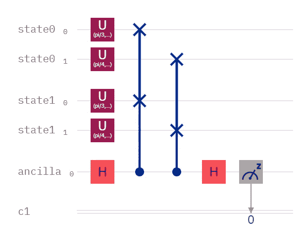

# 振幅的量子分类

> 原文：<https://levelup.gitconnected.com/quantum-classification-of-amplitudes-e0a3c596bc45>


[https://pix abay . com/photos/microscope-hands-medical-lab-4415777/](https://pixabay.com/photos/microscope-hands-medical-lab-4415777/)

# 有用！算是吧。

来自 [784 维量子 MNIST](https://bsiegelwax.medium.com/784-dimensional-quantum-mnist-f0adcf1a938c) 的开放式问题是，“[量子分类](https://medium.com/swlh/quantum-classification-cecbc7831be)和[振幅编码](/amplitude-encoding-dd89dc84170d)一起工作吗？”该算法在比较(模拟的)10 量子位量子系统时运行得如此之慢，以至于结果是不确定的。我没有耐心每次对比超过 10 张照片，结果可能需要数百万张照片。

首先，我犯了一个新手的错误，下载了一个我从未使用过的 8 维数据集。你可以在评论中和社交媒体上痛斥我。说真的，我活该。

该练习的要点是将数据的 8 个特征映射到 3 个量子位，假设 3 个量子位的比较将比 10 个量子位的比较运行得快得多。好消息是:确实如此。坏消息是:结果是无用的。是因为数据吗？我仍然不知道，但这肯定是可以推测的。坦白地说，这是一个遗憾，因为这篇文章是关于使用振幅编码的量子分类来预测糖尿病的。

不管怎样，我回到了最开始，当我开始[比较量子态](/comparing-quantum-states-c6445e1e46fd)的时候。我创建了一个随机数据集，较小的数字被归类为 0，较大的数字被归类为 1。尽管这在现实世界中可能不切实际，但关键还是要确定在这些数字被转换成振幅并打包成很少的量子位后，比较是否可行。我还创建了另一个随机数据集，它有意地更接近于分类 1。它会被正确分类为 1 吗，或者它会证明振幅编码数据的分类是不可能的吗？

```
0
{'1': 1345, '0': 8655}
{'1': 10, '0': 9990}
1
{'1': 1289, '0': 8711}
{'1': 5, '0': 9995}
2
{'1': 1402, '0': 8598}
{'1': 6, '0': 9994}
3
{'1': 1296, '0': 8704}
{'1': 12, '0': 9988}
4
{'1': 1202, '0': 8798}
{'1': 10, '0': 9990}
5
{'1': 1319, '0': 8681}
{'1': 13, '0': 9987}
6
{'1': 1358, '0': 8642}
{'1': 15, '0': 9985}
7
{'1': 1322, '0': 8678}
{'1': 14, '0': 9986}
8
{'1': 1291, '0': 8709}
{'1': 20, '0': 9980}
9
{'1': 1261, '0': 8739}
{'1': 15, '0': 9985}
```

对于上面的每个数字 0-9，有 2 个比较。这是低效的，是的，但是，同样，关键是要容易地看到这是否工作。每次迭代的顶部结果是与分类 0 的比较，而每次迭代的底部结果是与分类 1 的比较。好消息是:成功了！坏消息是:结果中几乎没有分离，所以很难看出它对真实世界的数据有效。运行 10，000 个镜头，计数只有 1，200 到 1，400 个点差，尽管我通常预计会有 4，000 到 4，500 个点差。

如果有人需要复习，内核方法比较量子状态。如果两个状态是相同的，则它们以 100%的概率测量为 0。如果状态是极性相反的，那么它们有 50%的概率测量为 0。两个状态越接近，它们测量 0 的频率越高。因此，两个非常接近的州可能以 90–95%的概率测量为 0，而两个非常远的州可能以 55–60%的概率测量为 0。这就是量子分类起作用的原因:将你的数据编码为量子状态，你的测试数据最接近的状态就是可能的分类。我在我的免费电子书《地下城&量子位:超越量子计算教程的冒险家的故事中详细介绍了这一点。

上述结果表明，与分类 1(较低的结果)相比，与分类 0(较高的结果)相比，有偏测试数据(如预期的那样)更频繁地测量到 0。因此，测试数据很可能是分类 1。 ***原则上，你可以对振幅编码数据进行分类。***

```
0
{'1': 1401, '0': 8599}
{'1': 17, '0': 9983}
1
{'0': 8562, '1': 1438}
{'1': 19, '0': 9981}
2
{'1': 1357, '0': 8643}
{'1': 16, '0': 9984}
3
{'1': 1421, '0': 8579}
{'1': 13, '0': 9987}
4
{'1': 1368, '0': 8632}
{'1': 11, '0': 9989}
5
{'1': 1364, '0': 8636}
{'1': 15, '0': 9985}
6
{'1': 1448, '0': 8552}
{'1': 17, '0': 9983}
7
{'0': 8631, '1': 1369}
{'1': 16, '0': 9984}
8
{'1': 1393, '0': 8607}
{'1': 19, '0': 9981}
9
{'1': 1334, '0': 8666}
{'1': 19, '0': 9981}
```

从 3 量子位状态扩展到 4 量子位状态已经在运行时间上引入了轻微的延迟。这还不算坏，但它预示着未来的延误。使用相同的算法，重要的是，我们可以看到它仍然在工作。分类 1 仍然是有偏测试数据的可能分类。

```
0
{'1': 396, '0': 9604}
{'1': 11, '0': 9989}
1
{'1': 413, '0': 9587}
{'1': 9, '0': 9991}
2
{'1': 393, '0': 9607}
{'1': 14, '0': 9986}
3
{'1': 406, '0': 9594}
{'1': 15, '0': 9985}
4
{'1': 410, '0': 9590}
{'1': 22, '0': 9978}
5
{'1': 450, '0': 9550}
{'1': 19, '0': 9981}
6
{'1': 444, '0': 9556}
{'1': 17, '0': 9983}
7
{'1': 393, '0': 9607}
{'1': 13, '0': 9987}
8
{'1': 417, '0': 9583}
{'1': 17, '0': 9983}
9
{'1': 392, '0': 9608}
{'1': 9, '0': 9991}
```

扩展到 5 量子位状态也延长了作业执行之间的暂停时间。它仍然在一万个镜头下工作，但我们可以看到分离只有几百个。我们在这里用非常小的振幅工作。32 个振幅的均匀分布(等概率)仅为 0.17677669529663688110021109052621，因此您可以看到检测轻微偏差是多么具有挑战性。

所以，我要为这篇文章做的最后一个测试是，如果我大大增加镜头数会怎么样？量子比特数越多，分离越多吗？

```
0
{'1': 3912, '0': 96088}
{'1': 133, '0': 99867}
1
{'1': 4208, '0': 95792}
{'1': 125, '0': 99875}
2
{'1': 4177, '0': 95823}
{'1': 122, '0': 99878}
3
{'1': 4026, '0': 95974}
{'1': 169, '0': 99831}
4
{'1': 3976, '0': 96024}
{'1': 134, '0': 99866}
5
{'1': 3966, '0': 96034}
{'1': 119, '0': 99881}
6
{'1': 3976, '0': 96024}
{'1': 146, '0': 99854}
7
{'1': 4200, '0': 95800}
{'1': 135, '0': 99865}
8
{'1': 3888, '0': 96112}
{'1': 106, '0': 99894}
9
{'1': 3842, '0': 96158}
{'1': 126, '0': 99874}
```

算是吧。我将镜头数从 10，000 增加到 100，000，间隔从几百变为几千。比率保持不变，但是小数向右移动了一位。所以，你可以说，更高的镜头数允许在结果中有更多的分离。

## 结论

振幅编码数据的量子分类。对于更小的量子态，我们可以看到。问题是，随着量子位计数的增长，振幅变得如此之小，以至于越来越难以区分。我们可以通过增加发射次数来增加结果的分离度，但是每个额外的量子位都会显著降低运行时间。对于 10 个量子比特的状态，我几乎没有耐心运行 10 个镜头。



比较两个 2 量子位的量子态。

不过，那都是指量子计算模拟。我没有足够的量子位在量子处理器上运行这个，但是，即使我有，振幅编码和 NISQ 设备上的多个 Fredkin 门的结果将是纯粹的噪声。我在一个 5 量子位的 IBM 量子后端上比较了两个 2 量子位的状态，在那个尺度上已经有显著的噪声了。


这应该以 100%的概率测量为 0，但是两个 Fredkin 门增加了很多噪声。

但是，当我们最终获得逻辑量子位(容错、纠错、适当的一致性)时，会发生什么呢？谷歌的“量子至上”实验用 53 个量子位只用了 200 秒，而我用 11 个量子位模拟 10 万次射击的等待时间远远超过这个时间。因此，我们肯定会看到运行时方面的“量子优势”，但是我们能够区分真实世界数据的结果吗？只有时间会证明…

*想玩代码？没有优化，但是在* [*GitHub*](https://cb.run/7Gxb) *上。*