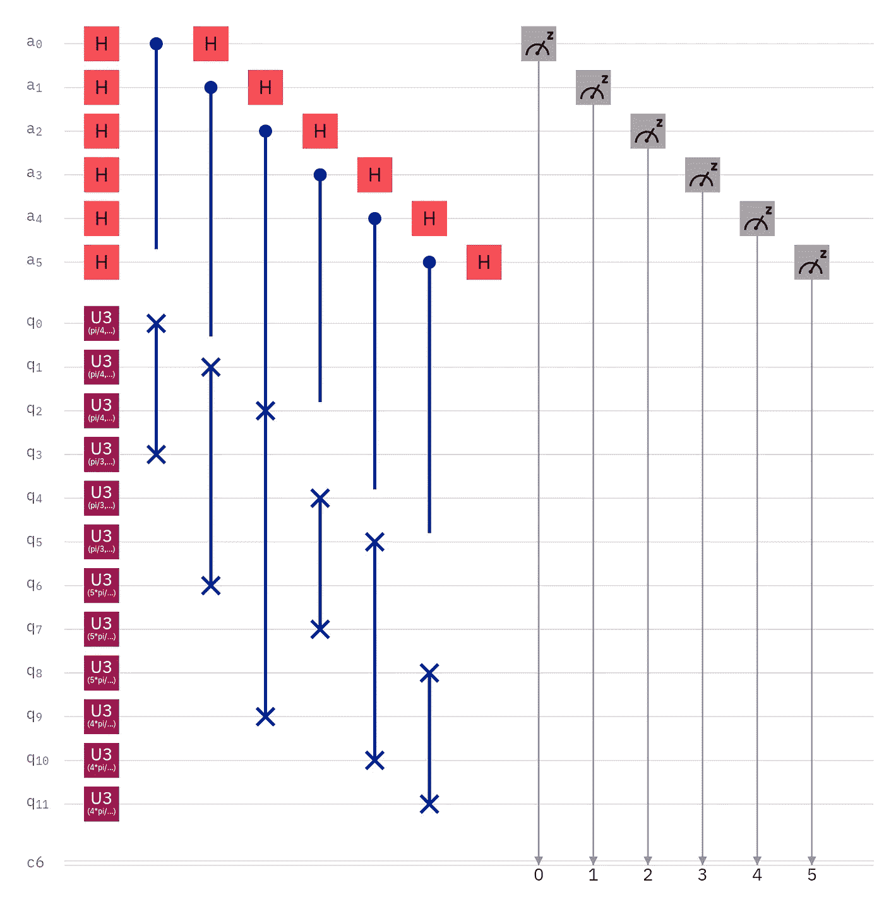
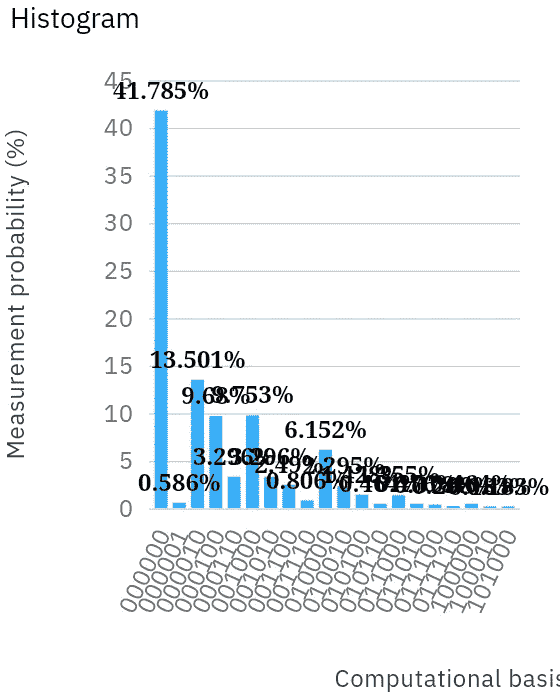
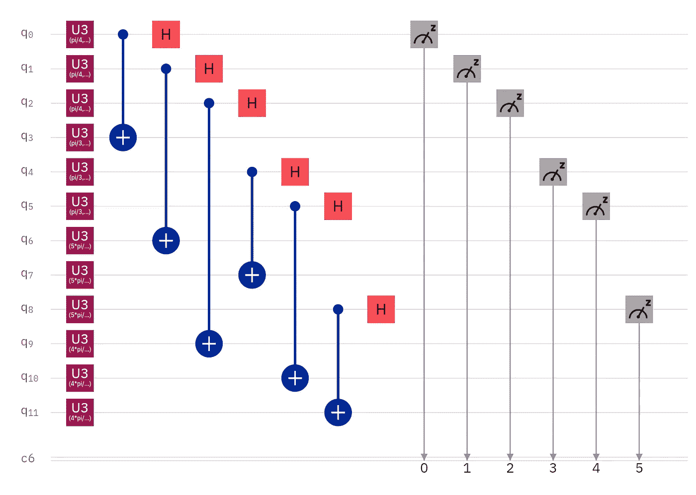
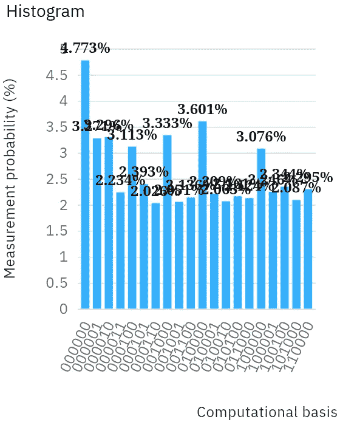

# 量子聚类

> 原文：<https://levelup.gitconnected.com/quantum-clustering-c498b089b88e>

在我最近的一篇题为“[最大量子分类](https://link.medium.com/lekZUorBJ8)”的文章中，我从已经映射到量子位并分组在一起的数据点开始，这里有一个算法来完成数据点的初始分组。该算法受基于质心的聚类的启发，使用该算法，您可以绘制任意数量的数据点，计算多个质心(中心点)，并根据数据点与质心的接近程度对数据点进行分组。基于质心的聚类最流行的版本是 k 均值算法。因此，我上一篇文章和这篇文章分别受到 k-最近邻和 k-means 算法的启发。

**免责声明**

首先，我承认我不认为这种聚类算法是最佳的。我分享它是因为它有效，但这种方法展示了经典思维，我真的希望减少所需的量子位和运算的数量。否则，尽管效率低下，但有这么多冗余，扩大电路规模会显得可笑。所以，我希望在不久的将来分享一个优化后的重新想象。

**数据**

如果你能想象一排四个布洛赫球，其中两个在球的一边有彼此接近的向量，另外两个在球的另一边有彼此接近的向量。该算法的目标是将四个数据点正确地分组为两个集群，因此我希望这个概念验证练习能够使确定它是否正确工作变得容易。

**设置**

我们首先准备六个辅助量子位来进行交换测试，这将决定量子态之间的距离。每个安西拉量子位都应用了哈达玛门。

数据量子位分为四组，每组三个。虽然只有四个数据点，但是每个都要准备三次，因为交换测试是破坏性的。每个数据点必须与其他三个数据点进行比较，因此每个数据点需要准备和销毁三次。

总共需要进行六次比较，才能确定每个状态与其他每个状态的距离。这就是为什么使用六个辅助量子位，也是为什么有六个经典寄存器来进行测量。

**分组**

该算法的主力是弗雷德金门，也称为受控交换门。辅助量子位是控制量子位，目标量子位将数据量子位配对，直到所有的状态相互比较。

**测量值**

交换测试以 x 测量结束，通过在进行测量之前立即应用 Hadamard 门，可以将 x 测量与 z 测量区分开。

**结果**

第一个和最后一个量子位的概率分别为. 9868 和. 98643。量子位 2 到 5 的测量概率依次为. 75107、. 8071、. 70994 和. 86863。

幸运的是，这个结果是正确的；第一个量子位和最后一个量子位是比较彼此最接近的状态的量子位。中间的四个量子位都在比较绕 z 轴和 y 轴旋转了一点的状态。

**失败的替代方案**

我最近发表了一篇题为“[比较单量子位量子态](https://link.medium.com/mylOzpflO8)的最简单方法”的文章，其中我将交换测试比作一种变体，用单个 CNOT 门代替最初的哈达玛门和弗雷德金门。这种替代方案很有吸引力，因为它大大降低了电路深度。虽然它似乎适用于单个量子位状态的简单比较，但在这个电路中实施时却完全失败了。

除了减少电路深度，还需要更少的量子位；这种变化不使用辅助量子位。虽然电路深度减少了多少可能并不明显，但对于 IBM Q Experience 来说，交换测试的深度为 14。同时，这种替代方案在传输之前和之后都只有两个电路深度。由于对这个小例子进行了六次比较，这种替代方案将传输电路深度减少了大约六打。

乍一看，我认为这种变化确实有效。然而，出于本文的目的，我希望能够发表对此的确认。在完成一些经典的后处理之后，结果是所有的状态都被确定为距离相等。既然两个态在布洛赫球的一边，两个态在布洛赫球的另一边，那肯定不是这种情况；互换测试证实了这一点。

**未来工作**

下一个合乎逻辑的进展将是把我之前的电路和这个电路结合起来。因此，我们将从数量相对较少的数据点开始，使用该算法将它们分配到组中，然后使用之前的算法将新数据点分配到这些组中的一个组中。理想情况下，将有一个既进行聚类又进行分类的电路。

除此之外，如前所述，我想让电路更“量子化”通过减少所需量子位的数量，更多的量子位可用于映射更多的数据点。此外，为了在 NISQ 硬件上产生有意义的结果，必须大大减少电路深度，即使采用基于电路的误差抑制和 Qiskit 伊格尼丝降噪。