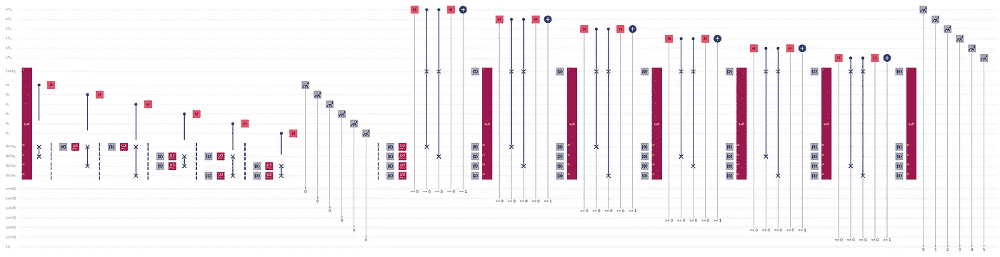
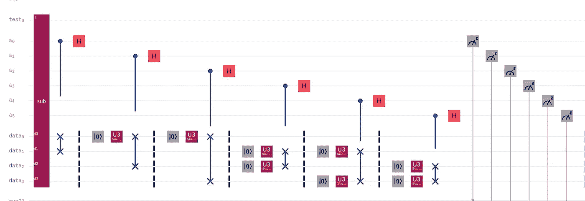
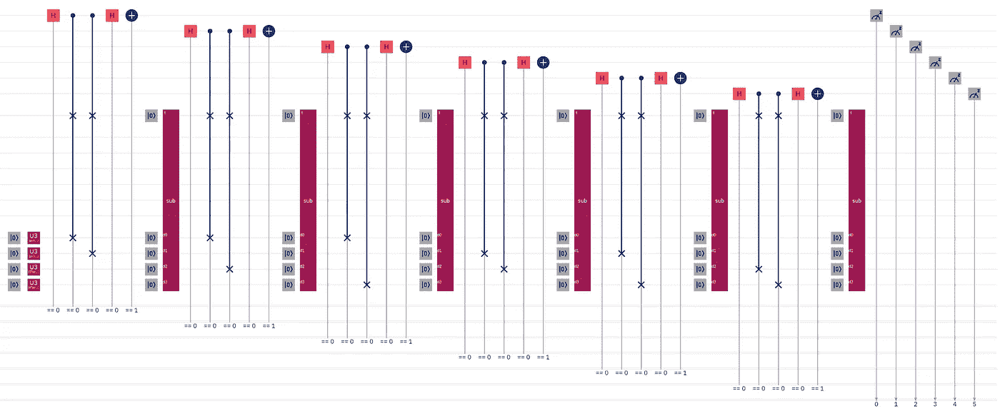
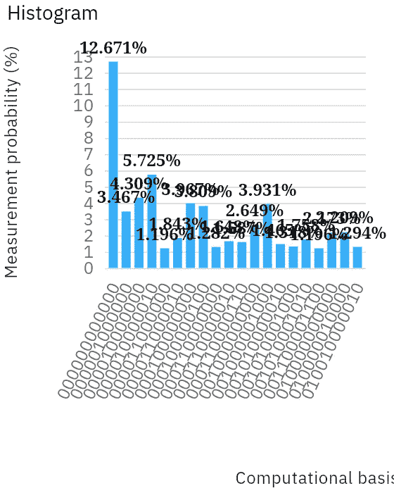

# 量子聚类和分类

> 原文：<https://levelup.gitconnected.com/quantum-clustering-classification-b8364814224f>

作为我最近写的文章“[量子集群](https://link.medium.com/1QH8fI1lY8)”和“[最大量子分类](https://link.medium.com/lekZUorBJ8)”的后续，这篇文章展示了如何将集群和分类合并到一个电路中。是的，你可能想在 Qiskit 或其他一些基于 Python 的量子计算框架中这样做，但这个电路是用 OpenQASM 编写的，所以重点是我们也许可以量子地做什么(如果那是一个词的话)，而不是我们知道我们可以经典地做什么。

**聚类**

受基于质心的聚类(特别是 k-means 算法)的启发，我们将四个数据点映射到四个总量子位。不，这并不是世界上最大的数据集，但你可以通过这四个数据点看到电路有多宽多深。

简而言之，我们希望获得我们拥有的任意数量的数据点，并根据它们之间的接近程度将它们分成 k 个组。对于这么小的数据集，我们希望最终有两组，每组有两个数据点。

该算法的聚类部分使用规范的[交换测试](https://link.medium.com/4io36myn38)来确定每个状态与其他每个状态的接近程度。为了最小化所需的模拟量子位的数量，利用了复位操作。为了避免使用 Python，使用了校正子位。

**复位并回收**

当经典地模拟太多量子位时，运行时间会延长到作业产生错误和失败的程度。缩短运行时间和避免这些错误的一个方法是使用复位操作和重用较少的量子位。这里的过程是应用一个重置门，然后是用于设置每个量子位各自初始状态的相同 U3 操作。

重置量子位意味着我们不能在真正的量子处理器上运行这个电路，但你需要为 IBM Research 的一个合作伙伴工作，以便有足够的量子位可供你使用，甚至尝试在真正的硬件上运行这个算法。在不使用复位操作的情况下，必须为每个数据点准备多个具有相同状态的量子位。

**症状位**

虽然通常用于纠错，但我们可以使用校正子位来避免使用 Python，并避免将该电路分成两个较小的电路。和重置操作一样，使用伴随位意味着我们不能使用真正的量子处理器，但在模拟器上，我们可以使用它们来增加正确分类新数据的概率。

**分类**

受 k-nearest neighbors 算法的启发，我们绘制了一个新的数据点，并根据其与每个组的中心点或质心的接近程度，确定该新数据点应分配到哪个先前确定的组。这种确定再次通过交换测试进行，尽管不是规范的交换测试，因为这些实现被修改为每个都将一个状态与多个状态进行比较。

同样，我们使用重置操作来最小化所需的模拟量子位的数量。我们还使用了一个低效的函数来简化状态的重置；效率很低，因为它重置了一些实际上不需要重置的量子位。然而，为了使该算法工作，它通过减少由于使用校正子位而需要的条件语句的数量来简化代码。

校正子位执行两个任务之一。如果测量值|0 >表示已识别的组，则交换测试将确定测试数据点和组质心之间的距离。然而，如果|1 >的测量值表明不存在基团，则将 Pauli-X 应用于相关的辅助量子位。因此，传统的后处理将显示远离未分组数据点的测试数据点。

原因是当状态重叠时，交换测试测量|0 >,否则以相等的概率测量|0 >或|1>。这就是为什么最大相反状态测量|0 >的最小概率为 0.5。因此，我们使用校正子位来避免交换测试给出| ^ 0 >测量值。相反，我们保证有更多的| ^ 1 >测量值，这表明测试数据点不能最接近未被该算法的群集部分识别的组的质心。

**结果**

对结果的分析需要经典的后处理。IBM Q 直方图只显示了最高的结果，但是这个特定电路的这个特定运行实际上产生了 299 个不同的结果。值得注意的是，聚类测量值是最右边的六个数字，而分类测量值是最左边的六个数字。

聚类结果与我上一篇文章中的结果几乎相同，因为我使用了相同的数据点，所以我让您阅读那篇文章进行相关的分析。TL；DR:如果你能想象四个布洛赫球，两个向量在布洛赫球的一边彼此靠近，另外两个向量在布洛赫球的另一边彼此靠近。这样做是为了更容易验证算法是否有效。经典的后处理揭示了第一和第六次测量是最好的组。

对于分类，度量|0 >的概率依次为:. 73221、. 55152、. 62648、. 65728、. 72842 和. 97343。这意味着测试数据点最接近第六组。事实上，测试数据状态与该组中的一个状态相同，所以这是一个正确的分类。

**总结**

我旋转了四个量子位，使得两个状态在布洛赫球的一边，另外两个状态在布洛赫球的另一边。该算法的聚类部分正确地识别出每一对应该被分组在一起。然后我旋转了一个新的量子位来匹配其中一个数据量子位。该算法的分类部分正确地确定了测试数据点应该与其相同的数据量子位在相同的先前识别的组中。

**未来工作**

出于这些文章的目的，我试图保持电路图的可读性。然而，这留下了优化的空间。电路深度和总门数肯定可以减少。函数和条件语句(大概)也可以优化。

然而，这种算法仍然不能在 NISQ 处理器上运行，所以用它可以做多少事情是有限制的。与此同时，模拟量子处理器(希望如此)最终能够实现的功能也很有趣。