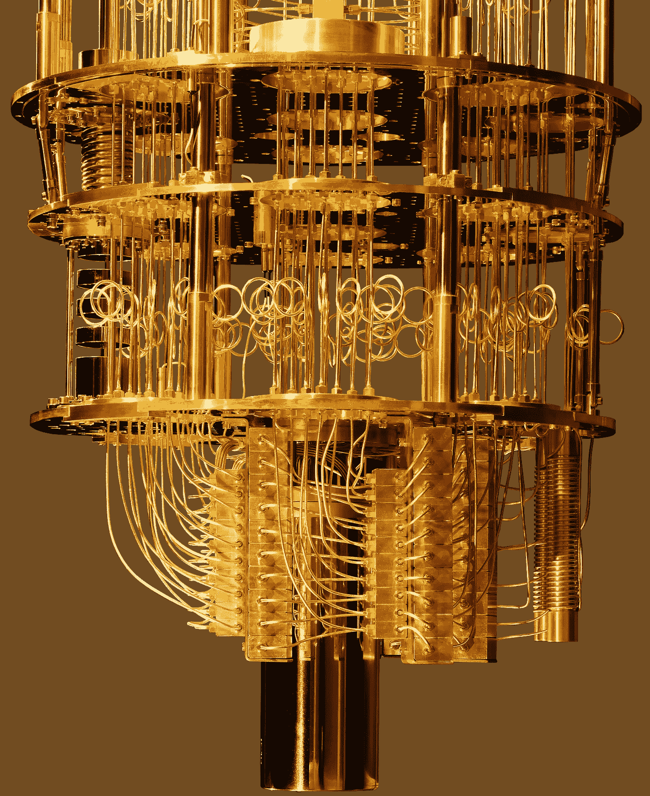
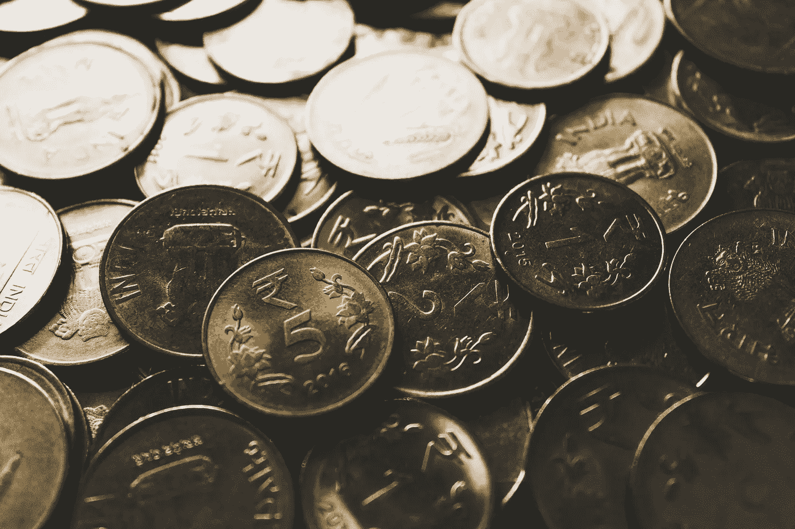
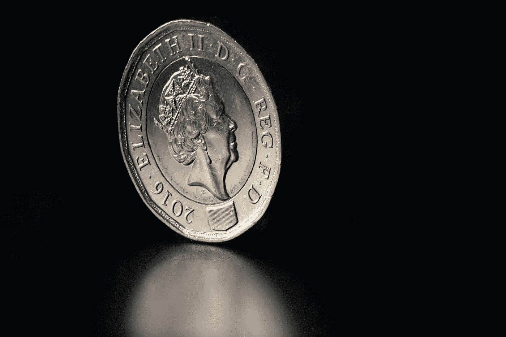
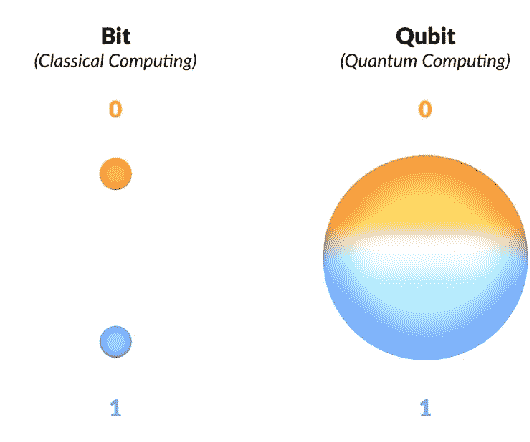
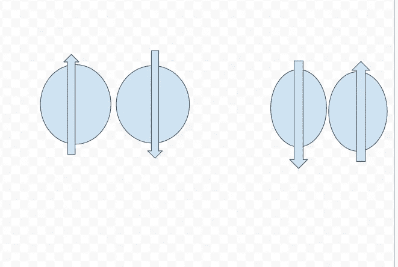
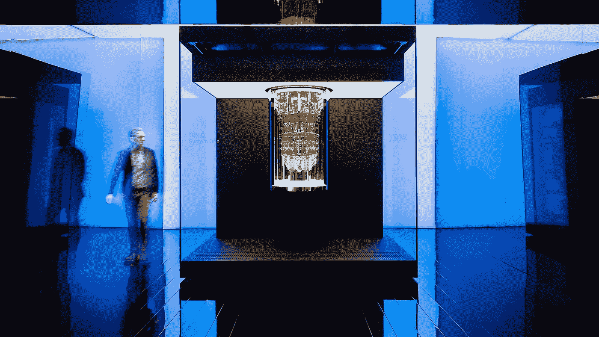
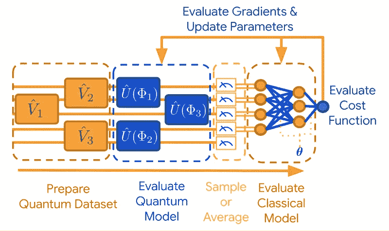
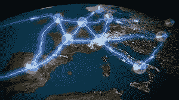

# 量子计算解释了

> 原文：<https://levelup.gitconnected.com/quantum-computing-explained-186d424afe03>

量子计算机在解决动态问题的方式上相当彻底。量子计算机避开传统的晶体管方法，选择自旋。

来源:IBM。计算机输出缩微胶片

围绕量子计算机的宣传是无与伦比的，它们被称为“癌症、衰老和死亡的解决者”。有些人甚至称他们为“终极黑客”，并将破解 RSA 加密。

嗯，我目前正在玩这些宝贝，特别是 [IBM](https://www.ibm.com/quantum-computing/) 量子计算机，我将分享我到目前为止学到的东西。

# 内容:

背景

量子特性

量子人工智能

量子互联网

神话

来源

# 背景

传统计算机使用二进制 101100 处理任务。让我们把这想象成一个硬币的头像和故事系统。正面代表 1，反面代表 0，我们根据正面或反面给计算机指令。

你可以想象这个充电系统是非常有限的，因为计算机需要选择一个或零，这个任务不能同时完成。

来源:Rupixen.com 经 Unsplash.com

对于量子计算机，我们使用自旋，类似于你如何旋转一枚硬币。它可以是 1、0 或两者都是。

来源:Unsplash.com 途径史蒂夫·史密斯

现在计算机不必在 1 或 0 之间进行选择，它可以同时处理两者。使用遵循量子力学规则的新一代芯片。

这种芯片含有量子比特，可以被操纵成不同的状态。

这些状态是:

*   叠加
*   纠缠

# 量子叠加

来源:【Scholar.com 语义

量子叠加表示“每一个量子物体都处于它所能发现的所有状态的超级位置！”

每当我们测量电子自旋时，它可以是向上或向下的状态。一个量子位处于 0 +1、上+下或两者之一的超位置状态。

# 量子纠缠

被伟大的科学家阿尔伯特·爱因斯坦描述为“Spukhafte Fernwirkung ”,翻译过来就是幽灵般的超距作用。

考虑我们有两个电子，总自旋等于零，可以写成上，下，下，上的线性组合。

说明向上、向下和向下、向上表达式的图表

如果电子被分离到一个不可能相互作用的点，当我们改变其中一个时，那么另一个电子也会被改变。

这些原理被研究科学家用来操纵量子计算机的构建模块——量子位。

这是通过微波脉冲沿着电缆一路传输来实现的。

来源:[Daimler.com](https://www.daimler.com/magazine/technology-innovation/quantum-computing.html)

# 量子人工智能

来源:谷歌

量子人工智能是一个专注于开发量子算法以进一步增强机器学习和人工智能的领域。

一段时间前，谷歌宣布张量流量子(TFQ)，这是一个开发人工智能量子系统的开源库。

以下是该库的一些有用功能:

*   量子数据可以表示为 TFQ 中的张量，并进一步转换为经典数据集。
*   TFQ 评估了量子数据，并基于此选择了一个神经网络，其目的是提取处于纠缠态的信息。
*   此外，TFQ 评估经典和量子数据，并确定两者的相关性。

# 量子互联网

来源:[物理 World.com](https://www.google.com/imgres?imgurl=https%3A%2F%2Fphysicsworld.com%2Fwp-content%2Fuploads%2F2021%2F05%2FQW-webinar2021-05.jpg&imgrefurl=https%3A%2F%2Fphysicsworld.com%2Fa-roadmap-for-the-quantum-internet%2F&tbnid=WazEWac7vz-E8M&vet=12ahUKEwjAtb_02pnyAhUQw4UKHSW0AG8QMygGegUIARC7AQ..i&docid=8p7jRq6SJnyYNM&w=1200&h=675&q=quantum%20internet&ved=2ahUKEwjAtb_02pnyAhUQw4UKHSW0AG8QMygGegUIARC7AQ)

量子互联网只是利用量子效应传输数据，并通过量子加密技术进行保护。

使用量子密码术，我们可以通过利用量子力学的测量来保护数据传输。这将不可逆转地改变量子粒子的状态。

当我们可以用量子粒子对一条消息进行编码时，一旦这条消息被黑客截获，这将被检测到。因为黑客测量会改变粒子的行为。

# 常见的神话

*   量子互联网可以比光速更快地传输数据！不正确，因为量子力学尊重光速极限。
*   量子计算机会破解 RSA 加密，让我们都不堪一击！半真半假，RSA 加密可以通过寻找大数的质因数来破解。这项任务将需要数千年才能由计算机完成，但可以由量子计算机简单计算。
*   在芯片中添加更多的量子位将会提升量子优势！添加更多的量子位会带来更多的问题，因为量子计算机对噪音、环境影响和温度非常敏感。
*   在接下来的 5 到 10 年里，量子计算将解决气候变化、癌症，带我们走向永生，并最终终结人类！量子计算还很不成熟，更像是哈佛的 Mark 1 阶段。

# 来源:

 [## IBM |量子计算

### IBM 将帮助您率先探索、定义并受益于快速到来的量子时代…

www.ibm.com](https://www.ibm.com/quantum-computing/)  [## 谷歌量子人工智能

### 无论你是一个想拓展 NISQ 计算机，一个软件的研究人员…

quantumai.google](https://quantumai.google/)