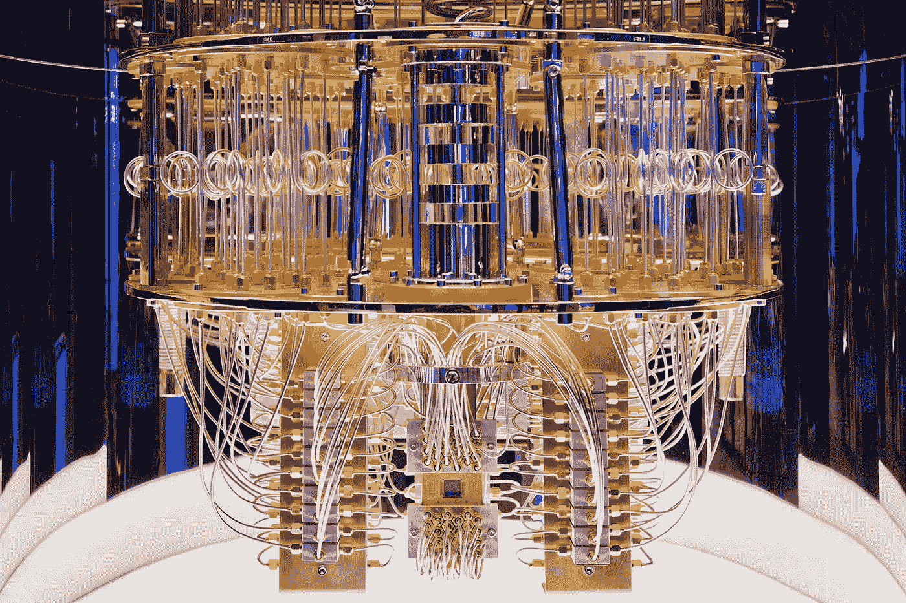
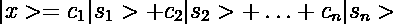
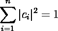
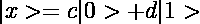
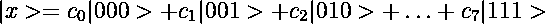
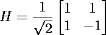
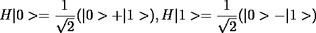
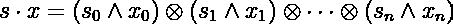
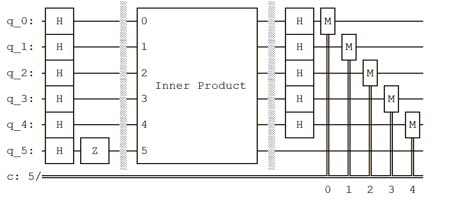

# 量子计算解释了

> 原文：<https://levelup.gitconnected.com/quantum-computing-explained-a212a4f30ac1>

## 为什么量子计算机可以更快地解决(某些)问题

IBM 的量子计算机

我应该首先披露我是量子计算机专家，而不是 T2。我是一名计算机科学家，对我所在领域的下一场大革命充满好奇。我也碰巧对理论物理有终生的兴趣。我开始研究质量控制的基础不久，我一直在努力理解为什么量子计算机能够比我们目前最先进的计算机更快地解决一些问题。我想与我的读者分享我的见解。

# 量子力学的一些规则

把量子计算机想象成一个装有某种电路的盒子。我们准备一个处于特定状态的量子系统，把它放在盒子里，让它在电路中搅动。当它在盒子里时，我们不能观察它。当我们需要关于系统的信息时，我们执行**测量**。这涉及到选择我们想要测量的物理变量，如能量、动量、极化等。这些变量被称为**可观测量**，测量它们会产生对应于系统不同状态的几种可能结果之一。

以下是一些描述量子力学状态及其行为的定量规则:

*   一个特定的可观测值，比如说 S，在测量时可以产生固定数量的状态，比如说 *n* 。我们将这些状态表示为向量空间中的基向量。在量子力学符号中，这个基础被写成 as|s₁ >，|s₂ >，…，|sₙ >。我们可以把这些看作是正常三维空间中单位向量 **x，y，z** (或 **i，j，k** )的推广。
*   在测量之前，系统的状态是由这些结果的线性组合形成的向量，称为**叠加**，其中`ci`是复数:

*   |sᵢ>.说，当我们测量可观测的 s 时，自然会选择其中一个结果除非我们以其他方式与这个系统互动，否则任何后续的相同可观测值的测量都会产生相同的状态。这种从叠加态到单一结果的转换被称为**坍缩态。**
*   大自然是如何选择结局的？在某种程度上，它掷骰子。这个状态坍缩到|sᵢ>的概率由 state,|cᵢ|系数的平方模给出。注意，由于这个要求，称为**玻恩法则**，cᵢ不能是任意的，但它们必须满足以下条件:

平方模形成概率密度

## 量子力学中的随机性和确定性

简要说明是为了阐明量子力学系统中确定性和随机性的界限。只要系统开始于一个已知的状态，并且它通过已知操作的应用而发展，系统的状态是完全确定的，在这个意义上，我们知道描述任意时间点的状态向量`(c1, c2,.., cn)`的复数。随机性只有在测量的时候才表现出来，也就是说在状态坍缩的时候，选择一个可观测值。

# 量子位和量子门

在经典计算机中，一位是最小的信息单位。它可以处于通常用 0 和 1 表示的两种状态之一。更大的信息单元可以通过将几个比特组合成一个类似`01100111`的字符串来构建。

在量子力学中，一个比特对应的信息单位可以是 0 和 1 的叠加。因此最简单的量子力学系统是二维复向量空间。标准状态由代表向量[1，0]的|0 >和代表向量[0，1]的|1 >表示。系统的一般状态是一个矢量

其中 *c* 和 *d* 为满足 *|c| + |d| = 1* 的复数。 *|c|* 是测量时系统处于状态|0 >的概率，而| *d|* 是系统处于状态|1 >的概率。

和经典计算机一样，我们可以组合几个量子位来编码更多的信息。在这种情况下，相应的系统将是位串所有可能组合的叠加。例如，对于 3 量子位系统，状态的一般表达式是:

一般来说，一个 *n* 量子位的系统由一个 2ⁿ.维度的向量空间来建模

我们可以通过组合逻辑门来构建量子逻辑电路，就像我们构建经典电路一样。量子门与经典门有一些重要的不同:

*   每个门都必须是可逆的。例如，不允许简单的 AND 运算，因为 0 的结果不能重建原始的两位。因此，所有量子门的输出和输入一样多。
*   门应该能够作用于任何叠加态。
*   门线性地作用于状态。如果 v 和 w 是状态，c 是复数，那么一个门 G 必须满足 *G(v+w) = G(v )+G(w)* 和 *G(cv) = cG(v)* 。换句话说，门可以表示为状态向量空间上的矩阵。
*   门必须保持总概率加起来必须等于 1 的要求。换句话说，我们要求对于每个向量 v， *||Gv|| = 1* ，使得 *||v|| = 1。*

随着这些规则的建立，我们可以通过被称为**酉**的 2ⁿ矩阵将一个 *n* 量子位系统中的每个量子门表示为一种特殊的 2ⁿ。当一个量子系统在状态|x >“通过”一个门 G 时，得到的状态由矩阵乘法给出。

这里有一个广泛使用的门的例子，称为**哈达玛门**，它作用于一个 1 量子位系统:

哈达玛门的特性是，它采用一个标准的量子位状态，并将其转换成一个叠加态，其中每个结果都有相等的概率。

2 的平方根出现在分母中，因为概率是由振幅的平方给出的。出于同样的原因，第二个表达式中的负号是不重要的，因为它的平方也给出 1/2 的概率。哈达玛门可以组合起来，把几个量子位元放在一个相等重量的叠加态中。

量子电路中经常使用的另一种结构是**控制的**门，其中对输入量子位|x >的操作是通过与控制位|y >执行 XOR 来控制的。

受控门

在上图中，f 是一个任意函数。注意，即使函数 *f* 是不可逆的——例如，它将所有内容映射到 0——门 *Uf* 是可逆的。事实上，这是它自己的反面。

# 量子算法

量子计算机的优势来自以下事实:当我们需要为每个可能的输入评估一个函数时，经典计算机必须执行与输入一样多的计算。在量子计算机中，如果我们操纵状态，使其处于所有可能输入的叠加状态，那么当我们应用函数(作为门)时，在某种意义上，状态将是函数所有可能值的叠加。

这种“神奇”的平行评价有其局限性。函数应用后，系统处于未知状态，我们无法直接观察到。当我们测量机器的输出时，叠加态会崩溃，我们可能会丢失测量前包含的信息。更糟糕的是，一条被称为 [**不可克隆定理**](https://en.wikipedia.org/wiki/No-cloning_theorem) 的量子力学定律规定我们不能复制状态。如果可以的话，我们会复制多份，然后全部测量，这样就可以还原出隐藏在叠加态中的统计数据。

量子算法中的聪明之处在于，为了提取未知函数值之间的*关系* ，而不是单个值本身，计算出在未知函数前后应用什么变换。

这里有一个例子。考虑一个函数，它采用两个 *n* 位整数，并计算它们的逐位内积，从而返回 0 或 1。

两个数的按位内积

数字 ***s*** 是未知的，但我们可以代入 ***x*** 的各种值来试着算出来。经典计算机需要对函数进行 *n* 次求值才能完全确定值*s。*然而，有一种量子算法，称为 **Bernstein-Vazirani 算法**，可以在一次求值中完成。下面是一个 4 量子位系统的算法电路图。

Bernstein-Vazirani 算法的量子电路——用 Qiskit 编码

第五个量子位用于携带隐藏内积的结果。内积盒本身是一个量子电路，它使用受控门技巧将所讨论的函数变成一个酉门。

量子位 1 到 4 在|0 >状态被初始化。哈达玛门(H)用于将它们置于叠加态。它们代表上式中 ***x*** 的值。最后的 M 个盒子是对每个量子位的测量操作。测量每个位将迫使其进入|0 >或|1 >。事实证明，当最后的比特被测量时，它们将精确地包含 ***s*** 的未知值。

解释该算法的工作原理超出了本简介的范围。我向感兴趣的读者推荐优秀的 Qiskit 文档，它提供了算法和许多其他内容的完整解释，以及实现它们的代码。

有一点需要澄清:代表未知函数的黑盒从何而来？ *s* 的每个值对应一个略有不同的电路。这些电路可以被认为是程序中的子程序。可以说，在用户或 I/O 设备提供外部输入的情况下，它们是“动态”编译的。

[2]:例如，对于一个 3 位数，我们需要为 x 提供这些值:100，010，001

# 量子优势

Bernstein-Vazirani 算法演示了一个可以由量子计算机在单次评估中解决的问题，其中经典计算机需要执行线性数量的评估。诚然，这个问题有些做作。人们也可以认为，简单地计算函数求值不足以描述算法的整个计算复杂性。事实上，要证明量子优势——即量子计算机可以比经典计算机更有效地解决一些问题——还需要更多。

对量子计算机能力的最具戏剧性的测试之一是由 Shor 的算法提供的，该算法可以在多项式时间而不是指数时间内解决整数因式分解问题。这个问题不仅仅是数学上的好奇。大多数现代非对称密码系统，如 RSA，都依赖于这样一个假设，即分解大整数在计算上是不可行的。给定足够的量子位和足够的稳定性，看起来量子计算机可以破解这些加密系统。有关 Shor 算法的详细概述和模拟，请查看 [Qiskit 文档](https://qiskit.org/textbook/ch-algorithms/shor.html)。

我希望这份对量子计算机和算法世界的旋风般的介绍激起了读者对这个迷人的研究领域的兴趣。目前，量子优势还没有降临到我们头上，部分原因是建造稳定的量子计算机是一项艰巨的任务，但作为计算机科学家，我们应该关注量子技术的进步，因为它很可能是我们工艺的未来。

# 参考资料和资源

*   Noson S. Yanofsky 和 Mirco A. Mannucci，*计算机科学家的量子计算*，剑桥大学出版社，2019 年
*   大卫·默明，*量子计算机科学，*剑桥大学出版社，2007
*   Scott Aaronson，*量子信息科学导论*，2018:[https://www.scottaaronson.com/qclec.pdf](https://www.scottaaronson.com/qclec.pdf)
*   IBM 的 Quantum Composer 可以用来模拟量子电路，甚至在真实的量子计算机上执行:[https://quantum-computing.ibm.com/composer](https://quantum-computing.ibm.com/composer)
*   Qiskit 是一个用于构建量子电路的 Python 库。这些电路可以在 IBM 的一组门电路中传输，在量子计算机上运行:[https://qiskit.org/](https://qiskit.org/)