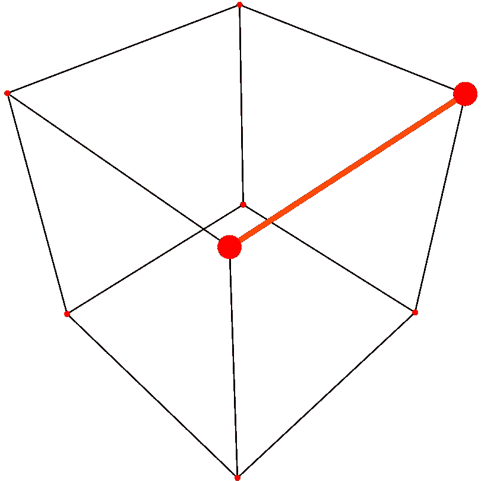

# 量子误差忽略

> 原文：<https://levelup.gitconnected.com/quantum-error-ignoration-1efa1b1b70d1>


[https://pix abay . com/photos/angel-little-angel-cumber-5585337/](https://pixabay.com/photos/angel-little-angel-figurine-5585337/)

# 纠正、减轻、抑制或…忽略错误。

我目前正在合作开发一个算法(这篇文章得到了各方的认可)，它需要一种不同的错误处理。就本文的目的而言，重要的一点是，当我们遇到一个特定的错误时，我们丢弃它，回滚一步，然后再试一次。这种方法最终可能会改变，但这无关紧要。无论如何，用这种当前的方法，我们丢弃坏的结果，继续尝试，直到我们只剩下好的结果。

与这个项目无关，社交媒体上有人开始了一场关于噪音和错误的对话。不知何故，那次谈话让我想知道为什么我们选择接受错误。我正在做一个项目，在这个项目中我们丢弃错误，那么如果我更普遍地采用同样的方法会怎么样呢？如果我只是忽略不想要的结果，并继续尝试，直到我只得到我想要的允许结果的总数，那该怎么办？

## 你好，量子世界！

我选择在最简单的量子电路上进行试验，只有一个哈达玛和一个 CNOT。完成任何量子计算教程的每个人都应该知道结果应该只有 00 和 11。因为噪音，我们会看到 01 和 10，但它们不应该出现在结果中。模拟器不会在结果中显示 01 和 10。

以下是我添加到教科书算法中的内容:

```
good = {"00": 0, "11": 0} # Create dictionary to store good results.
shots_remaining = 20000 # Go big or go home.
start = shots_remaining # Prevent an error later.while shots_remaining > 0: 
    print("shots remaining: " + str(shots_remaining)) 
    job = execute(circuit, backend, shots=shots_remaining) 
    job_monitor(job) # Where are we in the queue for real hardware?
    result = job.result() # Retrieve the results.
    counts = result.get_counts(circuit) # Count the 00, 01, 10, 11.
    print("counts: " + str(counts)) # Let's see what we counted.
    good["00"] += counts["00"] # Just count the 00...
    good["11"] += counts["11"] # ...and the 11 results.
    print("good: " + str(good) + "\n") # Print running totals.
    sum = good["00"] + good["11"] # Sum our good results.
    shots_remaining = start - sum # Update so we can loop again.print(circuit) # Let's verify what this circuit looks like.
print(backend) # Which backend was this run on?
print("final: " + str(good)) # Display the final counts.
```

我真的希望对每个人来说，这些代码都有足够的注释。简单地说，我检索结果，将 00 和 11 的计数添加到一个字典中，计算我想要的 20，000 个镜头与我的 00 和 11 的运行总数之间的差异，然后循环运行更多的镜头，直到我达到我的目标。

```
shots remaining: 20000
Job Status: job has successfully run
counts: {'00': 9620, '01': 646, '10': 662, '11': 9072}
good: {'00': 9620, '11': 9072}

shots remaining: 1308
Job Status: job has successfully run
counts: {'00': 648, '01': 46, '10': 41, '11': 573}
good: {'00': 10268, '11': 9645}

shots remaining: 87
Job Status: job has successfully run
counts: {'00': 45, '01': 3, '10': 3, '11': 36}
good: {'00': 10313, '11': 9681}

shots remaining: 6
Job Status: job has successfully run
counts: {'00': 3, '11': 3}
good: {'00': 10316, '11': 9684}

     ┌───┐     ┌─┐   
q_0: ┤ H ├──■──┤M├───
     └───┘┌─┴─┐└╥┘┌─┐
q_1: ─────┤ X ├─╫─┤M├
          └───┘ ║ └╥┘
c: 2/═══════════╩══╩═
                0  1 
ibmq_belem
final: {'00': 10316, '11': 9684}
```

现在，你看到了:在 ibmq_belem 上有 20，000 张“你好，量子世界”的照片，计数中没有 01 或 10。因为量子位并不完美，所以计数仍然倾向于 0，但是谁告诉你不能用这种技术结合其他技术呢？我不会告诉你的。继续使用一些 Qiskit 工具，甚至可以把[的 Q-CTRL 的火猫眼石](/fire-opal-is-awesome-c642347ec89d)扔向……你不会伤害我的感情。



[https://commons . wikimedia . org/wiki/File:A _ edge _ in _ A _ cube . SVG](https://commons.wikimedia.org/wiki/File:A_edge_in_a_cube.svg)

## 实际例子

想象一下两个量子比特的量子行走。有四种可能的测量结果，代表四种不同的路径可供选择。但是，现在看看上面的立方体的角。我们只有三条路可以选择。这三条有效路径可能有三种不同的被选概率，我们事先不知道会是哪一条。然而，我们知道噪音和误差会导致我们测量不存在的第四条路径。

这是不可接受的。我们没有宇宙魔方和更高的维度。我们需要去立方体的另一边。因此，如果我们使用的所有上述工具都不能给我们一个没有错误的结果，我们可以忽略这个错误，再试一次，直到我们得到一个有效的结果，然后继续。

记住:一个迷路的送货卡车司机不会一路开回起点重新开始。同样，算法中的错误不一定需要全部重做。只要重新上路，忽略身后的死胡同，选择眼前的一条有效路径。