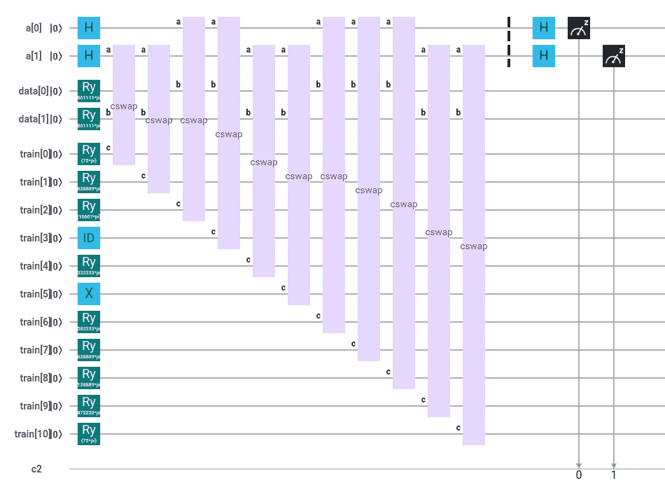
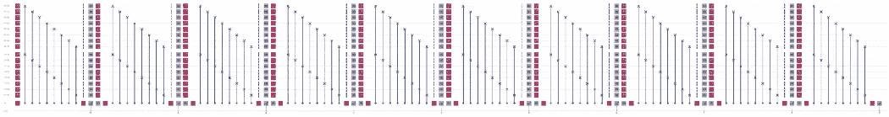
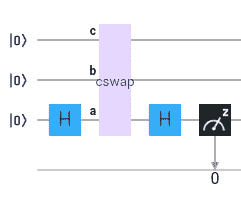
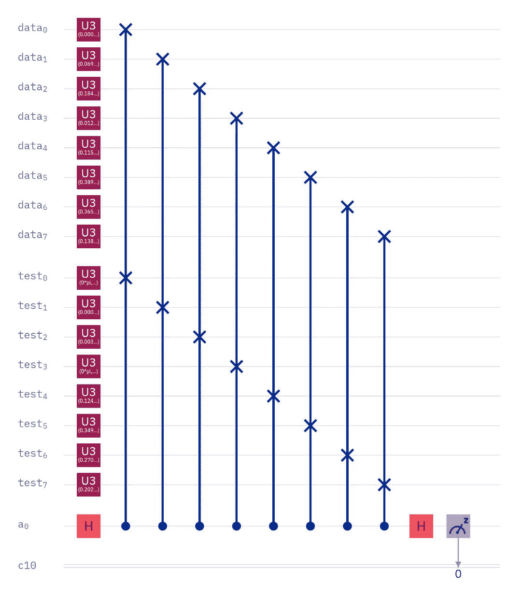

# 量子激发的 MNIST

> 原文：<https://levelup.gitconnected.com/quantum-inspired-mnist-6e33466d991b>


[https://commons.wikimedia.org/wiki/File:MnistExamples.png](https://commons.wikimedia.org/wiki/File:MnistExamples.png)

# 没有比这更容易的了…

如果你可以在不建立和训练模型的情况下进行机器学习，会怎么样？如果你能忘记权重、激活函数和优化器会怎么样？如果你能把归一化和导数换成加法和减法会怎么样？

你可以。

我将使用[分类](https://medium.com/swlh/quantum-classification-cecbc7831be)作为例子，使用 [MNIST 数据集](https://towardsdatascience.com/quantum-mnist-f2c765bdd478)。这应该也适用于[聚类](/quantum-clustering-c498b089b88e)，因为启发这个实验的[量子算法对两者都适用。](/comparing-quantum-states-c6445e1e46fd)

对于那些不知道的人来说，MNIST 是一个流行的手写数字数据集，数字 0 到 9。MNIST 练习的目标是获取一个手写的一位数，并准确地识别出它想要的数字。而且，不遇到机器学习大概是不可能进入的，因为这是一个干净的数据集。您可以专注于构建和训练模型，而不是清理数据。



量子分类

## 经典分类是如何工作的？

在最基本的层面上，分类从输入和输出开始，我们确定“权重”,当乘以输入时，产生已知的输出。然后，我们将这些权重乘以测试输入，并获得建议每个输入最可能分类的输出。

```
inputs * weights = outputs
```

嗯，这看起来并不难，对吧？这有什么挑战性？

挑战在于有效地找到重量。我们从将输入乘以随机权重开始，确定我们离已知输出有多远，并以小增量调整权重。我们这样做很多很多次，直到小的权重调整将加权输入和输出之间的距离减小到它们的最低可能值。

但是，这些调整应该有多大呢？如果我们太自由了，超出了我们的目标怎么办？或者，如果我们太保守了，训练要花很长时间呢？那么，我们需要另一个模型来调整我们的超参数？

因此，基本分类在概念上很简单，但也可能变得复杂。我们正在寻求优化运行时间和准确性。



量子 MNIST

## 量子分类是如何工作的？

对于经典分类，我们使用加权来减少输入和输出之间的“距离”。“距离”这个词很重要，因为有一种称为交换测试的量子算法，也称为内积、核方法，以及对本讨论最重要的距离度量。如果我们将经典数据映射到量子态，[交换测试决定了两个量子态有多近或多远](/comparing-quantum-states-c6445e1e46fd)。

经典分类和量子分类的区别在于，我们不需要加权，也不需要做任何调整。我们只是测量。如果我们的测试数据测量最接近分类 A，那么这就是我们的测试数据的可能分类。另一方面，如果我们的数据点测量值最接近分类 B，那么这就是可能的分类。就这么简单。



规范互换测试

## 什么是量子启发分类？

如果我们经典地做同样的事情，就像我们定量地做一样，只是确定值之间的距离，会怎么样？

```
distance += absolute_value(MNIST_value - test_data_value)
```

MNIST 数据集包含 28x28 像素或总共 784 像素的图像。如果我们一个像素一个像素地循环，确定一个测试数字和零、同一个测试数字和一、同一个测试数字和二之间的总距离，等等，会怎么样呢？

```
.
.
.Target: 9
Actual: 9Correct: 72%
```

训练数据集包含大约 6000 个每个数字的记录，所以我喜欢使用平均数字。对于所有的 0、1 等等，每个像素的平均亮度值是多少？然后我取了前 100 个测试数字，完全按照我刚才描述的那样做。我一个像素一个像素地计算测试数字和平均值 0 之间的距离，然后是相同的数字和平均值 1，以此类推。最低总和代表测试数据和某一特定分类之间的最短距离，这就是可能的分类。



比较多维数据

## 结果如何比较？

在 100 个测试数字的小样本中，准确率为 72%。随机猜测只有 10%，所以 72%并不可怕。而且，考虑到我们只做加法和减法，它[与传统上执行 230，000 次运算](https://www.researchgate.net/figure/Accuracy-versus-the-average-number-of-operations-for-MNIST-dataset_fig2_329701816)相比。在低端，我发现有人在 MNIST 准确率[低至 11%](https://datascience.stackexchange.com/questions/38604/too-low-accuracy-on-mnist-dataset-using-a-neural-network) 的情况下苦苦挣扎，我发现 Kaggle 比赛准确率在 99%以上。事实上，这两个极端的原因是我们可以增加的复杂程度。一方面，这种方法击败了正在努力学习图像分类的学生，另一方面，同时保留了相当多的改进空间。

我还必须说，量子启发的分类速度很快。我已经训练了非常简单的分类模型，最简单的通常仍然需要至少一分钟。相比之下，7840 轮加减运算几乎是瞬间完成的。它实际上需要一秒钟，但这可能是因为在 Jupyter 笔记本上运行它。这不是最优的。

## 下一步是什么？

我的起点是 72%的准确率。除了加法和减法什么都没有。再简单不过了。然而，我有办法让这种方法保持概念上的简单，同时有望提高准确性。

首先，我一直关注偏离平均数字，因为我一直关注训练数字相互重叠。我这里指的当然是量子分类。此外，我还担心维数减少和有限的量子位可用性。然而，如果按照传统方式来做，这些真的不是问题。因此，我有另一种“编码”来尝试，我们将看到它如何影响准确性。

第二，经典 MNIST 使用卷积神经网络(CNN)，而不是我在这里描述的简单方法。我们不做单个像素和单个像素的比较，也不会只做一个比较。因此，我可以扩展它，将小像素组与小像素组进行比较，就像 CNN 一样，看看会发生什么。

第三，我可以分析 Kaggle 提交的内容。我实际上从来没有这样做过，因为直到现在我只和 MNIST·量子合作过。但是，也许有一些想法可以在不增加太多复杂性的情况下实现。量子启发的 MNIST 的要点是简单，因为量子 MNIST 的简单。

*一如既往的可以在* [*GitHub*](https://github.com/bsiegelwax/Quantum-Inspired-MNIST) *上找到代码。*