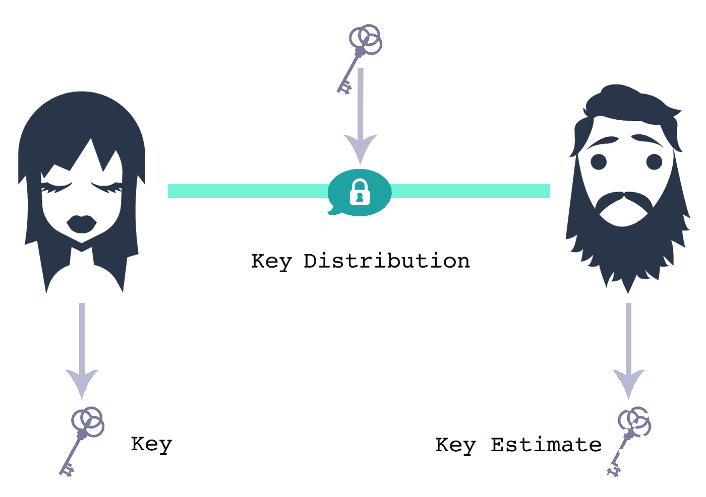
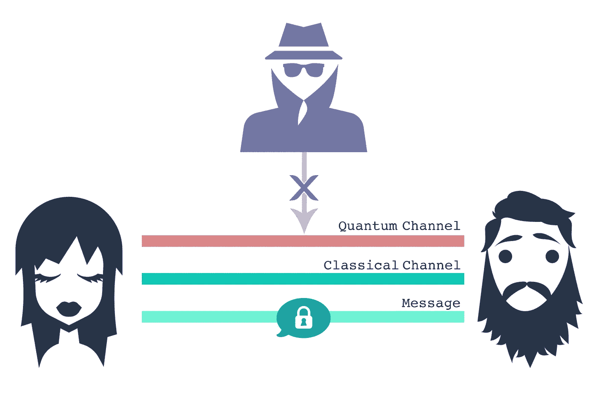
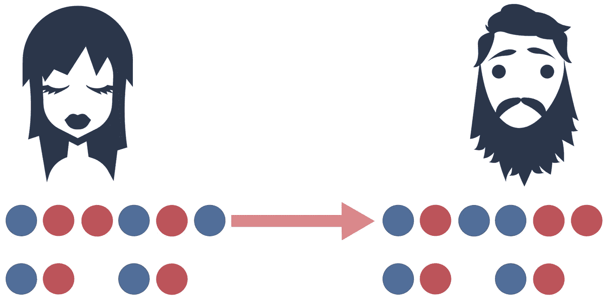
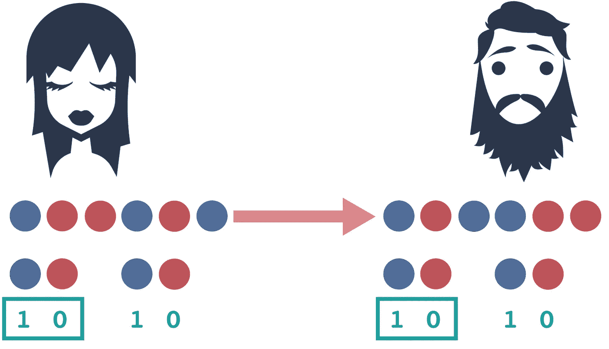
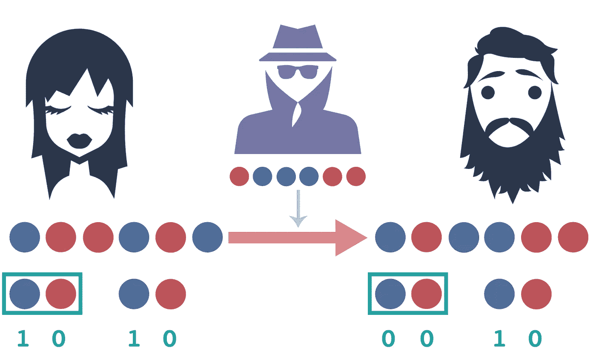

# 面向所有人的量子密钥分发

> 原文：<https://levelup.gitconnected.com/quantum-key-distribution-for-everyone-f08dd5646f33>

这是一个关于爱丽丝和鲍勃如何智胜他们爱管闲事的邻居伊芙的故事。你看，伊芙是那种爱管闲事的人，她想知道每个人的一切。你知道那种人。

伊芙整天无所事事，窃听人们的电话线路，偷听他们的谈话。你猜对了，她最喜欢听的一对是最好的朋友爱丽丝和鲍勃，他们都是物理学家，都喜欢猫和量子比特。

爱丽丝和鲍勃私下交谈的唯一方式是面对面，但是每当有人想分享一个笑话时，就跑到街上的一个朋友家(问:为什么 P 和 X 不住在郊区？答:因为他们不通勤！)是乏味的生意。一天，这两个朋友厌倦了夏娃学习他们的秘密，决定使用加密技术。

爱丽丝可以通过用一次性密钥加密的方式给鲍勃发送一条秘密消息，这是一种牢不可破的加密技术。一次性密钥就是:只使用一次的密钥。

当伊芙得到这条信息时，爱丽丝和鲍勃可能已经丢弃了那把钥匙，并转移到另一把钥匙上了。所以，除非伊芙能接触到密钥，或者能准确预测密钥，否则她无法解密消息。

虽然爱丽丝和鲍勃*可以*使用他们最喜欢的书选择一个秘密密钥，*如何判断你的猫是否正密谋杀死你*【1】*作为密码本，他们决定多一点东西……量子。也就是说，他们实现了由 Bennett 和 Brassard 在 1984 年提出的开创性的 BB84 量子密钥分发协议[2]。*

*“密钥分发”本质上是通信双方获得密钥的过程，同时最小化 Eve 获得密钥知识的风险。换句话说，密钥分发协议的目的是在一端(Alice 的)输出一个密钥，在另一端(Bob 的)输出该密钥的良好估计。*

**

*当量子物理学和量子位测量的原理被用来创建安全的加密密钥时，你就得到了量子密钥分发。*

*量子密钥分发本质上由两部分组成。第一个是量子组件，其中量子原理用于检查窃听者的存在，原始密钥通过量子位测量生成。第二部分是经典部分，通过所谓的“经典后处理”从原始密钥中提取出最终密钥。我们要坚持量子部分，讨论 BB84。*

**

# *BB84 协议的工作原理*

**(如果你已经熟悉量子计算术语，并且想看一个基本的演示，跳到下一节嵌入的 Jupyter 笔记本。)**

*BB84 是所谓的“准备和测量”协议，其中 Alice 准备一系列量子位，将量子位发送给 Bob，然后 Bob 测量它们。两者舍弃了那些测量基础不匹配的。*

*这是什么意思？把测量基础想象成一种操作量子位状态的特殊方式。所以，假设爱丽丝和鲍勃每个人都有两个可以在单个量子位上执行的操作的选择，让我们把它们称为红色(R)和蓝色(B)。*

**

*假设 Alice 有一个 6 个量子位的序列，并根据经典的位序列 100100 准备它们，并使用操作 BRRBRB 的组合。她将序列发送给 Bob，Bob 随机选择操作 BRBBRR 的组合。*

**

*他们公布他们的操作选择，并且只关注那些选择匹配的操作，以保证他们在两端都有相同的信息。我所说的“信息”是指两端的经典位。Alice 有她的原始比特序列 100100，Bob 得到一个比特序列作为他测量的结果。*

*请注意，他们对第三个和第六个量子位的选择不匹配，这意味着它们在这些位置上不一定具有相同的位值。这是因为量子叠加以及测量基础的选择如何影响结果，但我们不会在这里深入讨论。可以说，当他们的选择不匹配时，他们在序列中丢弃该部分。*

**

*然后，Alice 和 Bob 选择一个子集来公布他们的比特信息。在这种情况下，它们决定共享前两位(用方框表示)。如果这两个比特匹配，那么他们可以合理地假设夏娃没有干涉。*

*如果 Eve 因为偷听了他们的谈话而了解了所有关于量子计算的知识，在序列到达 Bob 之前拦截它，并做出她自己的一套操作选择，那么她将会明显地扰乱结果。*

**

*当爱丽丝和鲍勃意识到他们应该匹配的信息并不匹配时，他们知道爱管闲事的夏娃干涉了。他们放弃整个过程，从头开始。他们不断地放弃这个进程，直到 Eve 终于受够了，不再窃听他们的通讯频道。因此，下次 Alice 和 Bob 执行窃听检查时，他们会发现他们的信息匹配，并且他们可以使用序列中没有作为窃听检查公开的第二部分(未装箱的部分)作为密钥！*

**请注意，这是一个极其简化的协议视图。**

# *BB84 协议的工作原理—简单的 Qiskit 演示*

*要了解这些原则是如何发挥作用的，你可以看看这个 Jupyter 笔记本。请注意，这只是该协议的简化演示，但它使用了量子术语。*

*(更多量子计算基础知识，请查看[4]。更多笔记来了！)*

*[1]马修·因曼(The 燕麦片)。如何判断你的猫是不是阴谋杀你？安德鲁斯·麦克米尔出版社，2012 年。*

*[2]贝内特和布拉萨尔。量子密码术:公钥分配和抛硬币。继续。IEEE Int。糖膏剂关于比较。Sys。信号处理(ICCSSP)，第 175 页，1984。*

*[3] [奇巧课本](https://qiskit.org/textbook/ch-gates/introduction.html)*

*[4] GitHub: [量子小猫/量子计算基础](https://github.com/quantum-kittens/quantum-computing-basics)*