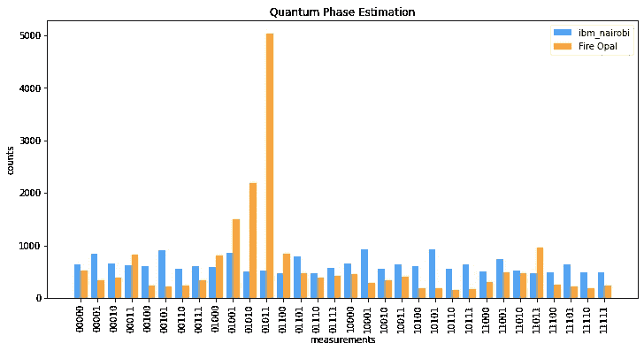
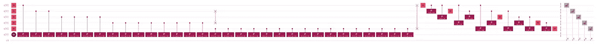

# 量子相位估计！

> 原文：<https://levelup.gitconnected.com/quantum-phase-estimation-d2cc21908744>



量子相位估计(QPE)

# 现在见证 Q-CTRL 的火猫眼石的真正威力。

在最近一篇题为“ [Grover 的火蛋白石算法](https://medium.com/gitconnected/grovers-algorithm-with-fire-opal-59e69c97ef96)”的文章中，我展示了火蛋白石如何能够获得均匀分布——纯粹的噪声——并阐明正确的结果。但是，那只是格罗弗电路，并没有不切实际的名声。因此，我的想法转向了量子相位估计(QPE)，它产生了如此深度的电路，以至于我们通常使用变分量子本征解算器(VQE)来代替。雪上加霜的是，我们通常只是经典地模拟 VQE。但是，只要我们停留在 T1 时间内，[火蛋白石似乎在挑战](https://medium.com/gitconnected/ibm-nairobi-vs-fire-opal-965f95800c6d)上茁壮成长。因此，这就引出了一个问题:火蛋白石能让 QPE 实用吗？

为了找到答案，让我们使用[量子相位估计教程](https://qiskit.org/textbook/ch-algorithms/quantum-phase-estimation.html#3.2-The-Solution-)。



原始电路

## 原始电路

按照教程生成上述电路。我们可以看到，只有六个量子位，我们有相当大的电路深度。除此之外，我们可以看到相当数量的爱错多量子位操作。


传输电路

## 传输电路

transpiled 电路是如此之深，媒体不允许我将原始图像嵌入到本文中！我不得不把它缩小很多，这样你就可以看到上面弯弯曲曲的浅蓝色线条。

```
OPENQASM 2.0;
include "qelib1.inc";
qreg q[6];
creg c[5];
h q[0];
h q[1];
h q[2];
h q[3];
h q[4];
x q[5];
cp(2*pi/3) q[0],q[5];
cp(2*pi/3) q[1],q[5];
cp(2*pi/3) q[1],q[5];
cp(2*pi/3) q[2],q[5];
cp(2*pi/3) q[2],q[5];
cp(2*pi/3) q[2],q[5];
cp(2*pi/3) q[2],q[5];
cp(2*pi/3) q[3],q[5];
cp(2*pi/3) q[3],q[5];
cp(2*pi/3) q[3],q[5];
cp(2*pi/3) q[3],q[5];
cp(2*pi/3) q[3],q[5];
cp(2*pi/3) q[3],q[5];
cp(2*pi/3) q[3],q[5];
cp(2*pi/3) q[3],q[5];
cp(2*pi/3) q[4],q[5];
cp(2*pi/3) q[4],q[5];
cp(2*pi/3) q[4],q[5];
cp(2*pi/3) q[4],q[5];
cp(2*pi/3) q[4],q[5];
cp(2*pi/3) q[4],q[5];
cp(2*pi/3) q[4],q[5];
cp(2*pi/3) q[4],q[5];
cp(2*pi/3) q[4],q[5];
cp(2*pi/3) q[4],q[5];
cp(2*pi/3) q[4],q[5];
cp(2*pi/3) q[4],q[5];
cp(2*pi/3) q[4],q[5];
cp(2*pi/3) q[4],q[5];
cp(2*pi/3) q[4],q[5];
cp(2*pi/3) q[4],q[5];
swap q[0],q[4];
swap q[1],q[3];
h q[0];
cp(-pi/2) q[0],q[1];
h q[1];
cp(-pi/4) q[0],q[2];
cp(-pi/2) q[1],q[2];
h q[2];
cp(-pi/8) q[0],q[3];
cp(-pi/4) q[1],q[3];
cp(-pi/2) q[2],q[3];
h q[3];
cp(-pi/16) q[0],q[4];
cp(-pi/8) q[1],q[4];
cp(-pi/4) q[2],q[4];
cp(-pi/2) q[3],q[4];
h q[4];
barrier q[0],q[1],q[2],q[3],q[4],q[5];
measure q[0] -> c[0];
measure q[1] -> c[1];
measure q[2] -> c[2];
measure q[3] -> c[3];
measure q[4] -> c[4];
```

## 量子汇编语言(QASM)

Fire Opal 接受 OpenQASM 2 作为输入，所以如果你想在家一起玩，而不一定要通过整个教程，这是来自原始电路的 QASM。你可以先把它转存过来，但是一些即将公布的测试表明 Fire Opal 喜欢自己做任何事情。不去尝试帮助它，你可能会得到最好的结果。上面的 transpiled 电路只是为了显示电路有多深。


ibm_nairobi 上的结果，不含和含火蛋白石

## 结果呢

如果你看蓝线，它代表没有使用火蛋白石的结果，我们有纯粹的噪音。这就是我们使用 VQE 的原因，因为对于当前的硬件来说，即使是小规模的 QPE 实现也是不切实际的。但是，如果你看橙色的线，火蛋白石向我们展示了隐藏在所有噪音中的答案。如果你回头看一下教程，你会发现火蛋白石是正确的。我们确实可以用火蛋白石来估计相位。

## 肖尔因子分解算法

我知道你在想什么。我也想过。如果我们能估计相位，我们能分解数字吗？火蛋白石实现了这一戏剧性的突破吗？

> 不幸的是，尽管用 j 进行多项式缩放，模幂电路并不简单，并且是 Shor 算法的瓶颈。[ [来源](https://qiskit.org/textbook/ch-algorithms/shor.html)

可悲的是——或者幸运的是，这取决于你如何看待 Shor 算法所需的受控 U 运算增加了太多的电路深度。我运行了一个 7 量子位版本，产生了 T1 警告，因此，纯粹的噪音。因此，虽然 Fire Opal 似乎已经准备好迎接挑战，但在 Shor 的算法变得实用之前，我们仍然需要我们的量子位在更长的时间内保持相干性，即使是在小规模的情况下。

## 结论

再一次:只要我们停留在 T1 时间内，火蛋白石已经表明它在挑战中茁壮成长。从逻辑上讲，它的下一个挑战应该是一个实际的测试:在一个小的现实世界问题上使用 QPE。

## 火蛋白石系列:

*   [带火蛋白石的格罗弗算法](https://medium.com/gitconnected/grovers-algorithm-with-fire-opal-59e69c97ef96)
*   [带火蛋白石的 Classiq】](https://medium.com/gitconnected/classiq-with-fire-opal-e0259d22fca9)
*   [ibm_nairobi 对 Fire Opal](https://medium.com/@bsiegelwax/ibm-nairobi-vs-fire-opal-965f95800c6d)
*   [ibmq_belem vs. Fire Opal](https://bsiegelwax.medium.com/ibmq-belem-vs-fire-opal-84683f8f91f2)
*   [回顾:Q-CTRL 火蛋白石](https://bsiegelwax.medium.com/review-q-ctrl-fire-opal-6bcc187ae1bd)
*   [量子切片面包](https://bsiegelwax.medium.com/quantum-sliced-bread-bd3dd048f)
*   [我从火蛋白石中学到了什么…](https://bsiegelwax.medium.com/what-i-learned-from-fire-opal-50608282972b)
*   [Q-CTRL 的火猫眼石很牛逼](/fire-opal-is-awesome-c642347ec89d)