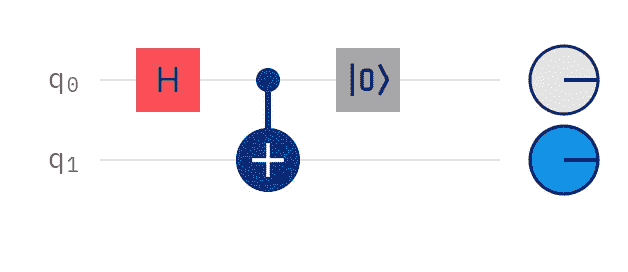

# 量子伪条件逻辑

> 原文：<https://levelup.gitconnected.com/quantum-pseudo-conditional-logic-8134ddff1063>

# 立即使用此 OpenQASM3 功能。

[OpenQASM 2.0 规范](https://arxiv.org/abs/1707.03429)包括复位门、校正子位和条件逻辑等特性。直到最近，所有三个功能都只能与量子计算模拟器一起工作。然后，突然之间，真实设备上的重置门变成了现实。

## 介绍

校正子位通常仅在纠错方面被引用，但它们不限于该角色。例如，如果你被允许早期测量量子位，你可以使用条件语句的结果将[聚类和分类](https://link.medium.com/iraXdJfGccb)结合到一个电路中。您可以消除第二个排队时间，运行一个合并的电路，而不是运行一个电路，传统地处理结果，然后运行第二个电路。

## 你好，重置世界！

在[最近的一篇文章](https://link.medium.com/Lh2dUEaW9bb)中，我写了重置闸门如何开启新的可能性。然而，当时我并没有考虑条件逻辑。直到我告诉别人“我们要等到 OpenQASM3”的时候，我才对那个实验的结果有了更多的思考。

## 简单地

效果很明显。哈达玛给了我们大约 50%的可能性来测量|0 >或|1 >。如果控制量子位坍缩到|1 >，注意这里的条件逻辑，一个 X 被应用到我们的目标量子位。 ***重置门然后破坏纠缠，只留下叠加坍缩和条件逻辑的效果。*** 而第一部分很重要；纠缠会在电路中产生不良影响。

## 结论

这张电路图并没有显示出你现在可以得到的所有可能性。首先，您不局限于使用 Hadamards 控制量子位可以有任何旋转。你也不局限于使用受控非门；在写这篇文章的时候，我已经成功地测试了受控 Z 门。看来重置门的用途出奇的多。

## 承认

一如既往地感谢 IBM Quantum 提供电路图和免费使用出血边缘技术。也感谢 Arnaldo Gouveia 提供了实现这一目标的场景。