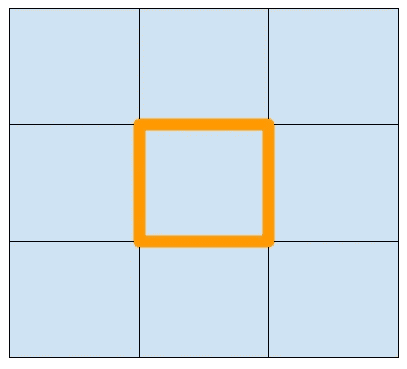
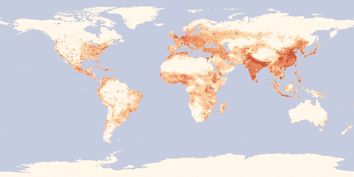
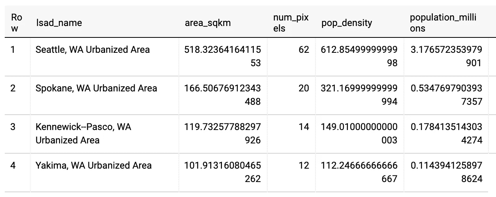
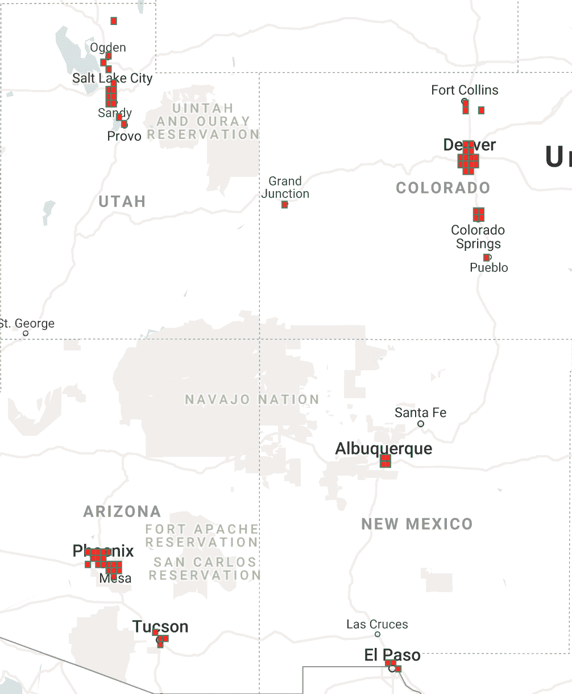
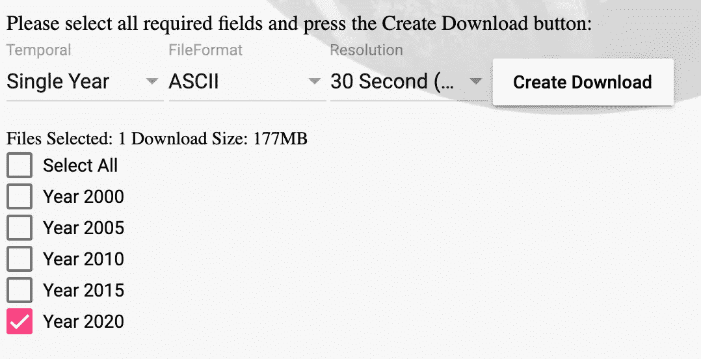
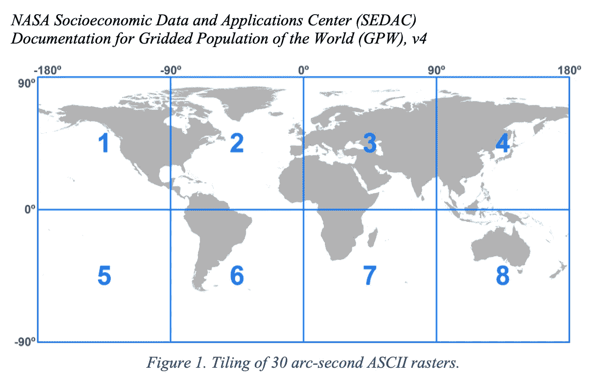
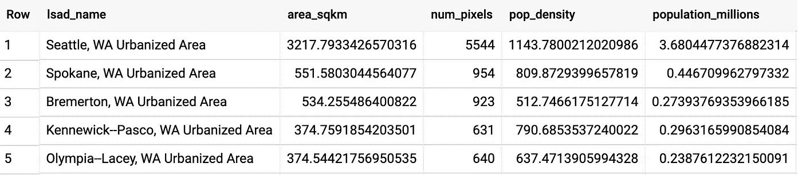
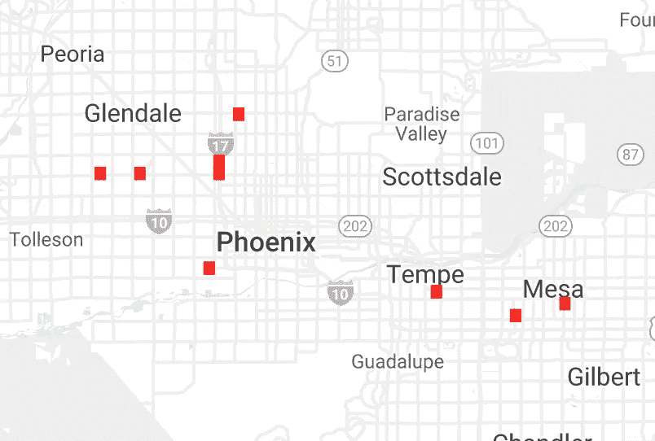

# 以强力方式查询地理栅格数据

> 原文：<https://levelup.gitconnected.com/querying-geographic-raster-data-in-bigquery-the-brute-force-way-1da46799d65f>

## 用多边形表示每个像素！别担心。BigQuery 可以处理。

在过去的一周里，我多次收到这个问题的变体:“我有栅格地理数据。有没有办法转换一下，让我可以用 BigQuery GIS？”原因是人们希望能够使用良好的旧 SQL 将地理空间影像与其他 GIS 数据集连接起来。

一种可能是获取网格化数据，对其进行等值线绘制，并将等值线作为多边形存储在 BigQuery 中。然后，我们可以结合其他地理类型的等高线。这似乎是合理的，但是我从经验中知道绘制一个网格区域的轮廓并不简单。首先，像[行进正方形](https://en.wikipedia.org/wiki/Marching_squares)这样的算法会产生方方正正、不自然的轮廓。试图通过在绘制等值线之前平滑区域来解决这个问题会导致精度损失。其次，有必要在不同的等值面上创建等高线，如果所讨论的场由连续值组成，等高线表示又会有损耗。

有没有更好的办法？

## 在 BigQuery 中将每个像素存储为多边形

好吧，BigQuery 可以处理 Pb 级的数据集，那么如果我们做一些蛮力的事情呢？人们通常回避的事情，因为他们的工具不能处理它？如果我们取网格中的每个像素，并将其存储为多边形，会怎么样？



美国宇航局发布了一个全球[网格人口密度](https://neo.sci.gsfc.nasa.gov/view.php?datasetId=SEDAC_POP)，看起来像这样:



我们可以将人口密度数据下载为 ASCII 文本文件，该文件由 1800 行和 3600 列组成，其中每个像素对应 0.1 度的纬度和经度。

我做的第一件事是[将下载的文本文件转换成 JSON 文件](https://github.com/GoogleCloudPlatform/training-data-analyst/blob/master/blogs/popdensity/convert_to_geo.py)，其中像素由像素边界的多边形表示:

```
 # represent each pixel by a polygon of its corners
       top = ORIGIN_LAT - rowno * LATRES
       bot = ORIGIN_LAT - (rowno+1) * LATRES
       left = ORIGIN_LON + colno * LONRES
       right = ORIGIN_LON + (colno+1) * LONRES
       poly = 'POLYGON(({:.2f} {:.2f}, {:.2f} {:.2f}, {:.2f} {:.2f}, {:.2f} {:.2f}, {:.2f} {:.2f}))'.format(
                 left, top,  # topleft
                 left, bot,  # botleft
                 right, bot, # botright
                 right, top, # topright
                 left, top   # same as first point
              )
       center = 'POINT({:2f} {:2f})'.format( (left+right)/2, (top+bot)/2 )
       pixel = {
          'rowno': rowno,
          'colno': colno,
          'location': center,
          'bounds': poly,
          'population_density': value
       }
```

生成的 JSON 文件有如下几行:

```
{"rowno": 64, "colno": 1451, "location": "POINT(-34.850000 83.550000)", "bounds": "POLYGON((-34.90 83.60, -34.90 83.50, -34.80 83.50, -34.80 83.60, -34.90 83.60))", "population_density": 1.04}
```

请注意，地理类型以 WellKnownText (WKT)形式表示。

现在，我们可以写出模式:

```
[
  {
    "description": "row number",
    "mode": "REQUIRED",
    "name": "rowno",
    "type": "INTEGER"
  },
  {
    "description": "column number",
    "mode": "REQUIRED",
    "name": "colno",
    "type": "INTEGER"
  },
  {
    "description": "centroid location",
    "mode": "REQUIRED",
    "name": "location",
    "type": "GEOGRAPHY"
  },
  {
    "description": "polygon representing boundary of pixel",
    "mode": "REQUIRED",
    "name": "bounds",
    "type": "GEOGRAPHY"
  },
  {
    "description": "population density (persons per sq km)",
    "mode": "REQUIRED",
    "name": "population_density",
    "type": "FLOAT"
  }
]
```

然后，使用以下命令将其加载到 BigQuery 中:

```
bq load --source_format=NEWLINE_DELIMITED_JSON \
        advdata.popdensity popdensity_geo.json.gz schema.json
```

所以，数据被载入，它是一个精确的表示。但是我们真的能有效地查询这个怪物吗？

## 查询性能和数据可视化

让我们看看…下面是一个查询，它将我们的人口密度栅格数据与城市区域的公共数据集相关联，以查找华盛顿州人口最密集的区域:

```
WITH urban_populations AS (
SELECT 
   lsad_name
   , SUM(ST_AREA(bounds)/1000000) AS area_sqkm
   , COUNT(1) AS num_pixels
   , AVG(population_density) AS pop_density
FROM advdata.popdensity, `bigquery-public-data.geo_us_boundaries.urban_areas`
WHERE ST_INTERSECTS(bounds, urban_area_geom) 
      AND STRPOS(lsad_name, ', WA') > 0
GROUP BY lsad_name
)SELECT 
   *, (area_sqkm * pop_density / 1000000) AS population_millions
FROM urban_populations
ORDER BY area_sqkm DESC
LIMIT 10
```

上面的查询相当复杂-它动态地计算像素的面积，并在每个像素多边形和每个城市区域多边形之间进行相交检查-所以如果这有效地工作，我们应该处于良好的状态。

我发现该查询处理 500 MB，仅用 4 秒钟就返回:



这看起来是正确的(2020 年西雅图的地铁人口为 370 万，因此 2000 年的 317 万似乎是合理的)。使用按需定价的 500 MB 查询将花费大约 1/4 美分，因此它也是划算的。

让我们用一点可视化来抽查我们的转换是否正确。让我们转到 [BigQuery GeoViz](https://bigquerygeoviz.appspot.com/) 网站，查询美国 1000 个人口最密集的网格单元:

```
SELECT 
   location, population_density, bounds
FROM advdata.popdensity, 
     `bigquery-public-data`.utility_us.us_border_area
WHERE ST_WITHIN(location, us_border_geom)
ORDER BY population_density DESC
LIMIT 1000
```

我将`bounds`指定为要可视化的几何列，并放大美国西南部的四角区域:



太棒了。

## 100 倍的数据

我们从美国宇航局下载的数据“已经过缩放和重新采样……可能不适合严格的科学使用”。不使用 NASA 发布的大约 10km 分辨率的数据，如果我们使用 1km 分辨率的像素会怎么样？全球人口密度的原始数据可以从哥伦比亚大学获得[，所以我注册并下载了他们 2020 年的最高分辨率数据:](https://sedac.ciesin.columbia.edu/data/set/gpw-v4-population-density-rev11/data-download)



1 公里分辨率数据集是美国宇航局数据集的 100 倍。让我们看看 BigQuery 是否能够应对挑战。

转换数据并将其加载到 BigQuery 中需要更长的时间，因为数据要多 100 倍。数据现在也足够大了，我把它存放在谷歌云存储中，而不是直接从我的笔记本电脑加载到 BigQuery 中。当然，我可以并行化代码来创建 GeoJSON，但我没有这样做。

我做的一个改变是添加了一个列，指定像素来自的图块。然后，我在 BigQuery 表中将 tile 指定为一个[聚类列](https://cloud.google.com/bigquery/docs/clustered-tables):

```
bq load --replace \
   --source_format NEWLINE_DELIMITED_JSON \
   --time_partitioning_type DAY \
   **--clustering_fields tile** \
   advdata.popdensity $GCSFILE schema.json
```

聚类有助于提高查询性能并降低查询成本。这很重要，因为 1 公里的全球网格是 52 GB！按照 SEDAC 数据的设置方式，大多数查询只需处理一两个切片即可完成:



例如，整个华盛顿州都在 1 号分块中，因此我可以在 WHERE 子句中指定这一点:

```
WITH urban_populations AS (
SELECT 
   lsad_name
   , SUM(ST_AREA(bounds)/1000000) AS area_sqkm
   , COUNT(1) AS num_pixels
   , AVG(population_density) AS pop_density
FROM advdata.popdensity, `bigquery-public-data.geo_us_boundaries.urban_areas`
WHERE 
  **tile = 'gpw_v4_population_density_rev11_2020_30_sec_1.asc'**
  AND ST_INTERSECTS(bounds, urban_area_geom)
  AND STRPOS(lsad_name, ', WA') > 0
GROUP BY lsad_name
)SELECT 
   *, (area_sqkm * pop_density / 1000000) AS population_millions
FROM urban_populations
ORDER BY area_sqkm DESC
LIMIT 10
```

以下是华盛顿市区的结果(注意，现在像素数更多了，因为我们使用的是 1 千米分辨率的数据):



对 1km 分辨率数据的查询处理 5.8 GB(成本:2.5c)但仍然只需要 6 秒钟！

这是 GeoViz——注意我必须放大多远才能获得密集的像素:



这完全出乎我的意料。可以在 BigQuery 中强力查询栅格 GIS 数据。又快，又便宜，又准。太神奇了！

**下一步:**

*   完整代码见我的 GitHub repo:[https://GitHub . com/Google cloud platform/training-data-analyst/tree/master/blogs/pop density](https://github.com/GoogleCloudPlatform/training-data-analyst/tree/master/blogs/popdensity)
*   阅读本文，通过利用游程编码，获得将栅格数据加载到 BigQuery 的更有效方法:[https://medium . com/Google-cloud/how-to-query-geographic-raster-data-in-big query-efficient-b 178 B1 a5e 723](https://medium.com/google-cloud/how-to-query-geographic-raster-data-in-bigquery-efficiently-b178b1a5e723)