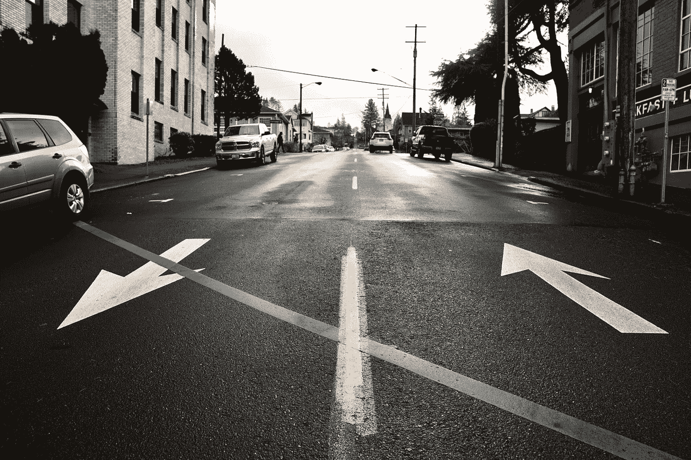

# 软件工程面试官试图回答的问题(第一部分)

> 原文：<https://levelup.gitconnected.com/questions-your-software-engineering-interviewer-tries-to-answer-part-1-ab1466e34fba>

你最近面试过软件工程的工作吗？也许是两年前，或者你现在正在面试。作为一名软件工程师技术和非技术面试的面试官，我可以给你一些关于面试官实际上在候选人身上寻找什么的见解。

克里斯蒂娜@ wocintechchat.com 在 [Unsplash](https://unsplash.com?utm_source=medium&utm_medium=referral) 上的照片

**你愿意和他一起工作吗？**

首先，面试官通常会试图回答你是否是或者曾经是一个混蛋或者一个糟糕的队友。很多时候，公司会拒绝在这个问题上被误判的候选人，因为解雇或解雇难以共事的人需要时间，通常需要几次书面和口头交流。有时，员工在被解雇前必须经历一个月的绩效改进计划(PIP)。这个漫长的过程会耗尽团队的士气，有时会影响团队中最优秀的人才去别处寻找工作或机会。

许多被框定为“告诉我一个……的时候”的情景问题，都是为了深入了解你如何与他人互动，以及你一般如何思考或解决问题。这些问题将考察您如何与工程之外的其他部门(如法律、产品、设计等)合作和互动。).你对工程之外的角色有同理心吗？或者你会搭建桥梁并与其他人合作以达到更高的公司目标吗？

几乎每个公司都有一套自己概述的价值观，比如“做正确的事情”或“以客户为重”，这些价值观有时会出现在公司网站上。面试官会根据这些价值观提问，并试图了解你是如何与这些价值观保持一致的。当不得不在两个选项之间做出选择时，你会“做正确的事”吗？你会“优先考虑客户”吗？

有时，人们会在接受采访时，对他们从未参与的经历撒下弥天大谎。我不建议对面试官隐瞒真相或撒谎，因为这通常很容易发现，但在面试前想清楚这些问题，问问是什么影响了你的某些行为。也许在回顾不同的场景后，你会发现自己有一个你从来不知道的优点或缺点。

劳伦茨·克莱因海德在 [Unsplash](https://unsplash.com?utm_source=medium&utm_medium=referral) 上的照片

需要注意的是，面试是双向的。作为受访者，你有机会了解公司的文化和工作环境。面试官会成为你未来的经理吗？他们管理的团队有多大？他们如何管理团队中的冲突？利用面试过程中的时间获取更多的信息将有助于你避免糟糕的工作情况，并向面试官表明你关心你的工作地点。你甚至会发现更多的信息，让你更想得到那份工作！

照片由[玛丽莎&埃里克](https://unsplash.com/es/@emtm17?utm_source=medium&utm_medium=referral)在 [Unsplash](https://unsplash.com?utm_source=medium&utm_medium=referral) 拍摄

如果你喜欢这篇文章，考虑一下[订阅 Medium](https://medium.com/@ascourter/membership) ！

如果你或你的公司有兴趣找人进行技术面试，请在 Twitter 上给我发消息。如果你喜欢这样的话题，那么你可能也会喜欢我的 Youtube 频道。祝您愉快！

[继续第 2 部分。](https://medium.com/@ascourter/questions-your-software-engineering-interviewer-tries-to-answer-part-2-c7a38795ab0)