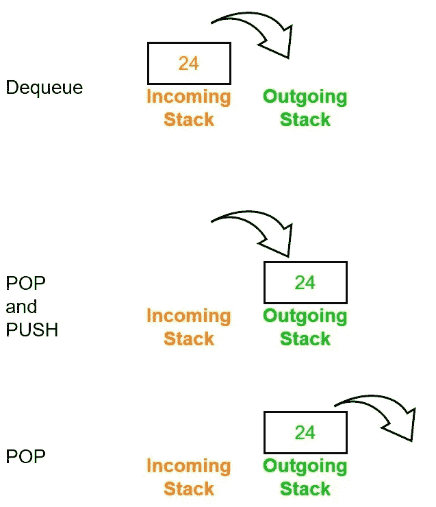
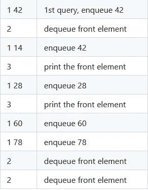
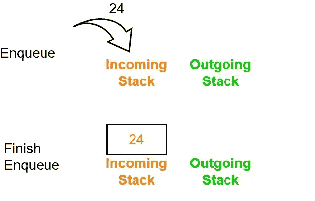
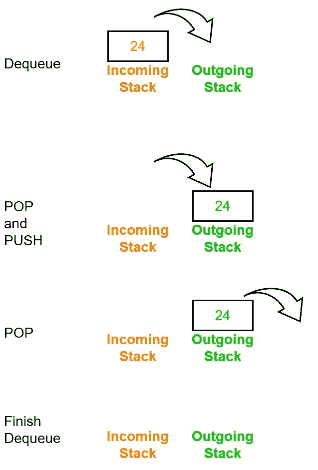
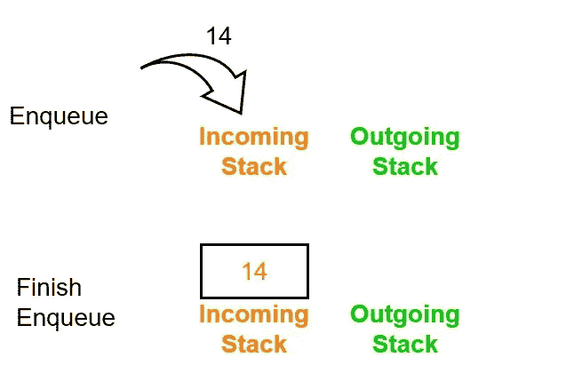
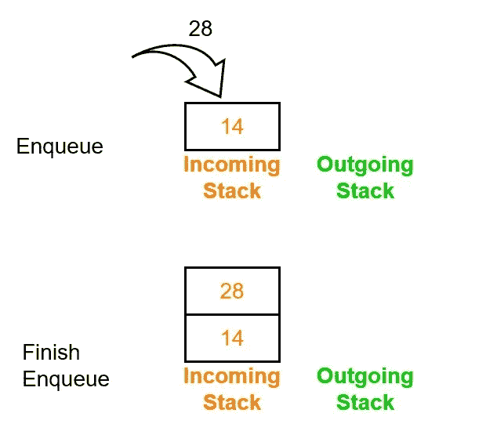
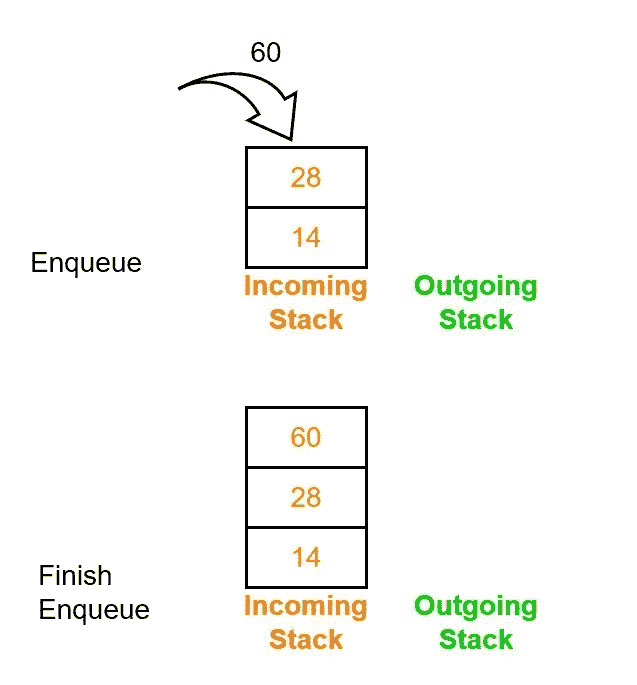
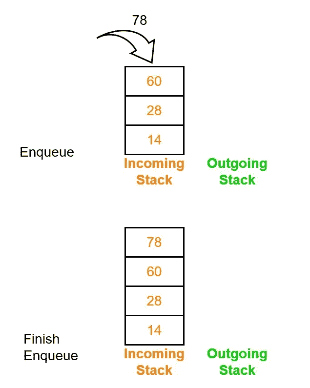
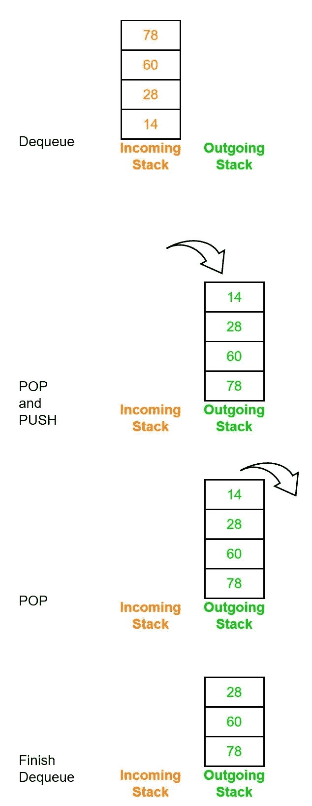
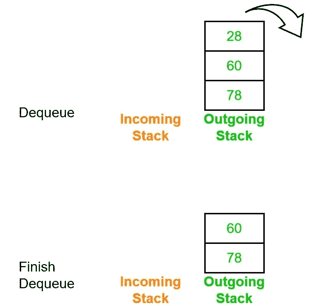

# 使用两个堆栈的队列—Hackerrank

> 原文：<https://levelup.gitconnected.com/queue-using-stacks-leetcode-972bd1d53a9c>



# 问题

使用两个堆栈实现队列。然后处理`q`个查询，其中每个查询都是以下`3`种类型之一:

1.  将元素`x`放入队列的末尾
2.  将队列前面的元素出队
3.  打印队列前面的元素

## 例子

## 投入

第一行包含一个整数 q，表示查询的次数。

`q`后续行的每一行`i`都包含一个查询，其形式如上述问题陈述中所述。所有三个查询都以表示查询`type`的整数开始，但是只有查询`1`后面跟有一个附加的空格分隔值`x`，表示要排队的值。

*   1 →排队
*   2 →出列
*   3 →打印队列的最前面



## 输出

对于每个类型为`3`的查询，在新的一行中打印队列前面的元素的值。

```
14
14
```

## 说明

执行以下一系列操作:

1.  排队 42；队列= {42}
2.  将队列头的值出队，42；队列= {}
3.  排队 14；队列= {14}
4.  打印队列头的值，14；队列= {14}
5.  排队 28；队列= {14，28}
6.  打印队列头的值，14；队列= {14，28}
7.  排队 60；队列= {14，28，60}
8.  排队 78；queue = {14，28，60，78}
9.  将队列头的值出队，14；队列= {28，60，78}
10.  将队列头的值出队，28；队列= {60，78}

# 算法走查

## 排队 42



## 出列



## 排队 14



## 检查传入堆栈的顶部

答案是 14。

## 排队 28



## 检查传入堆栈的底部

答案是 14。

## 排队 60



## 排队 78



## 出列



## 出列



## 检查传出堆栈的顶部

答案是 60。

# 解决办法

```
def Solution(input_arr):
    out_stack, in_stack = [], []

    for _input in input_arr:
        val = list(map(
            int, 
            _input.split()
        ))

        if val[0] == 1:
            in_stack.append(val[1])

        elif val[0] == 2:
            if not out_stack :
                while in_stack:
                    out_stack.append(
                        in_stack.pop()
                    )
            out_stack.pop()

        else:
            print(out_stack[-1] if out_stack else in_stack[0])

Solution([
    "1 42",
    "2",
    "1 14",
    "3",
    "1 28",
    "3",
    "1 60",
    "1 78",
    "2",
    "2"
])
```

## 时间和空间复杂性

*   **时间复杂度** : O(N*N)。给定 N 是数组中元素的数量。可能存在这样一种情况，其中存在所有入队命令，然后当调用出队命令时，可能需要 N 次才能从传入堆栈弹出并推入传出堆栈。
*   **空间复杂度**:如果要考虑栈，那么应该是 O(N+N)。

# 外卖食品

感谢您阅读这个简短的解题问题。如果有人知道更好或更快的时间复杂度来解决这个问题，请随意评论和反馈。和平！✌️