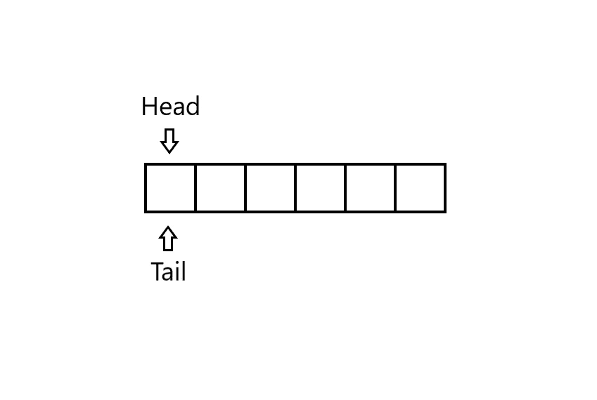
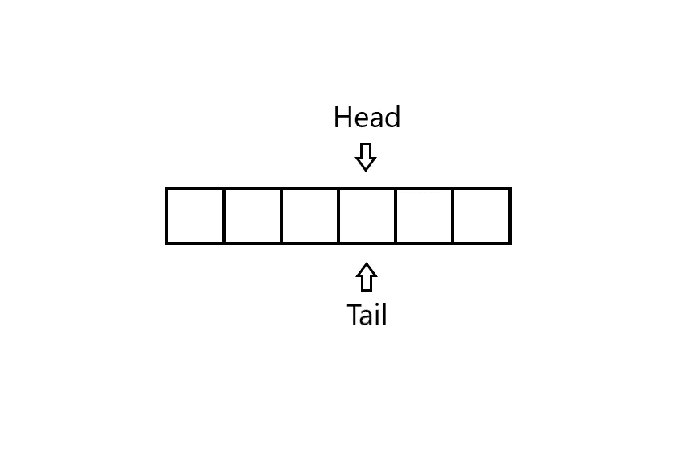
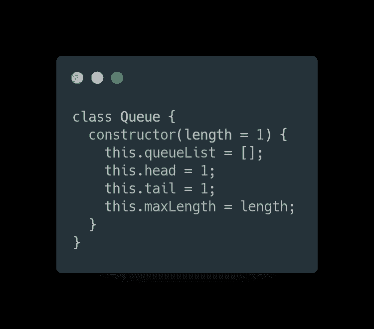
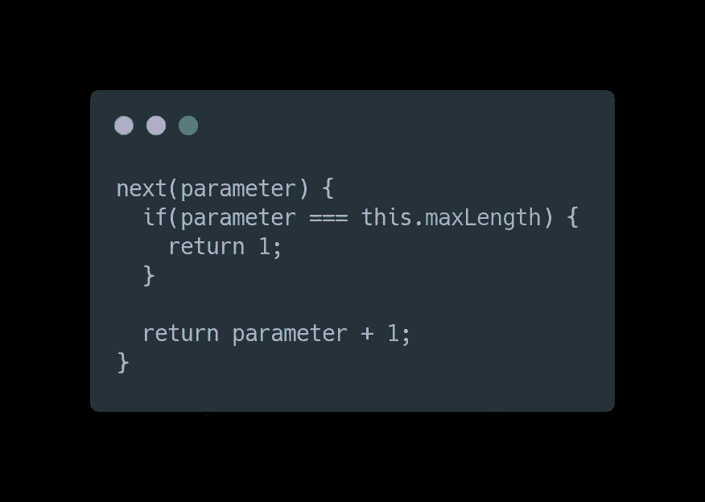
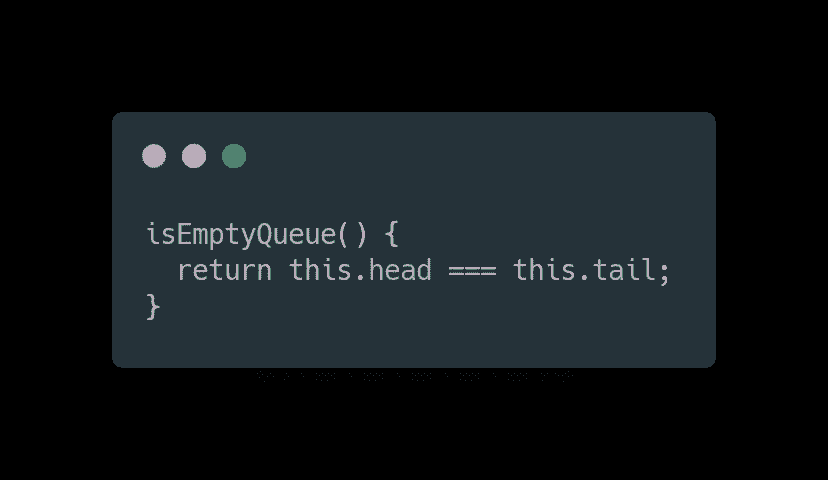
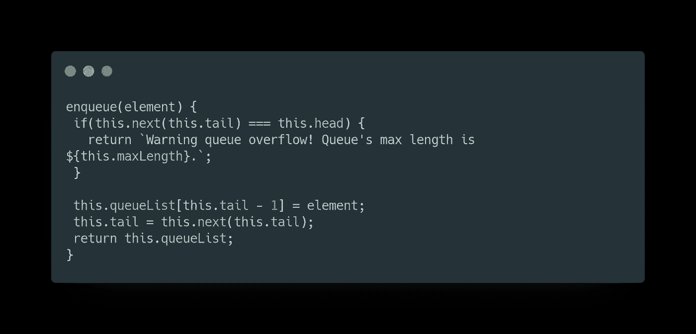
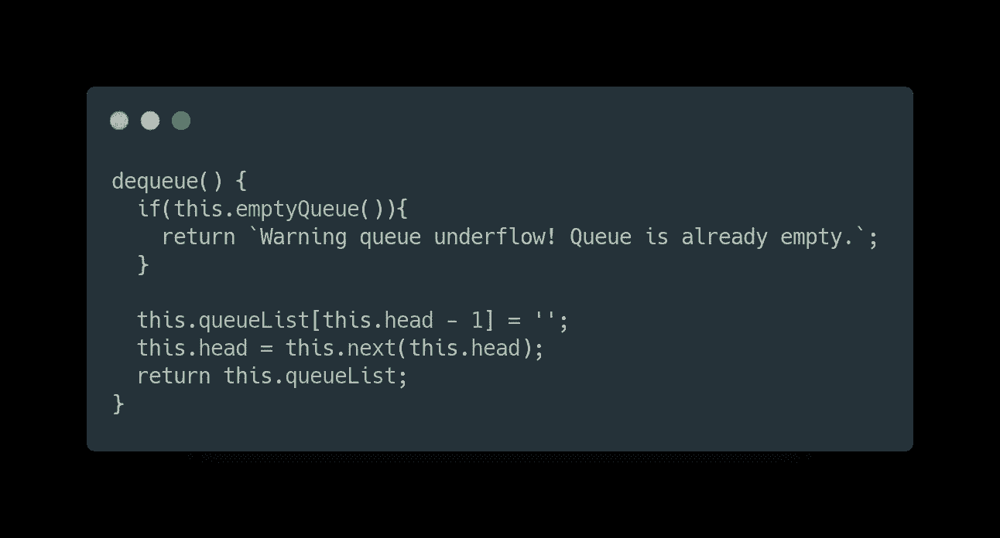

# 队列:JavaScript 中的数据结构

> 原文：<https://levelup.gitconnected.com/queues-data-structures-in-javascript-478d2cede718>

拉里·詹姆斯·贝勒斯在 [Unsplash](https://unsplash.com/s/photos/traffic-jam?utm_source=unsplash&utm_medium=referral&utm_content=creditCopyText) 上的照片

**队列**和**堆栈**一样，是许多原始数据结构中的一种。在本文中，我们将讨论队列及其实际实现，当然还有 JavaScript 语言中的实现。

队列数据结构的行为就像一个普通的真实队列，从它的名字就可以猜到。在队列中，被删除的元素总是在集合中存在时间最长的元素:队列实现了先进先出(FIFO)策略，这与使用堆栈的 LIFO(后进先出)策略不同。

我们调用队列上的插入操作**入队**，调用删除操作
出列**。L** 像堆栈操作**弹出**，**出列**不接受元素参数。

队列的 FIFO 属性使其作为一排等待向收银员付款的顾客进行操作。队列有一个**头**和一个**尾**。当一个元素进入队列时，它会在队列的尾部占据它的位置，就像一个新到达的客户在队列的末尾占据一个位置一样。出列的元素总是在队列的最前面，因为在队列最前面的客户等待的时间最长。

长队

上图中可以看到的一种实现方式是使用一个长度为 **n** 的数组来实现最多有 **n-1** 个元素的**队列。队列有一个属性 **head** ，它索引或者指向它的头。属性 **tail** 索引新到达的元素将被插入队列的下一个位置。**

队列中的元素驻留在位置 ***head、head+1、…、tail-1*** 中，这里我们“回绕”的意思是位置 **1** 以循环顺序紧跟在位置 **n** 之后。

开始时，我们有头=尾= 1。

队列的初始外观

当头=尾时，意味着队列是空的。

空队列情况

当我们试图将一个元素添加到一个已填充的队列(head = tail + 1)时，会发生队列溢出。但是当我们试图从一个空队列(head = tail)中删除一个元素时，就会发生队列下溢。

让我们开始创建队列。

# 初始化队列

首先，您应该初始化您的队列。堆栈逻辑对 4 个主要参数起作用。

用类初始化队列

1.  队列本身(this.queueList)
2.  队列中的起始位置(this.head)
3.  队列中的结束位置(this.tail)
4.  队列的最大可能长度(this.maxLength)(可选)

您也可以将您的**头部**和**尾部**参数分别命名为 **topIndex** 和 **lastIndex** 。当您没有用链表实现队列时，这是一个更好的命名。

队列的主要操作有*空队列检查*、*入队(推送)*和*出列(移位)*操作。

在传递给 main operations 之前，我写了一个小的实用程序方法来检查并返回给定元素位置的下一个位置，当我们没有达到队列中最大项目数量的限制时，否则返回 1(队列中第一个项目的位置)。

队列中的“下一个”方法

# 空队列

空队列操作检查队列是否为空。

队列中的 isEmptyQueue 操作

# 使…入队

入队操作在队列末尾添加一个元素。

首先，我们检查是否达到了队列的大小限制。如果没有，那么我们在队列数组的末尾添加新元素，更新尾部索引(最后一项的位置)并返回更新后的队列数组。否则我们会显示错误信息。

队列中的入队(推送)操作

# 出列

出列操作删除队列的第一个元素。

这里，首先，我们检查我们的队列中是否有要删除的项目。如果是，那么我们将一个空字符串赋给队列数组的第一个元素，更新头部索引并返回更新后的队列数组。否则我们会显示错误信息。

队列中的出列(移位)操作

注意，通过这样做，我们就像用现有值向右移动我们的队列**。我们的**队列列表**数组的长度保持不变。只是起点变了。**

这就是我们如何用数组实现队列，但是你可以用链表数据结构更优雅地实现它。

我在这个队列中添加了更多的实用方法，您可以通过导航[这里的](https://github.com/danomov/DataStructuresAndAlgorithmImplementations/blob/master/Queue/queue.js)来观察。

感谢您的阅读，我们很快会再见的🤟

> *我讲述的其他数据结构主题:*
> 
> [堆栈](/stacks-data-structures-in-javascript-106ecc0e147e)
> 
> [*单链表*](https://link.medium.com/hu38fRRvAbb)
> 
> [*LRU 缓存*](https://link.medium.com/z8tBxNIvAbb)