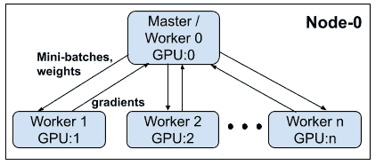
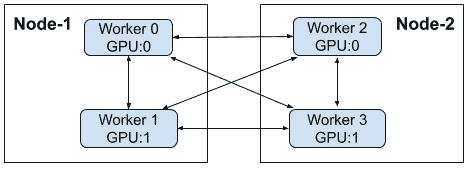

# PyTorch 分布式培训快速入门

> 原文：<https://levelup.gitconnected.com/quick-primer-on-distributed-training-with-pytorch-ad362d8aa032>

由 Unsplash 网站上的 Joey Kyber

# **简介**

深度学习算法是众所周知的数据饥渴。对于一个相当大的模型来说，大型数据集需要几天甚至几周的时间才能收敛到一个好的解决方案，这是很常见的。它们的功能和灵活性是有代价的，因为通常有几个超参数旋钮——网络结构、学习速率以及许多其他模型特性——需要仔细调整。由于它们的高度经验性，就像大多数学习算法一样，这种设置可以很容易地组合爆炸，导致在有限或共享资源上进行数百或数千次长期运行的实验。

运行大量的实验无疑增加了偶然发现一个优秀模型的机会，但要使它切实可行，还需要更快更可扩展的训练。深度神经网络通常使用反向传播算法进行训练，该算法本质上是经典的迭代梯度下降(GD)函数优化方法，通常使用[操作风格](https://ruder.io/optimizing-gradient-descent/index.html#gradientdescentoptimizationalgorithms)进行丰富，使其在处理更大的数据集和复杂的损失表面时更加鲁棒和高效。

在优化训练时间时，有几个方面需要考虑，它们围绕着高效的数据处理、计算和通信。训练通常以批处理模式进行——在单次迭代中一次处理一批训练数据，以进行模型更新(因此，也称为批处理随机梯度下降或批处理 SGD)。在这种情况下，许多模型计算可以表示为矩阵代数运算，这可以利用 GPU 设备的大规模并行化能力。虽然这种功能比基于 CPU 的执行有显著的提高，但 GPU 卡上的可用内存会限制批处理的大小。显而易见的下一步，一个相当容易实现的结果，是利用多个 GPU，并简单地在数据维度上分配计算。当然，只有在处理速度没有被在多个 GPU 上管理训练所增加的通信开销抵消的情况下，这才有意义。

分布式深度学习的实现很棘手，有许多陷阱，可能会导致难以检测的细微错误。幸运的是，大多数流行的框架都提供了经过良好测试和基准测试的工具和实用程序来扩展培训工作。在这篇文章中，我将讨论由 [PyTorch](https://pytorch.org/) 提供的关键策略，特别关注数据并行性(最流行的方法)，即数据集在多个 worker/GPU 上进行分区和处理。一个假设是模型足够小，可以放在单个 GPU 的内存中。这里不讨论的其他策略还有[模型并行](https://pytorch.org/tutorials/intermediate/model_parallel_tutorial.html)和[梯度累加](https://medium.com/huggingface/training-larger-batches-practical-tips-on-1-gpu-multi-gpu-distributed-setups-ec88c3e51255)，更适合于特别大的模型，或者甚至几个训练数据样本都装不进 GPU 内存的时候。

这篇文章的源代码可以在[https://github.com/hgrover/pytorchdistr.git](https://github.com/hgrover/pytorchdistr.git)获得。

P yTorch 提供了两种并行化训练作业的主要方法——**数据并行**和**分布式数据并行**。每种方法都包含一个包装器，它:a)封装所有较低层次的通信细节，以协调和同步分布式培训；以及 b)为最终用户展示了一个干净的 API。除非对代码进行一些小的修改，否则使用包装模型的体验与使用本地的非分布式模型几乎是一样的。

## **数据并行**

[DataParallel (DP)](https://pytorch.org/tutorials/beginner/blitz/data_parallel_tutorial.html) 是更简单、更直接的方法，只需要最少的努力和对训练代码的修改。它的工作方式是将一个训练数据批次分割成更小的、大小相似的子批次，子批次的数量与可用的 GPU 数量相等。然后，这些子批次在各自的 GPU 上并行处理。

一个 GPU 充当主 GPU(默认为 GPU:0)，它协调整个流程。在 SGD 的每次迭代中，主:a)在每个可用的 GPU 上复制并广播模型权重( ***复制*** 步骤)；b)拆分训练数据批次，并将作业命令发送到各个 GPU(***分散*** 步骤)。这使得每个 GPU 能够处理其自己的数据子批次，以计算关于模型参数的局部损失和梯度( ***parallel_apply*** 步骤)。一旦完成，主 GPU: c)从每个 GPU 收集局部梯度( ***收集*** 步骤)；d)、聚集梯度并执行模型更新( ***更新*** 步骤)。因此，在每次迭代开始时，所有 GPU 都被提供完全相同的模型参数。

**DataParallel:** 单节点，多 GPU 设置；作为具有多个线程的单个进程来实现，以管理工作线程

所有这些步骤都是由 PyTorch 库执行的。作为一个最终用户，对代码的唯一修改是将模型对象包装在 DataParallel 中，如下面的要点所示。

虽然当试图从多个可用的 GPU 中挤出性能时，DP 是有效的第一线攻击，但至少有一些限制:a)它遵循单进程、多线程设计，因此仅在单个节点上工作；b)由于在主设备和工作设备之间的每次迭代中的数据传输，它需要大量的通信开销；c)主 GPU 显然有更多的职责，因此通常比混合中的其他 GPU 工作更努力(不对称的工作负载)。事实上，在更新步骤中，主设备独自工作来更新模型参数，而集群中的其他设备则等待更新，因此未得到充分利用。

## **分布式数据并行**

与 DP 一样，[distributed data parallel(DDP)](https://pytorch.org/tutorials/intermediate/ddp_tutorial.html?highlight=distributeddataparallel)也在数据维度上实现了并行化。它解决了 DP 的一些基本限制；特别是，DDP 在单节点和多节点环境中都可以工作。DDP 的实现涉及多个 python 流程，这些流程必须在代码中的适当位置进行协调和同步。这在工作人员之间提供了更大的工作量平衡，并确保了数据传输带来的更低的通信开销。由于这些优点，DDP 也是单节点环境中的推荐方法。

**分布式数据并行:**多节点、多 GPU 设置；每个 worker 都由自己的 python 进程管理。

与 DP 的一个关键区别是，在更新模型参数时，它遵循不同的协议。与 DP 不同，它不是在主节点上收集本地梯度以执行聚合和模型更新，然后将这些更新广播回工作器，而是使用高效的 [all-reduce 操作](https://towardsdatascience.com/visual-intuition-on-ring-allreduce-for-distributed-deep-learning-d1f34b4911da)在所有 GPU 上聚合梯度，该操作使平均梯度对所有 GPU 工作器可用，然后每个 GPU 工作器可以并行更新其自己的模型副本。

在幕后，PyTorch 在代码中的关键点执行同步，因此不会遗漏任何 GPU。结果，并且因为模型在训练开始之前被预先复制在每个 GPU 上，所以在每次迭代结束时，所有模型副本都具有相同的更新参数。

根据 [PyTorch docs](https://pytorch.org/docs/stable/nn.html#torch.nn.parallel.DistributedDataParallel) 的说法，DDP 最有效的方法是分配一个进程来管理每个 GPU 设备。在培训开始之前，必须启动并初始化所有流程，以便进行通信和同步。有多种[方法可以实现这个目标](https://pytorch.org/tutorials/intermediate/dist_tuto.html#initialization-methods)——共享文件系统、环境变量和 TCP。在本文中，我使用了由 PyTorch 提供的[启动器实用程序](https://pytorch.org/docs/stable/distributed.html#launch-utility)填充的环境变量。这为所有进程的协同操作设置了所需的环境，包括一个用于所有进程协调的*主地址*和*端口*，表示同步时要等待的进程总数的*世界大小*，以及每个进程的*等级*(每个节点上的*本地*和跨节点的*全局*)。下面的要点显示了单节点和多节点启动的关键步骤和相关命令。

启动后，每个进程的第一步是调用阻塞的 *init_process_group* 函数，使进程之间建立通信，并建立初始化(此处为 env vars)和后端选择的过程(有[多个可用的](https://pytorch.org/tutorials/intermediate/dist_tuto.html#communication-backends) — GLOO、NCCL、MPI。在这个例子中，我使用了 NCCL)。

一旦初始化了所有进程，下一步就是将每个进程映射到它将控制的 GPU 设备。这必须在客户端代码级别进行管理。*本地等级*(由上述启动器工具设置)指特定节点上进程的等级，从 0 到该特定节点上启动的进程数量。然后，这可以用于索引由该特定进程管理的 GPU 设备。

这也确保了每个进程/ GPU，结合一个[分布式数据采样器对象](https://pytorch.org/docs/stable/data.html#torch.utils.data.distributed.DistributedSampler)，处理它们自己的数据子集。每个节点上的每个 GPU 并行处理自己的一批训练数据。

如前所述，一旦执行了上述初始化和设置步骤，DDP 包装器就会编排训练。从最终用户的角度来看，这是一个展开模型的替代。请注意，由于已经使用*本地等级*为每个进程适当地设置了 GPU 设备，因此通过 *cuda()* 方法调用，每个工人的模型副本会自动移动到正确的设备。类似地，device_ids 和 output_device 在 DDP 包装构造函数调用中被正确地实例化。

这是利用 PyTorch 的本地分布式训练包装器所需要做的全部工作。

在多个 GPU 设备上扩展 SGD 的并行实现策略暴露了训练效率和模型准确性之间的[权衡](https://arxiv.org/pdf/1709.05011.pdf)，尤其是在使用大量设备时。这是一个活跃的研究领域，已经提出了各种方法和技巧来根据经验管理这种权衡。虽然本文中讨论的 PyTorch 特性的基本用法足以满足许多实际用例以及适度的扩展，但是 PyTorch 还公开了[低级通信原语](https://arxiv.org/pdf/1711.00705.pdf)来实现更高级或新颖的策略。

此外，最近的发展——如 [**RAPIDS 数据科学平台**](https://rapids.ai/)**——**可能会进一步显著提升，因为它直接解决了使用大型实例集群时通信开销的核心问题，否则这可能会显著降低分布式培训可实现的收益。在后续的文章中会有更多的介绍。

**附加说明**

出于本文演示的目的，我使用并改编了 PyTorch 文档 **中一个[示例的大部分代码和数据集。](https://pytorch.org/tutorials/beginner/aws_distributed_training_tutorial.html)**

所有测试都是在高性能计算(HPC)环境中完成的，其中我们的计算节点配备了 4 或 8 个 NVIDIA Tesla V100 GPU 卡，每个卡都有 16GB 的设备上内存。每个节点还可以访问可以从中加载数据集的共享卷。在 RedHat Enterprise v7.4 平台上，使用 PyTorch v1.3.1、cuda toolkit v10.1 和 cuDNN v7.6 运行测试。在单个节点(最多 8 个 GPU)上成功执行了 DP 脚本，在多个节点(最多 4 个，每个节点 4 个 GPU)上成功执行了 DDP 脚本。python 3 . 6 . 5 版用于所有测试。