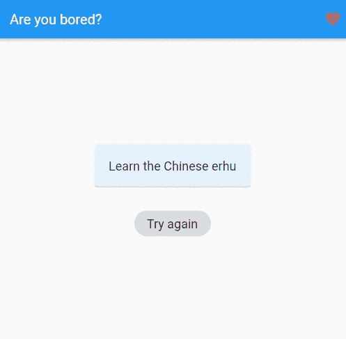

# 使用 Flutter 和 REST API 进行快速原型开发

> 原文：<https://levelup.gitconnected.com/quick-prototyping-with-flutter-and-a-rest-api-2c4e7d9ea66a>

## 概念的完美而简单的证明

## 在本文中，我将向您展示如何构建一个快速的演示应用程序来查询 web 服务并显示结果。

[200 度 Pixabay.com](https://pixabay.com/vectors/programmer-programming-code-work-1653351/)

开发简单的概念证明是当今世界软件开发人员的必备能力。Flutter 是完成这类任务的完美工具，因为它允许您在保持 UI 简单的同时专注于代码。让我们马上开始吧！

## 密码

这是演示应用程序的完整代码，包括查询逻辑、用户界面和数据转换。用这么多行代码完成这么多事情，真是太酷了😎。

我使用了一个`FutureBuilder`，因为它可以很好地处理不同的状态。我们要考虑三种状态:

*   查询正在运行
*   查询已成功完成
*   查询已完成，但有错误

使用异步方法`_httpGet()`为`future`参数赋值，以获取结果。它使用了 [http](https://pub.dev/packages/http) 包和公开可用的 [Bored API](https://www.boredapi.com/) 。在`builder`参数中，我们可以创建根据状态显示的实际 UI。为了区分状态，我们可以使用`[ConnectionState](https://api.flutter.dev/flutter/widgets/ConnectionState.html)`枚举和`[AsyncSnapshot](https://api.flutter.dev/flutter/widgets/AsyncSnapshot-class.html)`类。

我已经发表了一篇文章，详细介绍了如何使用 REST APIs。

 [## 如何用 Flutter 发出 HTTP 请求并解析 JSON 结果数据

### 这篇短文展示了如何从 Flutter 应用程序中执行 HTTP 请求。我们来看看最常见的…

levelup.gitconnected.com](/how-to-make-http-requests-with-flutter-and-parse-json-result-data-ae1f5794f53) 

## 用户界面

App 截图

UI 相当简单，因为这并不是大部分时间快速演示的主要焦点。我们有一个带`Scaffold`的`StatefulWidget`，其中包含一个带 API 调用结果的`Card`小部件，还有一个带`onPressed`处理程序的`ActionChip`，用于再次调用服务。处理程序只是调用触发页面重建的`setState`函数。

当页面重新构建后，`FutureBuilder`再次运行，并提供一个新的结果显示在屏幕中央。

## 结论

我提供了一个 Flutter 应用程序的简单示例，它查询 REST API 并显示结果。对于有经验的开发人员来说，这个任务不会超过半个小时。在我看来，Flutter 是快速原型的理想选择。

你可以在 [GitHub](https://github.com/xeladu/flutter_bored_api) 上找到源代码。

如果你喜欢这篇文章，我会很高兴得到掌声👏(你知道可以拍几次吗？😎)另外，如果你还没有跟上我，我也很感激。

🌲 [linktr.ee](https://linktr.ee/xeladu) |☕ [咖啡](https://www.buymeacoffee.com/xeladu)🎁[捐赠](https://www.paypal.com/donate/?hosted_button_id=JPWK39GGPAAFQ) |💻GitHub |🔔[订阅](https://xeladu.medium.com/subscribe)

顺便说一句:如果你还没有 Medium 会员，我推荐你使用[│我的推荐链接◀](https://medium.com/@xeladu/membership) ，因为它会让你访问 Medium 上的所有内容，并以一小部分费用支持我，而不会为你带来任何额外费用。谢谢大家！✨

## 相关故事

 [## Flutter app 从零开始第 1 部分—规划的功能、应用设计、应用框架

### 本文涵盖了计划中的应用程序特性、环境设置以及一个新的 Flutter 应用程序的第一个应用程序框架。

levelup.gitconnected.com](/flutter-app-from-scratch-part-1-planned-features-app-design-app-skeleton-c87f2c21f47a)  [## 颤振单元测试基础

### 我们涵盖了一个基本的例子，单元测试在一个颤振项目中会是什么样子。包括解释的代码示例。

xeladu.medium.com](https://xeladu.medium.com/flutter-unit-test-basics-a8c6815f7712)  [## 如何在你的 Flutter 应用中安装包

### 这篇短文展示了如何将包添加到一个 Flutter 应用程序中，这样你就可以使用现有的代码并加速…

xeladu.medium.com](https://xeladu.medium.com/how-to-install-packages-in-your-flutter-app-e7f7e62711ee)