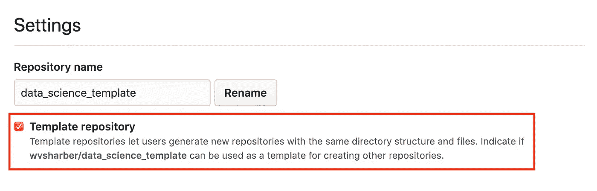
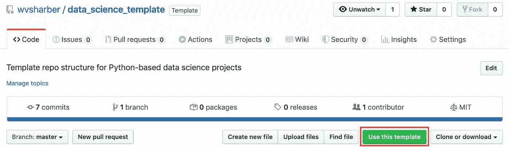

# 快速设置数据科学 GitHub 存储库

> 原文：<https://levelup.gitconnected.com/quick-setup-of-data-science-github-repositories-647b111b3c5f>

## 使用 GitHub 的模板功能高效启动您的下一个数据科学项目

在过去的一周里，我一直在查看我的一些旧项目，并思考如何改进它们。我注意到的一件事是缺乏一致的存储库结构。现在，我不认为这本身是一个大问题，只要命名策略和结构容易理解。我可以想象有必要偏离一刀切的存储库的情况，但是，我决定构建一个标准化的存储库，可以用来快速设置我未来的项目。在这篇文章中，我将讨论我是如何使用 GitHub 的模板功能创建模板库的，以及如何使用它。你可以在这里找到我的[模板库，以及自己设置的说明！](https://github.com/wvsharber/data_science_template)

**GitHub 模板**

如果你不知道，你可以设置你的任何 GitHub 库(包括那些从其他人那里得到的！)做为以后使用的模板。这个过程非常简单，最终结果是您的模板库的精确副本，可以为您的新项目定制！

要设置您的模板存储库，首先在浏览器中导航到您想要用作模板的 GitHub 存储库页面，选择“设置”选项卡，然后单击“模板存储库”框。



单击该框后，您可以导航回存储库的主页，这时会出现一个“使用此模板”按钮。如果您单击该按钮，它将把您带到一个页面，您可以在那里命名并创建您的新存储库！超级容易！



考虑到我想要一个空白的画布来轻松地开始新的数据科学项目，我开始了一个新的存储库，除了最基本的东西之外，什么也没有，这将在下一节中讨论。

**基于 Python 的数据科学项目的存储库结构**

许多数据科学项目从头到尾都遵循类似的轨迹——数据收集、清理、操作、探索性数据分析、建模，然后是结果呈现。这一过程中的每一步都从一些实验性代码开始，如果您使用 Python，这些代码通常是在 Jupyter 笔记本中开发的，稍后会最终形成一个. py 文件，以便简化使用或部署。通常实验性的笔记本保存在存储库中的一个`notebooks/`目录中，所有最终的代码保存在一个`src/`目录中。还应该有一个`data/`目录来保存你的原始和处理过的数据文件。根据项目的不同，可以使用额外的目录来保存报告，如备忘录或幻灯片、图表或参考资料，如数据字典。

除了目录结构之外，还有一些必要的帮助文件，可以让您和任何想用代码重现结果的人都可以很好地工作。其中包括一个环境文件，该文件列出了执行存储库中所有代码所需的 Python 库、解释性自述文件、一个. gitignore 文件以避免在 git 提交期间上传不需要的文件，以及一个 setup.py 文件，该文件有助于将代码作为 Python 包安装在`src/`目录中。最后，许可证可以帮助保护您的作品，或者明确声明您的作品是开源的，可以包含在您的库中(我发现[这篇文章](https://towardsdatascience.com/a-data-scientists-guide-to-open-source-licensing-c70d5fe42079)对于确定我想要使用哪个许可证很有用)。

我的模板库看起来像这样:

```
|
+-- data/
|   +-- raw/
|   +-- processed/
+-- notebooks/
|   +-- exploratory/
|   +-- final/
+-- src/
|   +-- __init__.py
+-- LICENSE
+-- README.md
+-- environment.yml
+-- setup.py
```

我通常会在每个子目录中包含一个自述文件，以解释每个目录的用途，同时确保它们出现在 GitHub 存储库中，即使它们是空的。

**使用** `**src/**` **并设置 Python 环境**

建立新存储库最棘手的部分可能是安装 Python 环境和 src 代码。在我的模板库的主自述文件中，我已经包含了设置它们的说明，但是我也想在这里简单地讨论一下。

我将这两者结合在同一个步骤中，确保 conda 将在安装环境其余部分的同时安装您的`src/`代码。为了做到这一点，我包含了一个“starter”环境，该环境只包含足够 conda 安装 Python 和 Jupyter 的包，以及一行 pip 安装任何代码的代码。您的`src/`目录中的 py 文件。一开始会是空的，但是一旦你添加了你自己的。py 文件(例如 utilities.py)您可以通过运行导入语句来使用它们，例如`import src.utilities`。设置好 starter 环境后，您可以用自己的定制环境替换它，并根据需要继续添加新的依赖项。这掩盖了很多细节，但是你可以在我的 [GitHub 库](https://github.com/wvsharber/data_science_template)中找到说明。

我希望这篇文章对为基于 Python 的数据科学项目建立自己的模板库有用。你喜欢如何组织你的仓库？你认为我遗漏了什么重要的东西，还是我遗漏了一个最佳实践方法？欢迎在评论中告诉我！