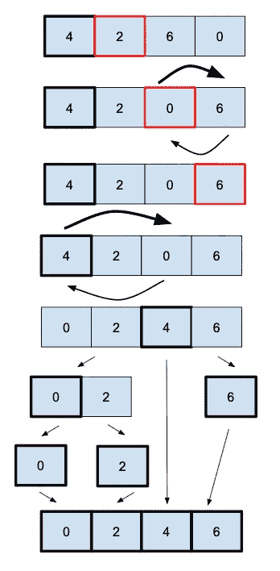

# 快速排序

> 原文：<https://levelup.gitconnected.com/quick-sort-217bf062ca65>

## 快速排序是一种就地和“分治”算法。

它的工作方式是**将数组分成两个子部分**，一个比**小，一个比**大，并在这两个部分上递归调用函数。有许多不同版本的快速排序取决于你如何**选择枢纽(第一个元素，最后一个，在中间，…)。**

这里我们需要三个函数。

第一个只是一个**帮助器，用整个数组范围调用第二个方法进行排序。**

第二个将接收 left 和 right，给出在数组内排序的**范围(就地排序)；**如果范围有效，我们将**从第三个方法(分区**)中获取轴心位置，并在两个部分(位置之前和之后)上递归调用相同的方法。

现在，所有的**魔法都发生在第三种方法**中，“partition”我们首先选择范围内的第一个元素作为支点。我们遍历该范围，并且将低于 pivot 的每个元素与 pivot 索引处的元素进行交换，然后我们递增 pivot 索引。最后，我们将第一个元素(pivot)与 pivot 索引处的元素(每次我们发现一个较低的元素时都会递增的元素)交换，并返回 pivot 索引。

**快速排序的最佳平均时间复杂度为 O(n log(n))，最差为 O(n)；**当你不能使用额外的内存时，它工作得很好**(相比之下[合并排序](https://medium.com/@jbstevenard/merge-sort-656f8ee59d83)，它需要一个额外的数组)并且**对于小数组比大数组更好。****

[< <归并排序](https://medium.com/@jbstevenard/merge-sort-656f8ee59d83) | [书](/@jbstevenard/learn-data-structures-and-algorithms-with-swift-5-6-d9f36a4027dd) | [堆排序> >](https://medium.com/@jbstevenard/heap-sort-6ee5206f0ba5)

 [## 通过我的推荐链接加入 Medium—JB stevenard

### 阅读 jb stevenard 的每一个故事(以及媒体上成千上万的其他作家)。你的会员费直接支持 jb…

medium.com](https://medium.com/@jbstevenard/membership)