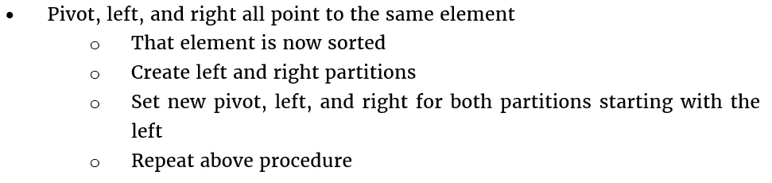
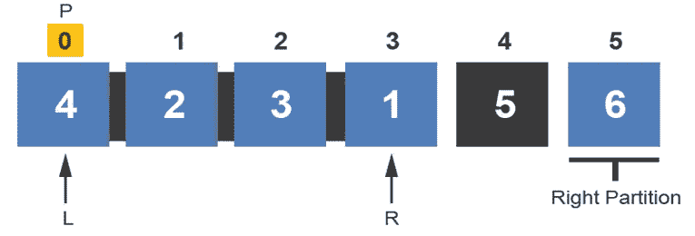
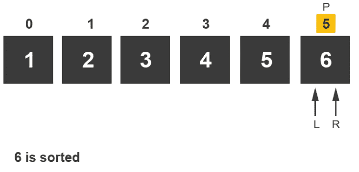
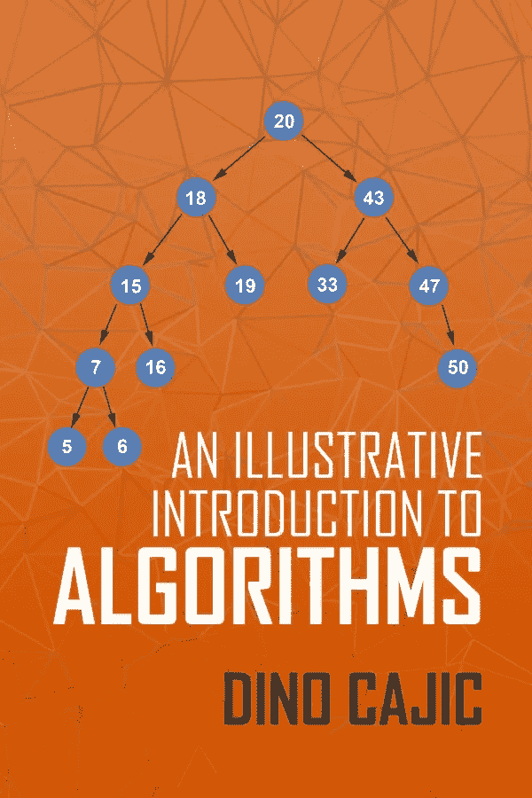

# 快速排序算法直观解释

> 原文：<https://levelup.gitconnected.com/quick-sort-algorithm-visually-explained-bc691dba7662>

像大多数排序算法一样，快速排序算法按升序对项目数组进行排序。快速排序有多种方法。本文将重点介绍一种方法。这种方法选择数组最左边的元素作为支点。然后将它与数组中的最后一个元素进行比较。如果枢纽小于它所比较的元素，该元素将成为枢纽，左侧将递增。如果透视大于与之比较的元素，则该元素的索引值将递增。这种情况一直持续到左侧和右侧相遇。一旦这些值相遇，它们相遇的元素就被排序了。创建了左右分区，并生成了新的轴心点。

此版本的快速排序算法将遵循以下规则:

这只是快速排序算法的一种方法。我们现在来看一个例子。

索引 0 处的左侧元素被设置为透视值，右侧元素被设置为数组中的最后一个元素。透视值与右侧元素进行比较。由于右值小于主值，右值与主值交换，右值成为新的主值；左索引递增。

接下来，将新的透视值与索引 1 处的值进行比较。由于 pivot 大于 left 值，因此 pivot 保持在当前位置，left 元素递增。

快速排序算法将 pivot 与 left 进行比较。因为轴值不大于左值，所以轴值与左值交换。索引 2 成为新的枢纽，右索引递减。

接下来，将索引 2 处的新透视与索引 4 处的值进行比较。因为 5 不小于 3，所以交换这些值，并且增加左索引值。

快速排序算法将透视值与左侧值进行比较。由于 pivot 值大于 left 值，因此左索引递增。

现在，左右箭头都指向同一个元素。算法知道这个值是排序的。创建左和右分区。

算法开始在左边的分区上工作。索引 0 处的值成为新的枢纽。左箭头指向透视值，右箭头指向左分区中的最后一个元素。

将枢轴值与右值进行比较。由于枢轴大于右侧值，所以两个值互换。索引 3 成为新的枢纽，并且左索引值递增。

该算法将透视值与索引 1 处的值进行比较。因为枢纽值较大，所以左索引值会递增。

该算法将透视值与索引 2 处的值进行比较。因为枢纽值较大，所以左索引值会递增。

左箭头和右箭头在同一元素相遇。快速排序算法现在知道索引 3 处的值已排序。创建新的分区。由于透视右侧没有未排序的值，因此只创建了左侧分区。

该算法开始在新的左分区上工作，因为它仍然在旧的左分区内。它将索引 0 指定为透视值，并将左箭头指向它。右箭头指向新的左分区中的最后一个元素。

该算法首先将枢轴值与右侧值进行比较。因为枢纽值小于右值，所以右索引递减。

接下来，比较索引 0 和 1 处的值。因为枢纽值较小，所以右边的值会减少。

左右箭头在索引 0 处相遇。快速排序算法知道索引 0 处的值现在已排序。创建新的分区。由于透视左侧没有值，因此只创建了右侧的分区。

由于算法仍然在左分区内，它开始在新的右分区上工作。枢轴和左箭头都指向索引 1；右箭头指向索引 2。

比较索引 1 和 2 处的值。因为枢纽值小于右值，所以右索引递减。

左右箭头在索引 1 处相遇。该算法知道索引 1 处的值已排序。创建新的分区。因为在这个分区中，索引 1 的左边没有未排序的元素，所以只创建右边的分区。

因为快速排序算法仍然在第一个左分区内，所以它开始在新的右分区上工作。它将枢轴、左箭头和右箭头指向索引 2，因为这是该分区中的唯一元素。

箭头在索引 2 处相遇，因此算法知道索引 2 处的值现在已排序。

快速排序算法终于走出了第一个左边的分区，并开始处理右边的分区。它将枢轴、左箭头和右箭头指向唯一可用的元素。

因为两个箭头都指向同一个元素，所以该算法断定索引 5 处的值现在已排序。

因为没有其他分区要排序，所以快速排序算法结束。

> ***

如果你喜欢你所读的，我的书，**【算法的说明性介绍】，涵盖了这个算法和更多。**

# *我的书:算法的说明性介绍*

**

*这本书是为了填补计算机科学学生和程序员试图学习和分析目前存在的不同算法的空白而写的。我上了一门算法课程，对目前可用的材料类型感到失望。我经常碰到两种类型的书:*

*   *第一，过于复杂的书。这本书看起来像是为那些已经对这个主题很熟悉，并且想要一个更详细的数学算法的人设计的。*
*   *第二，过于简单的书。算法的基本介绍。这是对一些算法的高级概述，大部分复杂的算法都没有提到。完成后，这个人仍然不能展示当出现问题时算法是如何运行的。*

*这本书是为想要扩展视野的大学高年级学生和程序员设计的。它可以和复杂的书一起作为补充的书。读者将获得必要的知识来解决那些复杂的书中提出的数学密集型算法问题。每章包括一个简单的描述算法是如何工作的，然后是一个或两个详细的例子。遍历过程中不会跳过任何步骤。给读者呈现一个清楚的，简化的方法来解决本章致力于的算法。*

*每一章都遵循前一章的自然发展。如果某些算法很大程度上依赖于先验知识，前一章会讨论这个话题。例如，Kruskal 的算法严重依赖于最小生成树和贪婪算法的先验知识。每个主题都有自己的一章。*

*现在可以在**买到***

******

***迪诺·卡伊奇目前是 [LSBio(生命周期生物科学公司)](https://www.lsbio.com/)、[绝对抗体](https://absoluteantibody.com/)、 [Kerafast](https://www.kerafast.com/) 、[珠穆朗玛生物](https://everestbiotech.com/)、[北欧 MUbio](https://www.nordicmubio.com/) 和 [Exalpha](https://www.exalpha.com/) 的 IT 主管。他还担任我的自动系统的首席执行官。他有十多年的软件工程经验。他拥有计算机科学学士学位，辅修生物学。他的背景包括创建企业级电子商务应用程序、执行基于研究的软件开发，以及通过写作促进知识的传播。***

***你可以在 [LinkedIn](https://www.linkedin.com/in/dinocajic/) 上联系他，在 [Instagram](https://instagram.com/think.dino) 上关注他，或者[订阅他的媒体出版物](https://dinocajic.medium.com/subscribe)。***

***[*阅读迪诺·卡吉克(以及媒体上成千上万其他作家)的每一个故事。你的会员费直接支持迪诺·卡吉克和你阅读的其他作家。你也可以在媒体上看到所有的故事。*](https://dinocajic.medium.com/membership)***