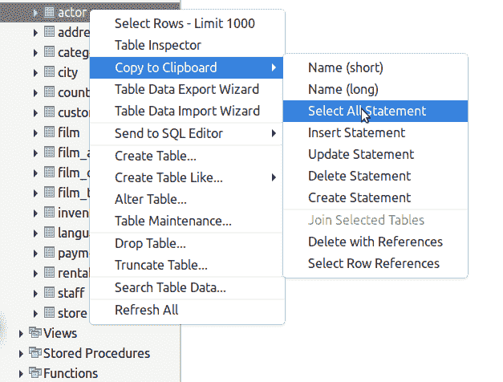
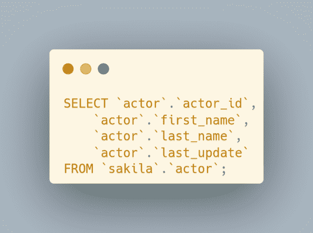
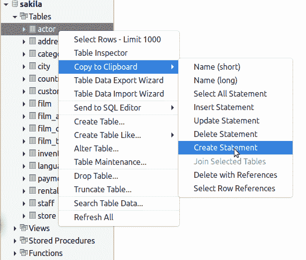
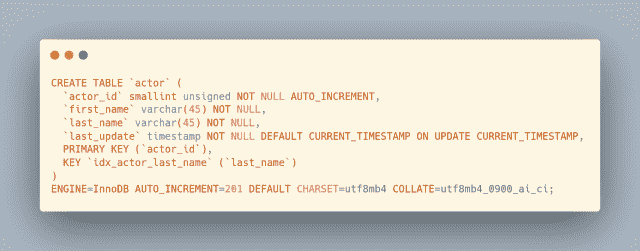
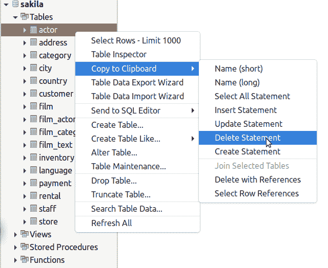
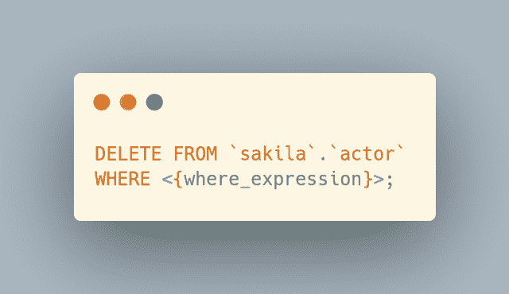
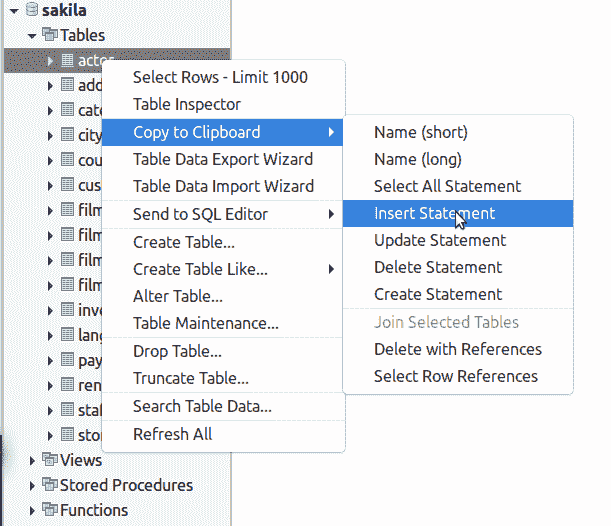
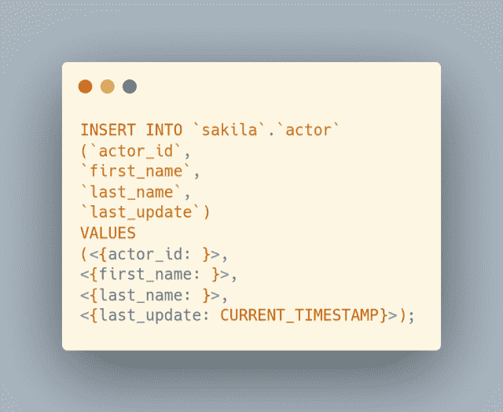
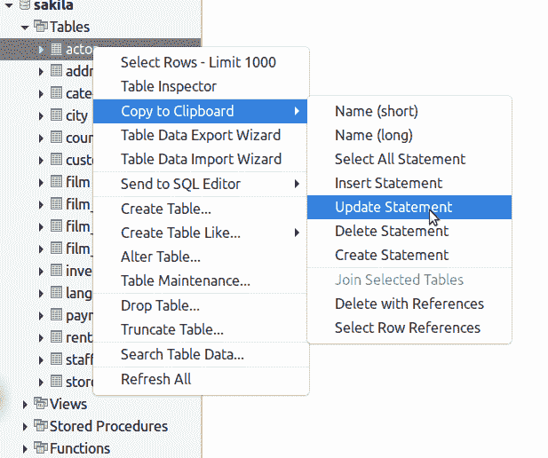
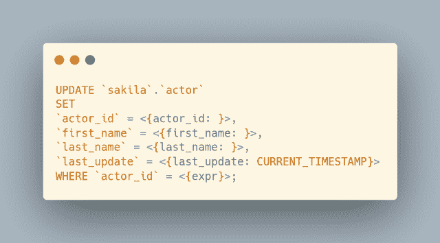

# MySQL Workbench 中的快速 SQL 片段

> 原文：<https://levelup.gitconnected.com/quick-sql-snippets-in-mysql-workbench-a3b5a938fb39>

使用这些可用于模式中任何表的*‘点击并粘贴’*SQL 代码片段，在 MySQL Workbench 中提高您的工作效率。继续阅读并查看' ***订书钉五个*** '…

需要学习 MySQL 吗？刚刚起步，对如何查询一个表，获取自己需要的数据感到困惑？出于这个特殊的原因，我正在创建优质的 MySQL 初学者内容。来帮助那些想学习 MySQL 基础知识却不知道从何入手的人。[了解更多关于我开发和发布的优质博客文章的](https://digitalowlsprose.ck.page/03da7bb182)。

自我推销:

如果你喜欢这里写的内容，尽一切办法，把这个博客和你最喜欢的帖子分享给其他可能从中受益或喜欢它的人。既然咖啡是我最喜欢的饮料，如果你愿意，你甚至可以给我买一杯！

我们键入了足够多的代码。如果我能找到少打代码的方法，那就给我报名。这是我喜欢 PHP 的原因之一，因为它的脚本能力。但是，那是另一天的另一个讨论。与此同时，你可以[在这里阅读更多相关信息](https://realtoughcandy.com/joshua-otwell-interview/) …

***OpenLampTech*** 是面向 PHP 和 MySQL 开发者的时事通讯。建立联系。学习成长。今天加入我们吧。

## MySQL Workbench 的代码片段

以下 5 个片段中的每一个都是完全相同的:

*   右键单击目标表
*   点击**复制到剪贴板**菜单项
*   *将鼠标悬停在*上，点击所需的代码片段菜单项
*   MySQL 代码现在被复制到你的剪贴板上，可以粘贴到任何你需要的地方

1.选择所有语句

这个 MySQL 代码片段创建了一个*全限定* `SELECT`查询:

2.创建语句

有了这个 MySQL 代码片段，我们就有了完整的`CREATE TABLE` DDL 语句:

3.删除语句

对于`DELETE` MySQL 代码片段，代码中包含了一个`WHERE`子句:

4.插入语句

所有列名和附带的`VALUES`子句都包含在`INSERT`语句 MySQL 代码片段中:

5.更新语句

每个表列都在`UPDATE` MySQL 代码片段中指定:

我希望这些片段对你在 MySQL Workbench 中继续开发有用。请在下面的评论中告诉我你最喜欢的 MySQL Workbench 快捷方式。

喜欢你读过的？看到什么不正确的吗？请在下面评论，感谢阅读！！！

# 行动的号召！

感谢你花时间阅读这篇文章。我真心希望你发现了一些有趣和有启发性的东西。请在这里与你认识的其他人分享你的发现，他们也会从中获得同样的价值。

访问 [Portfolio-Projects 页面](https://wp.me/P28ctb-3KD)查看我为客户完成的博客帖子/技术写作。

[**我可以整天喝咖啡！**](https://ko-fi.com/joshlovescoffee)

要在最新的博客文章发表时收到来自本博客(“数字猫头鹰散文”)的电子邮件通知(绝不是垃圾邮件)，请点击“点击订阅！”按钮在首页的侧边栏！(如有任何问题，请随时查看 [Digital Owl 的散文隐私政策页面](https://wp.me/P28ctb-3gI):电子邮件更新、选择加入、选择退出、联系表格等……)

请务必访问[“最佳”](https://joshuaotwell.com/where-blog_post-in-digital-owls-prose-best-of/)页面，收集我的最佳博客文章。

[Josh Otwell](https://joshuaotwell.com/about/) 作为一名 SQL 开发人员和博客作者，他热衷于学习和成长。其他最喜欢的活动是让他埋头于一本好书、一篇文章或 Linux 命令行。其中，他喜欢桌面 RPG 游戏，阅读奇幻小说，并与妻子和两个女儿共度时光。

免责声明:本文中的例子是关于如何实现类似结果的假设。它们不是最好的解决方案。所提供的大多数(如果不是全部)示例都是在个人发展/学习工作站环境中执行的，不应被视为生产质量或就绪。您的特定目标和需求可能会有所不同。使用那些最有利于你的需求和目标的实践。观点是我自己的。

***有什么可以帮你的*** ？

*   你想开一个博客吗？我用 WordPress 写博客。让我们都在提供的计划上省钱。💸
*   从[我的 Etsy 商店](https://www.etsy.com/shop/digitalowlsprose/)获取 Gmail HTML 电子邮件签名模板，让您的电子邮件更加醒目。✉️
*   需要托管你的下一个网络应用程序或 WordPress 网站吗？我使用并强烈推荐 [Hostinger](https://www.hostg.xyz/aff_c?offer_id=6&aff_id=94641) 。他们有很好的价格和服务。
*   我喜欢阅读 Refind: *网站的精华，每天早上在你的收件箱里。免费订阅*。通过我的推荐链接为您自己[注册，帮助我获得高级订阅。](https://refind.com/joshua-otwell?invite=5440c95e39)
*   获取一个[免费的手机 *Creator* 壁纸](https://click.convertkit-mail4.com/d0uvkov9k4s0h22640am/p8hehqu9xxnm2zbr/aHR0cHM6Ly9zcGFya2xwLmNvL2pvc2h1YWMwM2U2Mw==)包。
*   刚入门还是想学 MySQL？在这里找到我的[高级博客文章和 MySQL 初学者系列](https://digitalowlsprose.ck.page/03da7bb182)。

***披露*** :本帖部分服务和产品链接为附属链接。在没有额外费用给你，你应该通过点击其中一个购买，我会收到佣金。

***OpenLampTech*** 是面向 PHP 和 MySQL 开发者的时事通讯。建立联系。学习成长。今天加入我们吧。

*原载于 2022 年 3 月 2 日 https://joshuaotwell.com***。**