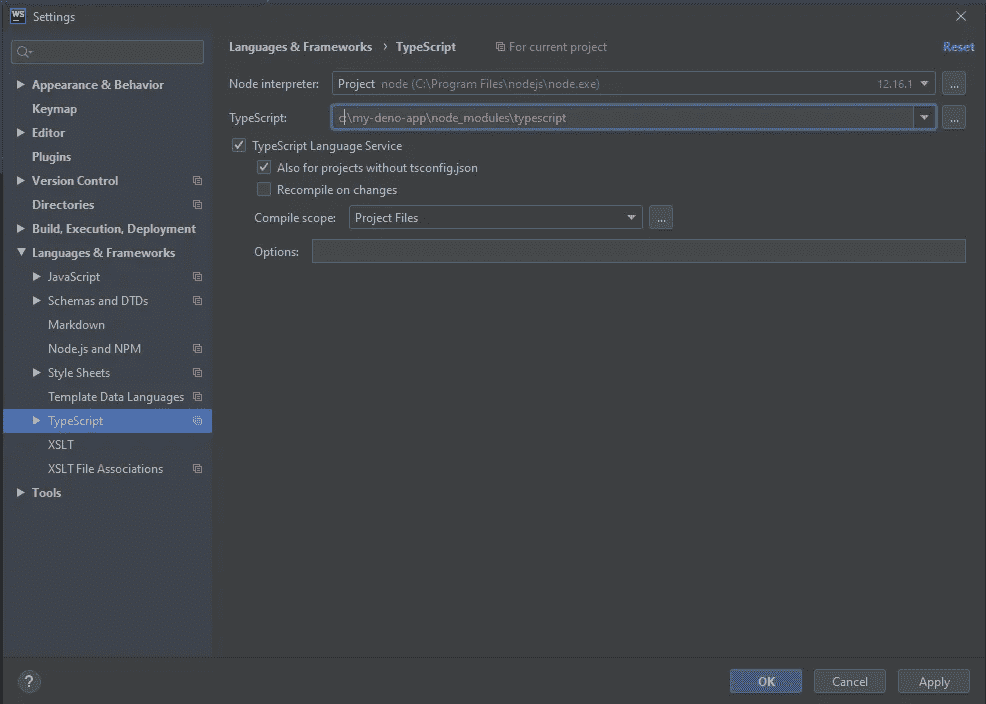

# 快速提示:为 Deno 配置 WebStorm

> 原文：<https://levelup.gitconnected.com/quick-tip-configure-webstorm-for-deno-9490cd785de3>

## 在几分钟内配置好您的 IDE


照片由 [Pexels](https://www.pexels.com/photo/three-wooden-dinosaur-3661193/?utm_content=attributionCopyText&utm_medium=referral&utm_source=pexels) 的 [cottonbro](https://www.pexels.com/@cottonbro?utm_content=attributionCopyText&utm_medium=referral&utm_source=pexels) 拍摄

开箱即用，Deno 和 WebStorm 几乎可以完美地协同工作，你不需要*做任何事情来提高工作效率。*

然而，我们可以做一些提高生活质量的事情。解决几个问题的增强功能，即:

*   WebStorm 抱怨导入路径中的文件扩展名
*   Deno API 的解析和完成

多亏了 Deno 贡献者 justavac，我们可以使用一个 TypeScript 插件，当它与 WebStorm 结合使用时，可以解决这些问题，并且只需要几分钟就可以安装好

1.  **创建一个 package.json**

我知道你在想什么——我们使用的是 Deno 而不是 Node，那么我们为什么需要 package.json 呢？嗯，我们需要安装和使用 TypeScript 插件，所以我们需要一个 package.json。虽然它可以很小。

```
{
  "devDependencies": {
    "typescript": "^3.9.5",
    "typescript-deno-plugin": "^1.31.0"
  }
}
```

就是这样。六条线。

一旦创建了这个文件，运行`npm install`。

2.**创建一个 tsconfig.json**

根据您对 Deno 的需求，您可能已经拥有了其中的一个。如果没有，您需要从头创建一个。和 package.json 一样，这个也很小。

```
{
  "compilerOptions": {
    "plugins": [{
      "name": "typescript-deno-plugin",
      "enable": true,
      "importmap": "import_map.json"
    }]
  }
}
```

我们所做的就是将`plugins`数组添加到`compilerOptions`对象中，并告诉编译器使用`typescript-deno-plugin`。

3.改变网络风暴的语言服务

告诉 WebStorm 的 TypeScript 语言服务使用本地安装的 TypeScript，而不是内置版本。

打开 WebStorm 的 TypeScript 语言和框架设置

`Settings/Preferences | Languages & Frameworks | TypeScript`

并将 **TypeScript** 值更改为安装在本地 **node_modules** 中的 TypeScript 文件夹的路径。



使用本地安装的 TypeScript，而不是内置的编译器

就是这样！

不再用`// @ts-ignore`标记导入，不再错误地识别对 Deno API 的调用。

*如果你想自动运行* ***fmt*** *，那么你可以* [*在这里找到指令*](/quick-tip-deno-fmt-in-webstorm-aa3e6d3b034d)*——这也是一个非常简单的过程。*

JetBrains 的团队正在他们的 ide 中为 Deno 提供完全的原生支持，但在此之前，由于 justjavac 的出色工作，我们已经可以获得非常流畅的体验。