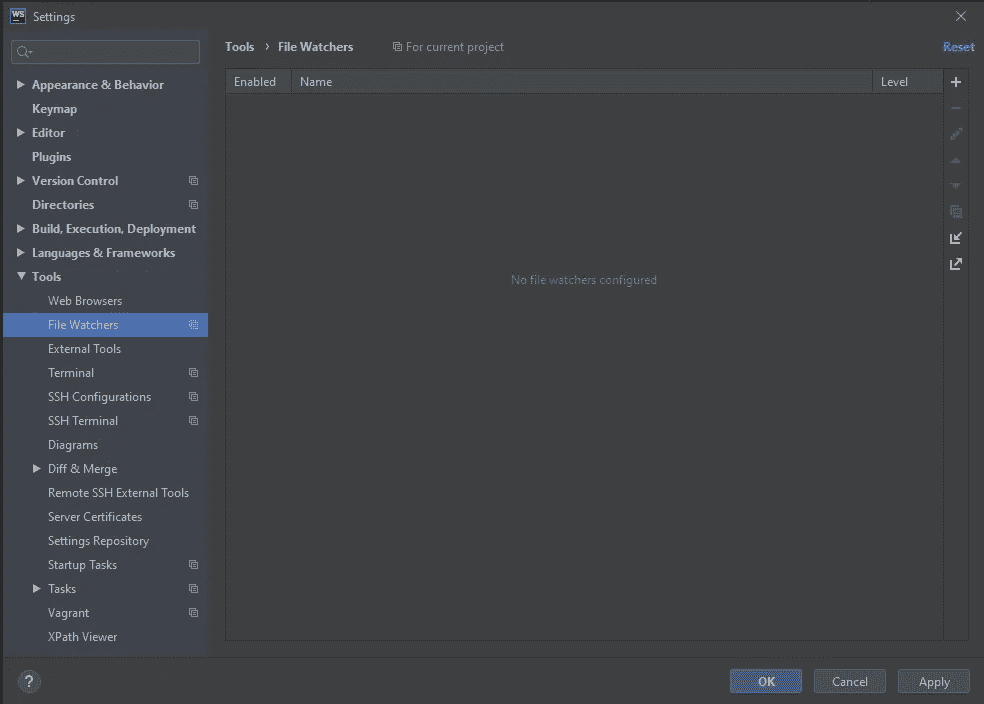
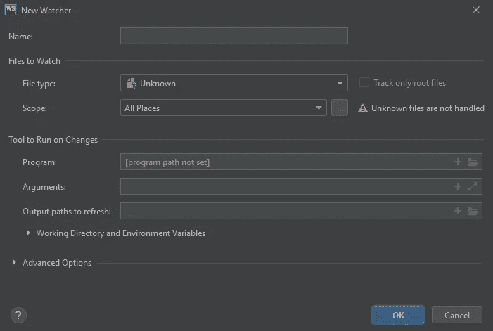
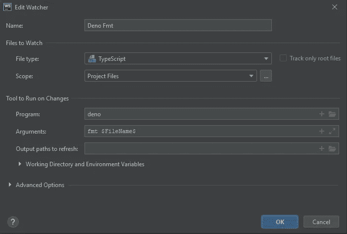

# 快速提示:网络风暴中的 Deno Fmt

> 原文：<https://levelup.gitconnected.com/quick-tip-deno-fmt-in-webstorm-aa3e6d3b034d>

## 配置 FileWatcher 通过三个简单的步骤格式化您的代码

来自 [Pexels](https://www.pexels.com/photo/white-dinosaur-figurine-on-wood-log-1319581/?utm_content=attributionCopyText&utm_medium=referral&utm_source=pexels) 的[玛格达·埃勒斯](https://www.pexels.com/@magda-ehlers-pexels?utm_content=attributionCopyText&utm_medium=referral&utm_source=pexels)的照片

现在 [Deno](https://deno.land/) 已经发布了版本 1，更多的开发者开始尝试看看它能提供什么。

对我来说，Deno 安装带来的最酷的东西之一是 **fmt** 。

这个格式工具标准化了 deno 代码。没有更多关于制表符或空格，悬挂逗号，或其他任何东西的争论！快乐的日子，我们可以专注于代码，而不是代码风格。

顺便说一句，这和 Co fmt 的想法是一样的，这也是我这么喜欢 Go 的原因之一(都是小事)。

我使用 WebStorm 作为我的主要 JavaScript/TypeScript IDE。我并不反对像 VSCode 这样的替代品——使用你喜欢的任何东西，任何有助于你提高效率的东西都是我的口头禅，但对我来说，Webstorm 提供了一些 VSCode 等人没有提供的生活质量的东西。

## 设置文件监视器

我喜欢在编辑的时候运行 fmt 我不想在完成一项工作后不得不手动启动某些东西。这就是 FileWatcher 派上用场的地方，下面是我如何设置它。

1.  打开“设置/偏好设置”,导航至文件观察器

文件观察器窗格

2.添加新的观察者，选择**自定义模板**

新观察器窗口

3.填充所需的选项。给观察者一个名字(我已经用 **Deno Fmt** 了)。对于*程序*使用`deno`，对于*参数*使用`fmt $FileName$`。对于*文件类型*，确保从列表中选择**类型脚本**，并将*范围*限制为**项目文件**。

`$FileName$`是一个内置宏。它所做的只是将当前文件名(包括扩展名)传递给观察器。

4.享受你的格式化代码！

就是这样——三个简单的步骤，您的代码将在工作时格式化。第一次在一个文件上运行时，你可能会得到一个对话框，警告你文件已经被修改，如果是这样，就接受修改。