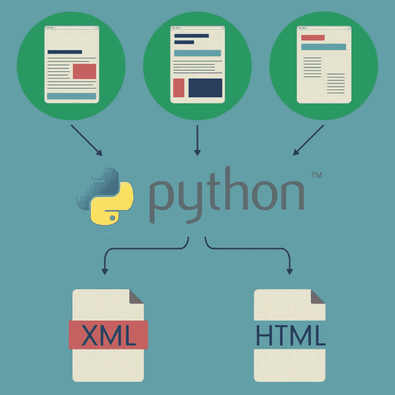
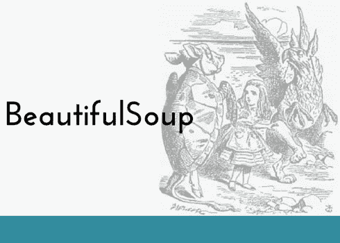
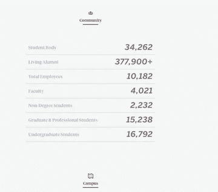
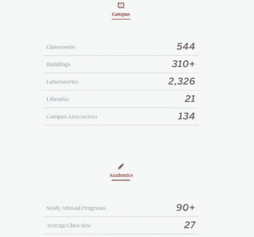
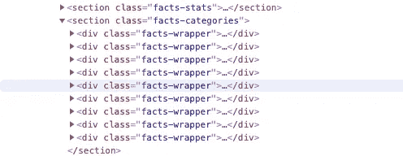
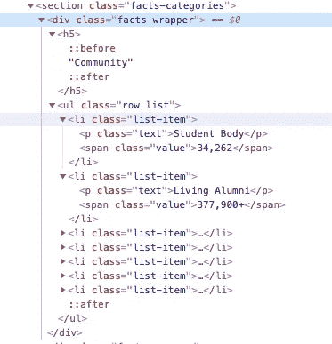

# 用 Python 和漂亮的汤快速刮网

> 原文：<https://levelup.gitconnected.com/quick-web-scraping-with-python-beautiful-soup-4dde18468f1f>



网络抓取允许你下载一个网站的 HTML 并提取你需要的数据。用 Python 配美汤是刮网的绝佳方式。

# 美味的汤



在进行数据搜集时，您可以使用的许多包之一是 Beautiful Soup。Beautiful Soup 是一个 python 包，用于解析 HTML 和 XML 文档并提取数据。为了执行网页抓取，我们还需要`urllib`来连接网页。

# 环境设置

首先，安装以下 python 包。

```
pip install requestspip install beautifulsoup4
```

然后，我们可以开始导入所有必需的包。

```
import requestsfrom urllib import request, response, error, parsefrom urllib.request import urlopenfrom bs4 import BeautifulSoup
```

# **漂亮的汤对象**

`BeautifulSoup`下有三个对象:

*   `BeautifulSoup`
*   `Tag`
*   `NavigableString`

## **创建一个 BeautifulSoup 对象是任何使用 Beautiful Soup 的项目的第一步**

有两种方法可以创建您的`BeautifulSoup`对象。

*   使用字符串

```
soup_string = BeautifulSoup(“<p>Hello!</p>”)
```

*   使用`urlopen`创建一个`BeautifulSoup`对象。这是创建`BeautifulSoup`对象最常见的方式。

```
url = “*PUT_YOUR_URL_HERE*”html = urlopen(url)soup = BeautifulSoup(html, "lxml") 
# here, the "lxml" is the html parser
```

# 使用 BeautifulSoup 获取数据

让我们用 BeautifulSoup 做一个简单的数据提取。比如说我想快速浏览一下波士顿大学在他们的[网站](http://www.bu.edu/president/boston-university-facts-stats/)上的事实和统计数据。



首先，我们想获得这个网站的名称。

```
url = “[http://www.bu.edu/president/boston-university-facts-stats/](http://www.bu.edu/president/boston-university-facts-stats/)”html = urlopen(url)soup = BeautifulSoup(html, “lxml”)title = soup.title titleText = title.get_text()print(titleText)
```

这将打印出标题的文本:

```
BU Facts & Stats | Office of the President
```

如果你不做最后一步`titleText = title.get_text()`，你的网页抓取器会给你下面的结果，而不是一个干净的文本。

```
<title>BU Facts &amp; Stats | Office of the President</title>
```

BeautifulSoup 有很多方法可以让你找到特定的元素。以下是一些常见的:

```
find(), find_all(), find_parent(), find_parents(), find_next_sibling(), find_next_siblings(), find_previous_sibling(), find_previous_siblings(), find_next(), find_all_next()
```

BeautifulSoup 功能强大，可以进行任何你能想到的数据提取。以下是一些其他简单的数据提取方法:

*   `soup.p.attrs['name'] #obtain the 'name' attribute in <p> tag`
*   `soup.select('ul')['id'] # obtain 'id' attribute in 'ul'`
*   `soup.find_all(re.complie("^b")) # finds all the tags whose names start with "b", for example <body> tag`
*   `soup.find_all("a", string = "Name") # finds all the <a> tags whose .string is "Name"`

在本例中，我们只需要`find()`和`find_all()`来查找特定数据。

`find_all()`允许您根据括号内的限制获取**所有**元素。

`find()`允许您提取满足您的限制的第一个元素。

## 步骤 1:确定您正在抓取的标签范围

右键单击网页上的任意位置，然后转到“inspect ”,选择我们要检查的元素。有一个由多个`div`标签组成的`<section class = "facts-categories">`。



我们想要的部分



下的众多标签之一

每个 div 标签都有对应的我们想要获取的数据，我们需要做的就是使用 BeautifulSoup 转到 section，然后找到每个`<div class = "facts-wrapper">`中的所有数据内容。我们可以使用`find_all()`来做到这一点。

```
section = soup.find_all(‘section’, class_=’facts-categories’)
```

通过这样做，我们现在处于 CSS 类为`facts-categories`的部分的范围内。接下来，我们要循环我们的 web scraper 到这个部分下的每个单独的`div`标签，它包含两个部分:一个子类，在`<h5></h5>`标签中，以及这个子类下的相应数据，可以在`<li class = "list-item">`中找到。

例如，这里我们有第一个子类:“社区”，它包含关于学生团体、活着的校友、员工总数等数据。

## 步骤 2:嵌套所有的循环

我们希望为 web scraper 构建一个嵌套循环，以迭代包含我们所需数据的每个列表。

```
section = soup.find_all(‘section’, class_=’facts-categories’)for elem in section:
    wrappers = elem.find_all(‘div’)
    for x in wrappers: 
        title = x.find(‘h5’).get_text()
        print(title)
        detail = x.find_all(‘ul’)
        for row in detail:
            for l in row.find_all(‘li’):
                text = l.find(‘p’).get_text() 
                value = l.find(‘span’, class_ = ‘value’).get_text()
                print (text + value)
            print("----------")
```

太棒了，现在我们可以把代码放到一个函数中并运行它了。我们得到的部分结果如下所示:

```
BU Facts & Stats | Office of the President
Community
Student Body34,262
Living Alumni377,900+
Total Employees10,182
Faculty4,021
Non-Degree Students2,232
Graduate & Professional Students15,238
Undergraduate Students16,792
----------
Campus
Classrooms544
Buildings310+
Laboratories2,326
Libraries21
Campus Area (acres)134
----------
Academics
Study Abroad Programs90+
Average Class Size27
Faculty4,021
Student/Faculty Ratio10:1
Schools and Colleges17
Programs of Study300+
----------
Grant & Contract Awards
Research Awards$486.8M
BMC Clinical Research Grants$116M......
```

## 摘要

Python 和 BeautifulSoup 包让网页抓取变得容易多了。

希望这个简单的网页抓取例子能给你一个 BeautifulSoup 的介绍和一些构建基本网页抓取器的想法。