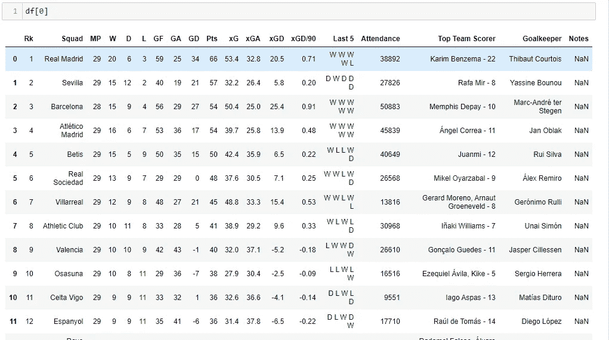

# 仅使用熊猫即可快速轻松地刮除 FBREF

> 原文：<https://levelup.gitconnected.com/quickly-and-easily-scrape-fbref-using-just-pandas-773b294f86a0>

我们喜欢足球数据，fbref 是最好的公开来源之一！

我们将从积分榜和其他一些投篮统计数据中寻找一些可能的感觉。fbref 使用 html 表格，这是我们今天所做工作的关键要求。和往常一样，完整的代码在这里:[https://github . com/PaulyCorcoran/Medium _ Football/blob/main/FB % 20 ref . ipynb](https://github.com/PaulyCorcoran/Medium_Football/blob/main/fb%20ref.ipynb)

第一步是确定我们要刮什么表。今天的文章，我选择在这里【https://fbref.com/en/comps/12/La-Liga-Stats刮出西甲联赛的积分榜。


资料来源:fbref

我们需要抓取 html 表的唯一库是 pandas。导入库并将目标 url 设置到 pd.read_html()函数中。

```
 import pandas as pddf = pd.read_html('[https://fbref.com/en/comps/12/La-Liga-Stats'](https://fbref.com/en/comps/12/La-Liga-Stats'))
```

如果你允许自己打印这个 df，它将会非常混乱，而且格式不正确。然而，我们可以使用一个简单的 for 循环来清理提取。

```
for idx,table in enumerate(df):
 print(“***************************”)
 print(idx)
 print(table)
```

这里我们要求 python 遍历 df 并打印它拥有的索引和表。正如您在下面看到的，python 中的索引从[0]开始，表是在其后打印的。我们想要提取索引[0]处的表，这可以通过简单地切片 df[0]来完成。


这就给我们留下了提取的表…很酷吧？



作者笔记本

笔记本的其余部分通过另一个西甲联赛表格提取。当抓取 fbref html 表时，生成的 df 可以是多层列，这将对任何分析或绘图产生影响。我们可以通过使用 df.columns.droplevel()来删除多层。浏览提供的笔记本，查看示例。

最后，我调出了联盟的投篮统计数据，过滤了前 4 名，并绘制了图表。这是一个简单的例子，说明如何利用从 fb ref 收集的足球统计数据。希望你玩得开心！下面，我绘制了当前前 4 名的 SoT 图。我们可以通过绘图获得有趣的见解。塞维利亚的射门命中率要低得多！


2022 年 3 月 29 日前 4 名的 SoT 统计数据

如果你喜欢这篇文章，可以看看我最新的关于刮 fb ref 夹具的文章！https://medium.com/p/e0d8130a3dfd[关注我，了解更多足球内容！](https://medium.com/p/e0d8130a3dfd)

如果你想在 medium 上看到更多来自我或其他伟大作者的足球内容，你可以使用这个链接加入，不需要额外付费。

[](https://medium.com/@leftsidedcentrehalf/membership) [## 通过我的推荐链接加入 Medium-Paul Corcoran

### 阅读保罗·科克兰(以及媒体上成千上万的其他作家)的每一个故事。您的会员费直接支持…

medium.com](https://medium.com/@leftsidedcentrehalf/membership) 

在其他帖子中，我涵盖了预期目标模型，从官方冠军联赛，2022 年世界杯和法国法甲联赛网站收集的足球统计数据，以及许多关于足球的有趣分析文章。

祝您愉快！