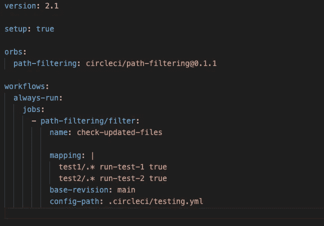

# 使用 CircleCI 快速创建选择性 CI/CD 管道

> 原文：<https://levelup.gitconnected.com/quickly-create-selective-ci-cd-pipeline-with-circleci-642ebae8237e>

在本文中，我将介绍如何快速构建一个管道，只有在检测到更改时，该管道才会有选择地在存储库的不同目录中运行命令。我将在文章中假设一些 CircleCI 的基本知识，但是我将从建立一个项目开始经历这个过程。

1.  **设置项目**

首先登录 CircleCi，在本例中，我将使用 Github SSO 登录，并选择您希望设置管道的项目。这里给你几个选项，都很好，但我更喜欢中间的选项`Faster: Commit a started CI pipeline to a new branch.`这个选项将创建一个新的项目分支与一个例子*。circleci/config.yml* 文件，然后您可以将该文件合并到项目的主分支中。或者，你自己进入并创建这个目录和文件，并提交到主分支，使用选项`Fastest:Use the .circleci/config.yml in my repo`并在文本框中输入你创建的分支。

CircleCi 项目设置选项

2.**项目结构示例**

在本例中，我们的根目录中有 3 个文件夹:

。circleci/ —这是我们存储 circleci 配置的地方

test1/ —如果检测到更改，我们将测试的目录之一

test2/ —如果检测到更改，我们将测试的目录之一

*注意:在这个例子中，我将使用 Go 来演示选择性运行测试。*

3.**配置 CircleCi**

在这一节中，我将介绍 CircleCi 配置中的要求。为了配置选择性触发，我们将使用两个文件，一个基本的 config.yml 文件，然后在本例中使用一个名为 testing.yml 的文件。

**Config.yml**

下面是我们需要的初始配置文件的图像。这个文件告诉我们的管道监视某些目录，如果检测到更改，我们将一个参数传递给我们在 testing.yml 中找到的继续配置。

config.yml

浏览上图:

需要`setup: true`才能使用 CircleCI 的动态配置功能。

`orbs: pathfiltering: circleci/path-filtering@0.1.1`这是根据更新文件的路径继续管道所需的 orb。

`always-run:`确保此工作流始终被触发。

`- path-filtering/filter:`是路径过滤作业，我们将映射到我们希望监控更改的目录。

`mapping:`接受由空格分隔的 3 个参数— <要监控的 regex 路径、要设置的参数、要设置的值>。

在检查给定的映射目录时，我们想要与之进行比较的分支。

`config-path:`我们希望管道使用的延续文件。

**testing.yml**

在下图中，我们声明了我们期望的参数，在本例中是 run-test-1 和 run-test-2，这些是在原始配置文件中的映射下传入的参数。然后，我们根据这些参数的值(检测到更改:真，没有更改:假)，触发所需的工作流。

浏览上图:

`parameters:`我们期望通过管道传递的参数在初始配置文件映射部分声明

`jobs/workflows`深入研究作业和工作流的基本工作原理超出了本文的范围，但是浮动版本是一个工作流列表，作业是在单个单元(容器/虚拟机)中执行的步骤的集合，在本例中，针对 docker 容器中的示例代码运行测试。

`when: << pipeline.parameters.run-test-1/2 >>` 这告诉我们的工作流仅在声明的管道参数设置为 true 时触发以下作业。

在下图中，我只将更改提交到 test2 目录中，然后这被检测到，管道将只测试必要的代码。

测试 2 中的变化

而在下一个映像中，我将更改提交到两个目录中，这再次被检测到，然后对所有内容进行测试。

两者的变化

4.**最终注释**

前面的例子非常简单，但是这里演示的概念可以在许多不同的情况下转移和使用。Monorepo 就是一个很好的例子，使用上述配置，您可以监控 Monorepo 中的每个单独的包，并且只触发包中有新更改的工作流，从而节省资金和时间。

此处示例的代码可以在下面找到:

 [## GitHub-Murray code/CircleCI-示例:测试 circle ci

### 此时您不能执行该操作。您已使用另一个标签页或窗口登录。您已在另一个选项卡中注销，或者…

github.com](https://github.com/MurrayCode/CircleCI-Example) 

# 分级编码

感谢您成为我们社区的一员！在你离开之前:

*   👏为故事鼓掌，跟着作者走👉
*   📰查看[升级编码出版物](https://levelup.gitconnected.com/?utm_source=pub&utm_medium=post)中的更多内容
*   🔔关注我们:[Twitter](https://twitter.com/gitconnected)|[LinkedIn](https://www.linkedin.com/company/gitconnected)|[时事通讯](https://newsletter.levelup.dev)

🚀👉 [**加入升级达人集体，找到一份惊艳的工作**](https://jobs.levelup.dev/talent/welcome?referral=true)