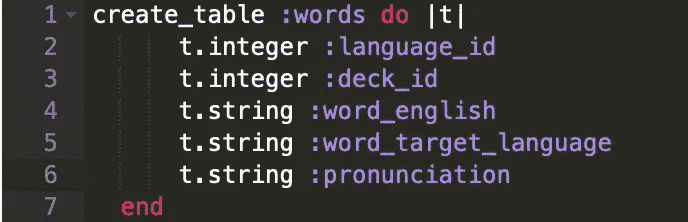
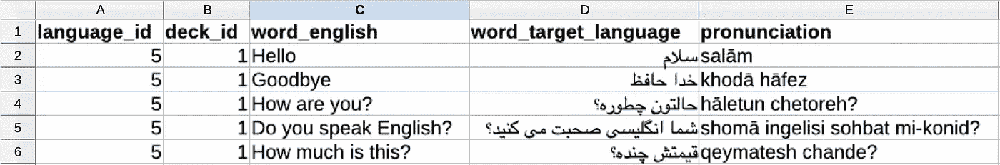
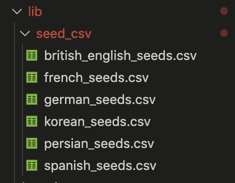
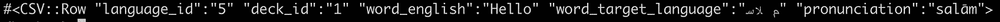

# 使用 CSV 文件快速植入 Rails 数据库

> 原文：<https://levelup.gitconnected.com/quickly-seeding-a-rails-database-using-a-csv-file-8438b8b68f05>

我一直在做一个名为 Langy 的项目，这是一个学习外语的抽认卡应用程序，用 Ruby on Rails API 后端和 React 前端*构建(链接到我的* [*前端*](https://github.com/grahamflas/langy-frontend) *和* [*后端*](https://github.com/grahamflas/langy-backend) *repos，如果你想查看的话)*。

该应用程序允许用户学习六种语言的词汇。每种语言都有超过 100 个单词组织成主题卡片组:问候和短语、家庭成员、城市中的地点等。

考虑到我要用来植入数据库的单词数量(目前是 688 个)，我知道我需要一个比手动将数百个单词的数据输入到我的`seeds.rb`文件中更系统、更可扩展的解决方案。

我决定在单独的电子表格中收集每种语言的单词数据，保存为`CSV (comma-separated value)`文件。然后，我使用 Ruby 的 [CSV 类](https://ruby-doc.org/stdlib-2.6.1/libdoc/csv/rdoc/CSV.html)读取每个 CSV 文件的内容，并在我的数据库中创建记录。

# 该项目的详情

出于上下文的考虑，我使用我的 CSV 数据创建了一个单词模型的实例，如下所示:

我的数据被输入到电子表格中，表格的列标题与我的模型的属性相对应:

在我编译完所有数据后，我将 CSV 文件保存在我的 Rails 项目目录中，在`​lib`目录下:

# 从 CSV 文件中读取

为了使用 CSV 文件中的数据作为数据库的种子，您需要某种方法来读取 CSV 文件并将其数据传递给一个`​#create`方法，以便初始化数据库中的新记录。

实质上，CSV 文件中的每一个**行**都对应于一个记录，而每一个**列**都对应于模型上的一个属性。

幸运的是，Ruby 有一个内置的方法可以做到这一点，通过`[CSV class](https://ruby-doc.org/stdlib-2.6.1/libdoc/csv/rdoc/CSV.html)`和它的`[foreach](https://ruby-doc.org/stdlib-2.6.1/libdoc/csv/rdoc/CSV.html#method-c-foreach)`方法。

下面是代码，我将在下面解释:

从 CSV 文件中读取数据的代码

首先，在`seeds.rb`中，我们需要在种子文件的顶部添加`​require ‘csv’`，以允许您使用 Ruby CSV 类及其方法。

`[foreach](https://ruby-doc.org/stdlib-2.6.1/libdoc/csv/rdoc/CSV.html#method-c-foreach)`方法将 CSV 文件的路径作为参数，以及`[new](https://ruby-doc.org/stdlib-2.6.1/libdoc/csv/rdoc/CSV.html#method-c-new)`方法理解的任何可选参数。

*   *第 3 行的第一个参数* : `Rails.root`返回当前 Rails 项目的文件路径。链接`​.join( ***the relative path of the CSV file within YOUR project directory*** )`将返回给定 CSV 文件的确切路径。
*   *第 3 行的第 2 个参数* : `​headers: true`是可选参数，将 CSV 文件的第一行视为标题行。

`​foreach`方法将 CSV 文件的每一行作为`[CSV::Row](https://ruby-doc.org/stdlib-2.6.1/libdoc/csv/rdoc/CSV/Row.html)`传递给提供的块。这个 block 参数是数组(它是有序的，所以可以通过索引访问它的元素)和散列(也可以通过键访问它的元素)的一部分。

上面代码中块参数`​row`的第一个值(即 CSV 文件中第一行的数据)如下所示:

将此与 CSV 文件的截图进行比较。

> 注意 CSV::Row: `​row[0]`和`​row[“language_id”]`都返回`​5`的数组和类似散列的性质。为了清楚起见，我更喜欢通过键而不是索引来访问值，但是两者都可以。

在块内，您可以将每行包含的数据传递给`​create`方法，为 CSV 文件中的每一行初始化数据库中的新记录。*参见上面代码中的*第 4–10 行。

瞧啊。通过手动将数据输入到`seeds.rb`文件中，您已经以前所未有的速度播种了您的数据库。