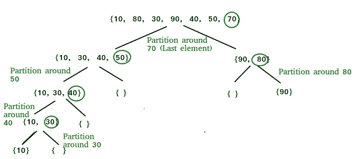
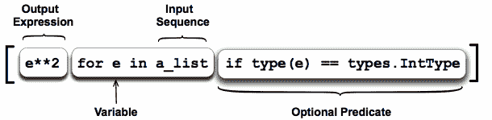
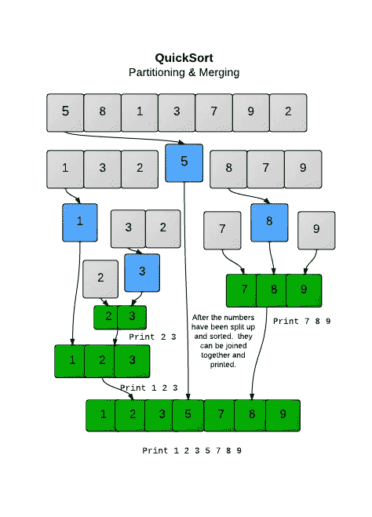

# Python 上的快速排序

> 原文：<https://levelup.gitconnected.com/quicksort-on-python-acb078cd8637>

```
**import random
UnorderedList =[random.randint(1,10000) for i in range(100000)]
OrderedList= ['' for i in range(len(UnorderedList))]

def QuickSort( lists, OrderedLists,index):
    if len(lists)==0:
        return OrderedLists
    UList = []; LList =[]
    pivot = random.choice(lists)
    lists.remove(pivot)
    for i in lists:
        if i>pivot:
            UList.append(i)
        else:
            LList.append(i)
    OrderedLists[index+len(LList)]= pivot
    QuickSort(UList, OrderedLists, index+len(LList)+1)
    QuickSort(LList,OrderedLists,index)
    return OrderedLists

ans = QuickSort(UnorderedList, OrderedList,0)
print(ans)**
```

昨天在学校，我们复习了排序方法，我被介绍了快速排序，这是一种非常快速的排序方法。我的计算机老师还说，算法有递归，通常是“涉及”的。他还说他不指望我们班的任何人能编写它，我把这看作是编写它的一个挑战。周六一小时后，这是我的解决方案。

# 先决条件:

这个程序确实涉及到一些复杂的概念，这意味着如果你还是一个编程初学者，我不认为这是一个适合理解的程序。所以，用这些要点来检查你自己，如果你符合它们，那么我认为你能理解代码！：

*   递归
*   列表理解
*   功能和参数
*   了解其他排序方法，如冒泡、插入和合并
*   列表索引

# 什么是快速排序？

根据我昨天学到的，快速排序包括在列表中选择一个随机分配的枢纽，然后排列列表中的值，使所有较大的值在枢纽的右边，而较小的值在列表的左边。因此，这意味着我们的枢纽将位于有序列表的正确位置。我们重复这一点，将数据透视表上方的数字以及列表左侧小于数据透视表的数字都包含在内。



圈起来的数字是枢纽，正如你看到的，它们是用快速排序法排序的。当重复时，这将意味着最终所有的数字将是一个枢纽，因此被放置在正确的位置。

这种方法利用了分而治之，因为我们立即将值排列成集合的一半(高于轴心和低于轴心)，这反过来意味着这适用于非常大的列表。例如，当使用 time 模块时，它在 0.001232 秒内对 100 个元素列表进行排序，范围从整数 1 到 10，000。因为它是分而治之的，这意味着它的符号将是 0(n x log n ),因此 1000 个元素需要 0.2994 秒，最终 100，000 个元素需要 0.543 秒，这是非常快的。不幸的是，对于更大的数字，1，000，000 个元素需要 11.18 秒，它会变得更慢，但我会在文章的最后建议一种方法，这是一种加速程序的方法，如果你想修改这段代码，这将是你的挑战。

因为我昨天才知道，所以我不会排除我误解了这个概念的可能性，所以请告诉我我是否犯了错误。我要指出的是，通常你会算出一个支点，但这是可选的，所以我没有包括它，因为我相信它实际上会降低我的程序的速度。

[](https://www.geeksforgeeks.org/quick-sort/) [## 快速分类-极客搜索

### 像合并排序一样，快速排序是一种分治算法。它选择一个元素作为支点，并划分给定的…

www.geeksforgeeks.org](https://www.geeksforgeeks.org/quick-sort/) 

**代码:**

```
**import random
UnorderedList =[random.randint(1,10000) for i in range(100000)]
OrderedList= ['' for i in range(len(UnorderedList))]**
```

最初，我们导入随机库，这样我们既可以使用它来创建无序列表，也可以随机选择一个枢纽。然后，我们使用 random.randint 方法进行列表理解，该方法在 1 到 10，000 之间选择一个随机数，这发生了 100，000 次，这意味着在最后，我们有一个由 100，000 个无序随机元素组成的列表。然后我创建了一个有序列表，这个列表现在是空的，但是它会慢慢地被所有正确排序的元素填充。因此，它充满了。



我们两次使用列表理解，如果你已经忘记了，这里是列表理解的语法

```
**ans = QuickSort(UnorderedList, OrderedList,0)
print(ans)**
```

在进入主函数之前，我将解释这最后两行。这将调用函数 QuickSort 并传递所有适当的参数，返回值将保存到变量 ans 中。然后我们可以打印最终结果。我首先将它设置为一个变量，因为在现实世界的应用程序中，您可能希望排序后的列表进行更多的实际处理。

```
**def QuickSort( lists, OrderedLists,index):
    if len(lists)==0:
        return OrderedLists
    UList = []; LList =[]
    pivot = random.choice(lists)
    lists.remove(pivot)
    for i in lists:
        if i>pivot:
            UList.append(i)
        else:
            LList.append(i)
    OrderedLists[index+len(LList)]= pivot
    QuickSort(UList, OrderedLists, index+len(LList)+1)
    QuickSort(LList,OrderedLists,index)
    return OrderedLists**
```

代码的最后一部分是实际的函数。首先，我将解释参数:

*   列表:这是一个无序列表(因为我想减少冗余),我将用它来检查是否所有的东西都被排序了，因此我们可以返回已经排序的快速排序的分支
*   **OrderedList:** 这是我们想要变形的有序列表，因此它是无序列表中元素的有序列表
*   **索引:**因为我们想追加到有序列表中，我们需要想出一个方法来跟踪代码的特定部分分支的索引，这样当我们追加到有序列表中时，我们就追加到正确的索引中。



以此图为例，如果我们在该列表上使用 index()时使用了 8，7，9 的子分支，尽管我们返回的是数字 7 的 1，但相对于有序列表，我们需要将所有其他数字包括在较低的数字列表中，以获得要添加的索引位置的正确值。因此，在这种情况下，我们需要添加 4，因为我们有较低的分支 1，3，2，5。

```
**if len(lists)==0:
        return OrderedLists**
```

这是程序的终止条件。由于程序是递归的，我们需要一个条件来停止函数的迭代。因为我们想在无序列表为空时结束，所以我这样做是因为一旦无序列表的长度为 0，那么就为空。为了使无序列表需要达到 0，我们需要在将值添加到有序列表中后，从无序列表中移除这些值。

```
**UList = []; LList =[]
pivot = random.choice(lists)
lists.remove(pivot)**
```

我们创建两个新列表，它们是列表中大于枢轴的值和小于枢轴的值，并将它们分成两个单独的列表。我们通过从无序列表中随机选择一个元素来选择枢纽，然后由于这个值现在将位于正确的位置，我们可以将它从无序列表中移除。

```
**for i in lists:
        if i>pivot:
            UList.append(i)
        else:
            LList.append(i)**
```

我们现在需要将无序列表排序为 UList 和 LLower 列表。要做到这一点，我们需要遍历无序列表，并运行一个与透视表列表值的比较，根据语句是否正确，我们将它附加到两个列表中的任何一个。

```
**OrderedLists[index+len(LList)]= pivot
QuickSort(UList, OrderedLists, index+len(LList)+1)
QuickSort(LList,OrderedLists,index)**
```

然后，我们需要将这个值添加到有序列表(pivot)中，因为现在一旦列表被排列，它将处于正确的位置——它将只是列表起点的索引加上下面列表的长度。所以我们将这个有序列表的索引设置为 pivot 的值。因为我们现在需要对上下列表进行排序，所以我们需要在新列表上重复运行函数来排序列表，这就是递归的来源，将这些列表再次运行到函数中。这些将重复这些步骤，直到主列表清空，然后我返回的所有内容返回，然后我们有了有序的数组。由于下面的列表将从与我们当前运行的函数迭代相同的位置开始，我们只将 index 传递给函数。从逻辑上来说，我们只是从同一个原点开始工作，但只是使用了一个更小的列表。上面的列表有点复杂，因为我们需要将起始索引放在枢轴位置上方的索引处，所以我们需要首先添加索引(原点，以防它不是 0 ),然后添加小列表的长度，这将使我们到达列表的中心，然后再添加 1，这样我们就在上面列表控制的区域上了。

递归地运行它，它会在很短的时间内对列表进行排序。这就对了。您已经完成了 python 上的快速排序程序！

挑战:如你所见，对于 1，000，000 个元素，程序花了 11 秒来排序，这太多了。你的工作是在函数中添加代码，这样，如果传递到函数中的任何列表只有 3 个元素长，那么它们只需将这些值添加到有序列表中。这是因为当排序到上列表和下列表时，它们将自动意味着 3 个值被排序。