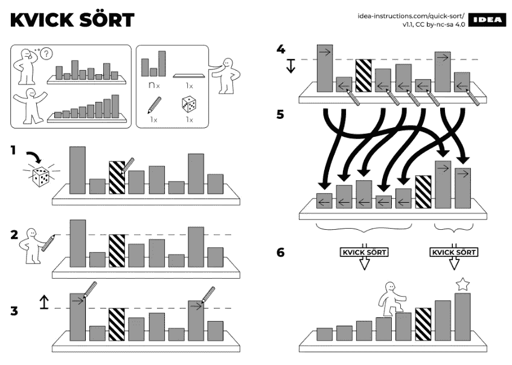
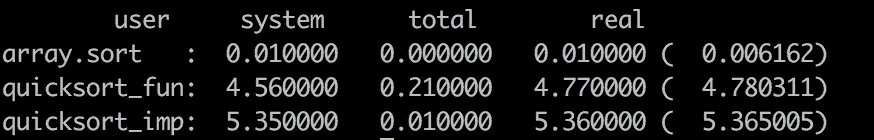

# 快速排序:两种实现风格

> 原文：<https://levelup.gitconnected.com/quicksort-the-history-and-two-styles-of-implementations-f36b9b07d2c8>


快速排序是一种经典、高效的分治排序算法。这在大多数算法教科书中都有解释，但是很少有程序员能够手工完成一个没有错误的实现。如果你不相信，关闭你的浏览器，试一试。

在这篇文章中，我将解释 quicksort 是如何工作的，并探索命令式和函数式编程风格的实现之间的差异。

# 一点历史

东尼·霍尔在 1959 年发明了快速排序，并于 1961 年发表。当东尼·霍尔第一次开发 Quicksort 时，他认为它太简单了，不能发表，只有在他能够分析它的预期运行时间后，才写了他的经典“Quicksort”论文。

顺便说一下，Algol60 是第一个支持递归的编译器，这有助于东尼·霍尔发布第一个版本的代码。


东尼·霍尔[讲述了](https://www.bl.uk/voices-of-science/interviewees/tony-hoare/audio/tony-hoare-inventing-quicksort)1960 年在莫斯科时如何想出快速排序计算机排序算法的想法。

# 快速排序的工作原理



图片来源:idea-instructions.com

快速排序的基本步骤是:

*   如果只有一个元素或没有元素，则完成排序。
*   否则，我们选择一个元素作为轴心，例如最后一个元素。
*   将元素与枢轴进行比较，将较小的元素移动到左侧，将较大的元素移动到右侧，然后将枢轴固定到适当的位置
*   在左子阵列和右子阵列中进行相同的操作。

快速排序是一种递归算法。复杂度平均为 O(N logN)，最坏的情况是 O(N^2).

为了避免在实践中出现最坏的情况，我们随机选择支点。

# 命令式和函数式编程风格

学习不同风格的实现可能有助于[学习数据结构和算法](https://coderscat.com/how-to-learn-data-structures-and-algorithms)。

大多数教科书以命令式编程风格描述快速排序。以下代码是 Ruby 版本:

```
def partition(arr, low, high)
  pos = rand(low..high) # random choose pivot
  arr[pos], arr[high] = arr[high], arr[pos] sep = low # index from the low position
  (low..high - 1).each do |j|
    if arr[j] <= arr[high]
      arr[sep], arr[j] = arr[j], arr[sep]
      sep += 1
    end
  end
  arr[sep], arr[high] = arr[high], arr[sep]
  sep
enddef quick_sort(arr, low, high)
  if low < high
    pi = partition(arr, low, high)
    quick_sort(arr, low, pi - 1)
    quick_sort(arr, pi + 1, high)
  end
end
```

因为 quicksort 是一种递归算法，所以用函数式编程风格来实现它是很自然的。当我第一次在 Ruby 中看到这一行快速排序时，我震惊了:

```
def qsort(a)
  (x=a.pop) ? qsort(a.select { |i| i <= x }) + [x] + qsort(a.select { |i| i > x }) : []
end
```

`a.select`过滤比`pivot`更小或更大的元素，然后我们用`left-subarray + [pivot] + right-subarray`构造一个新的数组。如果你懂一门模式匹配的编程语言，那就更简单了。下面是一个 Haskell 实现:

```
qsort n = case n of
 []->[]
 (x:xs)-> qsort[a|a<-xs, a<=x] ++ [x] ++ qsort[a|a<-xs, a>x]
```

# 差异

命令式编程是目前占主导地位的编程范式。

大多数主流编程语言主要支持命令式编程，如 C、Java、Python 等。

在命令式编程中，变量用于跟踪程序的当前“状态”。代码的很多部分都在给变量赋值，这将引入一个[副作用](https://en.wikipedia.org/wiki/Side_effect_(computer_science))。

有人可能会认为上述命令式版本会执行得更好。因为它不需要不断地分配内存。

实际上，许多现代编程语言在编译器(或解释器)中实现了函数式编程的优化。

我们先对以上两个版本做一个基准测试。我们生成 100000 个随机数作为输入:



按作者

有点意外，功能版比命令版表现更好。

# 其他优化

看基准测试的结果，Ruby 的内置排序有多快！

[Ruby 的 Qsort](https://github.com/ruby/ruby/blob/c5eb24349a4535948514fe765c3ddb0628d81004/util.c#L375) 差不多有 150 行 C 代码，类似于 GNU 的版本。

还有一些其他的优化变体，[kusha gra-Ortiz-Qiao-Munro](https://epubs.siam.org/doi/abs/10.1137/1.9781611973198.6)是 quicksort 的三支点变体。

[算法，罗伯特·塞奇威克和凯文·韦恩](https://algs4.cs.princeton.edu/23quicksort/)用一些精彩的插图描述得很好。

[typeacml](http://typeocaml.com/2015/01/02/immutable/)以 quicksort 为例展示了函数式编程的“不可变”。