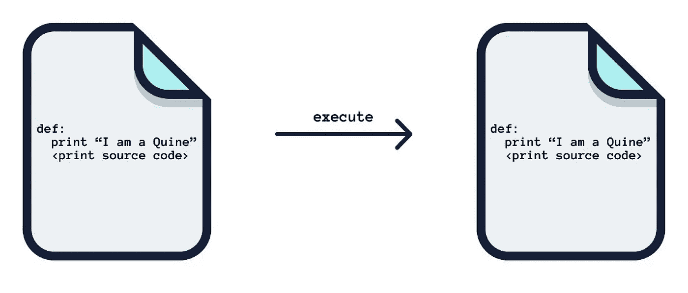

# 奎因:复制的计算机程序

> 原文：<https://levelup.gitconnected.com/quines-20ad5bd5d469>

## …以及用 C++语言编写的一个走过的建筑。



quine 是一个在执行时输出其源代码的程序

# 介绍

蒯因被定义为`a computer program which takes no input and produces a copy of its own source code as its only output.`它们赋予计算机程序一个非常重要的功能——繁殖。例如，查询(他们称之为过程)可以被用作计算机病毒通过网络设备繁殖和传播的一种方法。

因此，在计算机编程的知识中，蒯因通常被用作有趣的挑战，但是研究它们来写这篇博客让我了解了计算机理论的一些有趣的领域——lambda 编程就是其中之一。我期待着探索它，并讨论蒯因的理论方面，作为这个博客的延伸。在这篇文章中，我将带你了解这个概念，并带你了解我在 C++中从头构建一个 quine 的思想过程，以及语言本身的属性如何帮助我们解决这个问题。

# 奎因的规则

规则相当简单。程序在编译和执行时，需要输出自己的源代码。它必须这样做*，而不使用 IO 来读取自己的源代码文件*。换句话说，像这样的外壳程序是不允许的:

`cat script.sh`

同样，不允许用`scanf()`或`file()`访问源代码文件并打印出来。为了保持挑战的趣味性，空程序也是不允许的。从技术上讲，它输出自己的源代码，即空字符串，但这难道不是一个无聊的解决方案吗？

# 任何语言中的奎因

在编程世界中，编写一个查询的可能性并不是偶然或新奇的。奎因可以用任何图灵完整语言来编写，这是一个叫做*克林不动点定理*的定理的直接结果。我们将在单独的博客中讨论定理和证明。

# **让我们建造一个**

> 在我们开始之前，我鼓励你尝试用任何一种编程语言编写一个查询。

我花了一些时间来理解我在学习中的想法，我尽力把它分解成步骤。一定要花时间通读代码片段并理解发生了什么，您可以移动到提琴上查看输出或分叉代码，以在任何时候测试您自己的想法。我很想知道你选择的其他道路，以及它们会把你引向何方；请在评论中加入你的想法吧！

**骷髅**

你可以一次就写出这么多的 quine，基本思路是尝试用打印语句打印出源代码。

```
#include <iostream>
using namespace std;int main() {
 cout << "#include <iostream>\nusing namespace std;\n\nint main() {\ncout << **<the-quoted-text>**;\nreturn 0;\n}";
 return 0;
}
```

[https://ideone.com/u3a6lZ](https://ideone.com/u3a6lZ)

**自我参考**

您需要处理对`<the-quoted-text>`的自我引用，以完整地打印打印声明本身。作为第一次尝试，我使用了一个不同的变量。我还试图将源代码分成 3 部分:`beginning`、`end`和`the_quoted_text`。

```
#include <iostream>
#include <string>
using namespace std;int main() {
 string beginning = "#include <iostream>;\n#include <string>;\nusing namespace std;\n\nint main() {\nstring beginning = **<beginning>**\nstring end = **<end>**\n \ncout <<"; 
 string end = ";\nreturn 0;\n}";
 string the_quoted_text = beginning + end;
 cout << beginning << the_quoted_text << end;
 return 0;
}
```

[https://ideone.com/kHKgON](https://ideone.com/kHKgON)

我们仍然需要对变量`beginning`
和`end`进行自引用，因此我尝试重用变量进行自引用，并以如下程序结束:

```
#include <iostream>
#include <string>
using namespace std;int main() {
 string beginning = "#include <iostream>;\n#include <string>;\nusing namespace std;\n\nint main() {\nstring beginning = "; 
 cout << beginning << "\"" << beginning << "\"" << endl;
 cout << "cout << beginning << \"\\\"\" << beginning << \"\\\"\" << endl; \n...\nreturn 0;\n}";
 return 0;
}
```

[https://ideone.com/QnEN4h](https://ideone.com/QnEN4h)

但是这导致了另一个循环陷阱，第二个`cout`语句没有被考虑。你如何解决这个问题？

**C++ printf 函数来拯救**

C/C++的`printf`函数可以更直接地解析自我引用，因为我们可以在同一个变量中拥有完整的源代码(开始+引用文本(作为变量)+结束)，并且**在打印时直接格式化字符串**。

```
#include <iostream>
#include <string>
using namespace std;int main() {
 char* fullString = "#include <iostream>;\n#include <string>;\nusing namespace std;\n\nint main() {\nstring fullString = \"%s;\nprintf(fullString, fullString);\nreturn 0;\""; 
 printf(fullString, fullString);
 return 0;
}
```

[https://ideone.com/FJouWb](https://ideone.com/FJouWb)

这一个几乎是正确的，除了正确地印刷`\`。我们使用 ascii 字符的属性(34 代替一个`"`字符)来逃避“反斜杠地狱”。

```
#include <iostream>
#include <string>
using namespace std;
int main() {
 char q = 34;
 char* fullString = "#include <iostream>#include <string>using namespace std;int main() {char q = 34;char* fullString = %c%s%c;printf(fullString, q, fullString, q);return 0;}"; 
 printf(fullString, q, fullString, q);
 return 0;
}
```

[https://ideone.com/8Umk5e](https://ideone.com/8Umk5e)

# 奎因的传说

对于程序员来说，试图用特定的语言编写最短的程序是一个常见的挑战。程序员也用其他类似 quine-relays 的变种来挑战自己(例如，Java 程序输出 C++程序的源代码，c++程序输出原始的 Java 源代码。)和 multi-quines(n 种不同语言的不同程序，能够根据输入参数输出其中任何一种)。人们经常注意到，尝试用一种编程语言编写一个查询可以帮助编码者跨越理解这种语言的心理障碍。

只是为了增加趣味性…在 Mysql 中也可以构建一个查询！
[看看乔希·达夫的这首歌](https://joshduff.com/2008-11-29-my-accomplishment-for-the-day-a-mysql-quine.md)

# 奎因的用途

我发现“蒯因的概念”最重要的用途是作为哥德尔的不完全性假设的必要步骤，一旦我理解了这个假设，我希望能写出来。

如前所述，Quining 可用于编写自行传播的计算机病毒，而其他更简单的选项如“多次复制病毒文件”会被反病毒软件阻止/检测到。我们可以利用更多有感知能力的人工智能来进行量化，谁知道这会把我们引向何方？

如果你喜欢读这篇文章，可以看看我在[template-meta programming](/template-metaprogramming-a-c-walkthrough-a7c6db0b4148)上的文章，编写代码片段，在编译期间将它们构建成静态代码方法。

**参考文献**

[1]:蒯因(自我复制程序)【http://www.madore.org/~david/computers/quine.html#sec_fp 