# RabbitMQ 用 Java，Spring 和 Docker，微服务间异步通信

> 原文：<https://levelup.gitconnected.com/rabbitmq-with-java-and-spring-asynchronous-communication-between-microservices-c087595c500b>

在这篇文章中，我们将回顾 RabbitMQ 的实际实现，同时尝试寻找理论概念。我们将使用 docker 和 docker-compose，因此您可以使用任何操作系统。

[**上的项目 Github**](https://github.com/pedroluiznogueira/messaging-microservices-rabbitmq) :

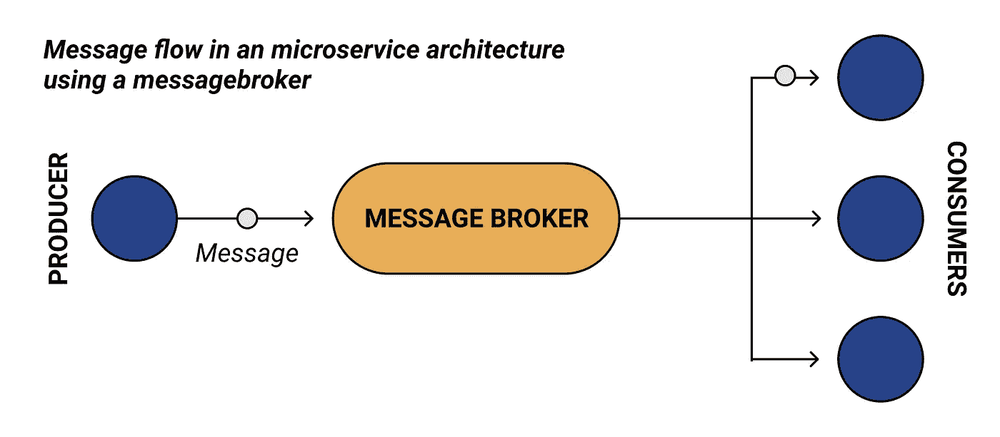

> 领域

为了简单起见，我们将从生产者微服务向消费者微服务发送用户信息。

> 项目设置

让我们去 [start.spring.io](https://start.spring.io/) 创建它们

**生产者-微服务**

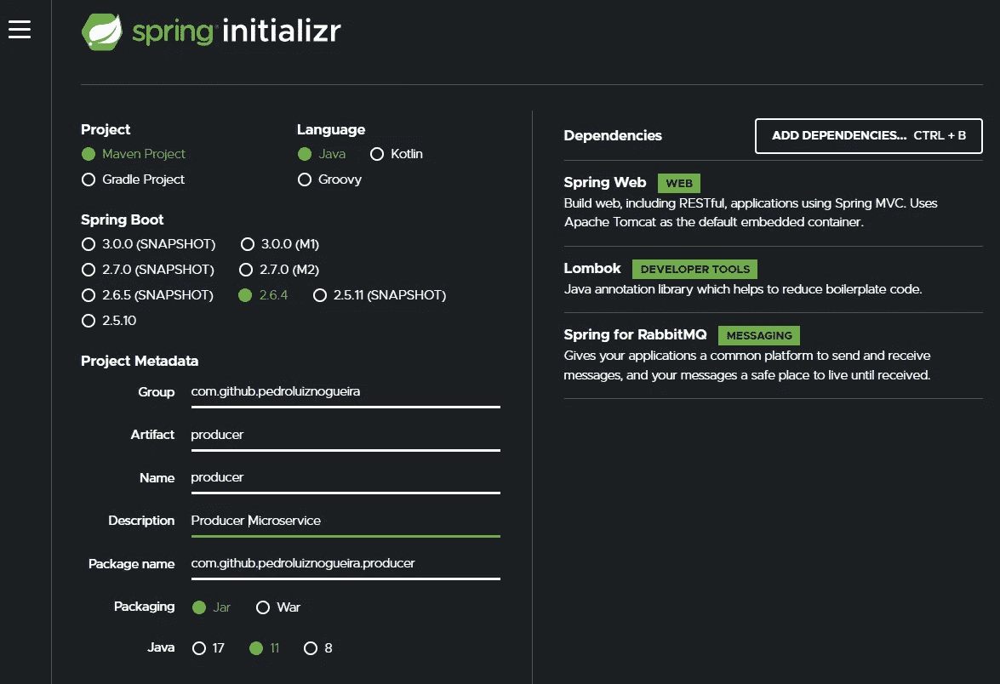

**消费者微服务**

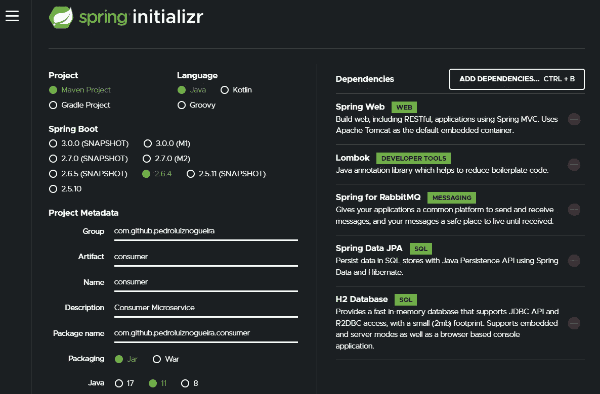

这两个项目都需要 pom.xml 文件中的以下额外依赖项。

**关于生产者**

**关于消费者**

> RabbitMQ docker 设置

在其中一个项目的根目录下，使用哪个(或两个)并不重要，让我们创建一个 **docker-compose.yml** 文件，包含在 docker 容器中运行 RabbitMQ 所需的配置。

**container_name:** 可以是任何名称，我们 docker 容器的名称

**图片:**要拉取的官方兔数量 docker 图片

**端口:**将用于访问 rabbitmq 代理和 rabbitmq 控制台管理器的公开端口

现在转到其中一个微服务的根目录，运行

**docker-compose up**

它将运行 rabbitmq 容器，可以验证它正在运行

**docker ps**

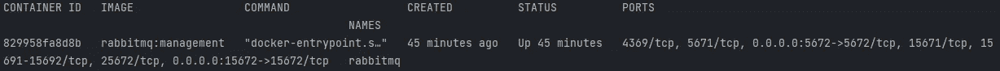

> 兔子质量管理用户界面

前往***localhost:15672***

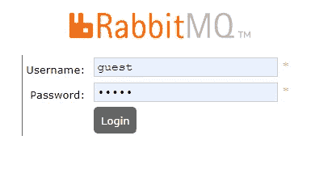

我们将登录 RabbitMQ 用户界面。默认情况下，rabbit 使用“guest”作为用户名和密码，所以继续使用它们登录。

去吧，看看用户界面。正如我前面所说的，本文的目的不是详述这个接口，我没有编码只是到此为止，因为我们将在开发项目时使用它。

> 消息传递概念

**什么是信息，我们为什么需要它？**

*   SOAP 协议有消息、报头和主体
*   异步，不同于同步 http 请求
*   示例:
*   顾客的信息，大量的订单
*   我们可以一个一个处理
*   我们使用高级消息来封装任何类型的信息
*   队列、主题、通道、交换取决于协议定义

这个信息是如何从生产者传递给消费者的？

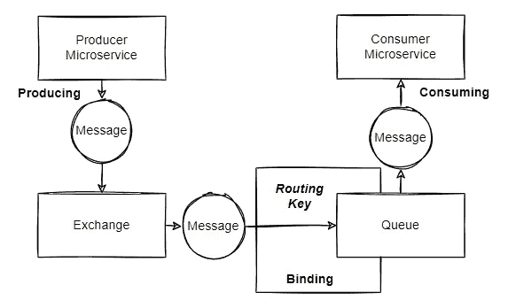

**交易所**

*   最先收到消息的人
*   将消息路由到一个或多个队列
*   路由算法取决于交换类型和“投标”
*   “绑定”只不过是一种将交换绑定到队列的配置
*   *类型*:
*   direct =空字符串和 amq.direct
*   fanout = amq.fanout
*   topic = amq.topic(例如，用户购买)
*   头= amq.match 和 amq.headers

**队列**

*   消息从交换机到达队列
*   消息到达订户之前的去向
*   *属性*:
*   名称:队列的名称
*   持久:要么保存到磁盘，要么不保存
*   独占:删除不再使用的队列
*   自动删除:当消费者退订时删除队列

**招标**

*   exchanges 用于将邮件路由到队列的规则
*   从交换 E 到队列 K，K 必须绑定到 E
*   可能有一些交换类型使用的可选路由关键字属性
*   routing_key 就像一个过滤器
*   想象一下类似于的事情:
*   队列是目的地城市
*   交易所就像这个城市的机场
*   投标是从机场到城市的路线
*   可能有零条或多条路线可以到达它

> 生产者微服务

**生产者-微服务架构**

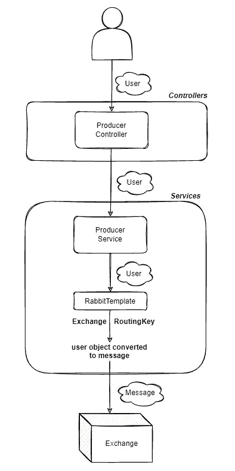

1.  使用用户名、密码和主机连接到代理。
2.  创建 JsonConverter bean，转换要作为消息发送的 json 对象
3.  创建 RabbitTemplate bean，对给定对象进行转换，并将其发送给代理

**环境变量**

**resources/application . yml**

*   **消息:**硬编码响应值
*   **主机:**要连接的主机(以前为本地主机…)
*   **端口:**主机端口
*   **密码:**默认密码如上所述
*   **用户名:**默认用户名如上所述
*   **交换:**交换名称发送消息
*   **队列:**发送消息的队列名称
*   **routing key:**bing 交换队列的路由键

**config/rabbitmqconfig . Java**

*   它将处理创建我们的连接
*   并将创建 RabbitTemplate 和 MessageConverter beans

**域/用户. java**

**控制器/生产控制器. java**

**service/producer service . Java**

一旦用户对象到达服务层，我们需要一个如图所示的 RabbitTemplate 来

1.  将对象转换成适当的消息。
2.  通知将向其发送邮件的交换名称和路由密钥。

如果我们运行项目，并向我们的生产者端点发送请求

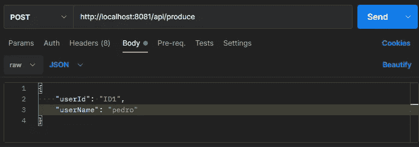

我们的应用程序将抛出

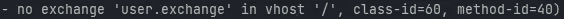

RabbitMQ docker 容器将抛出

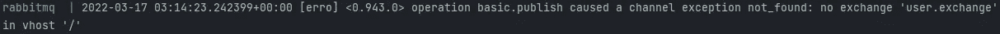

因为我们没有创建发送消息的交换，也没有创建接收消息的队列。

它们都将被创建为 Spring Beans，就像我们的其他配置一样。它可以在消费者或生产者上完成，原因是我们可以在管理控制台中手动完成，但我们不想手动完成。所以让我们理智地做吧。

> 消费者微服务

**消费者微服务架构**

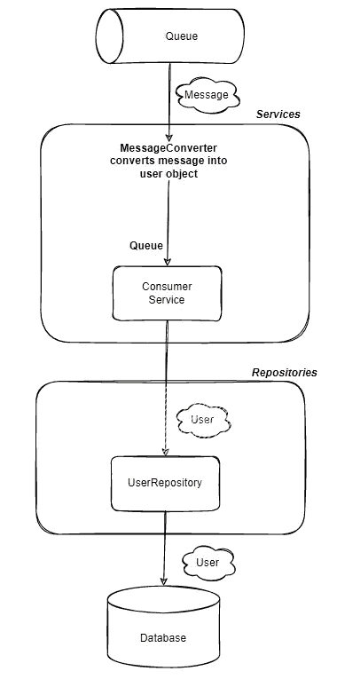

1.  创建队列 bean
2.  创建交换 bean
3.  创建绑定 bean
4.  使用用户名、密码和主机连接到代理。
5.  创建 JsonConverter bean，转换要作为消息发送的 json 对象
6.  创建 RabbitTemplate bean，对给定对象进行转换，并将其发送给代理

**环境变量和数据库配置**

**资源/应用. yml**

*   **queue:** 与之前不同的是，我们在这里提供了使用消息的队列名称

**资源/应用程序.属性**

*   h2 数据库和 spring 数据 jpa 配置

**config/rabbitmqconfig . Java**

*   它将创建我们需要的队列、交换及其绑定

**域/用户. java**

*   要保存在数据库中的用户实体

**repositories/user repository . Java**

*   负责将用户实体保存到数据库的存储库

**service/consumer service . Java**

*   在这里，我们将听取队列
*   转换消息
*   将它们保存到数据库中

运行这个应用程序，我们将能够在 RabbitMQ 管理界面中看到交换和队列已被创建，并被正确绑定。

**用户交换**

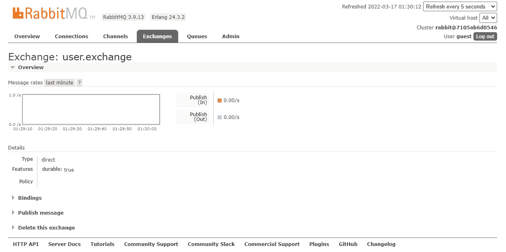

**用户队列**

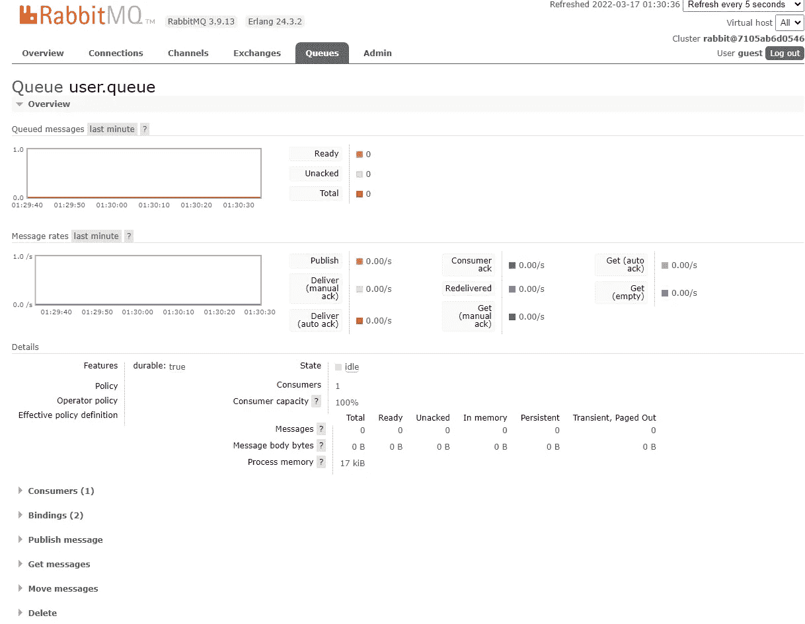

**交换和队列与提供的路由密钥**正确绑定

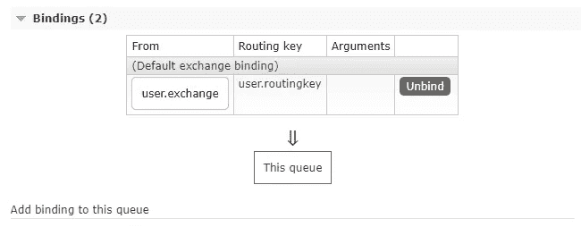

> 运行微服务

现在发送我们的用户有效负载，将触发整个消息传递过程

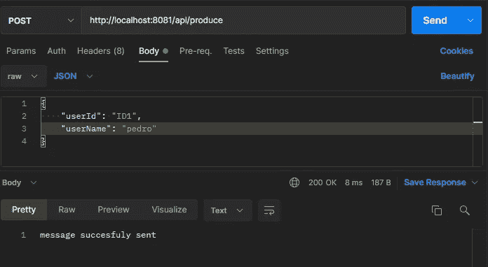

然后，它将在生产者微服务的生产者控制器上处理

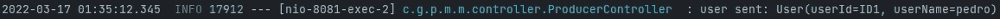

并在消费者微服务的消费者服务上使用

然后持久化在数据库上，可以通过进入**localhost:8080/H2-console**访问，点击**用户**表中的 ok

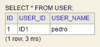

> 结论

这里的主要思想是创建一个项目来实现两个通过 RabbitMQ 通信的微服务，因此您可以在一个更复杂的系统中实现这个解决方案。

如果这篇文章在某些方面对你有所帮助，考虑为它鼓掌。

[**上的项目 Github**](https://github.com/pedroluiznogueira/messaging-microservices-rabbitmq) :

上找我: [**Github 简介**](https://github.com/pedroluiznogueira)**|**[**Linkedin**](https://www.linkedin.com/in/pedroluiznogueira)